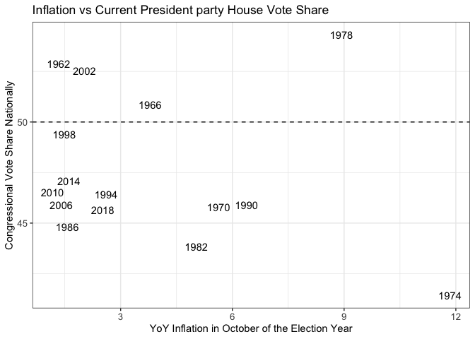
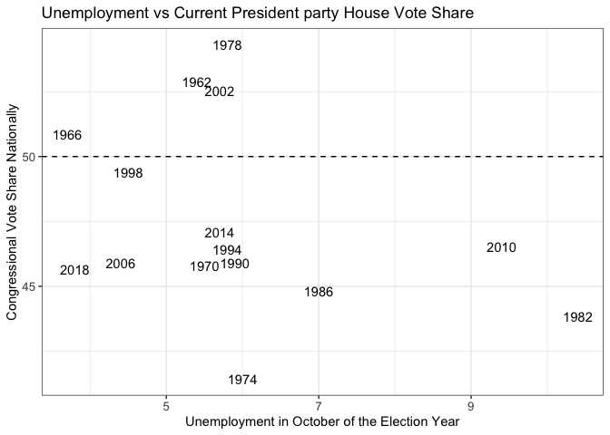
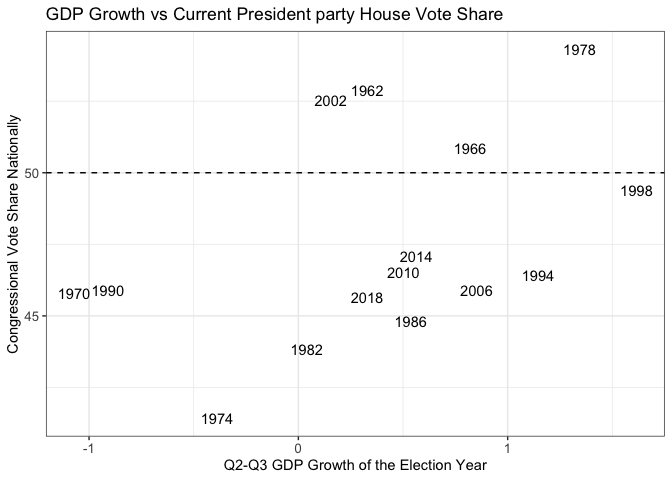
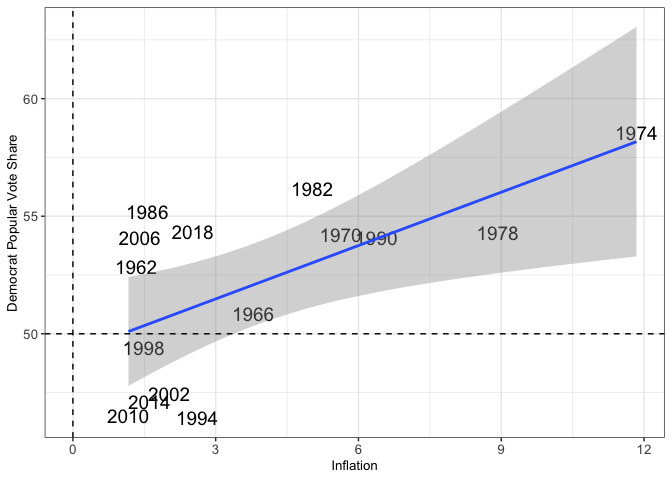

**Week 2 - Predicting Midterms using Economic Factors** Using economic
data is a key element in many models used to predict presidential or
midterm elections. People associate politics with their personal
finances, and the media constantly reports about inflation,
unemployment, and GDP figures. While the President does not have full
control over the economy, many Americans end up using this information
as a way to criticize or applaud the current administration.But, as we
will see, the economy may not be as useful as originally thought in
predicting Republican or Democratic vote share in the midterm elections.

The first logical step in creating a predictive model for the 2022
Midterm Elections is to visualize how economic indicators have related
to election outcomes in the past. One key decision in creating these
variables is determining which inflation, unemployment, and GDP growth
metrics to use. For example, a forecast may decide to use GDP growth
between the first fiscal quarter of a President’s term through to the
7th fiscal quarter (which is when the midterms take place) while others
may use GDP growth statistics from only the election year Borrowing from
Achen and Bartels’ “Retrospective Voting” concept, voters make choices
based on how the economy has performed. However, many people forget how
the economy has done throughout the first two years of a President’s
term, instead only focusing on how the economy has done in the months
leading up to the election. Therefore, it makes sense to take the most
recent economic information before the election and using the
measurement that the media commonly reports (because this is how most
voters consume this information). Combining these two ideas, the plots
depict year over year
[inflation](https://www.bls.gov/news.release/pdf/cpi.pdf) (media outlets
report the year-over-year number) and
[unemployment](https://www.bls.gov/news.release/pdf/empsit.pdf) for the
month of October before a midterm. Finally, GDP growth between the
second and third fiscal quarter of the election year gives the most
recent performance. As seen below, none of these metrics seem to have a
clear linear relationship with how the the sitting President’s party
performs in the midterms. Besides 1962, 1966, 1978, and 2002, every
party with control over the white house lost a majority of the vote
share regardless of economic factors.

**Creating Linear Models**

With this in mind, I still wanted to create simple linear models to
predict Republican vote share. I decided to exclude Presidential
elections for two main reasons. First, turnout in Presidential elections
is normally considerably higher than in [midterm
elections](https://fairvote.org/resources/voter-turnout/). Second,
Presidential candidates have much larger national profiles compared to
the average congressional representative, so there is much more media
coverage. Ultimately, I think the dynamics of Presidential elections are
too different, so it is safer to exclude them all together.

At first, I tried creating separate linear models for inflation, GDP
growth rate, and unemployment as sole independent variables to predict
each party’s vote share (party votes plus third party candidates who
lean in the same direction). The results show that only inflation is a
significant predictor (its p-value is less than 0.05). When predicting
Republican vote share, the GOP are predicted to lose 0.75% of the
popular vote share for every 1% increase in inflation. This finding is
the opposite for Democrats, which gain a predicted 0.75% in the popular
vote share for every 1% increase in inflation. These results are not
compelling, and while the plot below appears to suggest there is a
positive linear relationship between inflation and Democratic vote
share, many of these elections require context (the most obvious example
is in 1974 when President Ford pardoned Richard Nixon after the
Watergate Scandal two months before the midterms). Also, the inflation
model predicts Democrats win 56% of the vote share which is extremely
optimistic and unlikely due to President Biden’s poor approval ratings.
More generally, using past midterms when there are only 15 observations
in the data set means that small changes in past election outcomes could
lead to very different results in the models.

|     | Metric.Republican_Voteshare | Coefficient | P.Value | Predictions.2022 |
|:----|:----------------------------|:------------|:--------|:-----------------|
| 1   | Inflation                   | -0.756      | 0.013   | 43.982           |
| 1   | GDP Growth                  | 2.157       | 0.116   | 51.441           |
| 1   | Unemployment                | -0.055      | 0.926   | 48.024           |

|     | Metric.Democrat_Voteshare | Coefficient | P.Value | Predictions.2022 |
|:----|:--------------------------|:------------|:--------|:-----------------|
| 1   | Inflation                 | 0.756       | 0.013   | 56.018           |
| 1   | GDP Growth                | -2.157      | 0.116   | 48.559           |
| 1   | Unemployment              | 0.055       | 0.926   | 51.976           |

  
**Extension - Asking a Different Question** Next, I asked a different
question. Instead of predicting how many votes Republicans or Democrats
will win, the better question may be less concerned with specific party.
Put more generally, how will the current President’s party perform in
the midterms based on economic factors? This makes more sense because
voters punish the current President for bad economic performance. When
looking at it this way, none of the predictors are significant, but the
coefficients remain interpretable. In the table below, rises in
inflation and unemployment hurt the sitting administration’s party while
GDP growth has a positive relationship with the party who controls the
White House. Using the most recent economic data for 2022, the models
return a wide range of predictions for how well President Biden’s Party
(Democrats) will perform this fall. The inflation model thinks voters
will vote overwhelmingly for Republicans (which is far more reasonable
than the previous model that heavily favored Democrats because of high
inflation), while strong GDP growth indicates the Democrats could win
the popular vote. Compared to the previous models, changing the
dependent variable reveals that usually, the party of the current
President struggles in the midterms. While these models are far from
perfect, they serve as a baseline that we can improve upon immensely. As
we move closer to the election, it will be important to account for fear
of a recession due to the Federal Reserve’s tightening of interest
rates.

|     | models       | coefficients | p.values | predictions.2022 |
|:----|:-------------|:-------------|:---------|:-----------------|
| 1   | Inflation    | -0.248       | 0.438    | 46.275           |
| 1   | GDP Growth   | 2.146        | 0.096    | 51.085           |
| 1   | Unemployment | -0.644       | 0.237    | 49.058           |
