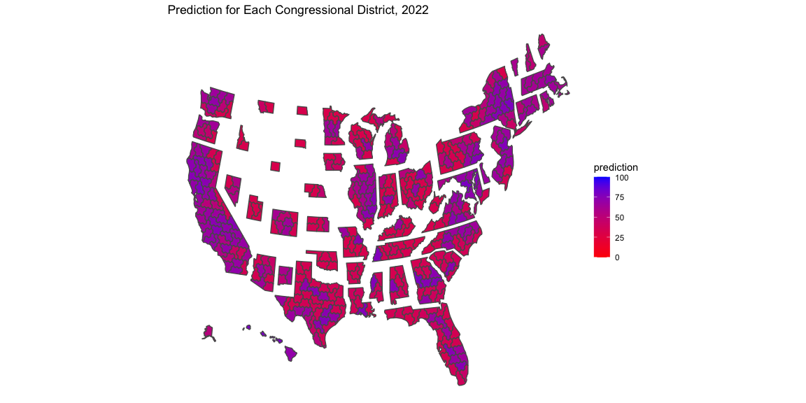
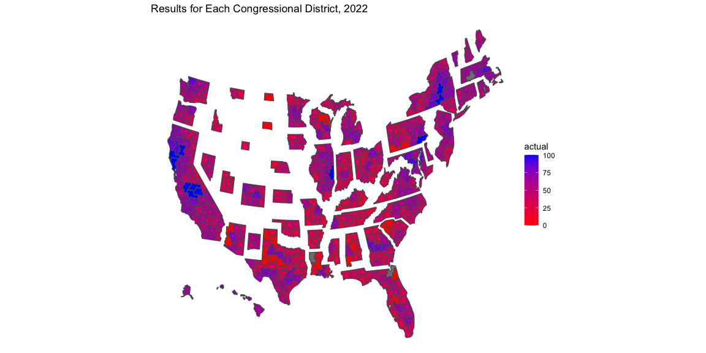
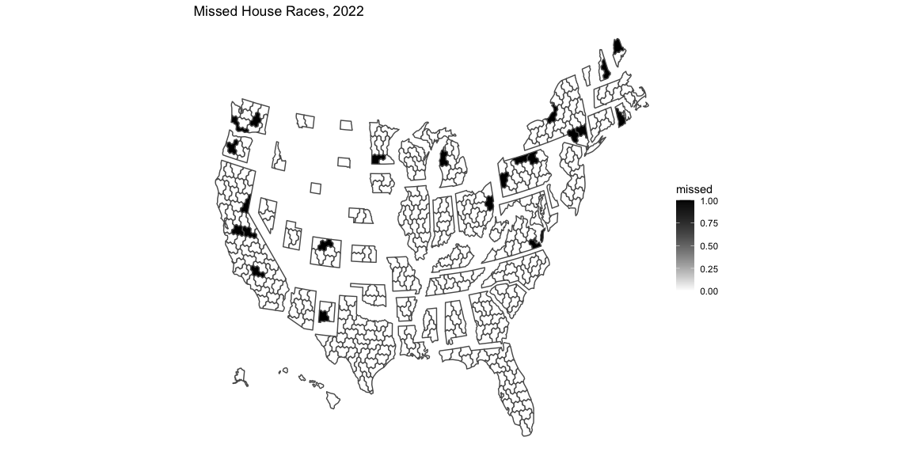

**Recap**

  
It is safe to say that the results of the 2022 midterm elections
surprised everyone, including the experts who forecast races for a
living. Polls were encouraging for the Democrats during the summer as
they rode a wave of anger following the overturn of Roe v Wade. However,
predictions shifted against Biden and the Democrats as inflation, the
economy, and crime seemed to become the dominant issues. My model
reflected the shift in professional opinion as the election got closer
because expert ratings, classifications to describe each house district
as “safe,” “likely,” “lean,” or “Toss-up” for a specific party, were the
key independent variable to predict the performance of the Democrats.
Expert ratings were important because they consider fundamentals,
incumbency, and polling, acting as a strong “catch-all” variable because
my own attempts at using these factors were largely in vain. Along with
demographic data on the percentage of the major minority groups within
each district, my linear model predicted Democratic vote share. When I
used expert predictions earlier in the semester, the model predicted
that Democrats would win more seats than it did in my final prediction,
largely because experts assigned more seats to be leaning towards the
Democrats. The night before the election, my model predicted that
Democrats would win 207 out of 435 seats. At the time, this seemed
somewhat reasonable given how the experts were predicting, but also
decently well considering most midterms go terribly for the party who
controls the White House.

**Accuracy**

  
Overall, my model was quite accurate, only incorrectly predicting 22 out
of 435 seats (for an error of roughly 5%). 8 out of 22 seats that I
called incorrectly were ones where I predicted a Democrat to win but
ended up losing. The other 14 out of 22 were predicted to go to a
Republican but were won by a Democrat. We know that predicting these
elections is extremely difficult, but ultimately, I view accuracy as how
I did with competitive races. Because a vast majority of races are
either uncontested or in districts that have heavy partisan lean,
calling these types of races is easy. However, control of the house is
decided by a few dozen races. In my test set (2022 midterm race
information that I used to make predictions), I had 37 true “tossups.”
In my circumstance, 20 out of 22 missed races were classified as true
tossups, meaning I got over 50% accuracy for races where the experts
said “flip a coin.” I see this as a huge win. However there does seem to
be some systematic error in my missed predictions. For example, all the
missed predictions in California and New York were ones where I called
in favor of Democrats (representing 7 of the 8 in this category.
Virginia’s 2nd District was the 8th and was classified a pure tossup).
Similarly, in Pennsylvania and Washington, all the incorrect races were
called for Republicans but won by Democrats (5 of out the 14 in this
category). In addition, when comparing the predicted versus actual maps,
we can see there are seats that were much more blue or more red than the
prediction (California is a clear example). This was because I predicted
all the 2022 races the same way, not factoring in if the race was
uncontested. Because of this, uncontested races would be predicted to
get 70% or more by my model in either direction, where in reality 100%
of the vote would go to that candidate.

| state          | district | avg_rating | prediction |    actual |
|:---------------|:---------|-----------:|-----------:|----------:|
| Alaska         | 1        |   3.000000 |   52.83531 |  65.36549 |
| Alabama        | 1        |   7.000000 |   37.66069 |   0.00000 |
| Alabama        | 2        |   7.000000 |   38.70306 |  29.64209 |
| Alabama        | 3        |   7.000000 |   37.10086 |  26.07277 |
| Alabama        | 4        |   7.000000 |   32.49912 |  13.94143 |
| Alabama        | 5        |   7.000000 |   35.64483 |  30.55259 |
| Alabama        | 6        |   7.000000 |   35.86665 |   0.00000 |
| Alabama        | 7        |   1.000000 |   74.49860 |  64.62794 |
| Arkansas       | 1        |   7.000000 |   34.76734 |  25.61933 |
| Arkansas       | 2        |   7.000000 |   35.97678 |  36.94851 |
| Arkansas       | 3        |   7.000000 |   32.44071 |  34.03196 |
| Arkansas       | 4        |   7.000000 |   35.88598 |  26.93293 |
| Arizona        | 1        |   4.500000 |   45.19735 |  49.56568 |
| Arizona        | 2        |   4.833333 |   42.72674 |  46.10058 |
| Arizona        | 3        |   1.000000 |   66.82642 |  76.97651 |
| Arizona        | 4        |   2.333333 |   57.21268 |  56.13503 |
| Arizona        | 5        |   7.000000 |   33.68919 |  39.71468 |
| Arizona        | 6        |   5.000000 |   43.28940 |  49.26543 |
| Arizona        | 7        |   1.000000 |   64.62063 |  64.55695 |
| Arizona        | 8        |   7.000000 |   33.54381 |   0.00000 |
| Arizona        | 9        |   7.000000 |   33.77512 |   0.00000 |
| California     | 1        |   7.000000 |   33.51017 |  37.95305 |
| California     | 2        |   1.000000 |   62.15184 |  75.20215 |
| California     | 3        |   6.000000 |   38.35984 |  47.87459 |
| California     | 4        |   1.000000 |   64.45732 |  72.41692 |
| California     | 5        |   7.000000 |   34.17278 |  38.66521 |
| California     | 6        |   1.000000 |   67.27121 |  56.00407 |
| California     | 7        |   1.000000 |   71.23058 |  69.07594 |
| California     | 8        |   1.000000 |   72.55724 |  75.68935 |
| California     | 9        |   2.333333 |   62.47285 |  55.97262 |
| California     | 10       |   1.000000 |   67.82099 | 100.00000 |
| California     | 11       |   1.000000 |   72.43951 |  83.94699 |
| California     | 12       |   1.000000 |   72.70577 |  90.55704 |
| California     | 13       |   3.666667 |   53.13576 |  49.65733 |
| California     | 14       |   1.000000 |   73.65748 |  69.34916 |
| California     | 15       |   1.000000 |   74.31028 | 100.00000 |
| California     | 16       |   1.000000 |   69.87850 | 100.00000 |
| California     | 17       |   1.000000 |   77.19749 |  70.92725 |
| California     | 18       |   1.000000 |   68.38448 |  65.82980 |
| California     | 19       |   1.000000 |   67.07701 |  69.59047 |
| California     | 20       |   7.000000 |   35.33104 |  32.18571 |
| California     | 21       |   1.000000 |   67.93115 |  54.07942 |
| California     | 22       |   4.000000 |   52.00548 |  47.33085 |
| California     | 23       |   7.000000 |   36.41395 |  38.86297 |
| California     | 24       |   1.000000 |   63.66040 |  61.04175 |
| California     | 25       |   1.333333 |   63.80950 |  57.40426 |
| California     | 26       |   1.333333 |   63.44576 |  54.10916 |
| California     | 27       |   4.333333 |   51.52649 |  46.73499 |
| California     | 28       |   1.000000 |   74.34234 |  66.31245 |
| California     | 29       |   1.000000 |   67.59289 | 100.00000 |
| California     | 30       |   1.000000 |   66.30963 | 100.00000 |
| California     | 31       |   1.000000 |   70.65327 |  59.51977 |
| California     | 32       |   1.000000 |   66.28372 |  69.18356 |
| California     | 33       |   1.000000 |   68.47962 |  57.68510 |
| California     | 34       |   1.000000 |   71.61301 | 100.00000 |
| California     | 35       |   1.000000 |   68.73060 |  57.38739 |
| California     | 36       |   1.000000 |   67.23403 |  69.72458 |
| California     | 37       |   1.000000 |   73.31247 | 100.00000 |
| California     | 38       |   1.000000 |   70.94173 |  58.09033 |
| California     | 39       |   1.000000 |   68.09851 |  57.59767 |
| California     | 40       |   6.000000 |   43.11902 |  43.05672 |
| California     | 41       |   6.000000 |   41.13916 |  47.75034 |
| California     | 42       |   1.000000 |   68.26693 |  68.35047 |
| California     | 43       |   1.000000 |   74.46773 |  77.31465 |
| California     | 44       |   1.000000 |   70.94406 |  72.20901 |
| California     | 45       |   4.833333 |   55.76590 |  47.53770 |
| California     | 46       |   1.000000 |   69.89641 |  61.64551 |
| California     | 47       |   3.166667 |   56.95409 |  51.61486 |
| California     | 48       |   7.000000 |   35.13977 |  39.63638 |
| California     | 49       |   3.500000 |   51.91405 |  52.60844 |
| California     | 50       |   1.000000 |   65.48549 |  62.80762 |
| California     | 51       |   1.000000 |   67.85457 |  61.84330 |
| California     | 52       |   1.000000 |   71.07555 |  66.61925 |
| Colorado       | 1        |   1.000000 |   64.40904 |  82.08444 |
| Colorado       | 2        |   1.000000 |   61.24294 |  71.41662 |
| Colorado       | 3        |   6.666667 |   33.80269 |  49.91532 |
| Colorado       | 4        |   7.000000 |   32.23053 |  37.50163 |
| Colorado       | 5        |   7.000000 |   34.06022 |  41.86000 |
| Colorado       | 6        |   1.000000 |   64.54767 |  61.81874 |
| Colorado       | 7        |   2.333333 |   55.00506 |  57.66189 |
| Colorado       | 8        |   4.000000 |   48.21679 |  50.35770 |
| Connecticut    | 1        |   1.000000 |   65.25221 |  62.02703 |
| Connecticut    | 2        |   1.666667 |   58.51499 |  59.12590 |
| Connecticut    | 3        |   1.000000 |   64.79488 |  58.28727 |
| Connecticut    | 4        |   1.000000 |   65.04753 |  59.41190 |
| Connecticut    | 5        |   3.500000 |   50.96190 |  50.39943 |
| Delaware       | 1        |   1.000000 |   66.34920 |  56.35073 |
| Florida        | 1        |   7.000000 |   35.13568 |  32.13087 |
| Florida        | 2        |   7.000000 |   37.25887 |  40.19380 |
| Florida        | 3        |   7.000000 |   35.82558 |  36.71993 |
| Florida        | 4        |   7.000000 |   39.46482 |  39.54152 |
| Florida        | 5        |   6.666667 |   37.18185 |       NaN |
| Florida        | 6        |   7.000000 |   34.17647 |   0.00000 |
| Florida        | 7        |   6.666667 |   36.35927 |  41.46325 |
| Florida        | 8        |   7.000000 |   33.84577 |  35.08500 |
| Florida        | 9        |   1.000000 |   66.39692 |  53.63428 |
| Florida        | 10       |   1.000000 |   68.97154 |  59.93332 |
| Florida        | 11       |   7.000000 |   35.44108 |  35.95228 |
| Florida        | 12       |   7.000000 |   32.58102 |  29.62227 |
| Florida        | 13       |   6.000000 |   38.37467 |  45.87936 |
| Florida        | 14       |   1.000000 |   66.83695 |  56.89499 |
| Florida        | 15       |   6.000000 |   41.26829 |  41.45355 |
| Florida        | 16       |   7.000000 |   34.86678 |  37.84686 |
| Florida        | 17       |   7.000000 |   32.63480 |  35.73577 |
| Florida        | 18       |   7.000000 |   35.18522 |   0.00000 |
| Florida        | 19       |   7.000000 |   32.99890 |  31.98863 |
| Florida        | 20       |   1.000000 |   74.47942 |  72.31101 |
| Florida        | 21       |   7.000000 |   34.45539 |  36.49220 |
| Florida        | 22       |   1.000000 |   65.12896 |  55.10538 |
| Florida        | 23       |   1.000000 |   64.59636 |  52.40889 |
| Florida        | 24       |   1.000000 |   74.22316 |  71.78383 |
| Florida        | 25       |   1.000000 |   67.70218 |  55.09108 |
| Florida        | 26       |   7.000000 |   36.69564 |  29.11850 |
| Florida        | 27       |   5.666667 |   43.83443 |  42.69990 |
| Florida        | 28       |   7.000000 |   37.90659 |  36.30787 |
| Georgia        | 1        |   7.000000 |   38.76942 |  40.85276 |
| Georgia        | 2        |   1.666667 |   69.70147 |  54.97431 |
| Georgia        | 3        |   7.000000 |   36.91678 |  31.25014 |
| Georgia        | 4        |   1.000000 |   76.10828 |  78.48634 |
| Georgia        | 5        |   1.000000 |   74.33342 |  82.47827 |
| Georgia        | 6        |   6.666667 |   37.09846 |  37.77827 |
| Georgia        | 7        |   1.000000 |   72.49847 |  61.05324 |
| Georgia        | 8        |   7.000000 |   38.86646 |  31.42379 |
| Georgia        | 9        |   7.000000 |   34.72049 |  27.64658 |
| Georgia        | 10       |   7.000000 |   36.96910 |  35.46756 |
| Georgia        | 11       |   7.000000 |   36.41593 |  37.40108 |
| Georgia        | 12       |   7.000000 |   40.62677 |  40.40348 |
| Georgia        | 13       |   1.000000 |   78.17475 |  81.77434 |
| Georgia        | 14       |   7.000000 |   34.50204 |  34.13534 |
| Hawaii         | 1        |   1.000000 |   79.22901 |  73.73989 |
| Hawaii         | 2        |   1.000000 |   70.43953 |  63.85383 |
| Iowa           | 1        |   5.166667 |   40.83883 |  46.59577 |
| Iowa           | 2        |   5.333333 |   39.69439 |  45.87563 |
| Iowa           | 3        |   4.666667 |   43.72575 |  49.65445 |
| Iowa           | 4        |   7.000000 |   31.46592 |  31.11597 |
| Idaho          | 1        |   7.000000 |   31.35438 |  26.95697 |
| Idaho          | 2        |   7.000000 |   31.56237 |  36.40936 |
| Illinois       | 1        |   1.000000 |   73.90469 |  66.01137 |
| Illinois       | 2        |   1.000000 |   72.80634 |  66.55249 |
| Illinois       | 3        |   1.000000 |   65.47009 |  66.94255 |
| Illinois       | 4        |   1.000000 |   66.13468 |  70.22736 |
| Illinois       | 5        |   1.000000 |   63.58737 |  68.88777 |
| Illinois       | 6        |   2.000000 |   58.34654 |  53.94846 |
| Illinois       | 7        |   1.000000 |   74.53036 | 100.00000 |
| Illinois       | 8        |   1.000000 |   65.58428 |  56.47922 |
| Illinois       | 9        |   1.000000 |   66.22190 |  70.59695 |
| Illinois       | 10       |   1.000000 |   64.29486 |  62.15627 |
| Illinois       | 11       |   1.666667 |   60.73773 |  55.97143 |
| Illinois       | 12       |   7.000000 |   32.11041 |  25.99612 |
| Illinois       | 13       |   3.166667 |   54.88838 |  55.89355 |
| Illinois       | 14       |   2.333333 |   58.01000 |  54.11289 |
| Illinois       | 15       |   7.000000 |   31.41943 |  28.68006 |
| Illinois       | 16       |   7.000000 |   31.54465 |  33.36994 |
| Illinois       | 17       |   3.666667 |   50.60097 |  51.73335 |
| Indiana        | 1        |   3.833333 |   51.48201 |  52.82898 |
| Indiana        | 2        |   7.000000 |   32.69841 |  33.37431 |
| Indiana        | 3        |   7.000000 |   32.54589 |  31.48399 |
| Indiana        | 4        |   7.000000 |   32.01979 |  31.79341 |
| Indiana        | 5        |   7.000000 |   32.77899 |  38.92666 |
| Indiana        | 6        |   7.000000 |   32.04543 |  32.47820 |
| Indiana        | 7        |   1.000000 |   69.08680 |  68.62630 |
| Indiana        | 8        |   7.000000 |   31.72063 |  32.39702 |
| Indiana        | 9        |   7.000000 |   31.55991 |  35.27683 |
| Kansas         | 1        |   7.000000 |   33.15245 |  32.22602 |
| Kansas         | 2        |   7.000000 |   34.75055 |  42.36254 |
| Kansas         | 3        |   3.333333 |   52.00287 |  56.19997 |
| Kansas         | 4        |   7.000000 |   34.74025 |  36.50562 |
| Kentucky       | 1        |   7.000000 |   32.55447 |  25.09927 |
| Kentucky       | 2        |   7.000000 |   32.23072 |  28.14169 |
| Kentucky       | 3        |   1.000000 |   65.84341 |  61.99171 |
| Kentucky       | 4        |   7.000000 |   31.56469 |  32.31159 |
| Kentucky       | 5        |   7.000000 |   30.82183 |  17.82522 |
| Kentucky       | 6        |   7.000000 |   33.09182 |  34.90997 |
| Louisiana      | 1        |   7.000000 |   34.50009 |  25.70368 |
| Louisiana      | 2        |   1.000000 |   76.37411 |  77.11403 |
| Louisiana      | 3        |   7.000000 |   37.09580 |  14.06667 |
| Louisiana      | 4        |   7.000000 |   39.56010 |       NaN |
| Louisiana      | 5        |   7.000000 |   39.39481 |  11.37080 |
| Louisiana      | 6        |   7.000000 |   37.00288 |   0.00000 |
| Massachusetts  | 1        |   1.000000 |   62.34805 |  61.38511 |
| Massachusetts  | 2        |   1.000000 |   62.52326 |  66.20569 |
| Massachusetts  | 3        |   1.000000 |   63.36320 |  63.78109 |
| Massachusetts  | 4        |   1.000000 |   62.07747 |       NaN |
| Massachusetts  | 5        |   1.000000 |   64.19659 |  73.75005 |
| Massachusetts  | 6        |   1.000000 |   61.77982 |  63.87393 |
| Massachusetts  | 7        |   1.000000 |   69.59490 |  84.54864 |
| Massachusetts  | 8        |   1.000000 |   64.53330 |  69.45387 |
| Massachusetts  | 9        |   1.000000 |   60.81510 |  59.44947 |
| Maryland       | 1        |   7.000000 |   34.94105 |  44.20618 |
| Maryland       | 2        |   1.000000 |   66.85420 |  59.31043 |
| Maryland       | 3        |   1.000000 |   66.99365 |  60.23484 |
| Maryland       | 4        |   1.000000 |   79.52757 |  90.30019 |
| Maryland       | 5        |   1.000000 |   71.19446 |  65.83486 |
| Maryland       | 6        |   2.333333 |   59.01578 |  54.23010 |
| Maryland       | 7        |   1.000000 |   75.40825 |  82.24453 |
| Maryland       | 8        |   1.000000 |   69.22773 |  81.08203 |
| Maine          | 1        |   1.000000 |   60.20815 |  62.89230 |
| Maine          | 2        |   3.666667 |   46.89252 |  51.80358 |
| Michigan       | 1        |   7.000000 |   30.88260 |  38.48924 |
| Michigan       | 2        |   7.000000 |   31.23993 |  34.97863 |
| Michigan       | 3        |   3.166667 |   52.79313 |  56.66626 |
| Michigan       | 4        |   7.000000 |   33.50538 |  43.61545 |
| Michigan       | 5        |   7.000000 |   31.84080 |  35.82148 |
| Michigan       | 6        |   1.000000 |   64.53596 |  65.88786 |
| Michigan       | 7        |   3.666667 |   48.94999 |  52.69937 |
| Michigan       | 8        |   3.500000 |   51.73525 |  55.35024 |
| Michigan       | 9        |   7.000000 |   31.46935 |  34.17085 |
| Michigan       | 10       |   5.166667 |   44.01890 |  49.74732 |
| Michigan       | 11       |   1.000000 |   65.19159 |  61.32592 |
| Michigan       | 12       |   1.000000 |   72.26215 |  72.95299 |
| Michigan       | 13       |   1.000000 |   73.11917 |  74.76047 |
| Minnesota      | 1        |   6.333333 |   34.97713 |  44.00751 |
| Minnesota      | 2        |   4.000000 |   47.74276 |  52.70694 |
| Minnesota      | 3        |   1.000000 |   63.35206 |  59.60315 |
| Minnesota      | 4        |   1.000000 |   65.34861 |  67.68964 |
| Minnesota      | 5        |   1.000000 |   65.25804 |  75.18628 |
| Minnesota      | 6        |   7.000000 |   31.97226 |  37.88414 |
| Minnesota      | 7        |   7.000000 |   30.93257 |  29.20001 |
| Minnesota      | 8        |   7.000000 |   30.93723 |  42.75946 |
| Missouri       | 1        |   1.000000 |   72.25145 |  74.92112 |
| Missouri       | 2        |   7.000000 |   32.19099 |  43.94248 |
| Missouri       | 3        |   7.000000 |   32.17911 |  34.84718 |
| Missouri       | 4        |   7.000000 |   31.85432 |  26.91668 |
| Missouri       | 5        |   1.000000 |   66.21520 |  62.53778 |
| Missouri       | 6        |   7.000000 |   31.79441 |  28.10018 |
| Missouri       | 7        |   7.000000 |   31.37411 |  27.37605 |
| Missouri       | 8        |   7.000000 |   31.63193 |  22.36621 |
| Mississippi    | 1        |   7.000000 |   37.64271 |  27.02338 |
| Mississippi    | 2        |   1.000000 |   76.02612 |  60.00022 |
| Mississippi    | 3        |   7.000000 |   39.30929 |  29.15084 |
| Mississippi    | 4        |   7.000000 |   36.80145 |  25.11937 |
| Montana        | 1        |   4.833333 |   41.38249 |  48.36300 |
| Montana        | 2        |   7.000000 |   30.85320 |  26.27669 |
| North Carolina | 1        |   2.333333 |   64.38766 |  52.36784 |
| North Carolina | 2        |   1.000000 |   66.67537 |  64.67753 |
| North Carolina | 3        |   7.000000 |   36.25508 |  33.09709 |
| North Carolina | 4        |   1.000000 |   68.17174 |  66.90675 |
| North Carolina | 5        |   7.000000 |   33.98424 |  36.84709 |
| North Carolina | 6        |   1.666667 |   65.60584 |  54.47289 |
| North Carolina | 7        |   7.000000 |   35.82903 |  42.27923 |
| North Carolina | 8        |   7.000000 |   34.85643 |  30.08929 |
| North Carolina | 9        |   7.000000 |   37.80787 |  43.49816 |
| North Carolina | 10       |   7.000000 |   33.77207 |  27.31851 |
| North Carolina | 11       |   7.000000 |   31.71326 |  45.27715 |
| North Carolina | 12       |   1.000000 |   70.98511 |  62.74631 |
| North Carolina | 13       |   4.333333 |   50.49007 |  51.59260 |
| North Carolina | 14       |   1.000000 |   66.78147 |  57.70586 |
| North Dakota   | 1        |   7.000000 |   31.25356 |   0.00000 |
| Nebraska       | 1        |   7.000000 |   32.20759 |  41.86853 |
| Nebraska       | 2        |   4.333333 |   46.85413 |  48.49253 |
| Nebraska       | 3        |   7.000000 |   31.18582 |  16.79150 |
| New Hampshire  | 1        |   3.333333 |   49.29388 |  54.06337 |
| New Hampshire  | 2        |   2.333333 |   54.04353 |  55.86837 |
| New Jersey     | 1        |   1.000000 |   65.78423 |  63.75309 |
| New Jersey     | 2        |   7.000000 |   35.23159 |  38.23551 |
| New Jersey     | 3        |   1.666667 |   62.26008 |  55.47507 |
| New Jersey     | 4        |   7.000000 |   32.40719 |  31.73413 |
| New Jersey     | 5        |   1.666667 |   62.79154 |  54.89074 |
| New Jersey     | 6        |   1.000000 |   68.34460 |  58.00367 |
| New Jersey     | 7        |   5.000000 |   43.85520 |  47.69819 |
| New Jersey     | 8        |   1.000000 |   67.72933 |  75.44884 |
| New Jersey     | 9        |   1.000000 |   66.70115 |  55.21155 |
| New Jersey     | 10       |   1.000000 |   76.26033 |  78.82946 |
| New Jersey     | 11       |   1.000000 |   64.88840 |  58.33030 |
| New Jersey     | 12       |   1.000000 |   69.71812 |  60.78223 |
| New Mexico     | 1        |   1.333333 |   61.79704 |  55.75236 |
| New Mexico     | 2        |   4.000000 |   49.30470 |  50.34708 |
| New Mexico     | 3        |   1.666667 |   59.33308 |  58.15500 |
| Nevada         | 1        |   3.333333 |   55.17276 |  52.87572 |
| Nevada         | 2        |   7.000000 |   33.20651 |  38.75682 |
| Nevada         | 3        |   3.666667 |   55.60820 |  51.98339 |
| Nevada         | 4        |   3.166667 |   57.21239 |  52.41503 |
| New York       | 1        |   5.000000 |   43.06791 |  44.13619 |
| New York       | 2        |   5.500000 |   42.39805 |  39.04130 |
| New York       | 3        |   3.333333 |   55.70989 |  45.87115 |
| New York       | 4        |   3.166667 |   56.66609 |  48.12267 |
| New York       | 5        |   1.000000 |   78.24354 |  75.15379 |
| New York       | 6        |   1.000000 |   74.39689 |  63.25362 |
| New York       | 7        |   1.000000 |   68.79652 |  80.48882 |
| New York       | 8        |   1.000000 |   75.02543 |  72.44469 |
| New York       | 9        |   1.000000 |   74.87518 | 100.00000 |
| New York       | 10       |   1.000000 |   68.39202 |  84.57145 |
| New York       | 11       |   6.000000 |   43.27474 |  37.89335 |
| New York       | 12       |   1.000000 |   64.84718 |  81.87162 |
| New York       | 13       |   1.000000 |   71.34992 | 100.00000 |
| New York       | 14       |   1.000000 |   70.85022 |  71.98604 |
| New York       | 15       |   1.000000 |   72.33866 |  82.62873 |
| New York       | 16       |   1.000000 |   68.76175 |  64.17331 |
| New York       | 17       |   3.333333 |   52.68746 |  49.53010 |
| New York       | 18       |   3.000000 |   54.07581 |  50.39693 |
| New York       | 19       |   4.000000 |   47.01812 |  48.87169 |
| New York       | 20       |   1.000000 |   62.99560 |  54.94862 |
| New York       | 21       |   7.000000 |   31.46468 |  40.60935 |
| New York       | 22       |   4.000000 |   47.89223 |  49.24981 |
| New York       | 23       |   7.000000 |   31.30750 |  34.96912 |
| New York       | 24       |   7.000000 |   31.57258 |  34.01396 |
| New York       | 25       |   1.000000 |   64.20602 |  53.64001 |
| New York       | 26       |   1.000000 |   64.72437 |  63.73772 |
| Ohio           | 1        |   4.000000 |   50.92789 |  52.46075 |
| Ohio           | 2        |   7.000000 |   31.08258 |  25.46382 |
| Ohio           | 3        |   1.000000 |   67.83507 |  70.16827 |
| Ohio           | 4        |   7.000000 |   32.22656 |  30.67997 |
| Ohio           | 5        |   7.000000 |   31.98388 |  32.97225 |
| Ohio           | 6        |   7.000000 |   32.23567 |  32.27157 |
| Ohio           | 7        |   7.000000 |   32.07174 |  44.56114 |
| Ohio           | 8        |   7.000000 |   34.15244 |  35.10721 |
| Ohio           | 9        |   3.166667 |   52.62625 |  56.54509 |
| Ohio           | 10       |   7.000000 |   35.43001 |  37.81416 |
| Ohio           | 11       |   1.000000 |   71.75585 |  77.57971 |
| Ohio           | 12       |   7.000000 |   31.67945 |  30.47290 |
| Ohio           | 13       |   4.000000 |   48.87896 |  52.58965 |
| Ohio           | 14       |   7.000000 |   31.93827 |  38.14438 |
| Ohio           | 15       |   7.000000 |   34.06042 |  42.76464 |
| Oklahoma       | 1        |   7.000000 |   33.90125 |  36.18562 |
| Oklahoma       | 2        |   7.000000 |   31.61987 |  24.40764 |
| Oklahoma       | 3        |   7.000000 |   32.84659 |  25.46063 |
| Oklahoma       | 4        |   7.000000 |   33.58349 |  33.25243 |
| Oklahoma       | 5        |   7.000000 |   34.85042 |  38.79751 |
| Oregon         | 1        |   1.000000 |   63.13661 |  68.01443 |
| Oregon         | 2        |   7.000000 |   31.41982 |  32.41150 |
| Oregon         | 3        |   1.000000 |   63.76594 |  72.83317 |
| Oregon         | 4        |   3.166667 |   50.35095 |  54.04062 |
| Oregon         | 5        |   4.000000 |   46.47782 |  49.07214 |
| Oregon         | 6        |   3.666667 |   48.88677 |  51.20649 |
| Pennsylvania   | 1        |   6.666667 |   34.71703 |  45.10877 |
| Pennsylvania   | 2        |   1.000000 |   69.86509 |  75.35249 |
| Pennsylvania   | 3        |   1.000000 |   75.48495 | 100.00000 |
| Pennsylvania   | 4        |   1.000000 |   63.04429 |  61.10729 |
| Pennsylvania   | 5        |   1.000000 |   67.24605 |  64.86267 |
| Pennsylvania   | 6        |   1.333333 |   61.04749 |  58.27057 |
| Pennsylvania   | 7        |   4.000000 |   47.81227 |  50.98302 |
| Pennsylvania   | 8        |   4.000000 |   47.38210 |  51.25855 |
| Pennsylvania   | 9        |   7.000000 |   31.34934 |  30.68494 |
| Pennsylvania   | 10       |   7.000000 |   34.15825 |  46.06260 |
| Pennsylvania   | 11       |   7.000000 |   32.08837 |  38.38095 |
| Pennsylvania   | 12       |   1.666667 |   60.79167 |  55.89124 |
| Pennsylvania   | 13       |   7.000000 |   31.20527 |   0.00000 |
| Pennsylvania   | 14       |   7.000000 |   31.36024 |   0.00000 |
| Pennsylvania   | 15       |   7.000000 |   31.31569 |  29.98559 |
| Pennsylvania   | 16       |   7.000000 |   31.72785 |  40.61701 |
| Pennsylvania   | 17       |   4.000000 |   47.37892 |  53.16339 |
| Rhode Island   | 1        |   1.000000 |   63.14887 |  64.12242 |
| Rhode Island   | 2        |   3.666667 |   48.95857 |  51.87163 |
| South Carolina | 1        |   7.000000 |   36.02530 |  42.95853 |
| South Carolina | 2        |   7.000000 |   37.71992 |  39.90601 |
| South Carolina | 3        |   7.000000 |   35.52118 |   0.00000 |
| South Carolina | 4        |   7.000000 |   36.42578 |   0.00000 |
| South Carolina | 5        |   7.000000 |   37.40087 |  34.99605 |
| South Carolina | 6        |   1.000000 |   72.89391 |  62.10710 |
| South Carolina | 7        |   7.000000 |   37.63081 |  35.12447 |
| South Dakota   | 1        |   7.000000 |   31.01352 |   0.00000 |
| Tennessee      | 1        |   7.000000 |   31.16283 |  20.10587 |
| Tennessee      | 2        |   7.000000 |   32.36970 |  32.08669 |
| Tennessee      | 3        |   7.000000 |   33.56842 |  30.70390 |
| Tennessee      | 4        |   7.000000 |   33.45937 |  26.72912 |
| Tennessee      | 5        |   6.333333 |   38.09569 |  43.08296 |
| Tennessee      | 6        |   7.000000 |   33.21174 |  33.65571 |
| Tennessee      | 7        |   7.000000 |   35.51927 |  38.86886 |
| Tennessee      | 8        |   7.000000 |   35.32729 |  24.72089 |
| Tennessee      | 9        |   1.000000 |   76.68286 |  72.75330 |
| Texas          | 1        |   7.000000 |   36.18865 |  21.89054 |
| Texas          | 2        |   7.000000 |   35.68492 |  34.06843 |
| Texas          | 3        |   7.000000 |   36.55414 |  37.83197 |
| Texas          | 4        |   7.000000 |   35.29171 |  31.63064 |
| Texas          | 5        |   7.000000 |   36.65683 |  34.54517 |
| Texas          | 6        |   7.000000 |   36.59467 |   0.00000 |
| Texas          | 7        |   1.000000 |   72.35965 |  63.75737 |
| Texas          | 8        |   7.000000 |   36.82189 |  30.94920 |
| Texas          | 9        |   1.000000 |   76.11899 |  76.66286 |
| Texas          | 10       |   7.000000 |   35.47988 |  35.16559 |
| Texas          | 11       |   7.000000 |   35.94140 |   0.00000 |
| Texas          | 12       |   7.000000 |   35.28323 |  35.72183 |
| Texas          | 13       |   7.000000 |   33.99842 |  24.60978 |
| Texas          | 14       |   7.000000 |   36.68664 |  31.41252 |
| Texas          | 15       |   5.500000 |   43.30171 |  45.64598 |
| Texas          | 16       |   1.000000 |   65.98837 |  63.28149 |
| Texas          | 17       |   7.000000 |   36.25475 |  33.50413 |
| Texas          | 18       |   1.000000 |   73.63015 |  72.95743 |
| Texas          | 19       |   7.000000 |   34.47787 |   0.00000 |
| Texas          | 20       |   1.000000 |   66.32793 |  68.39487 |
| Texas          | 21       |   7.000000 |   33.63885 |  37.09396 |
| Texas          | 22       |   7.000000 |   38.43685 |  36.32699 |
| Texas          | 23       |   7.000000 |   35.84723 |  40.91006 |
| Texas          | 24       |   7.000000 |   34.99276 |  40.20586 |
| Texas          | 25       |   7.000000 |   35.13518 |   0.00000 |
| Texas          | 26       |   7.000000 |   35.62663 |   0.00000 |
| Texas          | 27       |   7.000000 |   35.22545 |  35.50345 |
| Texas          | 28       |   3.500000 |   53.70067 |  56.61657 |
| Texas          | 29       |   1.000000 |   69.33780 |  71.36901 |
| Texas          | 30       |   1.000000 |   74.59472 |  77.44823 |
| Texas          | 31       |   7.000000 |   34.58289 |   0.00000 |
| Texas          | 32       |   1.000000 |   69.33895 |  65.32376 |
| Texas          | 33       |   1.000000 |   70.76039 |  73.75229 |
| Texas          | 34       |   3.666667 |   52.56692 |  54.36184 |
| Texas          | 35       |   1.000000 |   67.23491 |  72.55375 |
| Texas          | 36       |   7.000000 |   36.23930 |  30.50053 |
| Texas          | 37       |   1.000000 |   64.84880 |  78.54015 |
| Texas          | 38       |   7.000000 |   37.06063 |  36.02135 |
| Utah           | 1        |   7.000000 |   31.94613 |  32.88132 |
| Utah           | 2        |   7.000000 |   32.16076 |  36.13342 |
| Utah           | 3        |   7.000000 |   31.65079 |  31.38754 |
| Utah           | 4        |   7.000000 |   32.00594 |  34.68904 |
| Virginia       | 1        |   7.000000 |   35.37045 |  43.33685 |
| Virginia       | 2        |   4.000000 |   52.95495 |  48.29382 |
| Virginia       | 3        |   1.000000 |   72.27141 |  67.31351 |
| Virginia       | 4        |   1.000000 |   72.01702 |  64.74571 |
| Virginia       | 5        |   7.000000 |   36.56668 |  42.15645 |
| Virginia       | 6        |   7.000000 |   33.10554 |  35.49885 |
| Virginia       | 7        |   3.333333 |   55.99621 |  52.33339 |
| Virginia       | 8        |   1.000000 |   67.53733 |  74.78997 |
| Virginia       | 9        |   7.000000 |   32.27898 |  26.58406 |
| Virginia       | 10       |   2.000000 |   62.12279 |  53.25488 |
| Virginia       | 11       |   1.000000 |   69.10570 |  66.88849 |
| Vermont        | 1        |   1.000000 |   60.16912 |  69.24293 |
| Washington     | 1        |   1.000000 |   64.68236 |  63.54306 |
| Washington     | 2        |   1.000000 |   62.67947 |  60.23227 |
| Washington     | 3        |   5.166667 |   41.27634 |  50.45531 |
| Washington     | 4        |   7.000000 |   32.75693 |  31.86172 |
| Washington     | 5        |   7.000000 |   31.92883 |  40.41245 |
| Washington     | 6        |   1.000000 |   62.38838 |  60.10124 |
| Washington     | 7        |   1.000000 |   65.20863 |  85.73929 |
| Washington     | 8        |   3.666667 |   49.68531 |  53.41555 |
| Washington     | 9        |   1.000000 |   70.21358 |  71.74735 |
| Washington     | 10       |   1.000000 |   64.55117 |  56.97289 |
| Wisconsin      | 1        |   7.000000 |   32.87846 |  45.51299 |
| Wisconsin      | 2        |   1.000000 |   61.70091 |  72.50996 |
| Wisconsin      | 3        |   5.500000 |   38.56376 |  47.96859 |
| Wisconsin      | 4        |   1.000000 |   69.59355 |  76.92548 |
| Wisconsin      | 5        |   7.000000 |   31.58295 |  35.57138 |
| Wisconsin      | 6        |   7.000000 |   31.54853 |   0.00000 |
| Wisconsin      | 7        |   7.000000 |   30.98689 |  38.11319 |
| Wisconsin      | 8        |   7.000000 |   31.36855 |   0.00000 |
| West Virginia  | 1        |   7.000000 |   31.56452 |  30.15963 |
| West Virginia  | 2        |   7.000000 |   31.42794 |  34.43137 |
| Wyoming        | 1        |   7.000000 |   31.33454 |  26.33087 |

**What went wrong**

  
Fundamentals, incumbency, and polls (essentially expert ratings) did not
tell the whole story. I see two key areas that determined why Democrats
vastly outperformed expectations in some states while performing poorly,
and like historical trends, in others. First, I think abortion was
systematically underestimated when predicting turnout. Usually, midterms
are a referendum on the sitting President. The opposing party mobilizes
more effectively than the party in power (turnout is normally lower in
midterms anyway), leading to a victory for the opposition. Abortion
clearly played a large factor in galvanizing turnout for Democrats,
especially with women and younger voters, the latter of whom turned out
in unprecedented fashion. Despite Biden’s approval rating being
underwater, many Democrats in vulnerable seats made abortion the central
issue of their campaign which may have helped them. The second key
factor that I think lead to a higher-than-expected turnout and energy on
behalf of the democrats was the fear of institutional decay and threats
to the voting system. Many crucial battleground states like
Pennsylvania, Arizona, Nevada, and Wisconsin all had extreme candidates
running in either the Governor’s race or for Secretary of State
(sometimes both). Candidates like Doug Mastriano, the Republican
candidate for Governor in Pennsylvania, was at the January 6th
Insurrection to stop the Certification of President Biden’s election.
Denying the 2020 election results was central to his campaign, but he
lost badly to his Democratic opponent, Josh Shapiro, while John
Fetterman, the Lietenant Governor and Democratic Nominee, narrowly beat
his opponent in the Senate race. Candidates like Mastriano being on the
ballot may have led to higher-than-normal turnout because they posed
serious threats to the Democratic process, especially if Donald Trump
runs for President in 2024, and helped Democrats in local or
congressional races, even if the Democrat was running against a
moderate. In Pennsylvania, this is clearly where the error in my model
was. My model did not take into account state level factors like the
attacks on democracy and abortion, and I incorrectly guessed tossup
races going to Republicans that were won by Democrats.

  
In states that did not have credible threats to abortion access or
candidates who deny the 2020 Election running for statewide office, like
New York, republicans’ performance was consistent with historical trends
for the current President’s party. Particularly in New York, where two
thirds of registered voters are democrats, the Gubernatorial race was
very close (Kathy Hochul won by only 6 points when pollsters thought she
should win be 10 or more). Many tossups went in favor of the Republican,
including NY-19 (my home district), where Sean Patrick Maloney, a 5x
incumbent and the DNCC Chairman, lost to a relatively unknown candidate.
The error in my model when predicting races like this clearly
overestimated the democrats because all three races I missed in New York
did not forecast the Republican winner.

**Proposed Quantitative Tests**

  
There are a few quantitative tests that I would like to run to see if
this theory about statewide races impacted congressional races. First, I
would like to look at the turnout data for each district, asking the
following questions: Who turned out and what percentages from each
age/race/income/education bracket showed up? What percent of voters
split their ticket between statewide elections and their local and
congressional districts? Lastly, I would want to look at exit poll data
for what were the biggest motivating factors for coming to vote/what
their top issues were? To test the hypothesis about extremist candidates
at the statewide level influencing down-ballot congressional races, I
would do take random samples of voters from different states (for
example, Pennsylvania and New York) and then do a t-test to see if
people’s top issues were the same or different, and if they split their
tickets at different rates.

**What I would do differently**

  
Hindsight is always 20-20, so it is obviously very challenging to come
up with tweaks to my model that would be helpful in future models and
avoid overfitting on the 2022 midterms. I think I still made the right
decision to create a pooled-model, meaning viewing all the observations
in the training set from 2010, 2014, and 2018 as in the same group. A
district level fit, where each congressional district gets its own
linear model with only three training observations, would have created
too much overfitting. The other issue with this method is that
redistricting certainly changed the borders of each district. Thus, the
pooled model was the best way I saw to create a robust prediction.
However, pooling all the observations eliminates all of the state and
local level nuances that we may have gotten from separating them.
Because it is abundantly clear that I needed to account for state-level
differences, I would have tried to create a “state-factor” score that
accounts for dynamics within the state, its past voting history, and
candidate quality at the top of the ballot. Unfortunately, this would
not have been feasible because I would have needed to do in depth
research about every state for each year of the training set and the
test set (meaning I would have had to do the same research for 50 states
for 4 years). Also, this could have been susceptible to my own bias,
knowing the outcome of the elections in the training set. Other than
this factor to account for state-level nuances, I would have wanted to
add demographic information about average voting age population, income
level in the district, percentage of college educated people, and other
factors that could have had some inference about how people will vote.

**Conclusion**

  
The NY Times currently has called 212 seats for the democrats, meaning
my model was only off by 5 seats. This result makes me satisfied with
how my model performed, especially given how difficult the task of
predicting elections is. In general, I think my model’s success was
attributable to many training observations from past midterms and no
overcomplicating my model with too many predictors. The error arose from
not accounting for any state-level factors, but as discussed above, this
may not have been possible due to time constraints and the risk of
inserting my personal bias into the model. While adding state-level
factors into my model could have been an interesting project, I wish I
had added more demographic information about income and education level
in each district, but I remain confident I chose appropriate variables.
Overall, doing a deep dive into election analytics has been immensely
fufilling, and I will be watching the Senate Runoff in Georgia closely!
