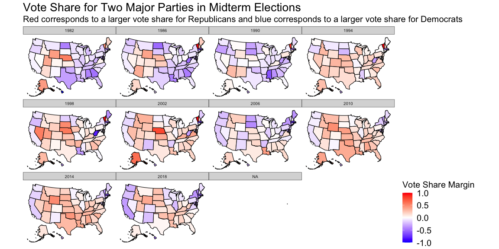
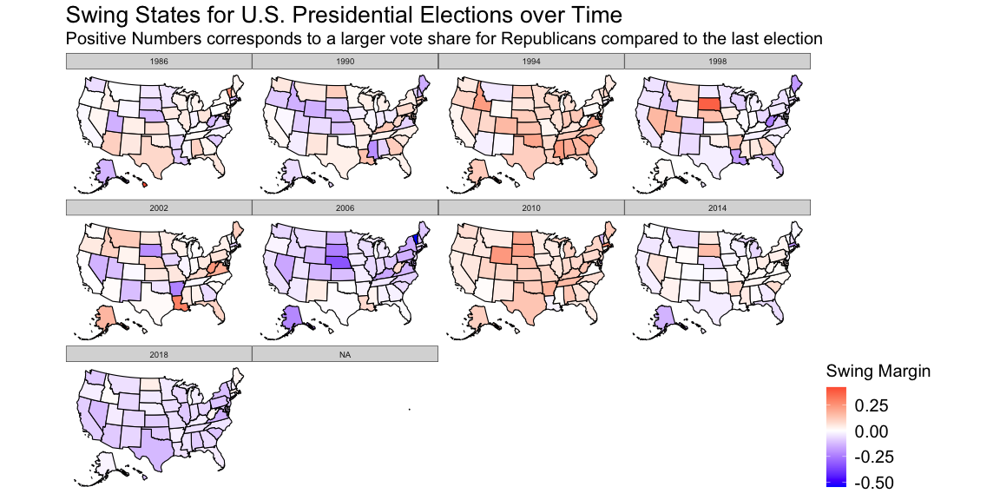

***Blog - Week 1***

One common way to predict upcoming midterm congressional elections is to
look at the vote share for each major party by state over time. Below
are maps of the United States. The highlighted colors represent the
percentage of Republican votes calculated by taking the total number of
votes for Republican congressional candidates in the state divided by
the total number of votes cast. Red indicates that Republicans carried
the state, while blue shades reflect a Democratic victory. The darker
the shade means that party won by a larger margin. White and pale shades
indicate that the vote was very close.  

  
**Vote margin by state 1982-2018 Midterms**  

The maps over time reflect that, in most states, party preference rarely
changes. For example, California has voted heavily for Democrats to
represent them in Congress since the 1990s while Texas has voted for
Republicans in the same time frame. More generally, southern states in
the “Sun” or “Bible” Belt have consistently voted for Republicans by
large margins while coastal regions with denser urban areas such as New
England and the West Coast have supported Democrats. While much of
midterm election results can be attributed to district level factors and
how the congressional maps were drawn, an examination of the few states
that regularly change party preferences can answer these important
questions for national politics: (1) are there states that used to lean
a certain direction that are now becoming more competitive? (2) If
certain states are beginning to shift their partisan slant, what do we
need to understand about these communities to indicate who may end up
holding power in Congress or in the White House? (3) Lastly, to which
candidates should the RNC and DNC allocate resources and attention?  

**Swing Analysis, Midterm Elections 1982-2018**

Before we answer these questions, it is important to figure out which
states are becoming more competitive. From the maps below, the different
shades of blue and red represent a “swing” factor. This is calculated by
taking the vote share won by the Republicans and subtracting their vote
share in the midterm election four years ago. Negative numbers,
corresponding to blue, mean that Republicans won a smaller share of the
votes compared to four years ago. For example, in 2018, Texas did not
vote overall for Democratic candidates, but the percent of the vote that
went to Democrats was higher than 2014. States that are a deeper shade
of red means the opposite - Republicans won a larger share of the vote
than they did four years prior. Looking at the maps, we can see that
Pennsylvania, Michigan, Ohio, and Florida have flipped between red and
blue in the past few midterm elections (this also holds true of
Presidential elections). There is clear evidence for this as well
because politicians at the top of the ballot held most of their campaign
rallies in the “rust” belt in the lead up to the 2020 election.
According to the [Washington
Post](https://www.washingtonpost.com/elections/2020/11/02/campaign-rallies-covid/),
Pennsylvania and Florida were the most common destination for both Joe
Biden and Donald trump.

More interesting still, some historically conservative states are
experiencing demographic shifts that could change the political
landscape. In particular,
[Georgia](https://www.nbcnews.com/politics/meet-the-press/meet-2022-s-most-important-swing-state-georgia-n1287686),
[Arizona](https://www.nysun.com/article/why-arizona-is-turning-blue),
and
[Texas](https://www.theguardian.com/us-news/commentisfree/2022/mar/08/can-texas-become-purple-that-may-depend-on-hispanic-voters)
all have rapidly growing cities and surrounding suburbs (which typically
vote for Democrats). In addition, immigrants escaping violence from
South America living in Arizona and Texas could open the door for
Democratic gains in the House and Senate. These demographic changes
could have huge consequences for the future of both political parties
and for Presidential Elections. Arizona, Georgia, and especially Texas
have large electoral college counts, so as these states become more
competitive, national organizations and candidates will spend
considerably more time, money, and organizational energy attracting
“swingable” voters.
