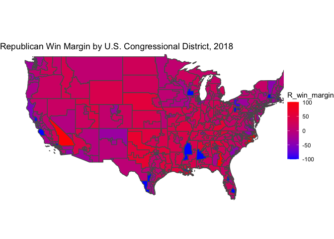
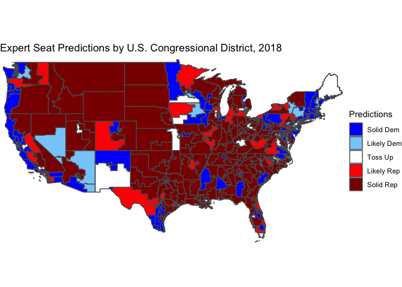
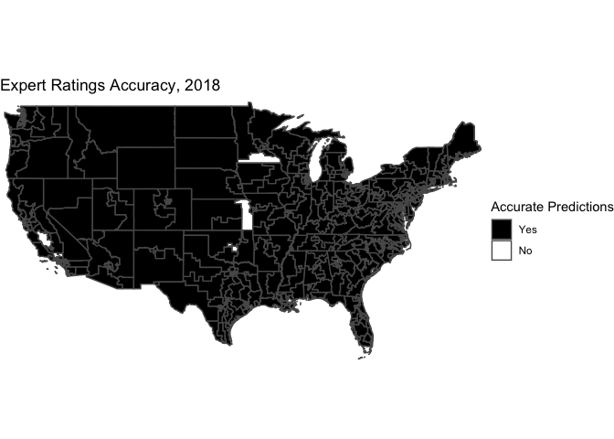

**Expert Ratings - Let’s see how the Professionals do it**

This week, I want to look at how expert ratings, more simply the “people
who do this for a living,” faired when predicting the 2018 midterm
elections. In particularly, I want to look at [The Cook Political
Report](https://www.cookpolitical.com/ratings/house-race-ratings),
[Inside Elections](https://insideelections.com), and [Sabato’s Crystal
Ball](https://centerforpolitics.org/crystalball/2022-senate/) because
they created forecasts for each congressional district.

These forecaster’s rate each district on a scale of 1 to 7. 1 represents
a “Solid Democratic” district, meaning there is no doubt that those
constituents will choose a Democrat to represent them in Congress. 7
means the same thing for Republicans or “Solid Republican.” 2 and 3 are
“likely” and “leaning” Democrat, while 5 and 6 are “likely” and
“leaning” Republican respectively. 4’s represent toss-ups which are too
hard to predict one way or another. Often, the media will keep monitor
these races as “ones to watch.”

The goal is to see if expert predictions forecast the outcome of the
elections accurately. (If they do, we will want to add them into our
model) in the future). However, the issue remains that a 1-7 scale does
not correspond to specific percentages. A forecaster may say a district
is “Solid Democrat”, but it may be challenging to predict what share of
the votes the Democrats will actually receive. Ultimately, I do not
think we should be concerned. While it may be important to know the
overall vote share of each party state and federal elections, the key
question when forecasting the house is about which party is going to win
control and by how many seats. Since we use single member districts with
“first past the post” voting ([with some
exceptions](https://fairvote.org/our-reforms/ranked-choice-voting-information/)),
we only care about who wins. Because of this, I simplify the 1-7 scale
to a 1-5 scale. I have eliminated the “Lean” category and expanded the
“Likely” and “Toss-up” category. As seen below, the first map indicates
actual results of the 2018 Midterm Elections. While there are some races
that are a deep shade of blue (heavily Democrat) or a deep shade of red
(heavily Republican), most races end up being relatively close (purple
shades). However, when we compare this with the simplified expert
predictions, most seats have been written off as not very competitive.

Finally, I wanted to see the accuracy of the expert forecasts to see if
they should be part of our models. As we can see, there are only a
handful of white districts (ones that the average expert ratings
predicted incorrectly. This means that expert ratings could be very
important for my models going forward.

**Model Update - None This Week**

While it may be tempting to use expert ratings in our models
immediately, there are a few key reasons why it may be smart to hold
off. First, the data we have available does not have expert ratings for
all 435 districts from each election, so adding this information into my
generic polling model ([what I did last
week](https://github.com/harrywalker146/electionanalytics/blob/main/posts/week3.md))
is impossible. It also compromises our models if we have misaligned
expert ratings. For example, if we have ratings for one congressional
district from 2012 and 2014, but another district’s training data is
from 2016 and 2018, the predictions will no longer be consistent.
Second, because 2020 was a census year, most districts got tweaked.
While most changes are minor, many states have gerrymandered maps,
giving the party in power a partisan edge. Third, while my model from
last week using generic polling has significant room to improve, expert
ratings already consider polling data. Because I want to avoid
co-linearity in my predictors, it does not make sense to mix polling
with expert ratings.
