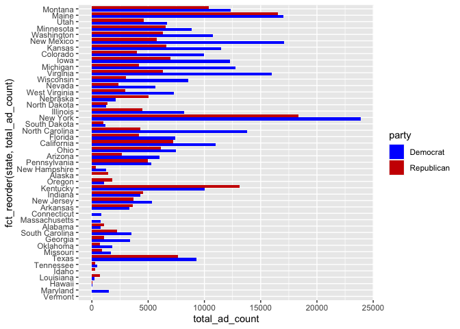
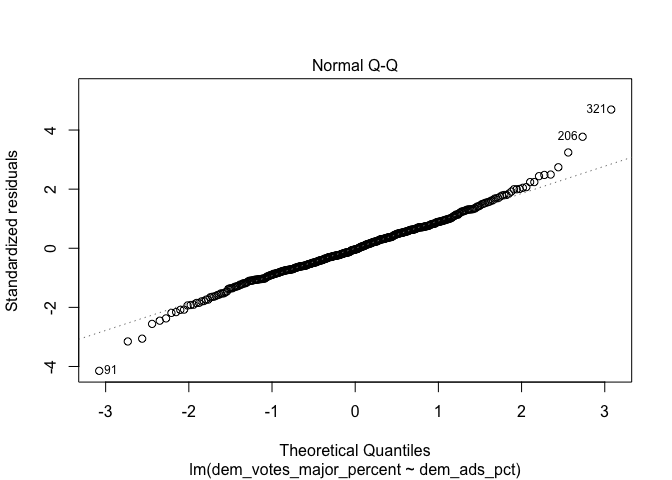
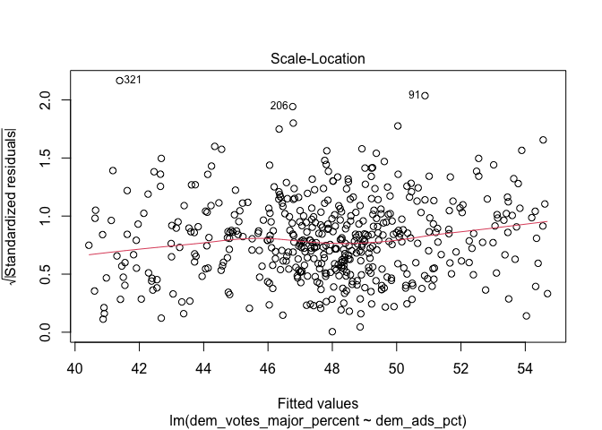
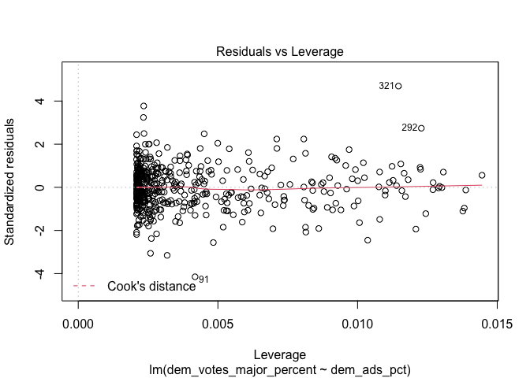
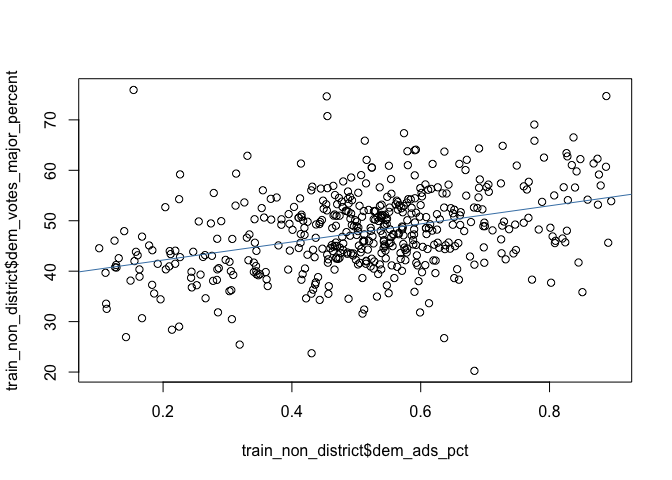
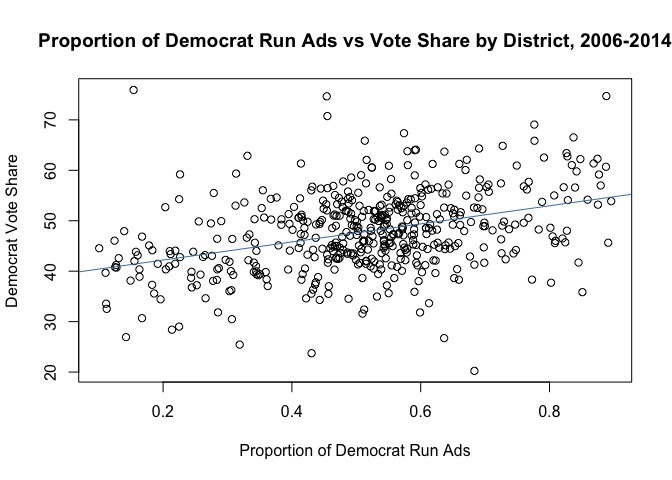

**Air Wars - Political Advertisements**

This week, I want to investigate political advertisements and test if
they are an effective predictor of political performance. In the past
few election cycles, political campaign spending has exploded. In 2022,
political campaigns are expected to spend close to [$10
billion](https://www.cnbc.com/2022/09/26/2022-midterms-candidates-spend-over-6point4-billion-on-ads-making-race-one-of-the-most-expensive-ever.html.)

Whether people are watching TV, listening to the radio, using social
media, or streaming platforms, political advertisements are everywhere.
Advertisements help introduce voters to the candidate. This is
especially true in local or congressional races where the constituency
may not be as familiar with the candidates (unlike Senate,
Gubernatorial, or Presidential races where candidates are oftentimes
more well-known). Campaigns also use ads to attack opponents for their
controversial views, affiliations with certain people or industries, or
public missteps while shining a light on the quality of the character.

As we can see from the bar plots below, Democrats published many more
advertisements than Republicans during the 2018 midterm cycle. While
this is not surprising because Democrats were trying to capitalize on
anti-Trump sentiment to recapture the house (midterms are normally a
referendum on the current administration), what is interesting are the
states with the most total advertisement. While it makes sense that New
York, California, and Texas have a high number of advertisements because
of large populations and many house races, swing states like Virginia,
Pennsylvania, Michigan, have high volume. This may be because many of
the house races in these states are competitive, leading for candidates
to want to advertise more. In addition, both parties have similar
breakdowns when it comes to the tone of their advertisements, with
attack (criticizing the opponent), contrast (comparing the two
candidates), and promote (highlighting personal qualities, voting
records, beliefs etc) each making up roughly 33% of all advertisements
for each party.


    ##  [1] "20" "1"  "2"  "4"  "13" "3"  "7"  "26" "23" "19" "17" "18" "15" "6"  "8" 
    ## [16] "5"  "9"  "10" "14" "12" "16" "11" "22" "45" "47" "21" "24" "29" "25" "28"
    ## [31] "50" "51" "52" "31" "42" "27" "30" "33" "35" "36" "38" "39" "34" "49" "53"
    ## [46] "48" "32"

    ##     [1] 20 20 20 20 20 20 20 20 20 20 20 20 20 20 20 20 20 20 20 20 20 20 20 20
    ##    [25] 20 20 20 20 20 20 20 20 20 20 20 20 20 20 20 20 20 20 20 20 20 20 20 20
    ##    [49] 20 20 20 20 20 20 20 20 20 20 20 20 20 20 20 20 20 20 20 20 20 20 20 20
    ##    [73] 20 20 20 20 20 20 20 20 20 20 20 20 20 20 20 20 20 20 20 20 20 20 20 20
    ##    [97] 20 20 20 20 20 20 20 20 20 20 20 20 20 20 20 20 20 20 20 20 20 20 20 20
    ##   [121] 20 20 20 20 20 20 20 20 20 20 20 20 20 20 20 20 20 20 20 20 20 20 20 20
    ##   [145] 20 20 20 20 20 20 20 20 20 20 20 20 20 20 20 20 20 20 20 20 20 20 20 20
    ##   [169] 20 20 20 20 20 20 20 20 20 20 20 20 20 20 20 20 20 20 20 20 20 20 20 20
    ##   [193] 20 20 20 20 20 20 20 20 20 20 20 20 20 20 20 20 20 20 20 20 20 20 20 20
    ##   [217] 20 20 20 20 20 20 20 20 20 20 20 20 20 20 20 20 20 20 20 20 20 20 20 20
    ##   [241] 20 20 20 20 20 20 20 20 20 20 20 20 20 20 20 20 20 20 20 20 20 20 20 20
    ##   [265] 20 20 20 20 20 20 20 20 20 20 20 20 20 20 20 20 20 20 20 20 20 20 20 20
    ##   [289] 20 20 20 20 20 20 20 20 20 20 20 20 20 20 20 20 20 20 20 20 20 20 20 20
    ##   [313] 20 20 20 20 20 20 20 20 20 20 20 20 20 20 20 20 20 20 20 20 20 20 20 20
    ##   [337] 20 20 20 20 20 20 20 20 20 20 20 20 20 20 20 20 20 20 20 20 20 20 20 20
    ##   [361] 20 20 20 20 20 20 20 20 20 20 20 20 20 20 20 20 20 20 20 20 20 20 20 20
    ##   [385] 20 20 20 20 20 20 20 20 20 20 20 20 20 20 20 20 20 20 20 20 20 20 20 20
    ##   [409] 20 20 20 20 20 20 20 20 20 20 20 20 20 20 20 20 20 20 20 20 20 20 20 20
    ##   [433] 20 20 20 20 20 20 20 20 20 20 20 20 20 20 20 20 20 20 20 20 20 20 20 20
    ##   [457] 20 20 20 20 20 20 20 20 20 20 20 20 20 20 20 20 20 20 20 20 20 20 20 20
    ##   [481] 20 20 20 20 20 20 20 20 20 20 20 20 20 20 20 20 20 20 20 20 20 20 20 20
    ##   [505] 20 20 20 20 20 20 20 20 20 20 20 20 20 20 20 20 20 20 20 20 20 20 20 20
    ##   [529] 20 20 20 20 20 20 20 20 20 20 20 20 20 20 20 20 20 20 20 20 20 20 20 20
    ##   [553] 20 20 20 20 20 20 20 20 20 20 20 20 20 20 20 20 20 20 20 20 20 20 20 20
    ##   [577] 20 20 20 20 20 20 20 20 20 20 20 20 20 20 20 20 20 20 20 20 20 20 20 20
    ##   [601] 20 20 20 20 20 20 20 20 20 20 20 20 20 20 20 20 20 20 20 20 20 20 20 20
    ##   [625] 20 20 20 20 20 20 20 20 20 20 20 20 20 20 20 20 20 20 20 20 20 20 20 20
    ##   [649] 20 20 20 20 20 20 20 20 20 20 20 20 20 20 20 20 20 20 20 20 20 20 20 20
    ##   [673] 20 20 20 20 20 20 20 20 20 20 20 20 20 20 20 20 20 20 20 20 20 20 20 20
    ##   [697] 20 20 20 20 20 20 20 20 20 20 20 20 20 20 20 20 20 20 20 20 20 20 20 20
    ##   [721] 20 20 20 20 20 20 20 20 20 20 20 20 20 20 20 20 20 20 20 20 20 20 20 20
    ##   [745] 20 20 20 20 20 20 20 20 20 20 20 20 20 20 20 20 20 20 20 20 20 20 20 20
    ##   [769] 20 20 20 20 20 20 20 20 20 20 20 20 20 20 20 20 20 20 20 20 20 20 20 20
    ##   [793] 20 20 20 20 20 20 20 20 20 20 20 20 20 20 20 20 20 20 20 20 20 20 20 20
    ##   [817] 20 20 20 20 20 20 20 20 20 20 20 20 20 20 20 20 20 20 20 20 20 20 20 20
    ##   [841] 20 20 20 20 20 20 20 20 20 20 20 20 20 20 20 20 20 20 20 20 20 20 20 20
    ##   [865] 20 20 20 20 20 20 20 20 20 20 20 20 20 20 20 20 20 20 20 20 20 20 20 20
    ##   [889] 20 20 20 20 20 20 20 20 20 20 20 20 20 20 20 20 20 20 20 20 20 20 20 20
    ##   [913] 20 20 20 20 20 20 20 20 20 20 20 20 20 20 20 20 20 20 20 20 20 20 20 20
    ##   [937] 20 20 20 20 20 20 20 20 20 20 20 20 20 20 20 20 20 20 20 20 20 20 20 20
    ##   [961] 20 20 20 20 20 20 20 20 20 20 20 20 20 20 20 20 20 20 20 20 20 20 20 20
    ##   [985] 20 20 20 20 20 20 20 20 20 20 20 20 20 20 20 20 20 20 20 20 20 20 20 20
    ##  [1009] 20 20 20 20 20 20 20 20 20 20 20 20 20 20 20 20 20 20 20 20 20 20 20 20
    ##  [1033] 20 20 20 20 20 20 20 20 20 20 20 20 20 20 20 20 20 20 20 20 20 20 20 20
    ##  [1057] 20 20 20 20 20 20 20 20 20 20 20 20 20 20 20 20 20 20 20 20 20 20 20 20
    ##  [1081] 20 20 20 20 20 20 20 20 20 20 20 20 20 20 20 20 20 20 20 20 20 20 20 20
    ##  [1105] 20 20 20 20 20 20 20 20 20 20 20 20 20 20 20 20 20 20 20 20 20 20 20 20
    ##  [1129] 20 20 20 20 20 20 20 20 20 20 20 20 20 20 20 20 20 20 20 20 20 20 20 20
    ##  [1153] 20 20 20 20 20 20 20 20 20 20 20 20 20 20 20 20 20 20 20 20 20 20 20 20
    ##  [1177] 20 20 20 20 20 20 20 20 20 20 20 20 20 20 20 20 20 20 20 20 20 20 20 20
    ##  [1201] 20 20 20 20 20 20 20 20 20 20 20 20 20 20 20 20 20 20 20 20 20 20 20 20
    ##  [1225] 20 20 20 20 20 20 20 20 20 20 20 20 20 20 20 20 20 20 20 20 20 20 20 20
    ##  [1249] 20 20 20 20 20 20 20 20 20 20 20 20 20 20 20 20 20 20 20 20 20 20 20 20
    ##  [1273] 20 20 20 20 20 20 20 20 20 20 20 20 20 20 20 20 20 20 20 20 20 20 20 20
    ##  [1297] 20 20 20 20 20 20 20 20 20 20 20 20 20 20 20 20 20 20 20 20 20 20 20 20
    ##  [1321] 20 20 20 20 20 20 20 20 20 20 20 20 20 20 20 20 20 20 20 20 20 20 20 20
    ##  [1345] 20 20 20 20 20 20 20 20 20 20 20 20 20 20 20 20 20 20 20 20 20 20 20 20
    ##  [1369] 20 20 20 20 20 20 20 20 20 20 20 20 20 20 20 20 20 20 20 20 20 20 20 20
    ##  [1393] 20 20 20 20 20 20 20 20 20 20 20 20 20 20 20 20 20 20 20 20 20 20 20 20
    ##  [1417] 20 20 20 20 20 20 20 20 20 20 20 20 20 20 20 20 20 20 20 20 20 20 20 20
    ##  [1441] 20 20 20 20 20 20 20 20 20 20 20 20 20 20 20 20 20 20 20 20 20 20 20 20
    ##  [1465] 20 20 20 20 20 20 20 20 20 20 20 20 20 20 20 20 20 20 20 20 20 20 20 20
    ##  [1489] 20 20 20 20 20 20 20 20 20 20 20 20 20 20 20 20 20 20 20 20 20 20 20 20
    ##  [1513] 20 20 20 20 20 20 20 20 20 20 20 20 20 20 20 20 20 20 20 20 20 20 20 20
    ##  [1537] 20 20 20 20 20 20 20 20 20 20 20 20 20 20 20 20 20 20 20 20 20 20 20 20
    ##  [1561] 20 20 20 20 20 20 20 20 20 20 20 20 20 20 20 20 20 20 20 20 20 20 20 20
    ##  [1585] 20 20 20 20 20 20 20 20 20 20 20 20 20 20 20 20 20 20 20 20 20 20 20 20
    ##  [1609] 20 20 20 20 20 20 20 20 20 20 20 20 20 20 20 20 20 20 20 20 20 20 20 20
    ##  [1633] 20 20 20 20 20 20 20 20 20 20 20 20 20 20 20 20 20 20 20 20 20 20 20 20
    ##  [1657] 20 20 20 20 20 20 20 20 20 20 20 20 20 20 20 20 20 20 20 20 20 20 20 20
    ##  [1681] 20 20 20 20 20 20 20 20 20 20 20 20 20 20 20 20 20 20 20 20 20 20 20 20
    ##  [1705] 20 20 20 20 20 20 20 20 20 20 20 20 20 20 20 20 20 20 20 20 20 20 20 20
    ##  [1729] 20 20 20 20 20 20 20 20 20 20 20 20 20 20 20 20 20 20 20 20 20 20 20 20
    ##  [1753] 20 20 20 20 20 20 20 20 20 20 20 20 20 20 20 20 20 20 20 20 20 20 20 20
    ##  [1777] 20 20 20 20 20 20 20 20 20 20 20 20 20 20 20 20 20 20 20 20 20 20 20 20
    ##  [1801] 20 20 20 20 20 20 20 20 20 20 20 20 20 20 20 20 20 20 20 20 20 20 20 20
    ##  [1825] 20 20 20 20 20 20 20 20 20 20 20 20 20 20 20 20 20 20 20 20 20 20 20 20
    ##  [1849] 20 20 20 20 20 20 20 20 20 20 20 20 20 20 20 20 20 20 20 20 20 20 20 20
    ##  [1873] 20 20 20 20 20 20 20 20 20 20 20 20 20 20 20 20 20 20 20 20 20 20 20 20
    ##  [1897] 20 20 20 20 20 20 20 20 20 20 20 20 20 20 20 20 20 20 20 20 20 20 20 20
    ##  [1921] 20 20 20 20 20 20 20 20 20 20 20 20 20 20 20 20 20 20 20 20 20 20 20 20
    ##  [1945] 20 20 20 20 20 20 20 20 20 20 20 20 20 20 20 20 20 20 20 20 20 20 20 20
    ##  [1969] 20 20 20 20 20 20 20 20 20 20 20 20 20 20 20 20 20 20 20 20 20 20 20 20
    ##  [1993] 20 20 20 20 20 20 20 20 20 20 20 20 20 20 20 20 20 20 20 20 20 20 20 20
    ##  [2017] 20 20 20 20 20 20 20 20 20 20 20 20 20 20 20 20 20 20 20 20 20 20 20 20
    ##  [2041] 20 20 20 20 20 20 20 20 20 20 20 20 20 20 20 20 20 20 20 20 20 20 20 20
    ##  [2065] 20 20 20 20 20 20 20 20 20 20 20 20 20 20 20 20 20 20 20 20 20 20 20 20
    ##  [2089] 20 20 20 20 20 20 20 20 20 20 20 20 20 20 20 20 20 20 20 20 20 20 20 20
    ##  [2113] 20 20 20 20 20 20 20 20 20 20 20 20 20 20 20 20 20 20 20 20 20 20 20 20
    ##  [2137] 20 20 20 20 20 20 20 20 20 20 20 20 20 20 20 20 20 20 20 20 20 20 20 20
    ##  [2161] 20 20 20 20 20 20 20 20 20 20 20 20 20 20 20 20 20 20 20 20 20 20 20 20
    ##  [2185] 20 20 20 20 20 20 20 20 20 20 20 20 20 20 20 20 20 20 20 20 20 20 20 20
    ##  [2209] 20 20 20 20 20 20 20 20 20 20 20 20 20 20 20 20 20 20 20 20 20 20 20 20
    ##  [2233] 20 20 20 20 20 20 20 20 20 20 20 20 20 20 20 20 20 20 20 20 20 20 20 20
    ##  [2257] 20 20 20 20 20 20 20 20 20 20 20 20 20 20 20 20 20 20 20 20 20 20 20 20
    ##  [2281] 20 20 20 20 20 20 20 20 20 20 20 20 20 20 20 20 20 20 20 20 20 20 20 20
    ##  [2305] 20 20 20 20 20 20 20 20 20 20 20 20 20 20 20 20 20 20 20 20 20 20 20 20
    ##  [2329] 20 20 20 20 20 20 20 20 20 20 20 20 20 20 20 20 20 20 20 20 20 20 20 20
    ##  [2353] 20 20 20 20 20 20 20 20 20 20 20 20 20 20 20 20 20 20 20 20 20 20 20 20
    ##  [2377] 20 20 20 20 20 20 20 20 20 20 20 20 20 20 20 20 20 20 20 20 20 20 20 20
    ##  [2401] 20 20 20 20 20 20 20 20 20 20 20 20 20 20 20 20 20 20 20 20 20 20 20 20
    ##  [2425] 20 20 20 20 20 20 20 20 20 20 20 20 20 20 20 20 20 20 20 20 20 20 20 20
    ##  [2449] 20 20 20 20 20 20 20 20 20 20 20 20 20 20 20 20 20 20 20 20 20 20 20 20
    ##  [2473] 20 20 20 20 20 20 20 20 20 20 20 20 20 20 20 20 20 20 20 20 20 20 20 20
    ##  [2497] 20 20 20 20 20 20 20 20 20 20 20 20 20 20 20 20 20 20 20 20 20 20 20 20
    ##  [2521] 20 20 20 20 20 20 20 20 20 20 20 20 20 20 20 20 20 20 20 20 20 20 20 20
    ##  [2545] 20 20 20 20 20 20 20 20 20 20 20 20 20 20 20 20 20 20 20 20 20 20 20 20
    ##  [2569] 20 20 20 20 20 20 20 20 20 20 20 20 20 20 20 20 20 20 20 20 20 20 20 20
    ##  [2593] 20 20 20 20 20 20 20 20 20 20 20 20 20 20 20 20 20 20 20 20 20 20 20 20
    ##  [2617] 20 20 20 20 20 20 20 20 20 20 20 20 20 20 20 20 20 20 20 20 20 20 20 20
    ##  [2641] 20 20 20 20 20 20 20 20 20 20 20 20 20 20 20 20 20 20 20 20 20 20 20 20
    ##  [2665] 20 20 20 20 20 20 20 20 20 20 20 20 20 20 20 20 20 20 20 20 20 20 20 20
    ##  [2689] 20 20 20 20 20 20 20 20 20 20 20 20 20 20 20 20 20 20 20 20 20 20 20 20
    ##  [2713] 20 20 20 20 20 20 20 20 20 20 20 20 20 20 20 20 20 20 20 20 20 20 20 20
    ##  [2737] 20 20 20 20 20 20 20 20 20 20 20 20 20 20 20 20 20 20 20 20 20 20 20 20
    ##  [2761] 20 20 20 20 20 20 20 20 20 20 20 20 20 20 20 20 20 20 20 20 20 20 20 20
    ##  [2785] 20 20 20 20 20 20 20 20 20 20 20 20 20 20 20 20 20 20 20 20 20 20 20 20
    ##  [2809] 20 20 20 20 20 20 20 20 20 20 20 20 20 20 20 20 20 20 20 20 20 20 20 20
    ##  [2833] 20 20 20 20 20 20 20 20 20 20 20 20 20 20 20 20 20 20 20 20 20 20 20 20
    ##  [2857] 20 20 20 20 20 20 20 20 20 20 20 20 20 20 20 20 20 20 20 20 20 20 20 20
    ##  [2881] 20 20 20 20 20 20 20 20 20 20 20 20 20 20 20 20 20 20 20 20 20 20 20 20
    ##  [2905] 20 20 20 20 20 20 20 20 20 20 20 20 20 20 20 20 20 20 20 20 20 20 20 20
    ##  [2929] 20 20 20 20 20 20 20 20 20 20 20 20 20 20 20 20 20 20 20 20 20 20 20 20
    ##  [2953] 20 20 20 20 20 20 20 20 20 20 20 20 20 20 20 20 20 20 20 20 20 20 20 20
    ##  [2977] 20 20 20 20 20 20 20 20 20 20 20 20 20 20 20 20 20 20 20 20 20 20 20 20
    ##  [3001] 20 20 20 20 20 20 20 20 20 20 20 20 20 20 20 20 20 20 20 20 20 20 20 20
    ##  [3025] 20 20 20 20 20 20 20 20 20 20 20 20 20 20 20 20 20 20 20 20 20 20 20 20
    ##  [3049] 20 20 20 20 20 20 20 20 20 20 20 20 20 20 20 20 20 20 20 20 20 20 20 20
    ##  [3073] 20 20 20 20 20 20 20 20 20 20 20 20 20 20 20 20 20 20 20 20 20 20 20 20
    ##  [3097] 20 20 20 20 20 20 20 20 20 20 20 20 20 20 20 20 20 20 20 20 20 20 20 20
    ##  [3121] 20 20 20 20 20 20 20 20 20 20 20 20 20 20 20 20 20 20 20 20 20 20 20 20
    ##  [3145] 20 20 20 20 20 20 20 20 20 20 20 20 20 20 20 20 20 20 20 20 20 20 20 20
    ##  [3169] 20 20 20 20 20 20 20 20 20 20 20 20 20 20 20 20 20 20 20 20 20 20 20 20
    ##  [3193] 20 20 20 20 20 20 20 20 20 20 20 20 20 20 20 20 20 20 20 20 20 20 20 20
    ##  [3217] 20 20 20 20 20 20 20 20 20 20 20 20 20 20 20 20 20 20 20 20 20 20 20 20
    ##  [3241] 20 20 20 20 20 20 20 20 20 20 20 20 20 20 20 20 20 20 20 20 20 20 20 20
    ##  [3265] 20 20 20 20 20 20 20 20 20 20 20 20 20 20 20 20 20 20 20 20 20 20 20 20
    ##  [3289] 20 20 20 20 20 20 20 20 20 20 20 20 20 20 20 20 20 20 20 20 20 20 20 20
    ##  [3313] 20 20 20 20 20 20 20 20 20 20 20 20 20 20 20 20 20 20 20 20 20 20 20 20
    ##  [3337] 20 20 20 20 20 20 20 20 20 20 20 20 20 20 20 20 20 20 20 20 20 20 20 20
    ##  [3361] 20 20 20 20 20 20 20 20 20 20 20 20 20 20 20 20 20 20 20 20 20 20 20 20
    ##  [3385] 20 20 20 20 20 20 20 20 20 20 20 20 20 20 20 20 20 20 20 20 20 20 20 20
    ##  [3409] 20 20 20 20 20 20 20 20 20 20 20 20 20 20 20 20 20 20 20 20 20 20 20 20
    ##  [3433] 20 20 20 20 20 20 20 20 20 20 20 20 20 20 20 20 20 20 20 20 20 20 20 20
    ##  [3457] 20 20 20 20 20 20 20 20 20 20 20 20 20 20 20 20 20 20 20 20 20 20 20 20
    ##  [3481] 20 20 20 20 20 20 20 20 20 20 20 20 20 20 20 20 20 20 20 20 20 20 20 20
    ##  [3505] 20 20 20 20 20 20 20 20 20 20 20 20 20 20 20 20 20 20 20 20 20 20 20 20
    ##  [3529] 20 20 20 20 20 20 20 20 20 20 20 20 20 20 20 20 20 20 20 20 20 20 20 20
    ##  [3553] 20 20 20 20 20 20 20 20 20 20 20 20 20 20 20 20 20 20 20 20 20 20 20 20
    ##  [3577] 20 20 20 20 20 20 20 20 20 20 20 20 20 20 20 20 20 20 20 20 20 20 20 20
    ##  [3601] 20 20 20 20 20 20 20 20 20 20 20 20 20 20 20 20 20 20 20 20 20 20 20 20
    ##  [3625] 20 20 20 20 20 20 20 20 20 20 20 20 20 20 20 20 20 20 20 20 20 20 20 20
    ##  [3649] 20 20 20 20 20 20 20 20 20 20 20 20 20 20 20 20 20 20 20 20 20 20 20 20
    ##  [3673] 20 20 20 20 20 20 20 20 20 20 20 20 20 20 20 20 20 20 20 20 20 20 20 20
    ##  [3697] 20 20 20 20 20 20 20 20 20 20 20 20 20 20 20 20 20 20 20 20 20 20 20 20
    ##  [3721] 20 20 20 20 20 20 20 20 20 20 20 20 20 20 20 20 20 20 20 20 20 20 20 20
    ##  [3745] 20 20 20 20 20 20 20 20 20 20 20 20 20 20 20 20 20 20 20 20 20 20 20 20
    ##  [3769] 20 20 20 20 20 20 20 20 20 20 20 20 20 20 20 20 20 20 20 20 20 20 20 20
    ##  [3793] 20 20 20 20 20 20 20 20 20 20 20 20 20 20 20 20 20 20 20 20 20 20 20 20
    ##  [3817] 20 20 20 20 20 20 20 20 20 20 20 20 20 20 20 20 20 20 20 20 20 20 20 20
    ##  [3841] 20 20 20 20 20 20 20 20 20 20 20 20 20 20 20 20 20 20 20 20 20 20 20 20
    ##  [3865] 20 20 20 20 20 20 20 20 20 20 20 20 20 20 20 20 20 20 20 20 20 20 20 20
    ##  [3889] 20 20 20 20 20 20 20 20 20 20 20 20 20 20 20 20 20 20 20 20 20 20 20 20
    ##  [3913] 20 20 20 20 20 20 20 20 20 20 20 20 20 20 20 20 20 20 20 20 20 20 20 20
    ##  [3937] 20 20 20 20 20 20 20 20 20 20 20 20 20 20 20 20 20 20 20 20 20 20 20 20
    ##  [3961] 20 20 20 20 20 20 20 20 20 20 20 20 20 20 20 20 20 20 20 20 20 20 20 20
    ##  [3985] 20 20 20 20 20 20 20 20 20 20 20 20 20 20 20 20 20 20 20 20 20 20 20 20
    ##  [4009] 20 20 20 20 20 20 20 20 20 20 20 20 20 20 20 20 20 20 20 20 20 20 20 20
    ##  [4033] 20 20 20 20 20 20 20 20 20 20 20 20 20 20 20 20 20 20 20 20 20 20 20 20
    ##  [4057] 20 20 20 20 20 20 20 20 20 20 20 20 20 20 20 20 20 20 20 20 20 20 20 20
    ##  [4081] 20 20 20 20 20 20 20 20 20 20 20 20 20 20 20 20 20 20 20 20 20 20 20 20
    ##  [4105] 20 20 20 20 20 20 20 20 20 20 20 20 20 20 20 20 20 20 20 20 20 20 20 20
    ##  [4129] 20 20 20 20 20 20 20 20 20 20 20 20 20 20 20 20 20 20 20 20 20 20 20 20
    ##  [4153] 20 20 20 20 20 20 20 20 20 20 20 20 20 20 20 20 20 20 20 20 20 20 20 20
    ##  [4177] 20 20 20 20 20 20 20 20 20 20 20 20 20 20 20 20 20 20 20 20 20 20 20 20
    ##  [4201] 20 20 20 20 20 20 20 20 20 20 20 20 20 20 20 20 20 20 20 20 20 20 20 20
    ##  [4225] 20 20 20 20 20 20 20 20 20 20 20 20 20 20 20 20 20 20 20 20 20 20 20 20
    ##  [4249] 20 20 20 20 20 20 20 20 20 20 20 20 20 20 20 20 20 20 20 20 20 20 20 20
    ##  [4273] 20 20 20 20 20 20 20 20 20 20 20 20 20 20 20 20 20 20 20 20 20 20 20 20
    ##  [4297] 20 20 20 20 20 20 20 20 20 20 20 20 20 20 20 20 20 20 20 20 20 20 20 20
    ##  [4321] 20 20 20 20 20 20 20 20 20 20 20 20 20 20 20 20 20 20 20 20 20 20 20 20
    ##  [4345] 20 20 20 20 20 20 20 20 20 20 20 20 20 20 20 20 20 20 20 20 20 20 20 20
    ##  [4369] 20 20 20 20 20 20 20 20 20 20 20 20 20 20 20 20 20 20 20 20 20 20 20 20
    ##  [4393] 20 20 20 20 20 20 20 20 20 20 20 20 20 20 20 20 20 20 20 20 20 20 20 20
    ##  [4417] 20 20 20 20 20 20 20 20 20 20 20 20 20 20 20 20 20 20 20 20 20 20 20 20
    ##  [4441] 20 20 20 20 20 20 20 20 20 20 20 20 20 20 20 20 20 20 20 20 20 20 20 20
    ##  [4465] 20 20 20 20 20 20 20 20 20 20 20 20 20 20 20 20 20 20 20 20 20 20 20 20
    ##  [4489] 20 20 20 20 20 20 20 20 20 20 20 20 20 20 20 20 20 20 20 20 20 20 20 20
    ##  [4513] 20 20 20 20 20 20 20 20 20 20 20 20 20 20 20 20 20 20 20 20 20 20 20 20
    ##  [4537] 20 20 20 20 20 20 20 20 20 20 20 20 20 20 20 20 20 20 20 20 20 20 20 20
    ##  [4561] 20 20 20 20 20 20 20 20 20 20 20 20 20 20 20 20 20 20 20 20 20 20 20 20
    ##  [4585] 20 20 20 20 20 20 20 20 20 20 20 20 20 20 20 20 20 20 20 20 20 20 20 20
    ##  [4609] 20 20 20 20 20 20 20 20 20 20 20 20 20 20 20 20 20 20 20 20 20 20 20 20
    ##  [4633] 20 20 20 20 20 20 20 20 20 20 20 20 20 20 20 20 20 20 20 20 20 20 20 20
    ##  [4657] 20 20 20 20 20 20 20 20 20 20 20 20 20 20 20 20 20 20 20 20 20 20 20 20
    ##  [4681] 20 20 20 20 20 20 20 20 20 20 20 20 20 20 20 20 20 20 20 20 20 20 20 20
    ##  [4705] 20 20 20 20 20 20 20 20 20 20 20 20 20 20 20 20 20 20 20 20 20 20 20 20
    ##  [4729] 20 20 20 20 20 20 20 20 20 20 20 20 20 20 20 20 20 20 20 20 20 20 20 20
    ##  [4753] 20 20 20 20 20 20 20 20 20 20 20 20 20 20 20 20 20 20 20 20 20 20 20 20
    ##  [4777] 20 20 20 20 20 20 20 20 20 20 20 20 20 20 20 20 20 20 20 20 20 20 20 20
    ##  [4801] 20 20 20 20 20 20 20 20 20 20 20 20 20 20 20 20 20 20 20 20 20 20 20 20
    ##  [4825] 20 20 20 20 20 20 20 20 20 20 20 20 20 20 20 20 20 20 20 20 20 20 20 20
    ##  [4849] 20 20 20 20 20 20 20 20 20 20 20 20 20 20 20 20 20 20 20 20 20 20 20 20
    ##  [4873] 20 20 20 20 20 20 20 20 20 20 20 20 20 20 20 20 20 20 20 20 20 20 20 20
    ##  [4897] 20 20 20 20 20 20 20 20 20 20 20 20 20 20 20 20 20 20 20 20 20 20 20 20
    ##  [4921] 20 20 20 20 20 20 20 20 20 20 20 20 20 20 20 20 20 20 20 20 20 20 20 20
    ##  [4945] 20 20 20 20 20 20 20 20 20 20 20 20 20 20 20 20 20 20 20 20 20 20 20 20
    ##  [4969] 20 20 20 20 20 20 20 20 20 20 20 20 20 20 20 20 20 20 20 20 20 20 20 20
    ##  [4993] 20 20 20 20 20 20 20 20 20 20 20 20 20 20 20 20 20 20 20 20 20 20 20 20
    ##  [5017] 20 20 20 20 20 20 20 20 20 20 20 20 20 20 20 20 20 20 20 20 20 20 20 20
    ##  [5041] 20 20 20 20 20 20 20 20 20 20 20 20 20 20 20 20 20 20 20 20 20 20 20 20
    ##  [5065] 20 20 20 20 20 20 20 20 20 20 20 20 20 20 20 20 20 20 20 20 20 20 20 20
    ##  [5089] 20 20 20 20 20 20 20 20 20 20 20 20 20 20 20 20 20 20 20 20 20 20 20 20
    ##  [5113] 20 20 20 20 20 20 20 20 20 20 20 20 20 20 20 20 20 20 20 20 20 20 20 20
    ##  [5137] 20 20 20 20 20 20 20 20 20 20 20 20 20 20 20 20 20 20 20 20 20 20 20 20
    ##  [5161] 20 20 20 20 20 20 20 20 20 20 20 20 20 20 20 20 20 20 20 20 20 20 20 20
    ##  [5185] 20 20 20 20 20 20 20 20 20 20 20 20 20 20 20 20 20 20 20 20 20 20 20 20
    ##  [5209] 20 20 20 20 20 20 20 20 20 20 20 20 20 20 20 20 20 20 20 20 20 20 20 20
    ##  [5233] 20 20 20 20 20 20 20 20 20 20 20 20 20 20 20 20 20 20 20 20 20 20 20 20
    ##  [5257] 20 20 20 20 20 20 20 20 20 20 20 20 20 20 20 20 20 20 20 20 20 20 20 20
    ##  [5281] 20 20 20 20 20 20 20 20 20 20 20 20 20 20 20 20 20 20 20 20 20 20 20 20
    ##  [5305] 20 20 20 20 20 20 20 20 20 20 20 20 20 20 20 20 20 20 20 20 20 20 20 20
    ##  [5329] 20 20 20 20 20 20 20 20 20 20 20 20 20 20 20 20 20 20 20 20 20 20 20 20
    ##  [5353] 20 20 20 20 20 20 20 20 20 20 20 20 20 20 20 20 20 20 20 20 20 20 20 20
    ##  [5377] 20 20 20 20 20 20 20 20 20 20 20 20 20 20 20 20 20 20 20 20 20 20 20 20
    ##  [5401] 20 20 20 20 20 20 20 20 20 20 20 20 20 20 20 20 20 20 20 20 20 20 20 20
    ##  [5425] 20 20 20 20 20 20 20 20 20 20 20 20 20 20 20 20 20 20 20 20 20 20 20 20
    ##  [5449] 20 20 20 20 20 20 20 20 20 20 20 20 20 20 20 20 20 20 20 20 20 20 20 20
    ##  [5473] 20 20 20 20 20 20 20 20 20 20 20 20 20 20 20 20 20 20 20 20 20 20 20 20
    ##  [5497] 20 20 20 20 20 20 20 20 20 20 20 20 20 20 20 20 20 20 20 20 20 20 20 20
    ##  [5521] 20 20 20 20 20 20 20 20 20 20 20 20 20 20 20 20 20 20 20 20 20 20 20 20
    ##  [5545] 20 20 20 20 20 20 20 20 20 20 20 20 20 20 20 20 20 20 20 20 20 20 20 20
    ##  [5569] 20 20 20 20 20 20 20 20 20 20 20 20 20 20 20 20 20 20 20 20 20 20 20 20
    ##  [5593] 20 20 20 20 20 20 20 20 20 20 20 20 20 20 20 20 20 20 20 20 20 20 20 20
    ##  [5617] 20 20 20 20 20 20 20 20 20 20 20 20 20 20 20 20 20 20 20 20 20 20 20 20
    ##  [5641] 20 20 20 20 20 20 20 20 20 20 20 20 20 20 20 20 20 20 20 20 20 20 20 20
    ##  [5665] 20 20 20 20 20 20 20 20 20 20 20 20 20 20 20 20 20 20 20 20 20 20 20 20
    ##  [5689] 20 20 20 20 20 20 20 20 20 20 20 20 20 20 20 20 20 20 20 20 20 20 20 20
    ##  [5713] 20 20 20 20 20 20 20 20 20 20 20 20 20 20 20 20 20 20 20 20 20 20 20 20
    ##  [5737] 20 20 20 20 20 20 20 20 20 20 20 20 20 20 20 20 20 20 20 20 20 20 20 20
    ##  [5761] 20 20 20 20 20 20 20 20 20 20 20 20 20 20 20 20 20 20 20 20 20 20 20 20
    ##  [5785] 20 20 20 20 20 20 20 20 20 20 20 20 20 20 20 20 20 20 20 20 20 20 20 20
    ##  [5809] 20 20 20 20 20 20 20 20 20 20 20 20 20 20 20 20 20 20 20 20 20 20 20 20
    ##  [5833] 20 20 20 20 20 20 20 20 20 20 20 20 20 20 20 20 20 20 20 20 20 20 20 20
    ##  [5857] 20 20 20 20 20 20 20 20 20 20 20 20 20 20 20 20 20 20 20 20 20 20 20 20
    ##  [5881] 20 20 20 20 20 20 20 20 20 20 20 20 20 20 20 20 20 20 20 20 20 20 20 20
    ##  [5905] 20 20 20 20 20 20 20 20 20 20 20 20 20 20 20 20 20 20 20 20 20 20 20 20
    ##  [5929] 20 20 20 20 20 20 20 20 20 20 20 20 20 20 20 20 20 20 20 20 20 20 20 20
    ##  [5953] 20 20 20 20 20 20 20 20 20 20 20 20 20 20 20 20 20 20 20 20 20 20 20 20
    ##  [5977] 20 20 20 20 20 20 20 20 20 20 20 20 20 20 20 20 20 20 20 20 20 20 20 20
    ##  [6001] 20 20 20 20 20 20 20 20 20 20 20 20 20 20 20 20 20 20 20 20 20 20 20 20
    ##  [6025] 20 20 20 20 20 20 20 20 20 20 20 20 20 20 20 20 20 20 20 20 20 20 20 20
    ##  [6049] 20 20 20 20 20 20 20 20 20 20 20 20 20 20 20 20 20 20 20 20 20 20 20 20
    ##  [6073] 20 20 20 20 20 20 20 20 20 20 20 20 20 20 20 20 20 20 20 20 20 20 20 20
    ##  [6097] 20 20 20 20 20 20 20 20 20 20 20 20 20 20 20 20 20 20 20 20 20 20 20 20
    ##  [6121] 20 20 20 20 20 20 20 20 20 20 20 20 20 20 20 20 20 20 20 20 20 20 20 20
    ##  [6145] 20 20 20 20 20 20 20 20 20 20 20 20 20 20 20 20 20 20 20 20 20 20 20 20
    ##  [6169] 20 20 20 20 20 20 20 20 20 20 20 20 20 20 20 20 20 20 20 20 20 20 20 20
    ##  [6193] 20 20 20 20 20 20 20 20 20 20 20 20 20 20 20 20 20 20 20 20 20 20 20 20
    ##  [6217] 20 20 20 20 20 20 20 20 20 20 20 20 20 20 20 20 20 20 20 20 20 20 20 20
    ##  [6241] 20 20 20 20 20 20 20 20 20 20 20 20 20 20 20 20 20 20 20 20 20 20 20 20
    ##  [6265] 20 20 20 20 20 20 20 20 20 20 20 20 20 20 20 20 20 20 20 20 20 20 20 20
    ##  [6289] 20 20 20 20 20 20 20 20 20 20 20 20 20 20 20 20 20 20 20 20 20 20 20 20
    ##  [6313] 20 20 20 20 20 20 20 20 20 20 20 20 20 20 20 20 20 20 20 20 20 20 20 20
    ##  [6337] 20 20 20 20 20 20 20 20 20 20 20 20 20 20 20 20 20 20 20 20 20 20 20 20
    ##  [6361] 20 20 20 20 20 20 20 20 20 20 20 20 20 20 20 20 20 20 20 20 20 20 20 20
    ##  [6385] 20 20 20 20 20 20 20 20 20 20 20 20 20 20 20 20 20 20 20 20 20 20 20 20
    ##  [6409] 20 20 20 20 20 20 20 20 20 20 20 20 20 20 20 20 20 20 20 20 20 20 20 20
    ##  [6433] 20 20 20 20 20 20 20 20 20 20 20 20 20 20 20 20 20 20 20 20 20 20 20 20
    ##  [6457] 20 20 20 20 20 20 20 20 20 20 20 20 20 20 20 20 20 20 20 20 20 20 20 20
    ##  [6481] 20 20 20 20 20 20 20 20 20 20 20 20 20 20 20 20 20 20 20 20 20 20 20 20
    ##  [6505] 20 20 20 20 20 20 20 20 20 20 20 20 20 20 20 20 20 20 20 20 20 20 20 20
    ##  [6529] 20 20 20 20 20 20 20 20 20 20 20 20 20 20 20 20 20 20 20 20 20 20 20 20
    ##  [6553] 20 20 20 20 20 20 20 20 20 20 20 20 20 20 20 20 20 20 20 20 20 20 20 20
    ##  [6577] 20 20 20 20 20 20 20 20 20 20 20 20 20 20 20 20 20 20 20 20 20 20 20 20
    ##  [6601] 20 20 20 20 20 20 20 20 20 20 20 20 20 20 20 20 20 20 20 20 20 20 20 20
    ##  [6625] 20 20 20 20 20 20 20 20 20 20 20 20 20 20 20 20 20 20 20 20 20 20 20 20
    ##  [6649] 20 20 20 20 20 20 20 20 20 20 20 20 20 20 20 20 20 20 20 20 20 20 20 20
    ##  [6673] 20 20 20 20 20 20 20 20 20 20 20 20 20 20 20 20 20 20 20 20 20 20 20 20
    ##  [6697] 20 20 20 20 20 20 20 20 20 20 20 20 20 20 20 20 20 20 20 20 20 20 20 20
    ##  [6721] 20 20 20 20 20 20 20 20 20 20 20 20 20 20 20 20 20 20 20 20 20 20 20 20
    ##  [6745] 20 20 20 20 20 20 20 20 20 20 20 20 20 20 20 20 20 20 20 20 20 20 20 20
    ##  [6769] 20 20 20 20 20 20 20 20 20 20 20 20 20 20 20 20 20 20 20 20 20 20 20 20
    ##  [6793] 20 20 20 20 20 20 20 20 20 20 20 20 20 20 20 20 20 20 20 20 20 20 20 20
    ##  [6817] 20 20 20 20 20 20 20 20 20 20 20 20 20 20 20 20 20 20 20 20 20 20 20 20
    ##  [6841] 20 20 20 20 20 20 20 20 20 20 20 20 20 20 20 20 20 20 20 20 20 20 20 20
    ##  [6865] 20 20 20 20 20 20 20 20 20 20 20 20 20 20 20 20 20 20 20 20 20 20 20 20
    ##  [6889] 20 20 20 20 20 20 20 20 20 20 20 20 20 20 20 20 20 20 20 20 20 20 20 20
    ##  [6913] 20 20 20 20 20 20 20 20 20 20 20 20 20 20 20 20 20 20 20 20 20 20 20 20
    ##  [6937] 20 20 20 20 20 20 20 20 20 20 20 20 20 20 20 20 20 20 20 20 20 20 20 20
    ##  [6961] 20 20 20 20 20 20 20 20 20 20 20 20 20 20 20 20 20 20 20 20 20 20 20 20
    ##  [6985] 20 20 20 20 20 20 20 20 20 20 20 20 20 20 20 20 20 20 20 20 20 20 20 20
    ##  [7009] 20 20 20 20 20 20 20 20 20 20 20 20 20 20 20 20 20 20 20 20 20 20 20 20
    ##  [7033] 20 20 20 20 20 20 20 20 20 20 20 20 20 20 20 20 20 20 20 20 20 20 20 20
    ##  [7057] 20 20 20 20 20 20 20 20 20 20 20 20 20 20 20 20 20 20 20 20 20 20 20 20
    ##  [7081] 20 20 20 20 20 20 20 20 20 20 20 20 20 20 20 20 20 20 20 20 20 20 20 20
    ##  [7105] 20 20 20 20 20 20 20 20 20 20 20 20 20 20 20 20 20 20 20 20 20 20  1  1
    ##  [7129]  1  1  1  1  1  1  1  1  1  1  1  1  1  1  1  1  1  1  1  1  1  1  1  1
    ##  [7153]  1  1  1  1  2  1  1  1  1  1  1  1  2  1  1  1  1  1  1  1  1  1  1  1
    ##  [7177]  1  1  1  1  1  1  1  1  1  1  1  1  1  1  1  1  1  1  1  1  1  1  1  1
    ##  [7201]  1  1  1  1  1  1  1  1  1  1  1  1  1  1  1  1  1  1  1  1  1  1  1  1
    ##  [7225]  1  1  1  1  1  1  1  1  1  1  1  1  1  1  1  1  1  1  1  1  1  1  1  1
    ##  [7249]  1  1  1  1  1  1  1  1  1  1  1  1  2  1  2  1  1  1  1  1  1  1  1  1
    ##  [7273]  1  1  1  1  1  1  1  1  1  1  1  1  1  1  1  1  1  1  1  1  1  1  1  1
    ##  [7297]  1  1  1  1  1  1  1  1  1  1  1  1  1  1  1  1  1  1  1  1  1  1  1  1
    ##  [7321]  1  2  1  1  1  1  1  1  1  1  1  1  1  1  1  1  1  1  1  1  1  1  1  1
    ##  [7345]  2  1  1  1  1  1  1  1  1  1  1  1  1  1  1  1  1  1  1  1  1  1  1  1
    ##  [7369]  1  1  1  1  1  1  1  1  1  1  1  1  1  1  1  1  1  1  1  1  1  1  1  1
    ##  [7393]  1  1  1  1  1  1  1  1  1  1  1  1  1  1  1  1  1  1  1  1  1  1  1  1
    ##  [7417]  1  1  1  1  1  1  1  1  1  1  1  1  1  1  1  1  1  1  1  1  1  1  1  1
    ##  [7441]  1  1  1  1  1  1  1  1  1  1  1  1  1  1  1  1  1  1  1  1  1  1  1  1
    ##  [7465]  1  1  1  1  2  1  1  1  1  1  1  1  1  1  1  1  1  1  1  1  1  1  1  1
    ##  [7489]  1  1  1  1  1  1  1  1  1  1  1  1  1  1  1  1  2  1  1  1  1  1  1  1
    ##  [7513]  1  1  1  1  1  1  1  1  1  1  1  1  1  1  1  1  1  1  1  1  1  1  1  1
    ##  [7537]  1  1  1  1  1  1  1  1  1  1  1  1  1  1  1  1  1  1  1  1  1  1  1  1
    ##  [7561]  1  1  1  1  1  1  1  1  1  1  1  1  1  1  1  1  1  1  1  1  1  1  1  1
    ##  [7585]  1  1  1  1  1  1  1  1  1  1  1  2  1  1  1  1  1  1  1  1  1  1  1  1
    ##  [7609]  1  1  1  1  1  1  1  2  1  1  1  2  1  1  1  1  1  1  1  1  1  1  1  1
    ##  [7633]  1  1  1  1  1  1  1  1  1  1  1  1  1  1  1  1  1  1  1  1  1  1  1  1
    ##  [7657]  1  1  1  1  1  1  1  1  1  1  1  1  1  1  1  2  1  1  1  1  1  1  1  1
    ##  [7681]  1  1  1  1  1  1  1  1  1  1  1  1  1  1  1  1  1  1  1  1  1  1  1  1
    ##  [7705]  1  1  1  1  1  1  1  1  1  1  1  1  1  1  1  1  1  1  1  1  1  1  1  1
    ##  [7729]  1  2  1  1  1  1  1  1  1  1  1  1  1  1  1  1  1  1  1  1  1  1  1  1
    ##  [7753]  1  1  1  1  1  1  1  1  1  1  1  1  1  1  1  1  1  1  2  1  1  1  1  1
    ##  [7777]  1  1  1  1  1  1  1  1  1  1  1  1  1  1  1  1  1  1  1  1  1  1  1  1
    ##  [7801]  1  1  1  1  1  1  1  1  1  1  1  1  1  1  1  1  1  1  1  1  1  1  1  1
    ##  [7825]  1  1  1  1  1  1  1  1  1  1  1  1  1  1  1  1  1  2  1  1  1  1  1  2
    ##  [7849]  1  1  1  1  2  1  1  1  1  1  1  1  1  2  1  1  1  1  1  1  1  1  1  1
    ##  [7873]  1  1  1  1  1  1  1  1  1  1  1  1  1  2  1  1  1  1  1  1  1  1  2  1
    ##  [7897]  2  1  1  1  1  2  2  2  2  1  2  1  2  1  2  1  1  1  2  1  2  2  2  2
    ##  [7921]  1  1  2  1  2  1  2  1  1  1  1  1  2  1  2  1  1  2  1  2  1  1  1  1
    ##  [7945]  2  1  1  1  1  1  1  1  1  1  1  1  1  1  1  1  1  1  1  1  1  1  1  1
    ##  [7969]  1  1  1  1  1  1  1  1  1  1  1  1  1  1  1  1  1  1  1  1  1  1  1  2
    ##  [7993]  1  2  2  1  2  1  1  2  1  2  1  1  2  2  1  1  1  1  1  1  2  1  1  2
    ##  [8017]  1  1  2  1  1  1  2  2  1  2  2  1  1  1  1  1  1  2  2  1  1  1  1  1
    ##  [8041]  2  1  2  2  1  2  1  2  1  1  2  2  2  1  1  1  1  1  2  1  1  1  1  1
    ##  [8065]  1  1  1  1  1  1  1  1  1  1  1  1  1  1  1  2  1  1  1  1  1  1  1  1
    ##  [8089]  1  1  1  1  1  1  1  1  1  1  1  1  1  1  1  1  1  1  1  1  1  1  1  1
    ##  [8113]  1  1  1  1  1  1  1  1  1  1  1  2  1  1  1  1  1  1  1  1  1  1  1  1
    ##  [8137]  1  1  1  1  1  1  1  1  1  1  1  1  1  1  1  1  1  1  1  1  1  1  1  1
    ##  [8161]  1  1  1  1  1  1  1  1  1  1  1  1  1  1  1  1  1  1  1  1  1  1  1  1
    ##  [8185]  1  1  1  1  1  1  1  1  2  1  1  1  1  1  1  1  1  1  1  1  1  1  1  1
    ##  [8209]  1  1  1  1  1  1  1  1  1  1  1  1  1  1  1  1  1  1  1  1  1  1  1  1
    ##  [8233]  1  1  1  1  1  1  1  1  1  1  1  1  1  1  1  1  1  1  1  1  1  1  1  1
    ##  [8257]  1  1  1  1  1  1  1  1  1  1  1  1  1  1  1  1  1  1  1  1  1  1  1  1
    ##  [8281]  1  1  1  1  1  1  1  1  1  1  1  1  1  1  1  1  1  1  1  1  1  1  1  1
    ##  [8305]  1  1  1  1  1  1  1  1  1  1  1  1  1  1  1  1  1  1  1  1  1  1  1  1
    ##  [8329]  1  1  1  1  1  1  1  1  1  1  1  1  2  1  1  1  1  1  1  1  1  1  1  1
    ##  [8353]  1  1  1  1  1  1  2  1  1  1  1  1  1  1  1  1  1  1  1  1  1  1  1  1
    ##  [8377]  1  1  2  1  1  1  1  1  1  1  1  1  1  1  1  1  1  1  1  1  1  1  1  2
    ##  [8401]  1  1  1  1  1  1  1  1  1  1  1  1  1  1  1  1  1  1  1  1  1  1  1  1
    ##  [8425]  1  1  1  1  1  1  1  1  1  1  1  1  1  1  1  1  1  1  1  1  1  1  1  1
    ##  [8449]  1  1  1  1  1  1  1  1  1  1  1  1  1  1  1  1  1  1  1  2  1  1  1  1
    ##  [8473]  1  1  1  1  1  1  1  1  1  1  1  1  1  1  1  1  1  1  1  1  1  1  1  1
    ##  [8497]  1  1  1  1  1  1  1  1  1  2  1  1  1  1  1  1  1  1  1  1  1  1  1  1
    ##  [8521]  1  1  1  1  1  1  1  1  1  1  1  1  1  1  1  1  1  1  1  1  1  1  1  1
    ##  [8545]  1  1  1  1  1  1  1  1  1  1  1  1  1  1  1  1  1  1  1  1  1  1  1  1
    ##  [8569]  1  1  1  1  1  1  1  1  1  1  1  1  1  1  1  1  1  1  1  1  1  1  1  1
    ##  [8593]  1  1  1  1  1  1  1  1  1  1  1  1  1  1  1  1  1  1  1  1  1  1  1  1
    ##  [8617]  1  1  1  1  1  1  1  1  1  1  1  1  1  1  1  1  1  2  1  1  1  1  1  1
    ##  [8641]  1  1  1  1  1  1  1  1  1  1  1  1  1  1  1  1  1  1  1  1  1  1  1  2
    ##  [8665]  1  1  1  1  1  1  1  1  1  1  1  1  1  1  1  1  1  1  1  1  1  1  1  1
    ##  [8689]  1  1  1  1  1  1  1  1  1  1  1  1  1  1  1  1  1  1  1  1  2  1  1  1
    ##  [8713]  2  1  1  1  1  1  1  1  1  1  1  1  1  1  1  1  1  1  1  1  1  1  1  1
    ##  [8737]  1  1  1  1  1  1  1  1  1  1  1  1  1  1  1  1  1  1  1  1  1  1  1  1
    ##  [8761]  1  1  1  1  1  1  1  1  1  1  1  1  1  1  1  1  1  1  1  1  1  1  1  1
    ##  [8785]  1  1  1  1  1  1  1  1  1  1  1  1  1  1  1  1  1  1  1  1  1  1  1  1
    ##  [8809]  1  1  1  1  1  1  1  1  1  1  1  1  1  1  1  1  1  1  1  1  1  1  1  1
    ##  [8833]  1  1  2  1  1  1  1  1  1  1  1  1  1  1  1  1  1  1  1  1  1  1  1  1
    ##  [8857]  1  1  1  1  1  1  1  1  1  1  1  1  1  1  1  1  1  1  1  1  1  1  1  1
    ##  [8881]  1  1  1  1  1  1  1  1  1  1  1  1  1  1  1  1  1  1  1  1  1  1  1  1
    ##  [8905]  1  1  1  1  1  1  1  1  1  1  1  1  1  1  1  1  1  1  1  1  1  1  1  1
    ##  [8929]  1  1  1  1  1  1  1  1  1  1  1  1  1  1  1  1  1  1  1  1  1  1  1  1
    ##  [8953]  1  2  1  1  1  1  1  1  1  1  1  1  1  1  1  1  1  1  1  1  1  1  1  1
    ##  [8977]  1  1  1  1  1  1  1  1  1  1  1  1  1  1  1  1  1  1  1  1  1  1  1  1
    ##  [9001]  1  1  1  1  1  1  1  1  1  2  1  1  1  1  1  1  1  1  1  1  1  1  1  1
    ##  [9025]  1  1  1  1  1  1  1  1  1  1  1  1  1  1  1  1  1  1  1  1  1  1  1  1
    ##  [9049]  1  1  1  1  1  1  1  1  1  1  1  1  1  1  1  1  1  1  1  1  1  1  1  1
    ##  [9073]  1  1  1  1  1  1  1  1  1  1  1  1  1  1  1  1  1  1  1  1  1  1  1  1
    ##  [9097]  1  1  1  1  1  1  1  1  1  1  1  2  1  1  1  1  1  1  1  1  1  1  1  1
    ##  [9121]  1  1  1  1  1  1  1  1  1  1  1  1  1  1  1  1  1  1  1  1  1  1  1  1
    ##  [9145]  1  1  2  1  1  1  1  1  1  1  1  1  1  1  1  1  1  1  1  1  1  1  1  1
    ##  [9169]  1  1  1  1  1  1  1  1  1  1  1  1  1  1  1  1  1  1  1  1  1  1  1  1
    ##  [9193]  1  1  1  1  1  1  1  1  1  1  1  2  1  1  1  1  1  1  1  1  1  1  1  1
    ##  [9217]  1  1  1  1  1  1  1  1  1  1  1  1  1  1  1  1  1  1  1  1  1  1  1  1
    ##  [9241]  1  1  1  1  1  1  1  1  1  1  1  1  1  1  1  1  1  1  1  1  1  1  1  1
    ##  [9265]  1  1  1  1  1  1  1  1  1  1  1  1  1  1  1  1  1  1  1  1  1  1  1  1
    ##  [9289]  1  1  1  1  1  1  1  1  1  1  1  1  1  1  1  1  1  1  1  1  1  1  1  1
    ##  [9313]  1  1  1  1  1  1  1  1  1  1  1  1  1  1  1  1  1  1  1  1  1  1  1  1
    ##  [9337]  1  1  2  1  1  1  1  1  1  1  1  1  1  1  1  1  1  1  1  1  1  1  1  1
    ##  [9361]  1  1  1  1  1  1  1  1  1  1  1  1  1  1  1  1  1  1  1  1  1  1  1  1
    ##  [9385]  1  1  1  1  1  1  1  1  1  1  1  1  1  1  1  1  1  1  1  1  1  1  1  1
    ##  [9409]  1  1  1  1  1  1  1  1  1  1  1  1  1  1  1  1  1  1  1  1  1  1  1  1
    ##  [9433]  1  1  1  1  1  1  1  1  1  1  2  1  1  1  1  1  1  1  1  1  1  1  1  1
    ##  [9457]  1  1  1  1  1  1  1  1  1  1  1  1  1  1  1  1  1  1  1  1  1  1  1  1
    ##  [9481]  1  1  1  1  1  1  1  2  1  1  1  1  1  1  1  1  1  1  1  1  1  1  1  1
    ##  [9505]  1  1  1  1  1  1  1  1  1  1  1  1  1  1  1  1  1  1  1  1  1  1  1  1
    ##  [9529]  1  1  1  1  1  1  1  1  1  1  1  1  1  1  1  1  1  1  1  1  1  1  1  1
    ##  [9553]  1  1  1  1  1  1  1  1  1  1  1  2  1  1  1  1  1  1  1  1  1  1  1  1
    ##  [9577]  1  1  1  1  1  1  1  1  1  1  1  1  1  1  1  1  1  1  1  1  1  1  1  1
    ##  [9601]  1  1  1  1  1  1  1  1  1  1  1  1  1  1  1  1  1  1  1  1  1  1  1  1
    ##  [9625]  1  1  1  1  1  1  1  1  1  1  1  1  1  1  1  1  1  1  1  1  1  1  1  1
    ##  [9649]  1  1  1  1  1  1  1  1  1  1  1  1  1  1  1  1  1  1  1  1  1  1  1  1
    ##  [9673]  1  1  1  1  1  1  1  1  1  1  1  1  1  1  1  1  1  1  1  1  1  1  1  1
    ##  [9697]  1  1  1  1  1  1  1  1  1  2  1  1  1  1  1  1  1  1  1  1  1  1  1  1
    ##  [9721]  1  1  1  1  1  1  1  1  1  1  1  1  1  1  1  1  1  1  1  1  1  1  1  1
    ##  [9745]  1  1  1  1  1  1  1  1  1  1  1  1  1  1  1  1  1  1  1  1  1  1  1  1
    ##  [9769]  1  1  1  1  1  1  1  1  1  1  1  1  1  1  1  1  1  1  1  1  1  1  1  1
    ##  [9793]  1  1  1  1  1  1  1  1  1  1  1  1  1  1  1  1  1  1  1  1  1  1  1  1
    ##  [9817]  1  1  1  1  1  1  1  1  1  1  1  1  2  1  1  1  1  1  1  1  1  1  1  1
    ##  [9841]  1  1  1  1  1  1  1  1  1  1  1  1  1  1  1  1  1  1  1  1  1  1  1  1
    ##  [9865]  1  1  1  1  1  1  1  1  1  1  2  1  1  1  1  1  1  1  1  1  1  1  1  1
    ##  [9889]  1  1  1  1  1  1  1  1  1  1  1  1  1  1  1  1  1  1  1  1  1  1  1  1
    ##  [9913]  1  2  1  1  1  1  1  1  1  1  1  1  1  1  1  1  1  1  1  1  1  1  1  1
    ##  [9937]  1  1  1  1  1  1  1  1  1  1  1  1  1  1  1  1  1  1  1  1  1  1  1  1
    ##  [9961]  1  1  1  1  1  1  1  1  1  1  1  1  1  1  1  1  1  1  1  1  1  1  1  1
    ##  [9985]  1  1  1  1  1  1  1  2  1  1  1  1  1  1  1  1  1  1  1  1  1  1  1  1
    ## [10009]  1  1  1  1  2  1  1  1  1  1  1  1  1  1  1  1  1  1  1  1  1  1  1  1
    ## [10033]  1  1  1  1  1  1  1  1  1  1  1  1  1  1  1  1  1  1  1  1  1  1  1  1
    ## [10057]  1  1  1  1  1  1  1  1  1  1  1  1  1  1  1  1  1  2  1  1  1  1  1  1
    ## [10081]  1  1  1  1  1  1  1  1  1  1  1  1  1  1  1  1  1  1  1  1  1  1  1  1
    ## [10105]  1  2  1  1  1  1  1  1  1  1  1  1  1  1  1  1  1  1  1  1  1  2  1  1
    ## [10129]  1  1  1  1  1  1  1  1  1  1  1  1  1  1  1  1  1  1  1  1  1  1  1  1
    ## [10153]  1  1  1  1  1  1  1  1  1  1  1  1  1  1  1  1  1  1  1  1  1  1  1  1
    ## [10177]  1  1  1  1  1  1  1  1  1  1  1  1  1  1  1  1  1  1  1  1  1  1  1  1
    ## [10201]  1  1  1  1  1  1  1  1  1  1  1  1  1  2  1  1  1  1  1  1  1  1  1  1
    ## [10225]  1  1  1  1  1  1  1  1  1  1  1  1  1  1  1  1  1  1  1  1  1  1  1  1
    ## [10249]  1  1  1  1  1  1  1  1  1  1  1  1  1  1  1  1  1  1  1  1  1  1  1  1
    ## [10273]  1  1  1  1  1  1  1  1  1  1  1  1  1  1  1  1  1  1  1  1  1  1  1  1
    ## [10297]  1  1  1  1  1  1  1  1  1  1  1  1  1  1  1  1  1  1  1  1  1  1  1  1
    ## [10321]  1  1  1  1  1  1  1  1  1  1  1  1  1  1  1  1  1  1  1  1  1  1  1  1
    ## [10345]  1  1  1  1  1  1  1  1  1  1  1  1  1  1  1  1  1  1  1  1  1  1  1  1
    ## [10369]  1  1  1  1  1  1  1  1  1  1  1  1  1  1  1  1  1  1  1  1  1  1  1  1
    ## [10393]  1  1  1  1  1  1  1  1  1  1  1  1  1  1  1  1  1  1  1  1  1  1  1  1
    ## [10417]  1  1  1  1  1  1  1  1  1  1  1  1  1  1  1  1  1  1  1  1  1  1  1  1
    ## [10441]  1  1  1  1  2  1  1  1  1  1  1  1  1  1  1  2  1  1  1  1  1  1  1  1
    ## [10465]  1  1  1  1  1  1  1  1  1  1  1  1  1  1  1  1  1  1  1  1  1  1  1  1
    ## [10489]  1  1  1  1  1  1  1  1  1  1  1  1  1  1  1  1  1  1  1  1  1  2  1  1
    ## [10513]  1  1  1  1  1  1  1  1  1  1  1  1  1  1  1  1  1  1  1  1  1  1  1  1
    ## [10537]  1  1  1  1  1  1  1  1  1  1  1  1  1  1  1  1  1  1  1  1  1  1  1  1
    ## [10561]  1  1  1  1  1  1  1  1  1  1  1  1  1  1  1  1  1  1  1  1  1  1  1  1
    ## [10585]  1  1  1  1  1  1  1  1  1  1  1  1  1  1  1  1  1  1  1  1  1  1  1  1
    ## [10609]  1  1  1  1  1  1  1  1  1  1  1  1  1  1  1  1  1  1  1  1  1  1  1  1
    ## [10633]  1  1  1  1  1  1  1  1  1  1  1  1  1  1  1  1  1  1  1  1  1  1  1  1
    ## [10657]  1  1  1  1  1  1  1  1  1  1  1  1  1  1  1  1  1  1  1  1  1  1  1  1
    ## [10681]  1  1  2  1  1  1  1  1  1  1  1  1  1  1  1  1  1  1  1  1  1  1  1  1
    ## [10705]  1  1  1  1  1  1  1  1  1  1  1  1  1  1  1  1  1  1  1  1  1  1  1  1
    ## [10729]  1  1  1  1  1  1  1  1  1  1  1  1  1  1  1  1  1  1  1  1  1  1  1  1
    ## [10753]  1  1  1  1  2  1  1  1  1  1  1  1  1  1  1  1  1  1  1  1  1  1  1  1
    ## [10777]  1  1  1  1  1  1  1  1  1  1  1  2  1  1  1  1  1  1  1  1  1  1  1  1
    ## [10801]  1  1  1  1  1  1  1  1  1  1  1  1  1  1  1  1  1  1  1  1  1  1  1  1
    ## [10825]  1  1  1  1  1  1  1  1  1  1  1  1  1  1  1  1  1  1  1  1  1  1  1  1
    ## [10849]  1  1  1  1  1  1  1  1  1  1  1  1  1  1  1  1  1  1  1  1  1  1  1  1
    ## [10873]  1  1  1  1  1  1  1  1  1  1  1  1  1  1  1  1  1  1  1  1  1  1  1  1
    ## [10897]  1  1  1  1  1  1  1  1  1  1  1  1  1  1  1  1  1  1  1  1  1  1  1  1
    ## [10921]  1  1  1  1  1  1  1  1  1  1  1  1  2  1  1  1  1  2  1  1  1  1  1  1
    ## [10945]  1  1  1  1  1  1  1  1  1  1  1  1  1  1  1  1  1  1  1  1  1  1  1  1
    ## [10969]  1  1  1  1  1  1  1  1  1  1  2  1  1  1  1  1  1  1  1  1  1  1  1  1
    ## [10993]  1  1  1  1  1  1  1  1  1  1  1  1  1  1  1  1  1  1  1  1  1  1  1  1
    ## [11017]  1  1  1  1  1  1  1  1  1  1  1  1  1  1  1  1  1  1  1  1  1  1  1  1
    ## [11041]  1  1  1  1  1  1  1  1  1  1  1  1  1  1  1  1  1  1  1  1  1  1  1  1
    ## [11065]  1  1  1  1  1  1  1  1  1  1  1  1  1  1  1  1  1  1  1  1  1  1  1  1
    ## [11089]  1  1  1  1  1  1  1  1  1  1  1  1  1  1  1  1  1  1  1  1  1  1  1  1
    ## [11113]  1  1  1  1  1  1  1  1  1  1  1  1  1  1  1  1  1  1  1  1  1  1  1  1
    ## [11137]  1  1  1  1  1  1  1  1  1  1  1  1  1  1  1  1  1  1  1  1  1  1  1  1
    ## [11161]  1  1  1  1  1  1  1  1  1  1  2  1  1  1  1  1  1  1  1  1  1  1  1  1
    ## [11185]  1  1  1  1  1  1  1  1  1  1  1  1  1  1  1  1  1  1  1  1  1  1  1  1
    ## [11209]  2  1  1  1  1  1  1  1  1  1  1  2  1  1  1  1  1  1  1  1  1  1  1  1
    ## [11233]  1  1  1  1  1  1  1  1  1  1  1  1  1  1  1  1  1  1  1  1  1  1  1  1
    ## [11257]  1  1  1  1  1  1  1  1  1  1  1  1  1  1  1  1  1  1  1  1  1  1  1  1
    ## [11281]  1  1  1  1  1  1  1  1  1  1  1  1  1  1  1  1  1  1  1  1  1  1  1  1
    ## [11305]  1  1  1  1  1  2  1  1  1  1  1  1  1  1  1  1  1  1  1  1  1  1  1  1
    ## [11329]  1  1  1  1  1  1  1  1  1  1  1  1  1  1  1  1  1  1  1  1  1  1  1  1
    ## [11353]  1  1  1  1  1  1  1  1  1  1  1  1  1  1  1  1  1  1  1  1  1  1  1  1
    ## [11377]  1  1  1  1  1  1  1  1  1  1  1  1  1  1  1  1  1  1  1  1  1  1  1  1
    ## [11401]  1  1  1  1  1  1  1  1  1  1  1  1  1  1  1  1  1  1  2  1  1  1  1  1
    ## [11425]  1  1  1  1  1  1  1  1  1  1  1  1  1  1  1  1  1  1  1  1  1  1  1  1
    ## [11449]  1  1  1  1  1  1  1  1  1  1  1  1  1  1  1  1  1  1  1  1  1  1  1  1
    ## [11473]  1  1  1  1  1  1  1  1  1  1  1  1  1  1  1  1  1  1  1  1  1  1  1  1
    ## [11497]  1  1  1  1  1  1  1  1  1  1  1  1  1  1  1  1  1  1  1  1  1  1  1  1
    ## [11521]  1  1  1  1  1  1  1  1  1  1  1  1  1  1  1  1  1  1  1  1  1  1  1  1
    ## [11545]  1  1  1  1  1  1  1  1  1  1  1  1  1  1  1  1  1  1  1  1  1  1  1  1
    ## [11569]  2  1  1  1  1  1  1  1  1  1  1  1  1  1  1  1  1  1  1  1  1  1  1  1
    ## [11593]  1  1  1  1  1  1  1  1  1  1  1  1  1  1  1  1  1  1  1  1  1  1  1  1
    ## [11617]  1  1  1  1  1  1  1  1  1  1  1  1  1  1  1  1  1  1  1  1  1  1  1  1
    ## [11641]  1  1  1  1  1  1  1  1  1  1  1  1  1  1  1  1  1  1  1  1  1  1  1  1
    ## [11665]  1  1  1  1  1  1  1  1  1  1  1  1  1  1  1  1  1  1  1  1  1  1  2  1
    ## [11689]  1  1  1  1  1  1  1  1  1  1  1  1  1  1  1  1  1  1  1  1  1  1  1  2
    ## [11713]  1  1  1  1  1  1  1  1  1  1  1  1  1  1  1  1  1  1  1  1  1  1  1  1
    ## [11737]  1  1  1  1  1  1  2  1  1  1  1  1  1  1  1  1  1  1  1  1  1  1  1  1
    ## [11761]  1  1  1  1  1  1  1  1  1  1  1  1  1  1  1  1  1  1  1  1  1  1  1  1
    ## [11785]  1  1  1  1  1  1  1  1  1  1  1  1  1  1  1  1  1  2  1  1  1  1  1  1
    ## [11809]  1  1  1  1  2  1  1  1  1  1  1  1  1  1  1  1  1  1  1  1  1  1  1  1
    ## [11833]  1  1  1  1  1  1  1  1  1  1  1  1  1  1  1  1  1  1  1  1  1  1  1  1
    ## [11857]  1  1  1  1  1  1  1  1  1  1  1  1  1  1  1  1  1  1  1  1  1  1  1  1
    ## [11881]  1  1  1  1  1  1  1  1  1  1  1  1  1  1  1  1  1  1  1  1  1  1  1  1
    ## [11905]  1  1  1  1  1  1  1  1  1  2  1  1  1  1  1  1  1  1  1  1  1  1  1  1
    ## [11929]  1  1  1  1  1  1  1  1  1  1  1  1  1  1  1  1  1  1  1  1  1  1  1  1
    ## [11953]  1  1  1  2  1  1  1  1  1  1  1  1  1  1  1  1  1  1  1  1  1  1  1  1
    ## [11977]  1  1  1  1  1  1  1  1  1  1  1  1  1  1  1  1  1  1  1  1  1  1  1  1
    ## [12001]  1  1  1  1  1  1  1  1  1  1  1  1  1  1  1  1  1  1  1  1  1  1  1  1
    ## [12025]  1  1  1  1  1  1  1  1  1  1  1  1  1  1  1  1  1  1  1  1  1  1  1  1
    ## [12049]  1  1  1  1  1  1  1  1  1  1  1  1  1  1  1  1  1  1  1  1  1  1  1  1
    ## [12073]  1  1  1  1  1  1  1  1  1  1  1  1  1  1  1  1  1  1  1  1  1  1  1  1
    ## [12097]  1  1  1  2  1  1  1  1  1  1  1  1  1  1  1  1  1  1  1  1  1  1  1  1
    ## [12121]  1  1  1  1  1  1  1  1  1  1  1  1  1  1  1  1  1  1  1  1  1  1  1  1
    ## [12145]  1  1  1  1  1  1  1  1  1  1  1  1  1  1  1  1  1  1  1  1  1  1  1  1
    ## [12169]  1  1  1  1  1  1  1  1  1  1  1  1  1  1  1  1  1  1  1  1  1  1  1  1
    ## [12193]  1  1  1  1  1  1  1  1  1  1  1  1  1  1  1  1  1  1  1  1  1  1  1  1
    ## [12217]  1  1  1  1  1  1  1  1  1  1  1  1  1  1  1  1  1  1  1  1  1  1  1  1
    ## [12241]  1  1  1  1  1  1  1  1  1  1  1  1  1  1  1  1  1  1  1  1  1  1  1  1
    ## [12265]  1  1  1  1  1  1  1  1  1  1  1  1  1  1  1  1  1  1  1  1  1  1  1  1
    ## [12289]  1  1  1  1  1  1  1  1  1  1  1  1  2  1  1  1  1  1  1  1  1  1  1  1
    ## [12313]  1  1  1  1  1  1  1  1  2  1  1  1  1  1  1  1  1  1  1  1  1  1  1  1
    ## [12337]  1  1  1  1  1  1  1  1  1  1  1  1  1  1  1  1  1  1  1  1  1  1  1  1
    ## [12361]  1  1  1  1  1  1  1  1  1  1  1  1  1  1  1  1  1  1  1  1  1  1  1  1
    ## [12385]  1  1  1  1  1  1  1  1  1  1  1  1  1  1  1  1  1  1  1  1  1  1  1  1
    ## [12409]  1  1  1  1  1  1  1  1  1  1  1  1  1  1  1  1  1  1  1  1  1  1  1  1
    ## [12433]  1  1  1  1  1  1  1  1  1  1  1  1  1  1  1  1  1  1  1  1  1  1  1  1
    ## [12457]  1  1  1  1  1  1  1  1  1  1  1  1  1  1  1  1  1  1  2  1  1  1  1  1
    ## [12481]  1  1  1  1  1  1  1  1  1  1  1  1  1  1  1  1  1  1  1  1  1  1  1  1
    ## [12505]  1  1  1  1  1  1  1  1  1  1  1  1  1  1  1  1  1  1  1  1  1  1  1  1
    ## [12529]  1  1  1  1  1  1  1  1  1  1  1  1  1  1  1  1  1  1  1  1  1  1  1  1
    ## [12553]  1  1  1  1  1  1  1  1  1  1  1  1  1  1  1  1  1  1  1  1  1  1  1  1
    ## [12577]  1  1  1  1  1  1  1  1  1  1  1  1  1  1  1  1  1  1  1  1  1  1  1  1
    ## [12601]  1  1  1  1  1  1  1  1  1  1  1  1  1  1  1  1  1  1  1  1  1  1  1  1
    ## [12625]  1  1  1  1  2  1  1  1  1  1  1  1  1  1  1  1  1  1  1  1  1  1  1  1
    ## [12649]  1  1  1  1  1  1  1  1  1  1  1  1  2  1  1  1  1  1  1  1  1  1  1  1
    ## [12673]  1  1  1  1  1  1  1  1  1  1  1  1  1  1  1  1  1  1  1  1  1  1  1  1
    ## [12697]  1  1  1  1  1  1  1  1  1  2  1  1  1  1  1  1  1  1  1  1  1  1  1  1
    ## [12721]  1  1  1  1  1  1  1  1  1  1  1  1  1  1  1  1  1  1  1  1  1  1  1  1
    ## [12745]  1  1  1  1  1  1  1  1  1  1  1  1  1  1  1  1  1  1  2  1  1  1  1  1
    ## [12769]  1  1  1  1  1  1  1  1  1  1  1  1  1  1  1  1  1  1  1  1  1  1  1  1
    ## [12793]  1  1  1  1  1  1  1  1  1  1  1  1  1  1  1  1  1  1  1  1  1  1  1  1
    ## [12817]  1  2  1  1  1  1  1  1  2  1  1  1  1  1  1  1  1  1  1  1  1  1  1  1
    ## [12841]  2  1  1  2  1  1  1  1  1  1  1  1  1  1  1  1  1  1  1  1  1  1  1  1
    ## [12865]  1  1  1  1  1  1  1  1  1  1  1  1  1  1  1  1  1  1  1  1  1  1  1  1
    ## [12889]  1  1  1  1  1  1  1  1  1  1  1  1  1  1  1  1  1  1  1  1  1  1  1  1
    ## [12913]  1  1  1  1  1  1  1  1  1  1  1  1  1  1  1  1  1  1  1  1  1  1  1  1
    ## [12937]  1  1  1  1  1  1  1  1  1  1  1  1  1  1  1  1  1  1  1  1  1  1  1  1
    ## [12961]  1  1  1  1  1  1  1  1  1  1  1  1  1  1  1  1  1  1  1  1  1  1  1  1
    ## [12985]  1  1  1  1  1  1  1  1  1  1  1  1  1  1  1  1  1  1  1  1  1  1  1  1
    ## [13009]  1  1  1  1  1  1  1  1  1  1  1  1  1  1  1  1  1  1  1  1  1  1  1  1
    ## [13033]  1  1  1  1  1  1  1  1  1  1  1  1  1  1  1  1  1  1  1  1  1  1  1  1
    ## [13057]  1  1  1  1  1  1  1  1  1  1  1  1  1  1  1  1  1  1  2  1  1  1  1  1
    ## [13081]  1  1  1  1  1  1  1  1  1  1  1  1  2  1  1  1  1  1  1  1  1  1  1  1
    ## [13105]  1  1  1  1  1  1  1  1  1  1  1  1  1  1  1  1  1  1  1  1  1  1  1  1
    ## [13129]  1  1  1  1  1  1  1  1  1  1  1  1  1  1  1  1  1  1  1  1  1  1  1  1
    ## [13153]  1  1  1  1  1  1  1  1  1  1  1  1  1  1  1  1  1  1  1  1  1  1  1  1
    ## [13177]  1  1  1  1  2  1  1  1  1  1  1  1  1  1  1  1  1  1  1  1  1  1  1  1
    ## [13201]  1  1  1  1  1  1  1  1  1  2  1  1  1  1  1  1  1  2  1  1  1  1  1  1
    ## [13225]  1  1  1  1  1  1  1  1  1  1  1  1  1  1  1  1  1  1  1  1  1  1  1  1
    ## [13249]  1  1  1  1  1  1  1  1  1  1  1  1  1  1  1  1  1  1  1  1  1  1  1  1
    ## [13273]  1  1  1  1  1  1  1  1  1  1  1  1  1  1  1  1  1  1  1  1  1  1  1  1
    ## [13297]  1  1  1  1  1  1  1  1  1  1  1  1  1  1  1  1  1  1  1  1  1  1  1  1
    ## [13321]  1  1  1  1  1  1  1  1  1  1  1  1  1  1  1  1  1  1  1  1  1  1  1  1
    ## [13345]  1  1  1  1  1  1  1  1  1  1  1  1  1  1  1  1  1  1  1  1  1  1  1  1
    ## [13369]  1  1  1  1  1  1  1  1  1  1  1  1  1  1  1  1  1  1  1  1  1  1  1  1
    ## [13393]  1  1  1  1  1  1  1  1  1  1  1  2  1  1  1  1  1  1  1  1  1  1  1  1
    ## [13417]  1  1  1  1  1  1  1  1  1  1  1  1  2  1  1  1  1  1  1  2  1  1  1  1
    ## [13441]  1  1  1  1  1  1  1  1  1  1  1  1  1  1  1  1  1  1  1  1  1  1  1  1
    ## [13465]  1  1  1  1  1  1  1  1  1  1  1  1  1  1  1  1  1  1  1  1  1  1  1  1
    ## [13489]  1  1  1  1  1  1  1  1  1  1  1  1  1  1  1  1  1  2  1  1  1  1  1  1
    ## [13513]  1  1  1  1  1  1  1  1  1  1  1  1  1  1  1  1  1  1  1  1  1  1  1  1
    ## [13537]  1  2  1  1  1  1  1  1  1  1  1  1  1  1  1  1  1  2  1  1  1  1  1  1
    ## [13561]  1  1  1  1  1  2  1  1  1  1  1  1  1  1  1  1  1  1  1  1  1  1  1  1
    ## [13585]  1  1  1  1  1  1  1  1  1  1  1  1  1  1  1  1  1  1  1  1  1  1  1  1
    ## [13609]  1  1  1  2  1  1  1  1  1  1  1  1  1  1  1  2  1  1  1  1  1  1  1  1
    ## [13633]  1  1  1  1  1  1  1  1  1  1  1  1  1  1  1  1  1  1  1  1  1  1  1  1
    ## [13657]  1  1  1  1  1  1  1  1  1  1  1  1  2  1  1  1  1  1  1  1  1  1  1  1
    ## [13681]  1  1  1  1  1  1  1  1  1  1  1  1  1  2  1  1  1  1  1  1  1  1  1  1
    ## [13705]  1  1  1  1  1  1  1  1  2  1  1  1  1  1  1  1  1  1  1  1  1  1  1  1
    ## [13729]  1  1  1  1  1  1  1  1  1  1  2  1  1  1  1  1  1  1  1  1  1  1  1  1
    ## [13753]  1  1  1  1  1  1  1  1  1  1  1  1  1  2  1  1  1  1  1  1  1  1  1  1
    ## [13777]  1  1  1  1  1  1  1  1  1  1  1  1  1  1  1  1  1  1  1  2  1  1  1  1
    ## [13801]  1  1  1  1  1  1  1  1  1  1  1  1  1  1  1  1  1  1  1  1  1  1  1  1
    ## [13825]  1  1  1  1  1  1  1  1  1  1  1  1  1  1  1  1  1  1  1  1  1  2  1  1
    ## [13849]  1  2  1  1  2  1  1  2  1  1  1  1  1  1  1  1  1  1  1  1  1  1  1  1
    ## [13873]  1  1  1  1  1  1  1  1  1  1  1  1  1  1  1  1  1  2  1  1  1  1  1  1
    ## [13897]  1  1  1  1  1  1  1  1  1  2  1  1  1  1  1  1  1  1  1  1  1  1  1  1
    ## [13921]  2  1  1  1  1  1  1  1  1  1  1  1  1  1  1  1  2  1  1  1  1  1  1  1
    ## [13945]  1  1  1  1  1  1  1  1  1  1  1  1  1  1  1  1  1  1  1  1  1  1  2  1
    ## [13969]  1  1  1  1  1  1  1  1  1  2  1  1  1  1  1  1  1  1  1  1  1  1  1  1
    ## [13993]  1  1  1  1  1  1  1  1  1  2  1  1  1  1  1  1  1  1  1  1  1  1  1  1
    ## [14017]  2  1  1  1  1  1  1  1  1  1  1  1  1  1  1  1  1  1  2  1  1  1  1  1
    ## [14041]  1  1  1  1  2  1  2  1  1  1  1  1  1  1  1  1  1  1  1  1  1  1  1  1
    ## [14065]  1  1  1  1  1  1  1  1  1  1  1  1  1  2  2  1  1  1  1  1  1  1  1  1
    ## [14089]  1  1  1  1  1  1  1  1  1  1  1  1  1  1  1  1  1  1  1  1  1  1  1  1
    ## [14113]  1  1  1  1  1  1  1  1  1  1  1  1  1  1  1  1  1  1  1  1  1  1  1  1
    ## [14137]  1  1  1  1  1  1  1  1  1  1  1  1  1  1  1  1  1  1  1  1  1  1  1  1
    ## [14161]  1  1  1  1  1  1  1  1  1  1  1  1  1  1  1  1  1  1  1  1  1  1  1  1
    ## [14185]  1  1  1  1  1  1  1  1  1  1  1  2  1  1  1  1  1  1  1  1  1  1  1  1
    ## [14209]  1  1  1  1  1  1  1  1  1  1  1  1  1  1  1  1  1  1  1  1  1  1  1  1
    ## [14233]  1  1  1  1  1  1  1  1  1  1  1  1  1  1  1  1  1  1  1  1  1  1  1  1
    ## [14257]  1  1  1  1  1  1  1  1  1  2  1  1  1  1  1  1  1  1  1  1  1  1  1  1
    ## [14281]  1  1  1  1  1  1  1  1  1  1  1  1  1  1  1  1  1  1  1  1  1  1  1  1
    ## [14305]  1  1  1  1  1  1  1  1  1  1  1  1  1  1  1  1  1  1  1  2  1  1  1  1
    ## [14329]  1  1  1  1  1  1  1  1  1  1  1  1  1  1  1  1  1  1  1  1  1  1  1  1
    ## [14353]  1  1  1  1  1  1  1  1  1  1  1  1  1  1  1  1  1  1  1  1  1  1  1  1
    ## [14377]  1  1  1  1  1  1  1  1  1  1  1  2  1  1  1  1  1  1  1  1  1  1  1  1
    ## [14401]  1  1  1  1  1  1  1  2  1  1  1  1  1  1  2  1  1  1  1  1  1  1  1  1
    ## [14425]  1  1  1  2  1  1  1  1  1  1  1  1  1  1  1  1  1  1  1  1  1  1  1  1
    ## [14449]  1  1  1  1  1  1  1  1  1  1  1  1  1  1  1  1  1  1  1  1  1  1  1  1
    ## [14473]  1  1  1  2  1  1  1  1  1  1  1  1  1  1  1  1  1  1  1  1  1  1  1  1
    ## [14497]  1  1  1  1  1  1  1  1  1  1  1  1  1  1  1  1  1  1  1  1  1  1  1  1
    ## [14521]  1  1  1  1  1  1  1  1  1  1  1  1  1  1  1  2  1  1  1  1  1  1  1  1
    ## [14545]  1  1  1  1  1  1  1  1  1  1  1  1  1  1  1  1  1  1  1  1  1  1  1  1
    ## [14569]  1  1  1  1  1  1  1  1  1  1  1  1  1  1  1  1  1  1  1  1  1  1  1  1
    ## [14593]  1  1  1  1  1  1  2  1  1  1  1  1  1  1  1  1  1  1  1  1  1  1  1  1
    ## [14617]  1  1  1  1  1  1  1  1  1  1  1  1  1  1  1  1  1  1  1  1  1  1  1  1
    ## [14641]  1  1  1  1  1  1  1  1  1  1  1  1  1  1  1  1  1  1  1  1  1  1  1  1
    ## [14665]  1  1  1  1  1  1  1  1  1  1  1  1  1  1  1  1  1  2  1  1  1  1  1  1
    ## [14689]  1  1  2  1  1  1  1  1  1  1  1  1  1  1  1  1  1  2  1  1  1  1  1  1
    ## [14713]  1  1  1  1  1  1  1  1  1  1  1  1  1  1  1  1  1  1  1  1  1  1  1  1
    ## [14737]  1  1  1  1  1  1  1  1  1  1  1  1  2  1  1  1  1  1  1  1  1  1  1  1
    ## [14761]  1  1  1  1  1  1  1  1  1  1  1  1  1  1  1  1  1  1  1  1  1  1  1  1
    ## [14785]  1  1  1  1  1  1  1  1  1  1  1  1  2  1  1  1  1  1  1  1  1  1  1  1
    ## [14809]  1  1  1  1  1  1  1  1  1  1  1  1  1  1  1  1  1  1  1  1  1  1  1  1
    ## [14833]  1  1  1  1  1  1  1  1  1  1  1  1  1  1  1  1  1  1  1  1  1  1  1  1
    ## [14857]  1  1  1  1  1  1  1  1  1  1  1  1  1  1  1  1  1  2  1  1  1  1  1  1
    ## [14881]  1  1  1  1  1  1  1  1  1  1  1  1  1  1  1  1  1  1  1  1  1  1  1  1
    ## [14905]  1  1  1  1  1  1  1  1  1  1  1  1  1  1  1  1  1  1  1  1  1  1  1  1
    ## [14929]  1  1  1  1  1  1  1  1  1  1  1  1  1  1  1  1  1  1  1  1  1  2  1  1
    ## [14953]  1  1  1  1  1  1  1  1  1  1  1  2  1  1  1  1  1  1  1  1  1  1  1  1
    ## [14977]  1  1  1  1  1  1  1  1  1  1  1  1  1  1  1  1  1  1  1  1  1  1  1  1
    ## [15001]  1  2  1  1  1  1  2  1  1  1  1  1  1  1  1  1  1  1  1  1  1  1  1  1
    ## [15025]  1  1  2  1  1  1  1  1  1  1  1  1  1  1  1  1  1  1  1  1  1  1  1  2
    ## [15049]  1  1  1  1  1  1  1  1  1  1  1  1  1  1  1  1  1  1  1  1  1  1  1  1
    ## [15073]  1  1  1  1  1  1  1  1  1  1  1  1  1  1  1  1  1  1  1  1  1  1  1  1
    ## [15097]  1  1  1  1  1  1  1  1  1  1  1  1  1  1  1  1  1  1  1  1  1  1  1  1
    ## [15121]  1  1  1  1  1  1  1  1  1  1  1  1  1  1  1  1  1  1  1  1  1  1  1  1
    ## [15145]  1  1  1  1  1  1  1  1  1  1  1  1  1  1  1  1  1  1  1  1  1  1  1  1
    ## [15169]  1  1  1  1  1  1  1  1  1  1  1  1  1  1  1  1  1  1  1  1  1  1  1  1
    ## [15193]  1  1  1  1  1  1  1  1  2  1  1  1  1  1  1  1  1  1  1  1  1  1  1  1
    ## [15217]  1  1  1  1  1  1  1  1  1  1  1  1  1  1  1  1  1  1  1  1  1  1  1  1
    ## [15241]  1  1  1  1  1  1  1  1  1  1  1  1  1  1  1  1  1  1  1  1  1  1  1  1
    ## [15265]  1  1  1  1  2  1  1  1  1  1  1  1  1  1  1  1  1  1  1  1  1  1  1  1
    ## [15289]  1  1  1  1  1  1  1  1  1  1  1  1  1  1  1  1  1  1  1  1  1  1  1  1
    ## [15313]  1  1  1  1  1  1  1  1  1  1  1  1  1  1  1  1  1  1  1  1  1  1  1  1
    ## [15337]  1  2  1  1  1  1  1  1  2  1  1  1  1  1  1  1  1  1  2  1  1  1  1  1
    ## [15361]  1  1  1  1  1  1  1  1  2  1  1  1  1  1  1  1  1  1  1  1  1  1  1  1
    ## [15385]  1  1  1  1  1  1  1  1  1  1  1  1  1  1  1  1  1  1  1  1  2  1  1  1
    ## [15409]  1  1  1  1  1  1  1  1  1  1  2  1  1  1  1  1  1  1  1  1  1  1  1  1
    ## [15433]  1  1  1  1  1  1  1  1  1  1  1  1  1  1  1  1  1  1  1  1  1  1  1  1
    ## [15457]  1  1  1  1  1  1  1  1  1  1  1  1  1  1  1  1  1  1  1  1  1  1  1  1
    ## [15481]  1  1  1  1  1  1  1  1  1  1  1  1  1  1  1  1  1  1  1  1  1  1  1  1
    ## [15505]  1  1  1  1  1  1  1  1  1  1  1  1  1  1  1  2  1  2  1  1  1  1  1  1
    ## [15529]  1  1  1  1  1  1  1  1  1  1  1  1  1  1  1  1  1  1  1  1  1  1  1  1
    ## [15553]  1  1  1  1  1  1  1  1  1  1  1  1  1  1  1  1  1  1  1  1  1  1  1  1
    ## [15577]  1  1  1  2  1  1  1  1  1  1  1  1  1  1  1  1  1  1  1  1  1  1  1  1
    ## [15601]  1  1  1  1  1  1  1  1  1  1  1  1  1  1  1  1  1  1  1  1  1  1  1  1
    ## [15625]  1  1  1  1  1  2  1  1  1  1  1  1  1  1  1  1  1  1  1  1  1  1  1  1
    ## [15649]  1  1  1  1  1  1  1  1  1  1  1  1  1  1  1  1  1  1  1  1  1  1  1  1
    ## [15673]  1  1  1  1  1  1  1  1  1  1  1  1  1  1  1  1  1  1  1  1  1  1  1  1
    ## [15697]  1  1  1  1  1  1  1  1  1  1  1  1  1  1  1  1  1  1  1  1  1  1  1  1
    ## [15721]  1  1  1  1  1  1  1  2  1  1  1  1  1  1  1  1  1  1  1  1  1  1  1  1
    ## [15745]  1  1  1  1  1  1  1  1  1  1  1  1  1  1  1  1  1  1  1  1  1  1  1  1
    ## [15769]  1  1  1  1  1  1  1  1  1  1  1  1  1  1  1  1  1  1  1  1  1  1  1  1
    ## [15793]  1  1  1  1  1  1  1  1  1  1  1  1  2  1  1  1  2  1  1  1  1  1  1  2
    ## [15817]  1  1  1  1  1  2  1  1  1  1  1  1  1  1  1  1  1  1  1  1  1  1  1  1
    ## [15841]  1  1  1  1  1  1  1  1  1  1  1  1  1  1  1  1  1  1  1  1  1  1  1  1
    ## [15865]  2  1  1  1  1  1  1  1  1  1  1  1  1  1  1  1  1  1  1  1  1  1  1  1
    ## [15889]  1  1  1  1  1  1  1  1  1  1  1  1  1  1  1  1  1  1  1  1  1  1  1  1
    ## [15913]  1  2  1  1  1  1  1  1  1  1  1  1  1  1  1  1  1  2  1  1  1  1  1  1
    ## [15937]  1  1  1  1  1  2  1  1  1  1  1  1  1  1  1  1  1  1  1  1  1  1  1  1
    ## [15961]  1  1  1  1  1  1  1  1  1  1  1  1  1  1  1  1  1  1  1  1  1  1  1  1
    ## [15985]  1  1  1  1  1  1  1  1  1  1  1  1  1  1  1  1  1  1  1  1  1  1  1  1
    ## [16009]  2  1  1  1  1  1  1  1  1  1  1  1  1  1  1  1  1  1  1  1  1  1  1  1
    ## [16033]  1  1  1  1  1  1  1  1  1  1  1  1  1  1  1  1  1  1  1  1  1  1  1  1
    ## [16057]  1  1  1  1  1  2  1  1  1  1  1  1  1  1  1  1  1  1  1  1  1  1  1  1
    ## [16081]  1  1  1  1  1  1  1  1  1  1  1  1  1  1  1  1  1  1  1  1  1  1  1  1
    ## [16105]  1  1  1  1  1  1  1  1  1  1  1  1  1  1  1  1  1  1  1  1  1  1  1  1
    ## [16129]  1  1  1  1  1  1  1  1  1  1  1  1  1  2  1  1  1  1  1  1  1  1  1  1
    ## [16153]  1  1  1  1  1  1  1  1  1  1  1  1  1  1  1  1  1  1  1  1  1  1  1  1
    ## [16177]  1  1  1  1  1  1  1  1  1  1  1  1  1  1  1  1  1  1  1  1  1  1  1  1
    ## [16201]  1  1  1  1  1  1  1  1  1  1  1  1  1  1  1  1  1  1  1  1  1  1  1  1
    ## [16225]  1  1  1  1  1  1  1  1  1  1  1  1  1  1  1  1  1  1  2  1  1  1  1  1
    ## [16249]  1  1  1  1  1  1  1  1  1  1  1  1  1  1  1  1  1  1  1  1  1  1  1  1
    ## [16273]  1  1  1  1  1  1  1  1  1  1  1  1  1  1  1  1  1  1  1  1  1  1  1  1
    ## [16297]  1  1  1  1  1  1  1  1  1  1  1  1  1  1  1  1  1  1  1  1  1  1  1  1
    ## [16321]  1  1  1  1  1  1  1  1  1  1  1  1  1  1  1  1  1  1  1  1  1  1  1  1
    ## [16345]  1  1  1  1  1  1  1  1  1  1  1  1  1  1  1  1  1  1  1  1  1  1  1  1
    ## [16369]  1  1  1  1  1  1  1  1  1  1  1  1  1  1  1  1  1  1  1  1  1  1  2  1
    ## [16393]  2  1  1  1  1  1  1  1  1  1  1  1  2  1  1  1  1  1  1  1  1  1  1  1
    ## [16417]  1  1  1  1  1  1  1  1  1  1  1  1  1  1  1  1  1  1  1  1  1  1  1  1
    ## [16441]  1  1  1  1  1  1  1  1  1  1  1  1  1  1  1  1  1  1  1  1  1  1  1  1
    ## [16465]  1  1  2  1  1  1  1  1  1  1  1  1  1  1  1  1  1  1  1  1  1  1  1  1
    ## [16489]  1  1  1  1  1  1  1  1  1  1  2  1  1  1  1  1  1  1  1  1  1  1  1  1
    ## [16513]  1  1  1  1  1  1  1  1  1  1  1  1  1  1  1  1  1  1  1  1  1  1  1  1
    ## [16537]  1  1  1  1  1  1  1  2  1  1  1  1  1  1  1  1  1  1  1  1  1  1  1  1
    ## [16561]  1  1  1  1  1  1  1  1  1  1  1  1  1  1  1  1  1  1  1  1  1  1  1  1
    ## [16585]  1  1  1  1  1  1  1  1  1  1  1  1  1  1  1  1  1  1  1  1  1  1  1  1
    ## [16609]  1  1  1  1  1  1  1  1  1  1  1  1  1  1  2  1  1  1  1  1  1  1  1  1
    ## [16633]  1  1  1  1  1  1  1  1  1  1  1  1  1  1  1  1  1  1  1  1  1  1  1  1
    ## [16657]  1  1  1  1  2  1  1  1  1  1  1  1  1  1  1  1  1  1  1  1  1  1  1  1
    ## [16681]  1  1  1  1  1  1  1  1  1  1  1  1  1  1  1  1  1  1  1  1  1  2  1  1
    ## [16705]  1  1  1  1  1  1  1  1  1  1  1  1  1  1  1  1  1  1  1  1  1  1  1  1
    ## [16729]  1  1  1  1  1  1  1  1  1  1  1  1  1  1  1  1  1  1  1  1  1  1  1  1
    ## [16753]  1  1  1  1  1  1  1  1  1  1  1  1  1  1  1  1  1  1  2  1  1  1  1  1
    ## [16777]  1  1  1  1  1  1  1  1  1  1  1  1  1  1  1  1  1  1  1  1  1  1  1  1
    ## [16801]  1  1  1  1  1  1  1  1  1  1  1  1  2  1  1  1  1  1  1  1  1  1  1  1
    ## [16825]  1  1  2  1  1  1  1  1  1  1  1  1  1  1  1  1  1  1  1  1  1  1  1  1
    ## [16849]  1  1  1  1  1  1  1  1  1  2  1  1  1  1  1  1  1  1  1  1  1  1  1  1
    ## [16873]  1  1  1  1  1  1  1  1  1  1  1  1  1  1  1  1  1  1  1  1  1  1  1  1
    ## [16897]  1  1  1  1  1  1  1  1  1  1  1  1  1  1  1  1  1  1  1  1  1  1  1  1
    ## [16921]  1  1  1  1  1  1  1  1  1  1  1  1  1  1  1  1  1  1  1  1  1  1  1  1
    ## [16945]  1  1  1  1  1  1  1  1  1  1  1  1  1  1  1  1  1  1  1  1  1  2  1  1
    ## [16969]  1  1  1  1  1  1  1  1  1  1  1  1  1  1  1  1  1  1  1  1  1  1  1  1
    ## [16993]  1  1  1  1  1  1  1  1  1  1  1  1  1  1  1  1  1  1  1  1  1  1  1  1
    ## [17017]  1  1  1  1  1  1  1  1  1  1  1  1  1  1  1  1  1  1  1  1  1  1  1  1
    ## [17041]  1  1  1  1  1  1  1  1  1  1  1  1  1  1  1  1  1  1  1  1  1  1  1  1
    ## [17065]  1  1  1  1  1  1  1  1  1  1  1  1  1  1  1  1  1  1  1  1  1  1  1  1
    ## [17089]  1  1  1  2  1  1  1  1  1  1  2  1  1  1  1  1  1  1  1  1  1  1  1  1
    ## [17113]  1  1  1  1  1  1  1  1  1  1  1  1  1  1  1  1  1  1  1  1  1  1  1  1
    ## [17137]  1  1  1  1  1  1  1  2  1  1  1  1  1  1  1  1  1  1  1  1  1  1  1  1
    ## [17161]  1  1  1  1  1  1  1  1  1  1  1  1  1  1  1  1  1  1  1  1  1  1  1  1
    ## [17185]  1  1  1  1  1  1  1  1  1  1  2  1  1  1  1  1  1  1  1  1  1  1  1  1
    ## [17209]  1  1  1  1  1  1  1  1  1  1  2  1  1  1  1  1  1  1  1  1  1  1  2  1
    ## [17233]  1  1  1  1  1  1  1  1  1  1  1  1  1  1  1  1  1  1  1  1  1  1  1  1
    ## [17257]  1  1  1  1  1  1  1  1  1  1  1  1  1  1  1  1  1  1  1  1  1  1  1  1
    ## [17281]  1  1  1  1  1  1  1  1  1  1  1  1  1  1  1  1  1  1  1  1  1  1  1  1
    ## [17305]  1  1  1  1  1  1  1  1  1  1  1  1  1  1  1  1  1  1  1  1  1  1  1  1
    ## [17329]  1  1  1  2  1  1  1  1  1  1  1  1  1  1  1  1  1  1  1  1  1  1  1  1
    ## [17353]  1  1  1  1  1  1  1  1  1  1  1  1  1  1  1  1  1  1  1  1  1  1  1  1
    ## [17377]  1  1  1  1  1  1  1  1  1  1  1  1  1  1  1  1  1  1  1  1  1  1  1  1
    ## [17401]  1  1  1  1  1  1  1  1  1  1  1  1  1  1  1  1  1  1  1  1  1  1  1  1
    ## [17425]  1  1  1  1  1  1  1  1  1  1  1  1  1  1  1  1  1  1  1  1  2  1  1  1
    ## [17449]  1  1  1  1  1  1  1  1  1  1  1  1  1  1  1  1  1  1  1  1  1  1  1  1
    ## [17473]  1  1  1  2  1  1  1  1  1  1  1  1  1  1  1  1  1  1  1  1  1  1  1  1
    ## [17497]  1  1  1  1  1  1  1  1  1  2  1  1  1  1  1  1  1  1  1  1  1  1  1  1
    ## [17521]  1  1  1  1  1  1  1  1  1  1  1  1  1  2  1  1  1  1  1  1  1  1  1  1
    ## [17545]  1  1  1  1  1  1  1  1  1  1  1  1  1  1  1  1  1  1  1  1  1  1  1  1
    ## [17569]  1  1  1  1  1  1  1  1  1  1  1  1  1  1  1  1  1  1  1  1  1  1  1  1
    ## [17593]  1  1  1  1  1  1  1  1  1  1  1  1  1  1  1  1  1  1  1  1  1  1  1  1
    ## [17617]  1  1  1  1  1  1  1  2  1  1  1  1  1  1  1  1  1  1  1  1  1  1  1  1
    ## [17641]  1  1  1  1  1  1  1  1  1  1  1  1  1  1  1  1  1  1  1  1  1  1  1  1
    ## [17665]  1  1  1  1  1  1  2  1  1  1  1  2  1  1  1  1  1  1  1  1  1  1  1  1
    ## [17689]  1  1  2  1  1  1  1  1  1  1  1  1  1  1  1  1  1  1  1  1  1  1  1  1
    ## [17713]  1  1  1  1  1  1  1  1  1  1  1  1  1  1  2  1  1  1  1  1  1  1  1  1
    ## [17737]  1  1  1  1  1  1  1  1  1  1  2  1  1  1  1  1  1  1  1  1  1  1  1  1
    ## [17761]  1  1  1  1  1  1  1  1  1  1  1  1  1  2  1  1  1  1  1  1  1  1  1  1
    ## [17785]  1  1  1  1  1  1  1  1  1  1  1  1  1  1  1  1  1  1  1  1  1  1  1  1
    ## [17809]  1  1  1  1  1  1  1  1  1  1  1  1  1  1  1  1  1  1  1  1  1  1  1  1
    ## [17833]  1  1  1  1  1  1  1  1  1  1  1  1  1  1  1  1  2  1  1  1  1  1  1  1
    ## [17857]  1  1  1  1  1  1  1  1  1  1  1  1  1  1  1  1  1  1  1  1  1  1  1  1
    ## [17881]  1  1  1  2  1  1  1  1  1  1  1  1  1  1  1  1  1  1  1  1  1  1  1  1
    ## [17905]  1  1  1  1  1  1  1  1  1  1  1  1  1  1  1  1  1  1  1  1  1  1  1  1
    ## [17929]  1  1  1  1  1  1  1  1  1  1  1  1  1  1  1  1  1  1  1  1  1  1  1  1
    ## [17953]  1  1  1  1  2  1  1  1  1  1  1  1  1  1  1  1  1  1  2  1  1  1  1  1
    ## [17977]  1  1  1  1  1  1  1  1  1  1  1  1  1  1  1  1  1  2  1  1  1  1  1  1
    ## [18001]  1  1  1  1  1  1  1  1  2  1  1  1  1  1  1  1  1  1  1  1  1  1  1  1
    ## [18025]  1  1  1  1  1  1  1  1  1  1  1  1  1  1  1  1  1  1  1  1  1  1  1  1
    ## [18049]  1  1  1  1  1  2  1  1  1  1  1  1  1  1  1  1  1  1  1  1  1  1  1  1
    ## [18073]  1  1  1  1  1  1  1  1  1  1  2  1  1  1  1  1  1  1  1  1  1  1  1  1
    ## [18097]  1  1  1  1  1  1  1  1  1  1  1  1  1  1  1  1  1  1  1  1  1  1  1  1
    ## [18121]  1  1  1  1  1  1  1  1  1  1  1  1  1  1  1  1  1  1  1  1  1  1  1  1
    ## [18145]  1  1  1  1  1  1  1  1  1  1  1  1  1  1  1  1  1  1  1  1  1  1  1  1
    ## [18169]  1  1  1  1  1  1  1  1  1  1  1  1  1  1  1  1  1  1  1  2  1  1  1  1
    ## [18193]  1  1  1  1  1  1  1  1  1  1  1  1  1  1  2  1  1  1  1  1  1  1  1  1
    ## [18217]  1  1  1  1  1  1  1  1  1  1  1  1  1  1  1  1  1  1  1  1  1  1  1  1
    ## [18241]  1  1  1  1  1  1  1  1  1  1  1  1  1  1  1  1  1  1  1  1  1  1  1  1
    ## [18265]  1  1  1  1  1  1  1  1  1  1  1  1  1  1  1  1  1  1  1  1  1  1  1  1
    ## [18289]  1  1  1  1  1  1  1  1  1  1  1  1  1  1  1  1  1  1  1  1  1  1  1  1
    ## [18313]  1  1  1  1  1  1  1  1  1  1  1  1  1  1  1  1  1  1  1  1  1  1  1  1
    ## [18337]  1  1  1  1  1  1  1  1  1  1  1  1  1  1  1  1  2  1  1  1  1  1  1  1
    ## [18361]  1  1  1  1  1  1  1  1  1  1  1  1  1  1  1  1  1  1  1  1  1  1  1  1
    ## [18385]  1  1  1  1  1  1  1  1  1  1  1  1  1  1  1  1  1  1  1  1  1  1  1  1
    ## [18409]  1  1  1  1  1  1  1  1  1  1  1  1  1  1  1  1  1  1  1  1  1  1  1  1
    ## [18433]  1  1  1  1  1  1  1  1  1  1  1  1  1  1  1  1  1  1  1  1  1  1  1  1
    ## [18457]  1  1  1  1  1  2  1  1  1  1  1  1  1  1  1  1  1  1  1  1  1  1  1  1
    ## [18481]  1  1  1  1  1  1  1  1  1  1  1  1  1  1  1  1  1  1  1  1  1  1  1  1
    ## [18505]  1  1  1  1  1  1  1  1  1  1  1  1  1  1  1  1  1  1  1  1  1  1  1  1
    ## [18529]  1  1  1  1  1  1  1  1  1  1  1  1  1  1  1  1  1  1  1  1  1  1  2  1
    ## [18553]  1  1  1  1  1  1  1  1  1  1  1  1  1  1  1  1  1  1  1  1  1  1  1  1
    ## [18577]  1  1  1  1  1  1  1  1  1  1  1  1  1  1  1  1  1  1  1  1  1  1  1  1
    ## [18601]  1  1  1  1  1  1  1  2  1  2  1  1  1  1  1  1  1  1  1  1  1  1  1  1
    ## [18625]  1  1  1  1  1  1  1  1  1  1  1  1  1  1  1  1  1  2  1  1  1  1  1  1
    ## [18649]  1  1  1  1  1  1  1  1  1  1  1  1  1  1  1  1  1  1  1  1  1  1  1  1
    ## [18673]  1  2  1  1  1  1  1  1  1  1  1  1  1  1  1  1  1  1  1  1  1  1  1  1
    ## [18697]  1  1  1  1  1  1  1  1  2  1  1  1  1  1  1  1  1  1  1  1  1  1  1  1
    ## [18721]  1  1  1  1  1  1  1  1  1  1  1  1  1  1  1  1  1  1  1  1  1  1  1  1
    ## [18745]  1  1  1  1  1  1  1  1  1  1  1  1  1  1  1  1  1  2  1  1  1  1  1  1
    ## [18769]  1  1  1  1  1  1  1  1  1  1  1  1  1  1  1  1  1  1  1  1  1  1  1  1
    ## [18793]  1  1  1  1  1  1  1  1  1  2  1  1  1  1  1  1  1  1  1  1  1  1  1  1
    ## [18817]  1  1  1  1  1  1  1  1  1  1  1  1  1  1  1  1  1  1  1  1  1  1  1  1
    ## [18841]  2  1  1  1  1  1  1  1  1  1  1  1  1  1  1  1  1  1  1  1  1  1  1  1
    ## [18865]  1  1  1  1  1  1  1  1  1  1  1  1  1  1  1  1  1  1  1  1  1  1  1  1
    ## [18889]  1  1  1  1  1  1  1  1  1  1  1  1  1  1  1  1  1  1  1  1  1  1  1  1
    ## [18913]  1  1  1  1  1  1  1  1  1  1  1  1  1  1  1  1  1  1  1  1  1  1  1  1
    ## [18937]  1  1  1  1  1  2  1  1  1  1  1  1  1  1  1  1  1  1  1  1  1  1  1  1
    ## [18961]  1  1  1  1  1  1  1  1  1  1  1  1  1  1  1  1  1  1  1  1  1  1  1  1
    ## [18985]  1  1  1  1  1  1  1  1  2  1  1  1  1  1  1  1  1  1  1  1  1  1  1  1
    ## [19009]  1  1  1  1  2  1  1  1  1  1  1  1  1  1  1  1  1  1  1  1  1  1  1  1
    ## [19033]  1  1  1  1  1  1  1  1  1  1  1  1  1  1  1  1  1  1  1  1  1  1  1  1
    ## [19057]  1  1  1  1  1  1  1  1  1  1  1  1  1  1  1  1  1  1  1  1  1  1  1  1
    ## [19081]  1  1  1  1  1  1  1  1  1  1  1  1  1  1  1  1  1  1  1  1  1  1  1  1
    ## [19105]  1  1  1  1  1  1  1  1  1  1  1  1  1  1  1  1  1  1  1  1  1  1  1  1
    ## [19129]  1  1  1  1  1  1  1  1  1  1  1  1  1  1  1  1  1  1  1  1  1  1  1  1
    ## [19153]  1  1  1  1  1  1  1  1  2  1  1  1  1  1  1  1  1  1  1  1  1  1  1  1
    ## [19177]  1  1  1  1  1  1  1  1  1  1  1  1  1  1  1  1  1  2  2  1  1  1  1  1
    ## [19201]  1  1  1  1  1  1  1  1  1  1  1  1  1  1  1  1  1  1  1  1  1  1  1  1
    ## [19225]  1  1  1  1  1  1  1  1  1  1  1  1  1  1  1  1  1  1  1  1  1  1  1  1
    ## [19249]  1  1  1  1  1  1  1  1  1  1  1  1  1  1  1  1  1  1  1  1  1  1  1  1
    ## [19273]  1  1  1  1  1  1  1  1  1  1  1  1  1  1  1  1  1  1  1  1  2  1  1  1
    ## [19297]  1  1  1  1  1  1  1  1  1  1  1  1  2  1  1  1  1  1  1  1  1  1  1  1
    ## [19321]  1  1  1  1  1  2  1  1  1  1  1  1  1  1  1  1  1  1  1  1  1  1  1  1
    ## [19345]  1  1  1  1  1  1  1  1  2  1  1  1  1  1  1  1  1  1  1  1  1  1  1  1
    ## [19369]  1  1  1  1  1  1  1  1  2  1  1  1  1  1  1  1  1  1  1  1  1  1  1  1
    ## [19393]  1  1  1  1  1  1  1  1  1  1  1  1  1  1  1  1  1  1  1  1  1  1  1  1
    ## [19417]  1  1  1  1  1  1  1  1  1  1  1  1  1  1  1  1  1  1  1  1  1  1  1  1
    ## [19441]  1  1  1  1  1  1  1  1  1  1  1  1  1  1  1  1  1  1  1  1  1  1  1  1
    ## [19465]  1  1  1  1  1  1  1  1  1  1  1  1  1  1  1  1  1  1  1  1  1  1  1  1
    ## [19489]  1  1  1  1  1  1  2  1  1  1  1  1  1  1  1  1  1  1  1  1  1  1  1  1
    ## [19513]  2  1  1  1  2  1  1  1  1  1  1  1  1  1  1  1  1  1  1  1  1  1  1  1
    ## [19537]  1  1  1  1  1  1  1  1  1  1  1  1  1  1  1  1  1  1  1  1  1  1  1  1
    ## [19561]  1  1  1  1  1  1  1  1  1  1  1  1  1  1  1  1  1  1  1  1  1  1  1  1
    ## [19585]  1  1  1  1  1  1  1  2  2  1  1  1  1  1  1  1  1  1  1  1  1  1  1  1
    ## [19609]  1  1  1  1  1  1  1  1  1  1  1  1  1  1  1  1  1  1  1  1  1  1  1  2
    ## [19633]  1  1  1  1  1  1  1  1  1  1  1  1  1  1  1  1  1  1  1  1  1  1  1  1
    ## [19657]  1  1  1  1  1  1  1  1  1  1  1  1  1  1  1  1  1  1  1  1  1  1  1  1
    ## [19681]  1  1  1  1  1  1  1  1  1  1  1  1  1  1  1  1  1  1  1  1  1  1  1  1
    ## [19705]  1  1  1  1  1  1  1  1  1  1  1  1  1  1  1  1  1  1  1  1  1  1  1  1
    ## [19729]  1  1  1  1  1  1  1  1  1  1  1  1  1  1  1  1  1  1  1  1  1  1  1  1
    ## [19753]  1  1  1  1  1  1  1  1  1  1  1  1  1  1  1  1  1  1  1  1  1  1  1  1
    ## [19777]  1  1  1  1  1  1  1  1  1  1  1  1  1  1  1  1  1  1  1  1  1  2  1  1
    ## [19801]  1  1  1  1  1  1  1  1  1  1  1  1  1  1  1  1  1  2  1  1  1  1  1  1
    ## [19825]  1  1  1  1  1  1  1  1  1  1  1  1  1  1  1  1  1  1  1  2  1  1  1  1
    ## [19849]  1  1  1  1  1  1  1  1  1  1  1  1  1  1  1  1  1  1  1  1  1  1  1  1
    ## [19873]  1  1  1  1  1  1  1  1  1  1  1  1  1  1  1  1  1  1  1  1  1  1  1  1
    ## [19897]  2  1  1  1  1  1  1  1  1  1  1  1  1  1  1  1  1  1  1  1  1  1  1  1
    ## [19921]  1  1  1  1  1  1  1  1  2  1  1  1  1  1  1  1  1  1  1  1  1  2  1  2
    ## [19945]  1  1  1  1  1  1  1  1  1  1  1  1  1  1  1  1  1  1  1  1  1  1  1  1
    ## [19969]  1  1  1  1  1  1  1  1  1  1  1  1  1  1  1  1  1  1  1  1  1  1  1  1
    ## [19993]  1  1  1  1  1  1  1  1  1  1  1  1  1  1  1  1  1  1  1  1  1  1  1  1
    ## [20017]  1  1  1  1  1  2  1  1  1  1  1  1  1  1  1  1  1  1  1  1  1  1  1  1
    ## [20041]  1  1  1  1  1  1  1  1  1  1  1  1  1  1  1  1  1  1  1  1  1  1  1  1
    ## [20065]  1  1  1  2  1  1  1  1  1  1  1  1  1  1  1  1  1  1  1  1  1  1  1  1
    ## [20089]  1  1  1  1  1  1  1  1  1  1  1  1  1  1  1  1  1  1  1  1  1  1  1  1
    ## [20113]  1  1  1  1  1  1  1  1  1  1  1  1  1  1  1  1  1  1  1  1  1  1  1  1
    ## [20137]  1  1  1  1  1  1  1  1  1  1  1  1  1  1  1  1  1  1  1  1  1  1  1  1
    ## [20161]  1  1  1  1  1  1  1  1  1  1  1  1  1  1  1  1  1  1  1  1  1  2  1  1
    ## [20185]  1  1  1  1  1  1  1  1  1  1  1  1  1  1  1  1  1  1  1  1  1  1  1  1
    ## [20209]  1  1  1  1  1  1  1  1  1  1  1  1  1  1  1  1  1  1  1  1  1  1  1  1
    ## [20233]  1  1  1  1  1  1  1  1  1  2  1  1  1  1  1  1  1  1  1  1  1  1  1  1
    ## [20257]  1  1  1  1  1  1  1  1  1  1  1  1  1  1  1  1  1  1  1  1  1  1  1  1
    ## [20281]  1  1  1  1  1  1  1  1  1  1  1  1  1  1  1  1  1  1  1  1  1  1  1  1
    ## [20305]  1  1  1  2  1  1  1  1  1  1  1  1  1  1  1  1  1  1  1  1  1  1  1  1
    ## [20329]  1  1  1  1  1  1  1  1  1  1  1  1  1  1  1  1  1  2  1  1  1  1  1  1
    ## [20353]  1  1  1  1  1  1  1  1  1  1  1  1  1  1  1  1  1  1  1  1  1  1  1  1
    ## [20377]  1  1  1  1  1  1  1  1  1  1  1  1  1  1  1  1  1  1  1  1  1  1  1  1
    ## [20401]  1  1  1  1  1  1  1  1  1  1  1  1  1  1  1  1  1  1  1  1  1  1  1  1
    ## [20425]  1  1  1  1  1  1  1  1  1  1  1  1  1  1  1  1  1  1  1  1  1  1  1  1
    ## [20449]  1  1  1  1  1  1  1  1  1  1  1  1  1  1  1  1  1  1  1  1  1  1  1  1
    ## [20473]  1  1  1  1  1  1  1  1  1  1  1  1  1  1  1  1  1  1  1  1  1  1  1  1
    ## [20497]  1  1  1  1  1  1  1  1  1  1  2  1  1  1  1  1  1  1  1  1  1  1  1  1
    ## [20521]  1  1  1  1  1  1  1  1  1  1  1  1  1  1  1  1  1  1  1  1  1  1  1  1
    ## [20545]  1  1  1  1  1  1  1  1  1  1  1  1  1  1  1  1  1  1  1  1  1  1  1  1
    ## [20569]  1  1  1  1  1  1  1  1  1  1  1  1  1  1  1  1  1  1  1  1  1  1  1  1
    ## [20593]  1  1  1  1  1  1  1  1  1  1  1  1  1  1  1  1  1  1  1  1  1  1  1  1
    ## [20617]  1  1  1  1  1  1  1  1  1  1  1  1  1  1  1  1  1  1  1  1  1  1  1  1
    ## [20641]  1  1  1  1  1  1  1  1  1  1  1  1  1  1  1  1  1  1  1  1  1  1  1  1
    ## [20665]  1  1  1  1  1  1  1  1  1  2  1  1  1  1  1  1  1  1  1  1  1  1  1  1
    ## [20689]  1  1  1  1  1  1  1  1  1  1  1  1  1  1  1  1  1  1  1  1  1  2  1  1
    ## [20713]  1  1  1  1  1  1  1  1  1  1  1  1  1  1  1  1  1  1  1  1  1  1  1  1
    ## [20737]  1  1  1  1  1  1  1  1  1  1  1  1  1  1  1  1  1  1  1  1  1  1  1  1
    ## [20761]  1  1  1  1  1  1  1  1  1  1  1  1  1  1  2  1  1  1  1  1  1  1  1  1
    ## [20785]  1  1  1  1  1  1  1  1  1  1  1  1  1  1  1  1  1  1  1  1  1  1  1  1
    ## [20809]  1  1  1  1  1  1  1  2  1  1  1  1  1  1  1  1  1  1  1  1  1  1  1  1
    ## [20833]  1  1  1  1  1  1  1  1  1  1  1  1  1  1  1  1  1  1  1  1  1  1  1  1
    ## [20857]  1  1  1  1  1  1  1  1  1  1  1  1  1  1  1  1  1  1  1  1  1  1  1  1
    ## [20881]  1  1  1  1  1  1  1  1  1  1  1  1  1  1  1  2  1  1  1  1  1  1  1  1
    ## [20905]  1  1  1  1  1  1  1  1  1  1  1  1  1  1  1  1  1  1  1  1  1  1  1  1
    ## [20929]  1  1  1  1  1  1  1  1  1  1  1  1  1  1  1  1  1  1  1  1  1  1  1  1
    ## [20953]  1  1  1  1  1  1  1  1  1  1  1  1  1  1  1  1  1  1  1  1  1  1  1  1
    ## [20977]  1  1  1  1  1  1  1  1  1  1  1  1  1  1  1  1  1  1  1  1  1  1  1  1
    ## [21001]  1  1  1  1  1  1  2  1  1  1  1  1  1  1  1  1  1  1  1  1  1  1  1  1
    ## [21025]  1  1  1  1  1  1  1  1  1  1  1  1  1  1  1  1  1  1  1  1  1  1  1  1
    ## [21049]  1  1  1  1  1  1  1  1  1  1  1  1  1  1  1  1  1  1  1  1  1  1  1  1
    ## [21073]  1  1  1  1  1  1  1  1  1  1  1  1  1  1  1  1  1  1  2  1  1  1  1  1
    ## [21097]  1  1  1  1  1  1  1  1  1  1  1  1  1  1  1  1  1  1  1  1  1  1  1  1
    ## [21121]  1  1  1  1  1  1  1  1  1  1  1  1  1  1  1  1  1  1  1  1  1  1  1  1
    ## [21145]  1  1  1  1  1  1  1  1  1  1  1  1  1  1  1  1  1  1  1  1  1  1  1  1
    ## [21169]  1  1  1  1  1  1  1  1  2  1  1  1  1  1  1  1  1  1  1  1  1  1  2  1
    ## [21193]  1  1  1  1  1  1  1  1  1  1  1  1  1  1  1  1  1  1  1  1  1  1  1  1
    ## [21217]  1  1  1  1  1  1  1  1  1  1  1  1  1  1  1  1  1  1  1  1  2  1  1  1
    ## [21241]  1  1  1  1  1  1  1  1  1  1  1  1  1  1  1  1  1  1  1  1  1  1  1  1
    ## [21265]  1  1  1  1  1  1  1  1  1  1  1  1  1  1  1  1  1  1  1  1  1  1  1  1
    ## [21289]  1  1  1  1  1  1  1  1  1  1  1  1  1  1  1  1  1  1  1  1  1  1  1  1
    ## [21313]  1  1  1  1  1  1  1  1  1  1  1  1  1  1  1  1  1  1  1  1  1  1  1  1
    ## [21337]  1  1  1  1  1  1  1  1  1  1  1  2  1  1  1  1  1  1  1  1  1  1  1  1
    ## [21361]  1  1  1  1  1  1  1  1  1  1  1  1  1  1  1  1  1  1  1  1  1  1  1  1
    ## [21385]  1  1  1  1  1  1  1  1  1  1  1  1  1  1  1  1  1  1  1  1  1  1  1  1
    ## [21409]  1  1  1  1  1  1  1  1  1  1  1  1  1  1  1  1  1  1  1  1  1  1  1  1
    ## [21433]  1  1  1  1  1  1  1  1  1  1  1  1  1  1  1  1  1  1  1  1  1  1  1  1
    ## [21457]  1  1  1  1  1  1  1  1  1  1  1  1  1  1  1  1  1  1  1  1  1  1  1  1
    ## [21481]  1  1  1  2  1  1  1  1  1  1  1  1  1  1  1  1  1  1  1  1  1  1  1  1
    ## [21505]  1  1  1  1  1  1  1  1  1  1  1  1  1  1  1  1  1  1  1  1  1  1  1  1
    ## [21529]  1  1  1  1  1  1  1  1  1  1  1  1  1  1  1  1  1  1  1  1  1  1  1  1
    ## [21553]  1  1  1  1  1  1  1  1  1  1  1  1  1  1  1  1  1  1  1  1  1  1  1  1
    ## [21577]  1  1  1  1  1  1  1  1  1  1  1  1  1  1  1  1  1  1  1  1  1  1  1  1
    ## [21601]  1  1  1  1  1  1  1  1  1  1  1  1  1  1  1  1  1  1  1  1  1  1  1  1
    ## [21625]  1  1  1  1  1  1  1  1  1  1  1  1  1  1  1  1  1  1  1  1  1  1  1  1
    ## [21649]  1  1  1  1  1  1  1  1  1  1  1  1  1  1  1  1  1  1  1  1  1  1  1  1
    ## [21673]  1  1  1  1  1  1  1  1  1  1  1  1  1  1  1  1  1  1  1  1  1  1  1  1
    ## [21697]  1  1  1  1  1  1  1  1  1  1  1  1  1  1  1  1  1  1  1  1  1  1  1  1
    ## [21721]  1  1  1  1  1  1  1  1  1  1  1  1  2  1  1  1  1  1  1  1  1  1  1  1
    ## [21745]  1  1  1  1  1  1  1  1  1  1  1  1  1  1  1  1  1  1  1  1  1  1  1  1
    ## [21769]  1  1  1  1  1  1  1  2  1  1  1  1  1  1  1  1  1  1  1  1  1  1  1  1
    ## [21793]  1  1  1  1  1  1  1  1  1  1  1  1  1  1  1  1  1  1  1  1  1  1  1  1
    ## [21817]  1  1  1  1  1  1  1  1  1  1  1  1  1  1  1  1  1  1  1  1  1  1  1  1
    ## [21841]  1  1  1  1  1  2  1  1  1  1  1  1  1  1  1  1  1  1  1  1  1  1  1  1
    ## [21865]  1  1  1  1  1  1  1  1  1  1  1  1  1  1  1  1  1  1  1  1  1  1  1  1
    ## [21889]  1  1  1  1  1  1  1  1  1  1  1  1  1  1  2  1  1  1  1  1  1  1  1  1
    ## [21913]  1  1  1  1  1  1  1  1  1  1  1  1  1  1  1  1  1  1  1  1  1  1  1  1
    ## [21937]  1  1  1  1  1  1  1  1  1  1  1  1  1  1  1  1  1  1  1  1  1  1  1  1
    ## [21961]  1  1  1  2  1  1  1  1  1  1  1  1  1  1  1  1  1  1  1  1  1  1  1  1
    ## [21985]  1  1  1  1  1  1  1  1  1  1  1  1  1  1  1  1  2  1  1  1  1  1  1  1
    ## [22009]  1  1  1  1  1  1  1  1  1  1  1  1  1  1  1  1  1  1  1  1  1  1  1  1
    ## [22033]  1  1  1  1  1  1  1  1  1  1  1  1  1  1  1  1  1  1  1  1  1  1  1  1
    ## [22057]  1  1  1  1  1  1  1  1  1  1  1  1  1  1  1  1  1  1  1  1  1  1  1  1
    ## [22081]  1  1  1  1  1  1  1  1  1  1  1  1  1  1  1  1  1  1  1  1  1  1  2  1
    ## [22105]  1  1  1  1  1  1  1  1  1  1  1  1  1  1  1  1  1  1  1  1  1  1  1  1
    ## [22129]  1  1  1  1  1  1  1  1  1  1  1  1  1  1  1  2  1  1  1  1  1  1  1  1
    ## [22153]  1  1  1  1  1  1  2  1  1  1  1  1  1  1  1  1  1  1  1  1  1  1  1  1
    ## [22177]  1  1  1  1  1  1  1  1  1  1  1  1  1  1  1  1  1  1  1  1  1  1  1  1
    ## [22201]  1  1  1  1  1  1  1  1  1  1  1  1  1  1  1  1  1  1  1  1  1  1  1  1
    ## [22225]  1  1  1  1  1  1  1  1  1  1  1  1  1  1  1  1  1  1  1  1  1  1  1  1
    ## [22249]  1  1  1  1  2  1  1  1  1  1  1  1  1  1  1  1  1  1  1  1  1  1  1  1
    ## [22273]  1  1  1  1  1  2  1  1  1  1  1  1  1  1  1  1  1  1  1  1  1  1  1  1
    ## [22297]  1  1  1  1  1  1  1  1  1  1  1  1  1  1  1  1  1  1  1  1  1  1  1  1
    ## [22321]  1  1  1  1  1  1  1  1  1  1  1  1  1  1  1  1  1  1  1  1  1  1  1  1
    ## [22345]  1  1  1  1  1  1  1  1  1  1  1  1  1  1  1  1  1  1  1  1  1  2  1  1
    ## [22369]  1  1  1  1  1  1  1  1  1  1  1  1  1  1  1  1  1  1  1  1  1  1  1  1
    ## [22393]  1  1  1  1  1  1  1  1  1  1  1  2  1  1  1  1  1  1  2  2  1  1  1  1
    ## [22417]  1  1  1  1  1  1  1  1  1  1  1  1  1  1  2  1  1  1  1  1  1  1  1  1
    ## [22441]  1  1  1  1  1  1  1  1  1  1  1  1  1  1  1  1  1  1  1  1  1  2  1  1
    ## [22465]  1  1  1  1  1  1  1  1  1  2  1  1  1  1  1  1  1  1  1  1  1  1  1  1
    ## [22489]  1  1  1  1  1  1  1  1  1  1  1  1  1  1  1  1  1  1  1  1  1  1  1  1
    ## [22513]  1  1  1  1  1  1  1  2  1  1  1  1  1  1  1  1  1  1  1  1  1  1  1  1
    ## [22537]  1  1  1  1  1  1  1  1  1  1  1  1  1  1  1  1  1  1  1  1  1  1  1  1
    ## [22561]  1  1  1  1  1  1  1  1  1  1  1  1  1  1  1  1  1  1  1  1  1  1  1  1
    ## [22585]  1  1  1  1  1  1  1  1  1  1  1  1  1  1  1  1  1  1  1  1  2  1  1  1
    ## [22609]  1  1  1  1  1  1  1  1  1  1  1  1  1  1  1  1  1  1  1  1  1  1  1  1
    ## [22633]  1  1  1  1  1  1  1  2  1  1  1  1  1  1  1  1  1  1  1  1  1  1  1  1
    ## [22657]  1  1  1  1  1  1  1  1  2  1  1  1  1  1  1  1  1  1  1  1  1  1  1  1
    ## [22681]  1  1  1  1  1  1  1  1  1  1  1  1  1  1  1  1  1  1  1  1  1  1  1  1
    ## [22705]  1  1  1  1  1  1  1  1  1  1  1  1  1  1  1  1  1  1  1  1  1  1  1  1
    ## [22729]  1  1  1  1  1  1  1  1  1  1  1  1  1  1  1  1  1  1  1  1  1  1  1  1
    ## [22753]  1  1  1  1  1  1  1  1  1  1  1  1  1  1  1  1  1  1  1  1  1  1  1  1
    ## [22777]  1  1  1  1  1  1  1  1  1  1  1  1  1  1  1  1  1  1  1  1  1  1  1  1
    ## [22801]  1  1  1  1  1  1  1  1  1  1  1  1  1  1  1  1  1  1  1  1  1  1  1  1
    ## [22825]  1  1  1  1  1  1  1  1  1  1  1  1  1  1  1  1  1  1  1  1  1  1  1  1
    ## [22849]  1  1  1  1  1  1  1  1  1  1  1  1  1  1  1  1  1  1  1  1  1  1  1  2
    ## [22873]  1  1  1  1  1  1  1  1  1  1  1  1  1  1  1  1  1  1  1  1  1  1  1  1
    ## [22897]  1  1  1  1  1  1  1  1  1  1  1  1  1  1  1  1  1  1  1  1  1  1  1  1
    ## [22921]  1  1  1  1  1  2  1  1  1  1  1  1  1  1  1  1  1  1  1  1  1  1  1  1
    ## [22945]  1  1  1  1  1  1  1  1  1  1  1  1  1  1  1  1  1  1  1  1  1  1  1  1
    ## [22969]  1  1  1  1  1  1  1  1  1  1  1  1  1  1  1  1  1  1  1  1  1  1  2  1
    ## [22993]  1  1  1  1  1  1  1  1  1  1  1  1  1  2  1  1  1  1  1  1  1  1  1  1
    ## [23017]  1  1  1  1  1  1  1  1  2  1  1  1  1  1  1  1  1  1  1  1  1  2  1  1
    ## [23041]  1  1  1  1  1  1  1  1  1  1  1  1  1  1  1  1  1  1  1  1  1  1  1  1
    ## [23065]  1  1  1  1  1  1  1  1  1  1  1  1  1  1  1  1  1  1  1  1  1  1  1  1
    ## [23089]  1  1  1  1  1  1  1  1  1  1  1  1  1  1  2  1  1  1  1  1  1  1  1  1
    ## [23113]  1  1  1  1  1  1  1  1  1  1  1  1  1  1  1  1  1  1  1  1  1  1  1  1
    ## [23137]  1  1  1  1  1  1  1  1  1  1  1  1  1  1  1  1  1  1  1  1  1  1  1  1
    ## [23161]  1  1  1  1  1  1  1  1  1  1  1  2  1  1  2  1  1  1  1  1  1  1  1  1
    ## [23185]  1  1  1  1  1  1  1  1  1  1  1  1  1  1  1  1  1  1  1  1  1  1  1  1
    ## [23209]  1  1  1  1  1  1  1  1  1  1  1  1  1  1  1  1  1  1  1  1  1  1  1  1
    ## [23233]  1  1  1  1  1  1  1  1  1  1  1  1  1  1  1  1  1  1  1  1  1  1  1  1
    ## [23257]  1  1  1  1  1  1  1  1  1  1  1  1  1  1  1  1  1  1  1  1  1  1  1  1
    ## [23281]  1  1  1  2  1  1  1  1  1  1  1  1  1  1  1  1  1  1  1  1  1  1  1  2
    ## [23305]  1  1  1  1  1  1  2  1  1  1  1  1  1  1  1  1  1  1  1  1  1  1  1  1
    ## [23329]  1  1  1  1  1  1  1  1  1  1  1  1  1  1  1  1  1  1  1  1  1  1  1  1
    ## [23353]  1  1  1  1  1  1  1  1  1  1  1  1  1  1  1  1  1  1  1  1  1  1  1  1
    ## [23377]  1  1  1  1  1  2  1  1  1  1  1  1  1  1  1  1  1  1  1  1  1  1  1  1
    ## [23401]  1  1  1  1  1  1  1  1  1  1  1  1  1  1  1  1  1  1  1  1  1  1  1  1
    ## [23425]  1  1  1  1  1  1  1  1  1  1  1  1  1  1  1  1  1  1  2  1  1  1  1  1
    ## [23449]  1  1  1  1  1  1  1  1  1  1  1  1  1  1  2  1  1  1  1  1  1  1  1  1
    ## [23473]  1  1  1  1  1  1  1  1  1  1  1  1  1  1  1  1  1  1  1  1  1  1  1  1
    ## [23497]  1  1  1  1  1  1  1  1  1  1  1  1  1  1  1  1  1  1  1  1  1  1  1  1
    ## [23521]  1  1  1  1  1  1  1  1  1  1  1  1  1  1  1  1  1  1  1  1  1  1  1  1
    ## [23545]  1  1  1  1  1  1  1  1  1  1  1  1  1  1  1  1  1  1  1  1  1  1  1  1
    ## [23569]  1  1  1  1  1  1  1  1  1  1  1  1  1  1  1  1  1  1  1  1  1  1  1  1
    ## [23593]  1  1  1  1  1  1  1  1  1  1  1  1  1  1  1  1  1  1  1  1  1  1  1  1
    ## [23617]  1  1  1  1  1  1  1  1  1  1  1  1  1  1  1  1  1  1  1  2  1  1  1  1
    ## [23641]  1  1  1  1  1  1  1  1  1  1  1  1  1  1  1  1  1  1  1  1  1  1  1  1
    ## [23665]  1  1  2  1  1  1  1  1  1  1  1  1  1  1  1  1  1  1  1  1  1  1  1  1
    ## [23689]  1  1  1  1  1  1  1  1  1  1  1  1  1  1  1  1  1  1  1  1  1  1  1  2
    ## [23713]  1  1  2  1  1  1  1  1  1  1  1  1  1  1  1  1  1  1  1  1  1  1  1  1
    ## [23737]  1  1  1  1  1  1  1  1  1  1  1  1  1  1  1  1  1  1  1  1  1  1  1  1
    ## [23761]  1  1  1  1  1  1  1  1  1  1  1  1  1  1  1  1  1  1  1  1  1  1  1  1
    ## [23785]  1  1  1  1  1  1  1  1  1  1  1  1  1  1  1  1  1  1  1  1  1  1  1  1
    ## [23809]  1  1  1  1  1  1  1  1  1  1  1  1  1  1  1  1  1  1  1  1  1  2  1  1
    ## [23833]  1  1  1  1  1  1  1  1  1  1  2  1  1  1  1  1  2  1  1  1  1  1  1  1
    ## [23857]  1  1  1  1  1  1  1  1  1  1  1  1  1  1  1  1  1  1  1  1  1  1  1  1
    ## [23881]  1  1  1  1  1  1  1  1  1  1  1  1  1  1  1  1  1  1  1  1  1  1  1  1
    ## [23905]  1  1  1  1  1  1  1  1  1  1  1  1  1  1  1  1  1  1  1  1  1  1  1  1
    ## [23929]  1  1  1  1  1  1  1  1  1  1  1  1  1  1  1  1  1  1  1  1  1  1  1  1
    ## [23953]  1  1  1  1  1  1  1  1  1  1  1  1  1  1  1  1  1  1  1  1  1  1  1  1
    ## [23977]  1  1  1  1  1  1  1  1  1  1  1  1  1  1  1  1  1  1  1  1  1  1  1  1
    ## [24001]  1  1  1  1  1  2  1  1  1  1  1  1  1  1  1  1  1  1  1  1  1  1  1  1
    ## [24025]  1  1  1  1  1  1  1  1  1  1  1  1  1  1  1  1  1  1  1  1  1  1  1  1
    ## [24049]  1  1  1  1  1  1  1  1  1  1  1  1  1  1  1  1  1  1  1  1  1  1  1  1
    ## [24073]  1  1  1  1  1  1  1  1  2  1  1  1  1  1  1  1  1  1  1  1  1  1  1  1
    ## [24097]  1  1  1  1  1  1  1  1  1  1  1  1  1  1  1  1  1  1  1  1  1  1  1  1
    ## [24121]  1  1  1  1  1  1  1  1  1  1  1  1  1  1  1  1  1  1  1  1  1  1  1  1
    ## [24145]  1  1  1  1  1  1  1  1  1  1  1  1  1  1  1  1  1  1  1  1  1  1  1  1
    ## [24169]  1  1  1  1  1  1  1  1  1  1  1  1  1  1  1  1  1  1  1  1  1  1  1  1
    ## [24193]  1  1  1  1  1  1  1  1  1  1  1  1  1  1  1  1  1  1  1  1  1  1  1  1
    ## [24217]  1  1  1  1  1  1  1  1  1  1  1  1  1  1  1  1  1  1  1  1  1  1  1  1
    ## [24241]  1  1  1  1  1  1  1  1  1  1  1  1  1  1  1  1  1  1  1  1  1  1  1  1
    ## [24265]  1  1  1  1  1  1  1  1  1  1  1  1  1  1  1  1  1  1  1  1  1  1  1  1
    ## [24289]  1  1  1  1  1  1  1  1  1  1  1  1  1  1  1  1  1  1  1  1  1  1  1  1
    ## [24313]  1  1  1  1  1  1  1  1  1  1  2  1  1  1  1  1  1  1  1  1  1  1  1  1
    ## [24337]  1  1  1  1  1  1  1  1  1  1  1  1  1  1  1  1  1  1  1  1  1  1  1  1
    ## [24361]  1  1  1  1  1  1  1  1  1  1  1  1  1  1  1  1  1  1  1  1  1  1  1  1
    ## [24385]  1  1  1  1  1  1  1  1  1  1  1  1  2  1  1  1  1  1  1  1  1  1  1  1
    ## [24409]  1  1  1  1  1  1  1  1  1  1  1  1  1  1  1  1  1  1  1  1  1  1  1  1
    ## [24433]  1  1  1  1  1  1  1  1  1  1  1  1  1  1  1  1  1  1  1  1  1  1  1  2
    ## [24457]  1  1  1  1  1  1  1  1  1  1  1  1  1  1  1  1  1  1  1  1  1  1  1  1
    ## [24481]  1  1  1  1  1  1  1  1  1  1  2  1  1  1  1  1  1  1  1  1  1  1  1  1
    ## [24505]  1  1  1  1  1  1  1  1  1  1  1  1  1  1  1  1  1  1  1  1  1  1  1  1
    ## [24529]  1  1  1  1  1  1  1  1  1  1  1  1  1  1  1  1  1  1  1  1  1  1  1  1
    ## [24553]  1  1  1  1  1  1  1  1  1  1  1  1  1  1  1  1  1  1  1  1  1  1  1  1
    ## [24577]  1  1  1  1  1  1  1  1  1  1  1  1  1  1  2  1  1  1  1  1  1  1  1  1
    ## [24601]  1  1  1  1  1  1  1  1  1  1  1  1  1  1  1  1  1  1  1  1  1  1  1  1
    ## [24625]  1  1  1  1  1  1  1  1  1  1  1  1  1  1  1  1  1  1  1  1  1  1  1  1
    ## [24649]  1  1  1  1  1  1  1  1  1  1  1  1  1  1  1  1  1  1  1  1  1  1  1  1
    ## [24673]  1  1  1  1  1  1  1  1  1  1  1  1  1  1  1  1  1  1  1  1  1  1  1  1
    ## [24697]  1  1  1  1  1  1  1  1  1  1  1  1  1  1  1  1  1  1  1  1  1  1  1  1
    ## [24721]  1  1  1  1  1  1  2  1  1  1  1  1  2  1  1  1  1  1  1  1  1  1  1  1
    ## [24745]  1  1  1  1  1  1  1  1  1  1  1  1  1  1  1  1  1  1  1  1  1  1  1  1
    ## [24769]  1  2  4 13 13 13  4  4  4  4  4  4  4  4  4  4 13  4  4  4  4 13 13  4
    ## [24793]  4  4 13  4  4 13 13  4 13  4  4 13  4 13 13 13 13 13 13 13  4  4  4 13
    ## [24817] 13  4  4 13  4 13 13 13 13  4 13  4 13  4  4  4  4 13 13  4 13 13  4 13
    ## [24841]  4 13 13  4 13  4 13  4 13 13  4  4  4  4 13  4  4  4 13  4  4  4  4  4
    ## [24865] 13  4  4 13  4  4  4 13  4  4  4  4 13  4 13 13  4 13  4  4  4  4  4  4
    ## [24889] 13 13 13 13 13 13 13  4  4 13 13  4 13 13  4  4  4 13 13  4 13 13  4 13
    ## [24913]  4  4 13  4 13 13  4  4  4 13  4  4 13  4  4 13  4  4 13 13  4  4  4  4
    ## [24937]  4 13  4  4 13  4 13  3  3  3  3  3  3  3  3  3  3  3  3  3  3  3  3  3
    ## [24961]  3  3  3  3  3  3  3  3  3  3  3  3  3  3  3  3  3  3  3  3  3  3  3  3
    ## [24985]  3  3  3  3  3  3  3  3  3  3  3  3  3  3  3  3  3  3  3  3  3  3  3  3
    ## [25009]  3  3  3  3  3  3  3  3  3  3  3  3  3  3  3  3  3  3  3  3  3  3  3  3
    ## [25033]  3  3  3  3  3  3  3  3  3  3  3  3  3  3  3  3  3  3  3  3  3  3  3  3
    ## [25057]  3  3  3  3  3  3  3  3  3  3  3  3  3  3  3  3  3  3  3  3  3  3  3  3
    ## [25081]  3  3  3  3  3  3  3  3  3  3  3  3  3  3  3  3  3  3  3  3  3  3  3  3
    ## [25105]  3  3  3  3  3  3  3  3  3  3  3  3  3  3  3  3  3  3  3  3  3  3  3  3
    ## [25129]  3  3  3  3  3  3  3  3  3  3  3  3  3  3  3  3  3  3  3  3  3  3  3  3
    ## [25153]  3  3  3  3  3  3  3  3  3  3  3  3  3  3  3  3  3  3  3  3  3  3  3  3
    ## [25177]  3  3  3  3  3  3  3  3  3  3  3  3  3  3  3  3  3  3  3  3  3  3  3  3
    ## [25201]  3  3  3  3  3  3  3  3  3  3  3  3  3  3  3  3  3  3  3  3  3  3  3  3
    ## [25225]  3  3  3  3  3  3  3  3  3  3  3  3  3  3  3  3  3  3  3  3  3  3  3  3
    ## [25249]  3  3  3  3  3  3  3  3  3  3  3  3  3  3  3  3  3  3  3  3  3  3  3  3
    ## [25273]  3  3  3  3  3  3  3  3  3  3  3  3  3  3  3  3  3  3  3  3  3  3  3  3
    ## [25297]  3  3  3  3  3  3  3  3  3  3  3  3  3  3  3  3  3  3  3  3  3  3  3  3
    ## [25321]  3  3  3  3  3  3  3  3  3  3  3  3  3  3  3  3  3  3  3  3  3  3  3  3
    ## [25345]  3  3  3  3  3  3  3  3  3  3  3  3  3  3  3  3  3  3  3  3  3  3  3  3
    ## [25369]  3  3  3  3  3  3  3  3  3  3  3  3  3  3  3  3  3  3  3  3  3  3  3  3
    ## [25393]  3  3  3  3  3  3  3  3  3  3  3  3  3  3  3  3  3  3  3  3  3  3  3  3
    ## [25417]  3  3  3  3  3  3  3  3  3  3  3  3  3  3  3  3  3  3  3  3  3  3  3  3
    ## [25441]  3  3  3  3  3  3  3  3  3  3  3  3  3  3  3  3  3  3  3  3  3  3  3  3
    ## [25465]  3  3  3  3  3  3  3  3  3  3  3  3  3  3  3  3  3  3  3  3  3  3  3  3
    ## [25489]  3  3  3  3  3  3  3  3  3  3  3  3  3  3  3  3  3  3  3  3  3  3  3  3
    ## [25513]  3  3  3  3  3  3  3  3  3  3  3  3  3  3  3  3  3  3  3  3  3  3  3  3
    ## [25537]  3  3  3  3  3  3  3  3  3  3  3  3  3  3  3  3  3  3  3  3  3  3  3  3
    ## [25561]  3  3  3  3  3  3  3  3  3  3  3  3  3  3  3  3  3  3  3  3  3  3  3  3
    ## [25585]  3  3  3  3  3  3  3  3  3  3  3  3  3  3  3  3  3  3  3  3  3  3  3  3
    ## [25609]  3  3  3  3  3  3  3  3  3  3  3  3  3  3  3  3  3  3  3  3  3  3  3  3
    ## [25633]  3  3  3  3  3  3  3  3  3  3  3  3  3  3  3  3  3  3  3  3  3  3  3  3
    ## [25657]  3  3  3  3  3  3  3  3  3  3  3  3  3  3  3  3  3  3  3  3  3  3  3  3
    ## [25681]  3  3  3  3  3  3  3  3  3  3  3  3  3  3  3  3  3  3  3  3  3  3  3  3
    ## [25705]  3  3  3  3  3  3  3  3  3  3  3  3  3  3  3  3  3  3  3  3  3  3  3  3
    ## [25729]  3  3  3  3  3  3  3  3  3  3  3  3  3  3  3  3  3  3  3  3  3  3  3  3
    ## [25753]  3  3  3  3  3  3  3  3  3  3  3  3  3  3  3  3  3  3  3  3  3  3  3  3
    ## [25777]  3  3  3  3  3  3  3  3  3  3  3  3  3  3  3  3  3  3  3  3  3  3  3  3
    ## [25801]  3  3  3  3  3  3  3  3  3  3  3  3  3  3  3  3  3  3  3  3  3  3  3  3
    ## [25825]  3  3  3  3  3  3  3  3  3  3  3  3  3  3  3  3  3  3  3  3  3  3  3  3
    ## [25849]  3  3  3  3  3  3  3  3  3  3  3  3  3  3  3  3  3  3  3  3  3  3  3  3
    ## [25873]  3  3  3  3  3  3  3  3  3  3  3  3  3  3  3  3  3  3  3  3  3  3  3  3
    ## [25897]  3  3  3  3  3  3  3  3  3  3  3  3  3  3  3  3  3  3  3  3  3  3  3  3
    ## [25921]  3  3  3  3  3  3  3  3  3  3  3  3  3  3  3  3  3  3  3  3  3  3  3  3
    ## [25945]  3  3  3  3  3  3  3  3  3  3  3  3  3  3  3  3  3  3  3  3  3  3  3  3
    ## [25969]  3  3  3  3  3  3  3  3  3  3  3  3  3  3  3  3  3  3  3  3  3  3  3  3
    ## [25993]  3  3  3  3  3  3  3  3  3  3  3  3  3  3  3  3  3  3  3  3  3  3  3  3
    ## [26017]  3  3  3  3  3  3  3  3  3  3  3  3  3  3  3  3  3  3  3  3  3  3  3  3
    ## [26041]  3  3  3  3  3  3  3  3  3  3  3  3  3  3  3  3  3  3  3  3  3  3  3  3
    ## [26065]  3  3  3  3  3  3  3  3  3  3  3  3  3  3  3  3  3  3  3  3  3  3  3  3
    ## [26089]  3  3  3  3  3  3  3  3  3  3  3  3  3  3  3  3  3  3  3  3  3  3  3  3
    ## [26113]  3  3  3  3  3  3  3  3  3  3  3  3  3  3  3  3  3  3  3  3  3  3  3  3
    ## [26137]  3  3  3  3  3  3  3  3  3  3  3  3  3  3  3  3  3  3  3  3  3  3  3  3
    ## [26161]  3  3  3  3  3  3  3  3  3  3  3  3  3  3  3  3  3  3  3  3  3  3  3  3
    ## [26185]  3  3  3  3  3  3  3  3  3  3  3  3  3  3  3  3  3  3  3  3  3  3  3  3
    ## [26209]  3  3  3  3  3  3  3  3  3  3  3  3  3  3  3  3  3  3  3  3  3  3  3  3
    ## [26233]  3  3  3  3  3  3  3  3  3  3  3  3  3  3  3  3  3  3  3  3  3  3  3  3
    ## [26257]  3  3  3  3  3  3  3  3  3  3  3  3  3  3  3  3  3  3  3  3  3  3  3  3
    ## [26281]  3  3  3  3  3  3  3  3  3  3  3  3  3  3  3  3  3  3  3  3  3  3  3  3
    ## [26305]  3  3  3  3  3  3  3  3  3  3  3  3  3  3  3  3  3  3  3  3  3  3  3  3
    ## [26329]  3  3  3  3  3  3  3  3  3  3  3  3  3  3  3  3  3  3  3  3  3  3  3  3
    ## [26353]  3  3  3  3  3  3  3  3  3  3  3  3  3  3  3  3  3  3  3  3  3  3  3  3
    ## [26377]  3  3  3  3  3  3  3  3  3  3  3  3  3  3  3  3  3  3  3  3  3  3  3  3
    ## [26401]  3  3  3  3  3  3  3  3  3  3  3  3  3  3  3  3  3  3  3  3  3  3  3  3
    ## [26425]  3  3  3  3  3  3  3  3  3  3  3  3  3  3  3  3  3  3  3  3  3  3  3  3
    ## [26449]  3  3  3  3  3  3  3  3  3  3  3  3  3  3  3  3  3  3  3  3  3  3  3  3
    ## [26473]  3  3  3  3  3  3  3  3  3  3  3  3  3  3  3  3  3  3  3  3  3  3  3  3
    ## [26497]  3  3  3  3  3  3  3  3  3  3  3  3  3  3  3  3  3  3  3  3  3  3  3  3
    ## [26521]  3  3  3  3  3  3  3  3  3  3  3  3  3  3  3  3  3  3  3  3  3  3  3  3
    ## [26545]  3  3  3  3  3  3  3  3  3  3  3  3  3  3  3  3  3  3  3  3  3  3  3  3
    ## [26569]  3  3  3  3  3  3  3  3  3  3  3  3  3  3  3  3  3  3  3  3  3  3  3  3
    ## [26593]  3  3  3  3  3  3  3  3  3  3  3  3  3  3  3  3  3  3  3  3  3  3  3  3
    ## [26617]  3  3  3  3  3  3  3  3  3  3  3  3  3  3  3  3  3  3  3  3  3  3  3  3
    ## [26641]  3  3  3  3  3  3  3  3  3  3  3  3  3  3  3  3  3  3  3  3  3  3  3  3
    ## [26665]  3  3  3  3  3  3  3  3  3  3  3  3  3  3  3  3  3  3  3  3  3  3  3  3
    ## [26689]  3  3  3  3  3  3  3  3  3  3  3  3  3  3  3  3  3  3  3  3  3  3  3  3
    ## [26713]  3  3  3  3  3  3  3  3  3  3  3  3  3  3  3  3  3  3  3  3  3  3  3  3
    ## [26737]  3  3  3  3  3  3  3  3  3  3  3  3  3  3  3  3  3  3  3  3  3  3  3  3
    ## [26761]  3  3  3  3  3  3  3  3  3  3  3  3  3  3  3  3  3  3  3  3  3  3  3  3
    ## [26785]  3  3  3  3  3  3  3  3  3  3  3  3  3  3  3  3  3  3  3  3  3  3  3  3
    ## [26809]  3  3  3  3  3  3  3  3  3  3  3  3  3  3  3  3  3  3  3  3  3  3  3  3
    ## [26833]  3  3  3  3  3  3  3  3  3  3  3  3  3  3  3  3  3  3  3  3  3  3  3  3
    ## [26857]  3  3  3  3  3  3  3  3  3  3  3  3  3  3  3  3  3  3  3  3  3  3  3  3
    ## [26881]  3  3  3  3  3  3  3  3  3  3  3  3  3  3  3  3  3  3  3  3  3  3  3  3
    ## [26905]  3  3  3  3  3  3  3  3  3  3  3  3  3  3  3  3  3  3  3  3  3  3  3  3
    ## [26929]  3  3  3  3  3  3  3  3  3  3  3  3  3  3  3  3  3  3  3  3  3  3  3  3
    ## [26953]  3  3  3  3  3  3  3  3  3  3  3  3  3  3  3  3  3  3  3  3  3  3  3  3
    ## [26977]  3  3  3  3  3  3  3  3  3  3  3  3  3  3  3  3  3  3  3  3  3  3  3  3
    ## [27001]  3  3  3  3  3  3  3  3  3  3  3  3  3  3  3  3  3  3  3  3  3  3  3  3
    ## [27025]  3  3  3  3  3  3  3  3  3  3  3  3  3  3  3  3  3  3  3  3  3  3  3  3
    ## [27049]  3  3  3  3  3  3  3  3  3  3  3  3  3  3  3  3  3  3  3  3  3  3  3  3
    ## [27073]  3  3  3  3  3  3  3  3  3  3  3  3  3  3  3  3  3  3  3  3  3  3  3  3
    ## [27097]  3  3  3  3  3  3  3  3  3  3  3  3  3  3  3  3  3  3  3  3  3  3  3  3
    ## [27121]  3  3  3  3  3  3  3  3  3  3  3  3  3  3  3  3  3  3  3  3  3  3  3  3
    ## [27145]  3  3  3  3  3  3  3  3  3  3  3  3  3  3  3  3  3  3  3  3  3  3  3  3
    ## [27169]  3  3  3  3  3  3  3  3  3  3  3  3  3  3  3  3  3  3  3  3  3  3  3  3
    ## [27193]  3  3  3  3  3  3  3  3  3  3  3  3  3  3  3  3  3  3  3  3  3  3  3  3
    ## [27217]  3  3  3  3  3  3  3  3  3  3  3  3  3  3  3  3  3  3  3  3  3  3  3  3
    ## [27241]  3  3  3  3  3  3  3  3  3  3  3  3  3  3  3  3  3  3  3  3  3  3  3  3
    ## [27265]  3  3  3  3  3  3  3  3  3  3  3  3  3  3  3  3  3  3  3  3  3  3  3  3
    ## [27289]  3  3  3  3  3  3  3  3  3  3  3  3  3  3  3  3  3  3  3  3  3  3  3  3
    ## [27313]  3  3  3  3  3  3  3  3  3  3  3  3  3  3  3  3  3  3  3  3  3  3  3  3
    ## [27337]  3  3  3  3  3  3  3  3  3  3  3  3  3  3  3  3  3  3  3  3  3  3  3  3
    ## [27361]  3  3  3  3  3  3  3  3  3  3  3  3  3  3  3  3  3  3  3  3  3  3  3  3
    ## [27385]  3  3  3  3  3  3  3  3  3  3  3  3  3  3  3  3  3  3  3  3  3  3  3  3
    ## [27409]  3  3  3  3  3  3  3  3  3  3  3  3  3  3  3  3  3  3  3  3  3  3  3  3
    ## [27433]  3  3  3  3  3  3  3  3  3  3  3  3  3  3  3  3  3  3  3  3  3  3  3  3
    ## [27457]  3  3  3  3  3  3  3  3  3  3  3  3  3  3  3  3  3  3  3  3  3  3  3  3
    ## [27481]  3  3  3  3  3  3  3  3  3  3  3  3  3  3  3  3  3  3  3  3  3  3  3  3
    ## [27505]  3  3  3  3  3  3  3  3  3  3  3  3  3  3  3  3  3  3  3  3  3  3  3  3
    ## [27529]  3  3  3  3  3  3  3  3  3  3  3  3  3  3  3  3  3  3  3  3  3  3  3  3
    ## [27553]  3  3  3  3  3  3  3  3  3  3  3  3  3  3  3  3  3  3  3  3  3  3  3  3
    ## [27577]  3  3  3  3  3  3  3  3  3  3  3  3  3  3  3  3  3  3  3  3  3  3  3  3
    ## [27601]  3  3  3  3  3  3  3  3  3  3  3  3  3  3  3  3  3  3  3  3  3  3  3  3
    ## [27625]  3  3  3  3  3  3  3  3  3  3  3  3  3  3  3  3  3  3  3  3  3  3  3  3
    ## [27649]  3  3  3  3  3  3  3  3  3  3  3  3  3  3  3  3  3  3  3  3  3  3  3  3
    ## [27673]  3  3  3  3  3  3  3  3  3  3  3  3  3  3  3  3  3  3  3  3  3  3  3  3
    ## [27697]  3  3  3  1  1  1  3  3  3  3  3  3  3  3  3  1  1  3  3  3  1  3  3  3
    ## [27721]  1  3  3  3  3  3  3  1  3  3  3  3  3  3  3  1  1  3  3  3  3  3  3  3
    ## [27745]  1  3  1  3  3  1  3  3  3  3  3  1  3  3  3  3  3  3  3  3  3  3  3  3
    ## [27769]  3  3  3  3  3  3  1  1  3  3  3  3  3  3  3  3  3  3  3  3  3  3  3  3
    ## [27793]  1  3  3  3  3  3  3  1  3  1  3  3  3  3  3  1  3  1  3  3  3  1  3  1
    ## [27817]  3  3  3  3  3  3  1  1  1  3  1  3  3  1  3  3  3  1  1  1  3  1  3  3
    ## [27841]  3  3  3  3  3  1  3  3  3  3  1  3  3  1  1  3  3  1  3  1  3  3  1  1
    ## [27865]  1  3  1  3  3  1  3  3  1  3  1  3  3  1  3  3  3  3  3  1  1  1  3  3
    ## [27889]  1  3  3  3  3  3  3  1  1  3  1  3  1  1  3  3  1  3  3  1  1  1  1  1
    ## [27913]  3  1  1  3  3  3  3  1  3  3  3  3  3  3  1  1  3  1  3  3  3  1  3  3
    ## [27937]  3  3  1  3  1  3  1  1  3  1  3  3  1  3  3  3  1  3  3  1  3  3  3  3
    ## [27961]  3  3  3  1  1  3  3  1  3  3  1  3  3  3  3  3  1  3  3  3  3  3  3  3
    ## [27985]  3  3  3  1  3  3  1  3  3  1  3  1  1  3  3  3  3  3  1  1  3  1  1  3
    ## [28009]  3  1  3  3  1  3  1  3  3  3  1  3  3  3  3  3  3  1  3  1  3  3  1  3
    ## [28033]  1  3  3  3  3  1  3  3  3  3  3  3  3  1  3  3  3  3  3  3  3  3  3  3
    ## [28057]  3  3  3  3  3  3  3  3  3  3  3  3  1  3  3  3  3  3  3  3  3  3  3  3
    ## [28081]  3  1  3  1  1  3  1  3  1  3  3  3  3  3  3  1  3  3  3  3  3  3  3  3
    ## [28105]  3  3  1  3  3  3  3  3  3  3  3  3  3  1  1  3  3  3  1  3  3  3  3  1
    ## [28129]  3  1  3  3  1  1  3  3  3  3  1  3  3  3  1  1  1  3  3  3  3  1  3  1
    ## [28153]  3  1  1  3  3  1  3  3  3  1  3  3  3  1  3  3  1  1  3  3  3  3  3  1
    ## [28177]  1  3  1  3  3  1  3  1  1  3  3  1  3  1  1  1  3  3  1  3  1  3  3  1
    ## [28201]  3  1  3  3  3  3  3  3  3  1  1  1  3  1  1  3  1  3  1  3  3  3  1  3
    ## [28225]  1  3  1  3  3  3  1  1  3  3  3  1  3  3  3  1  1  1  3  1  1  1  1  1
    ## [28249]  3  3  1  1  3  3  3  3  3  3  3  3  3  3  3  3  1  1  3  3  3  3  3  3
    ## [28273]  3  3  3  1  3  3  1  3  3  3  1  3  3  3  3  3  3  3  1  3  3  3  3  3
    ## [28297]  1  3  1  1  3  3  1  1  3  3  3  3  1  3  1  3  1  3  3  3  3  3  3  3
    ## [28321]  3  1  3  3  3  3  3  3  3  3  3  3  1  3  1  1  1  3  3  3  3  3  3  3
    ## [28345]  3  1  3  1  3  3  3  3  3  3  3  1  1  3  3  3  3  1  3  1  3  3  3  3
    ## [28369]  1  1  3  3  3  3  3  1  3  3  1  3  3  3  3  3  1  1  3  3  3  3  3  3
    ## [28393]  1  1  1  3  3  3  1  3  3  1  1  3  1  3  3  3  3  3  3  1  3  3  1  3
    ## [28417]  3  3  3  3  1  1  3  3  3  3  3  1  1  3  3  3  3  3  3  3  3  3  1  3
    ## [28441]  3  3  3  3  3  3  1  3  3  1  3  1  3  3  1  3  3  3  1  3  1  1  1  1
    ## [28465]  1  3  3  3  3  1  3  3  3  3  3  3  3  1  3  1  3  3  1  3  3  1  1  3
    ## [28489]  3  3  3  3  3  1  1  1  1  1  3  3  3  3  1  1  3  3  3  1  3  3  3  3
    ## [28513]  3  3  3  3  1  1  1  3  3  3  1  3  1  3  3  1  3  3  3  1  1  3  3  3
    ## [28537]  3  3  3  1  3  3  3  3  3  3  1  3  3  1  3  1  3  3  3  1  3  3  3  3
    ## [28561]  1  3  1  1  3  3  1  3  1  3  3  3  3  3  3  3  3  3  3  3  3  3  3  3
    ## [28585]  3  3  3  1  3  3  3  3  3  3  3  3  1  3  3  3  3  3  3  3  3  3  3  1
    ## [28609]  3  1  1  1  1  1  3  3  3  3  3  3  1  1  3  1  3  3  3  3  3  3  3  3
    ## [28633]  1  1  3  3  1  3  1  1  3  3  3  3  3  3  3  3  1  3  1  1  3  3  3  3
    ## [28657]  3  3  3  3  3  1  3  3  3  3  3  3  3  3  1  3  3  3  3  3  3  1  3  3
    ## [28681]  1  3  3  3  3  1  3  3  3  3  3  3  3  1  3  3  3  3  3  3  3  3  3  1
    ## [28705]  3  3  3  3  3  3  3  1  3  3  3  3  3  3  1  3  3  3  1  3  3  3  3  3
    ## [28729]  3  3  3  3  3  3  3  3  3  1  3  3  3  3  3  3  3  3  3  3  3  3  3  3
    ## [28753]  3  3  1  3  3  3  1  3  1  3  3  3  3  3  3  3  3  3  3  3  3  3  3  3
    ## [28777]  3  3  3  3  3  1  3  3  3  3  3  3  3  3  3  3  3  3  1  3  3  1  1  3
    ## [28801]  3  3  3  1  3  3  3  3  3  3  3  3  3  3  3  1  3  3  3  3  1  3  3  3
    ## [28825]  3  3  3  3  3  3  1  3  3  1  3  3  3  3  1  3  1  1  1  1  1  3  3  3
    ## [28849]  3  1  1  1  3  3  3  3  3  3  3  3  3  3  1  3  3  1  3  3  3  3  3  1
    ## [28873]  1  1  3  3  3  3  3  1  3  3  3  1  3  3  3  3  3  3  3  3  3  3  3  3
    ## [28897]  3  3  3  1  3  3  3  3  3  3  3  3  3  3  3  3  3  3  3  3  3  3  1  3
    ## [28921]  3  3  3  3  3  3  1  3  3  3  3  1  3  3  3  3  3  3  3  3  3  3  3  3
    ## [28945]  3  1  3  3  3  3  3  3  3  3  1  3  3  3  3  3  3  1  1  3  3  3  3  1
    ## [28969]  3  3  3  3  3  3  3  3  3  3  3  3  3  3  3  3  3  3  3  3  1  3  3  3
    ## [28993]  1  3  3  3  1  3  1  3  3  1  3  3  3  1  3  3  3  1  3  3  3  3  1  3
    ## [29017]  3  1  3  3  3  3  3  3  3  1  3  3  3  3  1  3  1  1  1  3  3  3  3  3
    ## [29041]  3  3  3  3  3  3  3  3  3  3  3  1  1  3  1  1  3  3  3  3  3  3  3  3
    ## [29065]  3  3  3  3  3  3  3  3  3  3  3  3  3  3  3  3  3  3  3  3  3  3  1  3
    ## [29089]  3  3  3  3  1  3  3  3  3  1  3  3  3  1  3  3  3  3  1  3  3  1  3  1
    ## [29113]  3  3  3  3  1  3  3  3  1  1  3  3  3  3  3  1  3  1  3  1  1  3  3  1
    ## [29137]  3  3  1  3  3  3  3  3  3  3  3  1  1  3  3  3  3  3  1  3  3  3  3  3
    ## [29161]  3  1  3  3  3  3  3  3  3  3  3  1  3  3  3  1  3  3  3  3  3  3  3  1
    ## [29185]  3  1  3  3  3  3  3  1  3  3  1  1  3  3  1  3  1  3  3  3  3  3  1  1
    ## [29209]  3  3  3  3  1  3  3  3  3  3  3  3  3  3  3  1  1  1  3  3  3  3  1  3
    ## [29233]  1  3  3  3  3  3  1  3  3  3  3  3  3  3  3  3  3  3  1  1  3  1  3  3
    ## [29257]  1  3  1  3  3  3  3  3  3  3  3  3  3  3  3  1  3  3  3  1  3  1  1  3
    ## [29281]  3  1  1  3  1  1  3  1  1  3  3  3  3  1  3  3  3  3  3  3  3  3  3  3
    ## [29305]  3  1  3  3  3  1  3  1  3  3  3  3  3  3  1  1  1  3  3  3  3  3  3  3
    ## [29329]  1  3  3  1  3  1  3  1  3  1  3  3  3  3  3  1  3  3  3  3  3  3  3  3
    ## [29353]  3  3  3  3  3  1  3  3  3  3  3  3  3  3  3  3  3  1  3  3  3  3  3  3
    ## [29377]  3  3  1  1  1  3  1  3  3  1  3  3  3  3  3  3  1  3  3  1  1  3  1  3
    ## [29401]  3  1  1  3  3  3  1  3  3  3  3  3  1  1  3  1  1  3  3  3  3  1  3  3
    ## [29425]  3  1  1  1  3  3  3  3  3  3  1  3  1  1  1  3  3  3  3  3  3  1  3  1
    ## [29449]  3  3  1  3  3  1  3  3  3  3  3  1  3  1  3  3  3  3  1  3  3  1  3  3
    ## [29473]  1  1  3  3  1  3  3  1  3  3  3  3  1  1  3  1  3  7  7  7  7  7  7  7
    ## [29497]  7  7  7  7  7  7  7  7  7  7  7  7  7  7  7  7  7  7  7  7  7  7  7  7
    ## [29521]  7  7  7  7  7  7  7  7  7  7  7  7  7  7  7  7  7  7  7  7  7  7  7  7
    ## [29545]  7  7  7  7  1  2  1  2  1  2  2  2  2  2  2  2  1  2  2  1  2  2  2  1
    ## [29569]  2  2  2  2  2  2  2  2  2  1  2  2  1  2  2  1  2  1  2  2  2  2  2  2
    ## [29593]  1  2  2  2  2  2  1  2  2  1  2  2  1  2  2  2  2  2  2  2  2  1  1  2
    ## [29617]  1  2  2  2  1  2  1  2  1  1  2  1  2  2  1  1  2  2  2  1  2  1  1  2
    ## [29641]  2  2  2  2  2  1  2  2  2  1  1  1  2  2  2  1  2  1  2  2  2  2  2  2
    ## [29665]  2  2  1  2  2  1  2  1  2  1  2  2  2  1  2  2  2  2  2  2  2  1  2  2
    ## [29689]  2  2  2  2  1  2  2  2  2  2  2  2  2  2  2  2  2  2  2  2  1  1  2  2
    ## [29713]  2  2  2  2  2  1  2  2  2  2  2  2  2  1  2  1  2  2  1  2  1  2  2  2
    ## [29737]  2  1  2  2  1  2  2  1  1  2  2  2  2  2  2  2  2  2  1  2  2  1  2  2
    ## [29761]  2  2  2  2  1  1  2  2  2  2  2  2  2  1  2  2  2  1  2  2  2  2  2  1
    ## [29785]  2  2  2  2  2  2  2  2  2  2  1  2  2  2  2  2  2  2  2  1  2  2  2  2
    ## [29809]  2  2  2  2  2  1  2  2  2  2  2  2  2  2  2  2  1  2  2  1  2  2  2  1
    ## [29833]  2  2  2  2  1  2  2  2  2  2  2  1  2  2  2  2  2  1  2  2  2  1  2  1
    ## [29857]  2  1  2  2  2  2  2  2  2  2  2  2  2  2  2  2  2  1  2  2  2  2  1  2
    ## [29881]  2  2  2  1  2  2  1  2  2  2  1  2  2  2  2  2  2  2  2  1  2  2  2  2
    ## [29905]  2  2  2  2  2  2  2  2  2  1  1  1  2  2  1  2  2  2  2  2  1  2  2  2
    ## [29929]  2  2  1  1  2  2  1  2  2  2  2  2  2  2  2  2  2  2  2  2  2  2  1  2
    ## [29953]  2  1  1  2  2  1  2  2  2  2  2  2  1  2  2  1  2  2  2  2  2  2  1  2
    ## [29977]  2  1  1  2  2  1  2  2  2  2  2  2  2  2  2  2  2  2  2  2  2  2  1  2
    ## [30001]  1  2  2  1  2  1  2  2  1  2  2  1  1  1  1  2  2  1  1  2  2  2  1  1
    ## [30025]  2  1  2  1  2  1  2  2  2  2  2  2  2  2  2  1  2  2  2  2  1  2  2  2
    ## [30049]  2  2  2  2  2  2  2  2  1  1  2  1  2  2  2  1  2  2  1  2  2  1  2  2
    ## [30073]  1  2  2  2  2  2  1  2  2  2  2  1  2  2  2  2  1  1  2  1  1  2  2  2
    ## [30097]  2  2  2  2  2  2  2  2  1  2  2  1  2  2  1  1  2  2  1  1  2  2  1  2
    ## [30121]  2  2  1  2  1  1  2  2  2  2  2  2  2  2  2  2  1  1  2  1  2  2  2  1
    ## [30145]  2  2  1  1  1  1  2  1  2  2  2  2  1  2  2  2  1  2  2  1  2  1  2  2
    ## [30169]  2  2  1  2  2  1  2  2  2  1  2  2  2  2  2  2  2  2  2  2  2  2  1  1
    ## [30193]  2  2  2  1  2  1  1  1  2  2  2  2  2  1  1  1  2  2  2  2  1  2  1  2
    ## [30217]  1  1  2  2  2  2  2  2  1  2  2  1  2  2  2  2  2  2  2  2  1  1  1  1
    ## [30241]  2  2  2  2  2  1  2  2  2  2  2  2  2  2  2  2  2  2  2  2  2  2  1  2
    ## [30265]  2  2  2  2  2  2  2  1  2  2  2  1  2  2  2  2  2  1  1  2  2  2  2  2
    ## [30289]  1  2  2  2  2  2  2  2  2  2  1  2  2  2  1  1  1  2  1  2  2  1  2  2
    ## [30313]  2  2  2  1  1  1  2  2  2  2  1  2  2  2  2  1  2  2  2  2  1  2  2  1
    ## [30337]  2  1  2  2  2  2  2  2  1  1  2  1  2  2  2  2  2  2  2  2  2  2  1  1
    ## [30361]  1  1  2  1  2  2  2  2  2  2  2  2  2  2  2  2  2  2  2  1  2  1  2  2
    ## [30385]  1  2  2  2  1  1  2  2  2  2  2  2  2  2  2  2  1  1  1  1  1  2  1  2
    ## [30409]  2  2  2  2  2  2  2  1  2  2  1  2  2  2  2  2  2  2  1  2  1  2  1  1
    ## [30433]  1  1  1  2  2  2  2  2  2  2  2  2  2  2  2  2  2  2  2  2  1  1  2  2
    ## [30457]  1  2  1  2  2  2  2  1  1  1  1  2  2  2  2  2  2  2  2  1  2  2  1  1
    ## [30481]  2  1  2  1  1  1  2  1  2  2  1  2  2  2  2  2  2  2  2  1  2  2  2  2
    ## [30505]  2  2  2  1  1  1  2  1  2  1  2  2  2  2  2  2  2  2  2  2  1  1  1  2
    ## [30529]  1  2  2  1  2  1  2  2  2  2  2  2  2  2  2  1  2  2  2  2  2  1  2  1
    ## [30553]  2  2  2  1  1  2  2  1  2  1  2  2  2  1  2  2  1  1  2  2  1  2  2  2
    ## [30577]  2  2  1  2  2  2  1  2  2  2  2  2  2  1  1  1  2  2  1  2  2  2  2  1
    ## [30601]  2  2  1  1  2  2  2  2  2  2  2  1  2  2  1  2  2  2  1  1  2  1  2  2
    ## [30625]  1  2  2  2  2  2  2  2  2  2  2  1  1  2  1  2  2  1  2  1  2  1  2  2
    ## [30649]  2  2  2  2  2  2  2  2  2  1  2  1  1  2  2  2  2  2  2  1  2  2  1  1
    ## [30673]  2  2  1  2  2  2  2  2  1  2  1  1  1  1  2  2  2  1  2  2  2  2  2  2
    ## [30697]  2  2  2  1  2  2  1  2  2  2  2  2  2  2  2  2  2  1  2  2  2  1  2  2
    ## [30721]  1  2  2  2  2  2  1  2  2  2  2  1  2  1  1  2  2  2  2  2  2  1  2  2
    ## [30745]  2  2  1  2  2  2  2  2  1  2  2  2  2  2  2  2  2  2  2  2  2  2  2  1
    ## [30769]  2  2  2  2  2  1  2  1  2  1  2  2  2  2  1  2  2  2  2  2  2  1  2  2
    ## [30793]  1  2  2  2  2  2  2  1  2  2  2  1  2  2  2  2  2  1  2  2  2  2  2  2
    ## [30817]  2  2  2  2  2  1  2  2  2  1  2  2  2  2  2  2  2  2  2  1  2  2  2  1
    ## [30841]  1  1  2  2  2  2  2  2  2  2  2  2  2  1  2  2  2  2  2  2  2  2  2  2
    ## [30865]  2  2  2  2  2  2  1  2  2  2  1  1  2  2  2  2  2  2  2  2  2  1  2  2
    ## [30889]  2  2  1  2  1  2  2  1  1  2  2  2  2  2  1  2  1  1  2  2  2  2  2  2
    ## [30913]  2  1  2  2  2  2  2  2  1  2  2  1  2  1  2  2  2  1  1  2  2  1  1  2
    ## [30937]  1  2  2  2  2  2  2  2  1  1  2  2  2  2  2  2  2  2  2  2  1  2  2  2
    ## [30961]  2  2  2  2  2  2  2  2  1  1  1  2  2  2  2  2  2  2  2  2  1  2  2  2
    ## [30985]  2  1  1  2  1  1  2  2  1  1  2  2  2  2  2  2  2  2  2  2  1  1  2  1
    ## [31009]  2  2  2  2  1  2  1  2  2  2  2  1  1  1  1  2  2  1  2  2  2  2  2  2
    ## [31033]  1  2  1  1  2  1  1  2  2  1  2  1  2  1  2  2  2  2  2  2  2  2  2  2
    ## [31057]  1  2  2  2  2  1  2  1  2  2  2  1  2  2  2  1  2  2  2  2  2  1  1  2
    ## [31081]  2  2  2  1  2  2  2  1  2  2  2  2  2  1  2  2  2  1  2  2  2  2  2  2
    ## [31105]  2  1  2  1  2  2  2  2  2  1  1  2  2  1  2  2  2  2  2  2  2  1  2  2
    ## [31129]  2  1  2  2  2  2  2  1  1  2  1  1  1  2  2  2  2  2  1  2  1  2  1  2
    ## [31153]  2  2  2  2  2  1  2  2  2  2  2  2  2  1  2  2  2  2  2  2  2  2  2  2
    ## [31177]  2  2  1  2  2  1  2  1  2  2  1  2  2  2  2  2  2  2  1  1  2  2  2  2
    ## [31201]  2  2  2  2  2  2  2  2  2  2  2  2  2  2  2  1  2  2  2  2  1  2  2  1
    ## [31225]  2  2  2  2  2  2  2  2  2  1  2  2  2  1  1  2  2  2  1  2  2  1  2  2
    ## [31249]  2  2  2  2  2  2  2  2  2  2  2  2  2  2  1  1  2  2  1  1  2  1  1  1
    ## [31273]  1  2  1  1  2  1  2  1  1  1  1  1  1  2  1  2  2  1  1  2  1  2  2  2
    ## [31297]  2  1  1  2  2  1  1  1  1  2  1  1  2  2  2  1  1  1  1  1  1  2  2  1
    ## [31321]  1  1  2  2  1  2  1  1  1  1  1  1  1  2  2  2  2  1  2  1  1  1  1  1
    ## [31345]  2  2  2  1  1  1  2  1  1  1  1  1  1  1  2  2  1  1  2  2  1  1  1  2
    ## [31369]  2  1  1  1  2  2  1  1  2  1  1  2  1  1  2  2  2  1  1  2  1  1  1  1
    ## [31393]  1  2  1  1  2  1  2  2  1  1  2  2  1  1  1  1  2  2  2  1  1  2  1  2
    ## [31417]  1  2  2  1  1  1  1  1  2  2  2  1  1  1  1  1  2  2  2  1  1  2  2  2
    ## [31441]  2  2  2  2  2  2  2  2  2  2  2  2  2  2  2  2  2  2  2  2  2  2  2  2
    ## [31465]  2  2  2  2  2  2  2  2  2  2  2  2  2  2  2  2  2  2  2  2  1  2  2  2
    ## [31489]  1  2  2  2  1  2  2  2  2  2  2  2  2  2  2  2  2  2  1  2  2  2  2  2
    ## [31513]  1  1  2  2  2  2  2  2  2  2  2  2  2  2  2  1  2  2  2  2  2  2  2  2
    ## [31537]  2  1  2  2  2  2  2  2  2  2  2  2  2  2  2  2  2  2  2  1  2  2  2  2
    ## [31561]  2  2  2  2  2  1  2  2  2  2  2  2  2  2  2  1  2  2  2  2  2  1  1  1
    ## [31585]  2  2  1  2  2  2  2  2  2  2  2  2  2  2  2  2  2  2  2  2  2  1  2  2
    ## [31609]  2  2  2  2  2  2  1  2  1  2  2  2  2  2  1  2  2  1  2  2  2  2  2  2
    ## [31633]  2  2  2  2  2  2  2  2  2  2  1  2  2  2  2  2  2  2  2  2  2  1  2  2
    ## [31657]  1  2  2  2  2  2  2  2  1  2  1  2  2  2  2  2  2  2  2  2  1  2  2  2
    ## [31681]  2  2  2  1  2  2  2  2  2  2  2  2  2  2  2  2  2  2  1  2  2  2  2  2
    ## [31705]  1  2  1  2  2  2  2  2  2  2  2  2  2  2  2  2  2  1  2  2  2  2  1  1
    ## [31729]  2  2  2  2  2  2  2  2  2  2  2  2  2  2  1  2  2  2  2  1  2  2  2  2
    ## [31753]  2  2  1  2  2  2  2  2  1  1  2  1  1  2  2  2  2  2  1  2  2  2  2  1
    ## [31777]  2  2  2  2  2  2  2  2  1  2  1  2  1  2  2  2  1  2  2  2  1  2  2  2
    ## [31801]  2  1  1  1  2  2  2  2  2  1  1  2  2  2  2  2  2  2  1  2  2  2  2  2
    ## [31825]  2  1  2  1  2  2  2  2  1  1  2  1  1  1  2  2  1  2  2  2  2  2  1  2
    ## [31849]  2  2  2  2  2  1  2  2  2  2  2  2  2  2  2  2  2  1  2  2  2  1  2  2
    ## [31873]  2  1  2  2  2  2  2  2  2  2  2  2  2  2  1  2  1  1  2  2  2  2  2  2
    ## [31897]  2  2  2  2  1  2  2  1  2  2  1  2  2 26 26 26 26 26 26 26 26 26 26 26
    ## [31921] 26 26 26 26 26 26 26 26 26 26 26 26 26 26 26 26 26 26 26 26 26 26 26 26
    ## [31945] 26 26 26 26 26 26 26 26 26 26 26 26 26 26 26 26 26 26 26 26 26 26 26 26
    ## [31969] 26 26 26 26 26 26 26 26 26 26 26 26 26 26 26 26 26 26 26 26 26 26 26 26
    ## [31993] 26 26 26 26 26 26 26 26 26 26 26 26 26 26 26 26 26 26 26 26 26 26 26 26
    ## [32017] 26 26 26 26 26 26 26 26 26 26 26 26 26 26 26 26 26 26 26 26 26 26 26 26
    ## [32041] 26 26 26 26 26 26 26 26 26 26 26 26 26 26 26 26 26 26 26 26 26 26 26 26
    ## [32065] 26 26 26 26 26 26 26 26 26 26 26 26 26 26 26 26 26 26 26 26 26 26 26 26
    ## [32089] 26 26 26 26 26 26 26 26 26 26 26 26 26 26 26 26 26 26 26 26 26 26 26 26
    ## [32113] 26 26 26 26 26 26 26 26 26 26 26 26 26 26 26 26 26 26 26 26 26 26 26 26
    ## [32137] 26 26 26 26 26 26 26 26 26 26 26 26 26 26 26 26 26 26 26 26 26 26 26 26
    ## [32161] 26 26 26 26 26 26 26 26 26 26 26 26 26 26 26 26 26 26 26 26 26 26 26 26
    ## [32185] 26 26 26 26 26 26 26 26 26 26 26 26 26 26 26 26 26 26 26 26 26 26 26 26
    ## [32209] 26 26 26 26 26 26 26 26 26 26 26 26 26 26 26 26 26 26 26 26 26 26 26 26
    ## [32233] 26 26 26 26 26 26 26 26 26 26 26 26 26 26 26 26 26 26 26 26 26 26 26 26
    ## [32257] 26 26 26 26 26 26 26 26 26 26 26 26 26 26 26 26 26 26 26 26 26 26 26 26
    ## [32281] 26 26 26 26 26 26 26 26 26 26 26 26 26 26 26 26 26 26 26 26 26 26 26 26
    ## [32305] 26 26 26 26 26 26 26 26 26 26 26 26 26 26 26 26 26 26 26 26 26 26 26 26
    ## [32329] 26 26 26 26 26 26 26 26 26 26 26 26 26 26 26 26 26 26 26 26 26 26 26 26
    ## [32353] 26 26 26 26 26 26 26 26 26 26 26 26 26 26 26 26 26 26 26 26 26 26 26 26
    ## [32377] 26 26 26 26 26 26 26 26 26 26 26 26 26 26 26 26 26 26 26 26 26 26 26 26
    ## [32401] 26 26 26 26 26 26 26 26 26 26 26 26 26 26 26 26 26 26 26 26 26 26 26 26
    ## [32425] 26 26 26 26 26 26 26 26 26 26 26 26 26 26 26 26 26 26 26 26 26 26 26 26
    ## [32449] 26 26 26 26 26 26 26 26 26 26 26 26 26 26 26 26 26 26 26 26 26 26 26 26
    ## [32473] 26 26 26 26 26 26 26 26 26 26 26 26 26 26 26 26 26 26 26 26 26 26 26 26
    ## [32497] 26 26 26 26 26 26 26 26 26 26 26 26 26 26 26 26 26 26 26 26 26 26 26 26
    ## [32521] 26 26 26 26 26 26 26 26 26 26 26 26 26 26 26 26 26 26 26 26 26 26 26 26
    ## [32545] 26 26 26 26 26 26 26 26 26 26 26 26 26 26 26 26 26 26 26 26 26 26 26 26
    ## [32569] 26 26 26 26 26 26 26 26 26 26 26 26 26 26 26 26 26 26 26 26 26 26 26 26
    ## [32593] 26 26 26 26 26 26 26 26 26 26 26 26 26 26 26 26 26 26 26 26 26 26 26 26
    ## [32617] 26 26 26 26 26 26 26 26 26 26 26 26 26 26 26 26 26 26 26 26 26 26 26 26
    ## [32641] 26 26 26 26 26 26 26 26 26 26 26 26 26 26 26 26 26 26 26 26 26 26 26 26
    ## [32665] 26 26 26 26 26 26 26 26 26 26 26 26 26 26 26 26 26 26 26 26 26 26 26 26
    ## [32689] 26 26 26 26 26 26 26 26 26 26 26 26 26 26 26 26 26 26 26 26 26 26 26 26
    ## [32713] 26 26 26 26 26 26 26 26 26 26 26 26 26 26 26 26 26 26 26 26 26 26 26 26
    ## [32737] 26 26 26 26 26 26 26 26 26 26 26 26 26 26 26 26 26 26 26 26 26 26 26 26
    ## [32761] 26 26 26 26 26 26 26 26 26 26 26 26 26 26 26 26 26 26 26 26 26 26 26 26
    ## [32785] 26 26 26 26 26 26 26 26 26 26 26 26 26 26 26 26 26 26 26 26 26 26 26 26
    ## [32809] 26 26 26 26 26 26 26 26 26 26 26 26 26 26 26 26 26 26 26 26 26 26 26 26
    ## [32833] 26 26 26 26 26 26 26 26 26 26 26 26 26 26 26 26 26 26 26 26 26 26 26 26
    ## [32857] 26 26 26 26 26 26 26 26 26 26 26 26 26 26 26 26 26 26 26 26 26 26 26 26
    ## [32881] 26 26 26 26 26 26 26 26 26 26 26 26 26 26 26 26 26 26 26 26 26 26 26 26
    ## [32905] 26 26 26 26 26 26 26 26 26 26 26 26 26 26 26 26 26 26 26 26 26 26 26 26
    ## [32929] 26 26 26 26 26 26 26 26 26 26 26 26 26 26 26 26 26 26 26 26 26 26 26 26
    ## [32953] 26 26 26 26 26 26 26 26 26 26 26 26 26 26 26 26 26 26 26 26 26 26 26 26
    ## [32977] 26 26 26 26 26 26 26 26 26 26 26 26 26 26 26 26 26 26 26 26 26 26 26 26
    ## [33001] 26 26 26 26 26 26 26 26 26 26 26 26 26 26 26 26 26 26 26 26 26 26 26 26
    ## [33025] 26 26 26 26 26 26 26 26 26 26 26 26 26 26 26 26 26 26 26 26 26 26 26 26
    ## [33049] 26 26 26 26 26 26 26 26 26 26 26 26 26 26 26 26 26 26 26 26 26 26 26 26
    ## [33073] 26 26 26 26 26 26 26 26 26 26 26 26 26 26 26 26 26 26 26 26 26 26 26 26
    ## [33097] 26 26 26 26 26 26 26 26 26 26 26 26 26 26 26 26 26 26 26 26 26 26 26 26
    ## [33121] 26 26 26 26 26 26 26 26 26 26 26 26 26 26 26 26 26 26 26 26 26 26 26 26
    ## [33145] 26 26 26 26 26 26 26 26 26 26 26 26 26 26 26 26 26 26 26 26 26 26 26 26
    ## [33169] 26 26 26 26 26 26 26 26 26 26 26 26 26 26 26 26 26 26 26 26 26 26 26 26
    ## [33193] 26 26 26 26 26 26 26 26 26 26 26 26 26 26 26 26 26 26 26 26 26 26 26 26
    ## [33217] 26 26 26 26 26 26 26 26 26 26 26 26 26 26 26 26 26 26 26 26 26 26 26 26
    ## [33241] 26 26 26 26 26 26 26 26 26 26 26 26 26 26 26 26 26 26 26 26 26 26 26 26
    ## [33265] 26 26 26 26 26 26 26 26 26 26 26 26 26 26 26 26 26 26 26 26 26 26 26 26
    ## [33289] 26 26 26 26 26 26 26 26 26 26 26 26 26 26 26 26 26 26 26 26 26 26 26 26
    ## [33313] 26 26 26 26 26 26 26 26 26 26 26 26 26 26 26 26 26 26 26 26 26 26 26 26
    ## [33337] 26 26 26 26 26 26 26 26 26 26 26 26 26 26 26 26 26 26 26 26 26 26 26 26
    ## [33361] 26 26 26 26 26 26 26 26 26 26 26 26 26 26 26 26 26 26 26 26 26 26 26 26
    ## [33385] 26 26 26 26 26 26 26 26 26 26 26 26 26 26 26 26 26 26 26 26 26 26 26 26
    ## [33409] 26 26 26 26 26 26 26 26 26 26 26 26 26 26 26 26 26 26 26 26 26 26 26 26
    ## [33433] 26 26 26 26 26 26 26 26 26 26 26 26 26 26 26 26 26 26 26 26 26 26 26 26
    ## [33457] 26 26 26 26 26 26 26 26 26 26 26 26 26 26 26 26 26 26 26 26 26 26 26 26
    ## [33481] 26 26 26 26 26 26 26 26 26 26 26 26 26 26 26 26 26 26 26 26 26 26 26 26
    ## [33505] 26 26 26 26 26 26 26 26 26 26 26 26 26 26 26 26 26 26 26 26 26 26 26 26
    ## [33529] 26 26 26 26 26 26 26 26 26 26 26 26 26 26 26 26 26 26 26 26 26 26 26 26
    ## [33553] 26 26 26 26 26 26 26 26 26 26 26 26 26 26 26 26 26 26 26 26 26 26 26 26
    ## [33577] 26 26 26 26 26 26 26 26 26 26 26 26 26 26 26 26 26 26 26 26 26 26 26 26
    ## [33601] 26 26 26 26 26 26 26 26 26 26 26 26 26 26 26 26 26 26 26 26 26 26 26 26
    ## [33625] 26 26 26 26 26 26 26 26 26 26 26 26 26 26 26 26 26 26 26 26 26 26 26 26
    ## [33649] 26 26 26 26 26 26 26 26 26 26 26 26 26 26 26 26 26 26 26 26 26 26 26 26
    ## [33673] 26 26 26 26 26 26 26 26 26 26 26 26 26 26 26 26 26 26 26 26 26 26 26 26
    ## [33697] 26 26 26 26 26 26 26 26 26 26 26 26 26 26 26 26 26 26 26 26 26 26 26 26
    ## [33721] 26 26 26 26 26 26 26 26 26 26 26 26 26 26 26 26 26 26 26 26 26 26 26 26
    ## [33745] 26 26 26 26 26 26 26 26 26 26 26 26 26 26 26 26 26 26 26 26 26 26 26 26
    ## [33769] 26 26 26 26 26 26 26 26 26 26 26 26 26 26 26 26 26 26 26 26 26 26 26 26
    ## [33793] 26 26 26 26 26 26 26 26 26 26 26 26 26 26 26 26 26 26 26 26 26 26 26 26
    ## [33817] 26 26 26 26 26 26 26 26 26 26 26 26 26 26 26 26 26 26 26 26 26 26 26 26
    ## [33841] 26 26 26 26 26 26 26 26 26 26 26 26 26 26 26 26 26 26 26 26 26 26 26 26
    ## [33865] 26 26 26 26 26 26 26 26 26 26 26 26 26 26 26 26 26 26 26 26 26 26 26 26
    ## [33889] 26 26 26 26 26 26 26 26 26 26 26 26 26 26 26 26 26 26 26 26 26 26 26 26
    ## [33913] 26 26 26 26 26 26 26 26 26 26 26 26 26 26 26 26 26 26 26 26 26 26 26 26
    ## [33937] 26 26 26 26 26 26 26 26 26 26 26 26 26 26 26 26 26 26 26 26 26 26 26 26
    ## [33961] 26 26 26 26 26 26 26 26 26 26 26 26 26 26 26 26 26 26 26 26 26 26 26 26
    ## [33985] 26 26 26 26 26 26 26 26 26 26 26 26 26 26 26 26 26 26 26 26 26 26 26 26
    ## [34009] 26 26 26 26 26 26 26 26 26 26 26 26 26 26 26 26 26 26 26 26 26 26 26 26
    ## [34033] 26 26 26 26 26 26 26 26 26 26 26 26 26 26 26 26 26 26 26 26 26 26 26 26
    ## [34057] 26 26 26 26 26 26 26 26 26 26 26 26 26 26 26 26 26 26 26 26 26 26 26 26
    ## [34081] 26 26 26 26 26 26 26 26 26 26 26 26 26 26 26 26 26 26 26 26 26 26 26 26
    ## [34105] 26 26 26 26 26 26 26 26 26 26 26 26 26 26 26 26 26 26 26 26 26 26 26 26
    ## [34129] 26 26 26 26 26 26 26 26 26 26 26 26 26 26 26 26 26 26 26 26 26 26 26 26
    ## [34153] 26 26 26 26 26 26 26 26 26 26 26 26 26 26 26 26 26 26 26 26 26 26 26 26
    ## [34177] 26 26 26 26 26 26 26 26 26 26 26 26 26 26 26 26 26 26 26 26 26 26 26 26
    ## [34201] 26 26 26 26 26 26 26 26 26 26 26 26 26 26 26 26 26 26 26 26 26 26 26 26
    ## [34225] 26 26 26 26 26 26 26 26 26 26 26 26 26 26 26 26 26 26 26 26 26 26 26 26
    ## [34249] 26 26 26 26 26 26 26 26 26 26 26 26 26 26 26 26 26 26 26 26 26 26 26 26
    ## [34273] 26 26 26 26 26 26 26 26 26 26 26 26 26 26 26 26 26 26 26 26 26 26 26 26
    ## [34297] 26 26 26 26 26 26 26 26 26 26 26 26 26 26 26 26 26 26 26 26 26 26 26 26
    ## [34321] 26 26 26 26 26 26 26 26 26 26 26 26 26 26 26 26 26 26 26 26 26 26 26 26
    ## [34345] 26 26 26 26 26 26 26 26 26 26 26 26 26 26 26 26 26 26 26 26 26 26 26 26
    ## [34369] 26 26 26 26 26 26 26 26 26 26 26 26 26 26 26 26 26 26 26 26 26 26 26 26
    ## [34393] 26 26 26 26 26 26 26 26 26 26 26 26 26 26 26 26 26 26 26 26 26 26 26 26
    ## [34417] 26 26 26 26 26 26 26 26 26 26 26 26 26 26 26 26 26 26 26 26 26 26 26 26
    ## [34441] 26 26 26 26 26 26 26 26 26 26 26 26 26 26 26 26 26 26 26 26 26 26 26 26
    ## [34465] 26 26 26 26 26 26 26 26 26 26 26 26 26 26 26 26 26 26 26 26 26 26 26 26
    ## [34489] 26 26 26 26 26 26 26 26 26 26 26 26 26 26 26 26 26 26 26 26 26 26 26 26
    ## [34513] 26 26 26 26 26 26 26 26 26 26 26 26 26 26 26 26 26 26 26 26 26 26 26 26
    ## [34537] 26 26 26 26 26 26 26 26 26 26 26 26 26 26 26 26 26 26 26 26 26 26 26 26
    ## [34561] 26 26 26 26 26 26 26 26 26 26 26 26 26 26 26 26 26 26 26 26 26 26 26 26
    ## [34585] 26 26 26 26 26 26 26 26 26 26 26 26 26 26 26 26 26 26 26 26 26 26 26 26
    ## [34609] 26 26 26 26 26 26 26 26 26 26 26 26 26 26 26 26 26 26 26 26 26 26 26 26
    ## [34633] 26 26 26 26 26 26 26 26 26 26 26 26 26 26 26 26 26 26 26 26 26 26 26 26
    ## [34657] 26 26 26 26 26 26 26 26 26 26 26 26 26 26 26 26 26 26 26 26 26 26 26 26
    ## [34681] 26 26 26 26 26 26 26 26 26 26 26 26 26 26 26 26 26 26 26 26 26 26 26 26
    ## [34705] 26 26 26 26 26 26 26 26 26 26 26 26 26 26 26 26 26 26 26 26 26 26 26 26
    ## [34729] 26 26 26 26 26 26 26 26 26 26 26 26 26 26 26 26 26 26 26 26 26 26 26 26
    ## [34753] 26 26 26 26 26 26 26 26 26 26 26 26 26 26 26 26 26 26 26 26 26 26 26 26
    ## [34777] 26 26 26 26 26 26 26 26 26 26 26 26 26 26 26 26 26 26 26 26 26 26 26 26
    ## [34801] 26 26 26 26 26 26 26 26 26 26 26 26 26 26 26 26 26 26 26 26 26 26 26 26
    ## [34825] 26 26 26 26 26 26 26 26 26 26 26 26 26 26 26 26 26 26 26 26 26 26 26 26
    ## [34849] 26 26 26 26 26 26 26 26 26 26 26 26 26 26 26 26 26 26 26 26 26 26 26 26
    ## [34873] 26 26 26 26 26 26 26 26 26 26 26 26 26 26 26 26 26 26 26 26 26 26 26 26
    ## [34897] 26 26 26 26 26 26 26 26 26 26 26 26 26 26 26 26 26 26 26 26 26 26 26 26
    ## [34921] 26 26 26 26 26 26 26 26 26 26 26 26 26 26 26 26 26 26 26 26 26 26 26 26
    ## [34945] 26 26 26 26 26 26 26 26 26 26 26 26 26 26 26 26 26 26 26 26 26 26 26 26
    ## [34969] 26 26 26 26 26 26 26 26 26 26 26 26 26 26 26 26 26 26 26 26 26 26 26 26
    ## [34993] 26 26 26 26 26 26 26 26 26 26 26 26 26 26 26 26 26 26 26 26 26 26 26 26
    ## [35017] 26 26 26 26 26 26 26 26 26 26 26 26 26 26 26 26 26 26 26 26 26 26 26 26
    ## [35041] 26 26 26 26 26 26 26 26 26 26 26 26 26 26 26 26 26 26 26 26 26 26 26 26
    ## [35065] 26 26 26 26 26 26 26 26 26 26 26 26 26 26 26 26 26 26 26 26 26 26 26 26
    ## [35089] 26 26 26 26 26 26 26 26 26 26 26 26 26 26 26 26 26 26 26 26 26 26 26 26
    ## [35113] 26 26 26 26 26 26 26 26 26 26 26 26 26 26 26 26 26 26 26 26 26 26 26 26
    ## [35137] 26 26 26 26 26 26 26 26 26 26 26 26 26 26 26 26 26 26 26 26 26 26 26 26
    ## [35161] 26 26 26 26 26 26 26 26 26 26 26 26 26 26 26 26 26 26 26 26 26 26 26 26
    ## [35185] 26 26 26 26 26 26 26 26 26 26 26 26 26 26 26 26 26 26 26 26 26 26 26 26
    ## [35209] 26 26 26 26 26 26 26 26 26 26 26 26 26 26 26 26 26 26 26 26 26 26 26 26
    ## [35233] 26 26 26 26 26 26 26 26 26 26 26 26 26 26 26 26 26 26 26 26 26 26 26 26
    ## [35257] 26 26 26 26 26 26 26 26 26 26 26 26 26 26 26 26 26 26 26 26 26 26 26 26
    ## [35281] 26 26 26 26 26 26 26 26 26 26 26 26 26 26 26 26 26 26 26 26 26 26 26 26
    ## [35305] 26 26 26 26 26 26 26 26 26 26 26 26 26 26 26 26 26 26 26 26 26 26 26 26
    ## [35329] 26 26 26 26 26 26 26 26 26 26 26 26 26 26 26 26 26 26 26 26 26 26 26 26
    ## [35353] 26 26 26 26 26 26 26 26 26 26 26 26 26 26 26 26 26 26 26 26 26 26 26 26
    ## [35377] 26 26 26 26 26 26 26 26 26 26 26 26 26 26 26 26 26 26 26 26 26 26 26 26
    ## [35401] 26 26 26 26 26 26 26 26 26 26 26 26 26 26 26 26 26 26 26 26 26 26 26 26
    ## [35425] 26 26 26 26 26 26 26 26 26 26 26 26 26 26 26 26 26 26 26 26 26 26 26 26
    ## [35449] 26 26 26 26 26 26 26 26 26 26 26 26 26 26 26 26 26 26 26 26 26 26 26 26
    ## [35473] 26 26 26 26 26 26 26 26 26 26 26 26 26 26 26 26 26 26 26 26 26 26 26 26
    ## [35497] 26 26 26 26 26 26 26 26 26 26 26 26 26 26 26 26 26 26 26 26 26 26 26 26
    ## [35521] 26 26 26 26 26 26 26 26 26 26 26 26 26 26 26 26 26 26 26 26 26 26 26 26
    ## [35545] 26 26 26 26 26 26 26 26 26 26 26 26 26 26 26 26 26 26 26 26 26 26 26 26
    ## [35569] 26 26 26 26 26 26 26 26 26 26 26 26 26 26 26 26 26 26 26 26 26 26 26 26
    ## [35593] 26 26 26 26 26 26 26 26 26 26 26 26 26 26 26 26 26 26 26 26 26 26 26 26
    ## [35617] 26 26 26 26 26 26 26 26 26 26 26 26 26 26 26 26 26 26 26 26 26 26 26 26
    ## [35641] 26 26 26 26 26 26 26 26 26 26 26 26 26 26 26 26 26 26 26 26 26 26 26 26
    ## [35665] 26 26 26 26 26 26 26 26 26 26 26 26 26 26 26 26 26 26 26 26 26 26 26 26
    ## [35689] 26 26 26 26 26 26 26 26 26 26 26 26 26 26 26 26 26 26 26 26 26 26 26 26
    ## [35713] 26 26 26 26 26 26 26 26 26 26 26 26 26 26 26 26 26 26 26 26 26 26 26 26
    ## [35737] 26 26 26 26 26 26 26 26 26 26 26 26 26 26 26 26 26 26 26 26 26 26 26 26
    ## [35761] 26 26 26 26 26 26 26 26 26 26 26 26 26 26 26 26 26 26 26 26 26 26 26 26
    ## [35785] 26 26 26 26 26 26 26 26 26 26 26 26 26 26 26 26 26 26 26 26 26 26 26 26
    ## [35809] 26 26 26 26 26 26 26 26 26 26 26 26 26 26 26 26 26 26 26 26 26 26 26 26
    ## [35833] 26 26 26 26 26 26 26 26 26 26 26 26 26 26 26 26 26 26 26 26 26 26 26 26
    ## [35857] 26 26 26 26 26 26 26 26 26 26 26 26 26 26 26 26 26 26 26 26 26 26 26 26
    ## [35881] 26 26 26 26 26 26 26 26 26 26 26 26 26 26 26 26 26 26 26 26 26 26 26 26
    ## [35905] 26 26 26 26 26 26 26 26 26 26 26 26 26 26 26 26 26 26 26 26 26 26 26 26
    ## [35929] 26 26 26 26 26 26 26 26 26 26 26 26 26 26 26 26 26 26 26 26 26 26 26 26
    ## [35953] 26 26 26 26 26 26 26 26 26 26 26 26 26 26 26 26 26 26 26 26 26 26 26 26
    ## [35977] 26 26 26 26 26 26 26 26 26 26 26 26 26 26 26 26 26 26 26 26 26 26 26 26
    ## [36001] 26 26 26 26 26 26 26 26 26 26 26 26 26 26 26 26 26 26 26 26 26 26 26 26
    ## [36025] 26 26 26 26 26 26 26 26 26 26 26 26 26 26 26 26 26 26 26 26 26 26 26 26
    ## [36049] 26 26 26 26 26 26 26 26 26 26 26 26 26 26 26 26 26 26 26 26 26 26 26 26
    ## [36073] 26 26 26 26 26 26 26 26 26 26 26 26 26 26 26 26 26 26 26 26 26 26 26 26
    ## [36097] 26 26 26 26 26 26 26 26 26 26 26 26 26 26 26 26 26 26 26 26 26 26 26 26
    ## [36121] 26 26 26 26 26 26 26 26 26 26 26 26 26 26 26 26 26 26 26 26 26 26 26 26
    ## [36145] 26 26 26 26 26 26 26 26 26 26 26 26 26 26 26 26 26 26 26 26 26 26 26 26
    ## [36169] 26 26 26 26 26 26 26 26 26 26 26 26 26 26 26 26 26 26 26 26 26 26 26 26
    ## [36193] 26 26 26 26 26 26 26 26 26 26 26 26 26 26 26 26 26 26 26 26 26 26 26 26
    ## [36217] 26 26 26 26 26 26 26 26 26 26 26 26 26 26 26 26 26 26 26 26 26 26 26 26
    ## [36241] 26 26 26 26 26 26 26 26 26 26 26 26 26 26 26 26 26 26 26 26 26 26 26 26
    ## [36265] 26 26 26 26 26 26 26 26 26 26 26 26 26 26 26 26 26 26 26 26 26 26 26 26
    ## [36289] 26 26 26 26 26 26 26 26 26 26 26 26 26 26 26 26 26 26 26 26 26 26 26 26
    ## [36313] 26 26 26 26 26 26 26 26 26 26 26 26 26 26 26 26 26 26 26 26 26 26 26 26
    ## [36337] 26 26 26 26 26 26 26 26 26 26 26 26 26 26 26 26 26 26 26 26 26 26 26 26
    ## [36361] 26 26 26 26 26 26 26 26 26 26 26 26 26 26 26 26 26 26 26 26 26 26 26 26
    ## [36385] 26 26 26 26 26 26 26 26 26 26 26 26 26 26 26 26 26 26 26 26 26 26 26 26
    ## [36409] 26 26 26 26 26 26 26 26 26 26 26 26 26 26 26 26 26 26 26 26 26 26 26 26
    ## [36433] 26 26 26 26 26 26 26 26 26 26 26 26 26 26 26 26 26 26 26 26 26 26 26 26
    ## [36457] 26 26 26 26 26 26 26 26 26 26 26 26 26 26 26 26 26 26 26 26 26 26 26 26
    ## [36481] 26 26 26 26 26 26 26 26 26 26 26 26 26 26 26 26 26 26 26 26 26 26 26 26
    ## [36505] 26 26 26 26 26 26 26 26 26 26 26 26 26 26 26 26 26 26 26 26 26 26 26 26
    ## [36529] 26 26 26 26 26 26 26 26 26 26 26 26 26 26 26 26 26 26 26 26 26 26 26 26
    ## [36553] 26 26 26 26 26 26 26 26 26 26 26 26 26 26 26 26 26 26 26 26 26 26 26 26
    ## [36577] 26 26 26 26 26 26 26 26 26 26 26 26 26 26 26 26 26 26 26 26 26 26 26 26
    ## [36601] 26 26 26 26 26 26 26 26 26 26 26 26 26 26 26 26 26 26 26 26 26 26 26 26
    ## [36625] 26 26 26 26 26 26 26 26 26 26 26 26 26 26 26 26 26 26 26 26 26 26 26 26
    ## [36649] 26 26 26 26 26 26 26 26 26 26 26 26 26 26 26 26 26 26 26 26 26 26 26 26
    ## [36673] 26 26 26 26 26 26 26 26 26 26 26 26 26 26 26 26 26 26 26 26 26 26 26 26
    ## [36697] 26 26 26 26 26 26 26 26 26 26 26 26 26 26 26 26 26 26 26 26 26 26 26 26
    ## [36721] 26 26 26 26 26 26 26 26 26 26 26 26 26 26 26 26 26 26 26 26 26 26 26 26
    ## [36745] 26 26 26 26 26 26 26 26 26 26 26 26 26 26 26 26 26 26 26 26 26 26 26 26
    ## [36769] 26 26 26 26 26 26 26 26 26 26 26 26 26 26 26 26 26 26 26 26 26 26 26 26
    ## [36793] 26 26 26 26 26 26 26 26 26 26 26 26 26 26 26 26 26 26 26 26 26 26 26 26
    ## [36817] 26 26 26 26 26 26 26 26 26 26 26 26 26 26 26 26 26 26 26 26 26 26 26 26
    ## [36841] 26 26 26 26 26 26 26 26 26 26 26 26 26 26 26 26 26 26 26 26 26 26 26 26
    ## [36865] 26 26 26 26 26 26 26 26 26 26 26 26 26 26 26 26 26 26 26 26 26 26 26 26
    ## [36889] 26 26 26 26 26 26  1 23 23  1  1  1  1  1  1  1 23  1  1  1  1  1  1  1
    ## [36913]  1  1  2  1  1  1  1  1  1  1  1  1  1  1  1  1  1  1  1  1  1  1  1  1
    ## [36937]  1  1  1  1  1  1  1  1  1  1  1  1 23  1  1  1 23  1 23  1 23  1  1  1
    ## [36961]  1  1  1  1 23  1  1  1  1  1  1  1  1  1  1  1  1  1  1  1  1  1  1  1
    ## [36985]  1  2  1  1  1  1  1  1  1  1  1  1  1  1  1  1  1  1  1  1  2  1 23  1
    ## [37009]  1  1  1  1  1  1  1  1  1 23  1  1  1  1  1  1  1  1  1 23  1  1  1  1
    ## [37033]  1  1  1  1  1  1  1  1  1  1  1  1  1  2  1  1  2  2  2  2  2  1  1  1
    ## [37057]  1  1  1  1  1  1  1  2  1  1  1  1  1  1  1  1  1  1  1  1  1  1  1  1
    ## [37081]  1  2  1  1  2  1  2  1  1  1  1  1  1  1  1 23  1  1  1  1  1  1  1  1
    ## [37105]  1  1  1  1  1  1  1  1  1  1 23  1  1  1  1  1  1  1  1  1  1  1  1  1
    ## [37129]  1  1  1  1  1  1  1  1  1  1  1  1 23  1  1  1  1  1  1 23  1  1  1  1
    ## [37153]  2  1  1  1  1  1  1  1  1  1  1  1  1  1  1  1  1  1  1  1  1  1  1  2
    ## [37177]  1  1  1  1  2  1  1  1  1  1  1  1  1  1  1  1  1  1  1  1  1  1  1 23
    ## [37201]  1  1  1  1  1  1  2  1  1  1  1  1  1  1  1  1  1  1  1  1  1  1  1  1
    ## [37225]  1  1  1  1  1  1  1  1  1  1  1  1  1  1  1  1  1  1  1  1  1  1  1  1
    ## [37249]  1  1  1  1  2  1  1 23  1  1  1  1  1 23  1  1  1 23  1  1  1  1 23  1
    ## [37273]  1  1  1  1  1  2  1  1  1 23  1  1  1  1  1  1  1  1  1  1  1  1  1  1
    ## [37297]  1  1  1  1  1  1  1 23  1  1  2  1  1  1  1  1  1  1  1  1  1  1  1  1
    ## [37321]  1 23  1  1  1  1  1  1  1  1  1  1  1  1  1  1  1  1  1  1  1  1  1  1
    ## [37345]  1  1  1  1  1  1  1  1  1  1  1  1  1  1  1  1  1  1  1  1  1  1  1  1
    ## [37369]  1  1  1  1  1  1  1 23  1  1  1  1  1  1 23  1  1  1  1  1  1  1  1  1
    ## [37393]  1  1  1  1  1  1  1  1  1  1  1  1  1  1  1  1  1  1  1  1  1  1  1  1
    ## [37417] 23  1  1  2  1  1  1  1  1  1 23  1  1  1  1 23  1  1  1  1  1  1  1  1
    ## [37441]  2  1  1  1  1  1  1  1  1  1  1  1  1  1  1  1  1  1  1  1  1  1  1  1
    ## [37465]  1 23  1  1  1  1  1  1  1  1  1  1  1  1  1  1  1  1  1  1  1  1  1  1
    ## [37489]  1  1  1  1  1  1  1  1  1  1  1 23  1  1  1  1  1  1  1  1  1  1  1  1
    ## [37513]  1  1  1  1  1  1  1  1 23  1  1  1 23  1  1  1  1  1  1  1  1  1  1  1
    ## [37537]  1  1  1  1  2  1  1  1  1  1  1  1  1  1  1  1  1  1  1  1  1  1  1  1
    ## [37561]  1  1  1  1  1  1  1  2  1  1  1  1  1  1  1  1  1  1  2  1  1  1  1 23
    ## [37585]  1  1  1  1  1  1  1  1  1  1  1  1  1  1  1  1  1  1  1  1  1  1  1  1
    ## [37609]  1  1 23  1  1 23  1  1  1  1  1 23  1  1  1  1  1  1  1  1  1 23  1  1
    ## [37633]  1  1 23  1  2  1  1  1  1  1  1  1  1  2  1  1  1  1  1 23  1  1  1  1
    ## [37657]  1  1  2  1  1  1  2  1  2  1  1  1  1 23  1  1  1  1  1  1  1  1  1  1
    ## [37681]  1 23  1  1  1  1  1  1  1  1  1 23  1  2  1  2  2  2  1  2  2  1  2  1
    ## [37705]  2  1  1  1  1  1  1  1  1  1  1  1  1  1  1  1  1 23  1  1  1 23  1  1
    ## [37729]  1  1  1  1  1  1  1  1  1  1  2  1  1  1  2  1  1  1  1 23  1  1  1  1
    ## [37753]  1  1  1  1  1  1  1  1  1  1  1  1  1  1  1  1 23  1  1  1  1  1  1  1
    ## [37777]  1  1  1  1  1  1  1  1  1  1  1  1  1  1  1  1  1  1 23  1  1  1  1 23
    ## [37801]  1  1  1  1 23  1  1  1  1  1  1  1  1  1  1  1 23  1  1  1  1  1  1  1
    ## [37825]  1  1  1  1  1  1  1  1  1  1  1  1 23  1  1  1  1  1  1  1  1  1  1  1
    ## [37849] 23  1  1  1  1  1  1  1  1  1  1  1  1  1  1 23 23  1  1  1  2  1  1  1
    ## [37873]  1  1  1  1  2  1  1  1  1  1  1  1  1  1  1  1  1  1  1  1  1  1  1  1
    ## [37897]  1  1  1  1  1  1  1  1  1  1  1  1  1 23  1  1  1  1  1  1  1  1  1  1
    ## [37921]  1  1  1  1  1  1  1  1  1  1  1  1  1  1 23  1  1  1  1  1  1  1  1  1
    ## [37945]  1  1  1  1  1  1  1  1 23  2  1  1  1  1  1  1 23  1  1  1  1  1  1  1
    ## [37969]  1  1  1  1  1  1  1 23  1  1  1  1  1  1 23  1  1  1  1  1  1  1  1  1
    ## [37993]  1  1  1  1  1 23  1  1  1  1  1  1  1  1  1  1  1  1  1  1  1  1  1  1
    ## [38017]  1  1  1  1  1  1  1  1  1  1  1  1  1  1  1  1  1  1  1  1  1  1  1  1
    ## [38041]  1  1  1  1 23  1  1  1  1  1  1  1  1  1  1  1  1  1  1  1  1  1  1  1
    ## [38065]  1  1 23  1  1  1  1  1  1  1  2  1  1  1  1  1  1  1  1  1  1  1  1  1
    ## [38089]  1  1  1  1  1 23  1  1  1  1  1 23  1  1  1  1  1  1  1  1  1  1  1  1
    ## [38113]  1  1  1  1 23  1  1  1  1  1  1  1  1  1  1  1  1  1  1  1  1  1  1  1
    ## [38137]  1  1  1  1  1  1  1  1  1  1  1  1  1  2  1  1  1  1  1  1  1  1  1  1
    ## [38161]  1  1  1  1  1  1  1  1  1  1  1  1  1  1  1  1  1 23  1  1  1  1  1  1
    ## [38185]  1  1  1  1  1  1  1  1  1  1  1  1 23  1  1  1  1  2  1  1  1  1  1  1
    ## [38209]  1  1  1  1  1  1  1  1  1  1  1  1  1  1  1  1  1  1  1  1  1  1  1  1
    ## [38233]  1  1  1  1  1  1  1  1  1  1  1  1  1  1  1  1  1  1  1 23  1  1  1  1
    ## [38257]  1  1  1  1  1  1  1  1  1 23  1  1  1  1  1  1  1  1  1  1  1  1  2  1
    ## [38281] 23 23  1  1 23  1  1  1  1  1  1  1  1  1  1  1  1  1  1  1  1  1  1  1
    ## [38305]  1  1  1  1  1  1  1  1  1  1  1  1  1  1  1  1  1  1  2  1  2  1  1 23
    ## [38329]  1  1  1  1  1  1  1  1  1  1  1  1  1  1  1  1  1  1  1  1  1  1  1  1
    ## [38353]  1  1  1  1  1  1  1  1  1 23  1  1  1  1  1  1  1  1 23  1  1  1  1  1
    ## [38377]  1  1  2  1  1  1  1  1  1  1  1  1  1  1  1  1  1  1  1  1  1  1  1  1
    ## [38401]  1  1 23  1 23  1  1  2  1  1  1  1  1  1  1 23  1  1  1  1  1  1  1  1
    ## [38425]  1  1  1  1 23  1  1  1  1  1  1  1  1  1  1  1  1  1  1  1  1  1  1  1
    ## [38449]  2  1  1  1  1  1  1  1  2  1  1  1  1  1  1  1  1  1  1  1  1  1  1  1
    ## [38473]  1  1  1  1  2  1  1  1 23  1  1  1  1  1  1  1  1  1  1 23  1  1  1  2
    ## [38497]  1  1  1  1  1  1  1  1  1  1  1  1  1 23  1  1  1  1  1  1  1  1  1  1
    ## [38521]  1  2  2  1  1  1  1  1  1  1  1  1  1  1  1  1  1  1  1  1  1  1  1  1
    ## [38545]  1  1  1  1  1  1  1  1  1  1  1  1  1  1  1  1  1  1  1  1  1  1  1  1
    ## [38569]  1  1  1  1  1  1  2  1  1  1  1  1  1  1  1  1  1  1  1  1  1  1  1 23
    ## [38593]  1  1  1  1  1  1  1  1  1  1  1  1  1  1  1  1  1  1  1  1  2  1  1  1
    ## [38617]  1  1  1 23  1  1  1  1  1  1  1  1  1  1  1  1  1  1  1  1  1  1  1  1
    ## [38641]  1  1  1  1  1  1  1  1  1  1  1  1  1  1  1  1  1  1  1  1  1  1  1  1
    ## [38665]  1  1  1  1  1  1  1  1  1  1  1  1  1  1  1  1  1  1  1  1  1  1  1  1
    ## [38689]  1  1  1  1  1  1  1  1  1  1  1  2  1  1  1  1  1  1  1  1  1  1  1  1
    ## [38713]  1  1  1  1  1  1  1  1  1  1  1  1  1  1  1  1  1  1  1  1  1  1  1  1
    ## [38737]  1  1  1  1  1  1  1  1  1  1  1  1  1  1  1  1  1  1  1  1  1  1  1  1
    ## [38761]  1  1 23  1  1  1  1  1  1  1  1  1  1  1  1  1  1  1  1  1  1  1  1  1
    ## [38785]  1  1  1  1  1  1  1  1  1  1  1  1  1  1 23 23  1  2  1  1  1  1  1  1
    ## [38809]  1 23  1  1  1  1  1  1  1  1  1  1  1  1  1  1  1  1  1  1  1  1  1  1
    ## [38833]  1  1  1  1  1  1  1  1  1  1  1  1  2  1  1  1  1  1  1  1  1  1  1  1
    ## [38857]  1  1  1  1 23  1  1  1  1  1  1  1  1  1  1  1  1  1  1  1  1  1  1  1
    ## [38881]  1  1  1  1  1  1  1  1  1  1  1  1 23 23  1  1  1 23 23 23  1  1  1  1
    ## [38905] 23  1  1  1  1  1  1  1  1  1  1  1  1  1  1  1  1  1  1  1  1  1  1 23
    ## [38929]  1  1  1  1  1  1  1  1  1  1  1  1  1  1  1  1  1  1  1  1  1  1  1 23
    ## [38953]  1  1  1  1  1  1 23  1  1  1  1  1  1  1  1  1  1  1  1  1  1  1  1  1
    ## [38977]  1  1  1  1  1  1  1  1 23  1  1  1  1  1  1 23  1  1  1  1  1  1  1 23
    ## [39001]  1  1  1  1  1  1  1  1  1  1  1  1  2  1  1  1  1 23  1  1  2  1  1  1
    ## [39025]  1  1  1  1  1  1  1  1  1  1  1  1  1  1  1  1  1  1  1  1  1  1  1  1
    ## [39049]  1  1  1  1  1  1  2  1  1  1  1  1  1  1 23  1  1  1  1 23  1  1  1  1
    ## [39073]  1  1 23  1  1  1  1  1  1  1  1  1  1  1  1  1  1  1  1  1  1  1  1  1
    ## [39097]  1  1 23 23  1  1  1  1  1  1  1  1 23  1  1 23  1  1  1  1  1  1  1  1
    ## [39121]  1  1  1  1  1  1  1  1  1  1  1  1  1  1  1  1  1  1  1  1  1  1  1  1
    ## [39145]  1  1  1  1  1  1  1  1  1  1  1  1  1  1  1  1  1  1  2  1  1  1  1  1
    ## [39169] 23  1  1  1  1  1  1  1  1  1  1  1  1  1  1  1  1  1  1  1  1  1  1  1
    ## [39193]  1  1 23  1  1  1  1  1  1  1  1  1  1  1  1  1  1  1  1  1  1  1 23  1
    ## [39217] 23  1  1  1  1 23  1  1  1  1  1  1  1 23  1  1  1  1  1  1  1  1  1  1
    ## [39241]  1 23  1  1  1  1  1  1  1  1  1  1  1  1  1  1  1  1  1  1  1  1  1  1
    ## [39265]  1  1  1 23  1  1  1  1  2  1  1  2  1  1  1  1  1  1  1  1  1  1  1  1
    ## [39289]  1  1  1  1  1  1  1  1  1  1  1  1  1  1  1  1  1  1  1  1  1  1  1  1
    ## [39313]  1  1  1  1  1  1  1  1  2  1 23  1  1  1  1  1  1  1  1  1  1  1  1  1
    ## [39337]  1  1  1  1  1  1  1  1  1  1  1  2  1  1  1  1  1 23  1  1  1  1  1 23
    ## [39361]  1  1  1  1  1  1  1  1  1  1  1  1  1  1  1  1  1  1  1  1  1  2  1  2
    ## [39385]  1  1  1  1  1  1  1 23  1  1  1  1  1  1  1 23  1  1  1  1  1  1  1  1
    ## [39409]  1  1  1  1  1  1  1  1 23  1  1  1  1  1  1  1  1  1  1  1  1  1  1  1
    ## [39433]  1  1  1  1  1  1 23  1  1  1  1  1  1  1  1  1  1  1  1  1  1  1  1  1
    ## [39457]  1  1  1  1  1  1  1  1  1  1  1  1  1  1  1  1  1  2  1  1  1 23  1  1
    ## [39481]  1  1  1  1  1  2  1  1  1  1  1  1  1  1  1  1  1  1  1  1  1  1  1  1
    ## [39505]  1  1  1  1  1  1  1  1  2  1  1  1  1  1  1  1 23  1  1  1 23 23  1 23
    ## [39529]  1  1  1  1  1  1  1  1  1  1  1  1  1  1  1  1  1  1  1  1  1  1  1  1
    ## [39553]  1  1  1  1  1 23  2  1  1  1  1  1  1  1  1  1  1  1  1  1  1  1  1  1
    ## [39577]  1  1  1  1  1  1  1  1  1  1  1  1  1  1 23  1  1  1  1  1  1  1  1  1
    ## [39601]  1  1  1  1  1  1  1  1  1  1  1  1  1  1  1  1  1  1  1  1  1  1  1  1
    ## [39625]  1  1  1  1  1  1  1  1  1  1  1  1  1  1  1 23  1  1  1  1  1 23  1  1
    ## [39649]  1  1  1  1  1  1  1  1  1  1  1  1  1  1 23  1  1  1  1  1  1  1  1  1
    ## [39673]  1  1  1  1  1  1  1  1  1  1  1  1  1  1  1  1  1 23 23 23 23 23  1 23
    ## [39697]  1 23 23 23  1  1  1 23 23  1 23 23 23  1 23  1  1  1 23  1  1 23  1 23
    ## [39721]  1  1 23  1  1 23  1  1 23  1 23 23  1 23  1  1 23  1  1  1  1  1  1  1
    ## [39745] 23  1  1  1  1  1 23  1 23  1  1  1 23 23 23  1  1 23  1  1  1  1  1  1
    ## [39769]  1  1  1  1  1  1 23  1  1  1  1 23  1  1 23  1  1  1 23 23  1 23 23  1
    ## [39793] 23 23  1  1  1  1  1  1  1  1  1  1  1  1  1  1  1  1  1  1  1  1  1  1
    ## [39817]  1 23  1  1  1  1  1 23  1  1  1  1  1  1  2  1  1  1  1  1  1  1  1  1
    ## [39841]  1  1  1  1  1  1  1  1  1 23  1  1  1  1  1  1  1  1 23  1  1  1  1  1
    ## [39865]  1  1  1  1  1  1  1  1  1  1  1  1  1  1  1  1  1  1  1  1  1  1  1  1
    ## [39889]  1  1  1  1  1  1  1  1  1  1  1  1  1 23  1  1  1  1  1  1  1  1  1 23
    ## [39913]  1  1  1  1  2  1  1 23  1  1  1  1  1  1  1  1  1  1  1  1  1  1  1  1
    ## [39937]  1  1  1  1  1  1  1  1  1  1  1  1  1  1 23  1  1  1  1  1  1  1  1  1
    ## [39961]  1  1  1  1  1  1  1  1  1  1 23  1  2  1  1  1  1  1  1  1  1  1  1 23
    ## [39985]  1  1  1  1  1  1  1  1  1  1 23  1  1  2  1  1  1  1  1  1  1  1  1  1
    ## [40009]  1  1  1 23  1  1  1  1  1  1  1  1  1  1  1  1  1  1  1  1 23  1  1  1
    ## [40033]  1  1  1  1  1  1  1  1  1  1  1  1  1  1  1  1  1  1  1  1  1  1  1  1
    ## [40057]  1  1  1  1  1  1  1  1  1  1  1  1  2  1  1  1  1  1  1  1  1  1  1  1
    ## [40081]  1  1  1  1  1  1  1  1  1  1  1  1  1  1  1  1  1  1  1  1  1  1  1  1
    ## [40105] 23  1  1  1  1  2  1  1  1  1  1  1  1  1  1  1  1  1  1  1  1  1 23 23
    ## [40129]  1  1  1  1  1 23  2  1  1  1  1  1  1  1  1  1  1  1  1  1  1  1  1  1
    ## [40153]  1  1  1  1  1  1  1  1  1  1  1  1  1  1  1  1  1  1  1  1  1  1  1  1
    ## [40177]  1  1  1  1  1  1  1  1  1  1  1  1  1  1  1  1  1  1  1  1  1  1  1  1
    ## [40201]  1 23  1  1  1  1  1  1  1  1  1  1  1  1  1  1  1  1  1  1  1  1  1  1
    ## [40225]  1  1  1  1  1  1  1  1  1  1  1  1  1  1  1  1  1  1  1  1  1  1  1  1
    ## [40249]  1  1  1  1  1  1  1  1  1  1  1  1  1  1  1  1  1  1  1  1  1  1  1  1
    ## [40273]  1  1  1  1  1  1  1  1  1  1  1  1  1  1  1  1  1  1  1  1  1  1  1  1
    ## [40297]  1  1  1  1  1  1  1  1  1  1  1  1  1  1  1  1  1  1  1 23  1 23 23  1
    ## [40321]  1  1  1  1  1  1  1  1  1  1  1  1  1  1  1  1  1  1  1  1  1  1 23  1
    ## [40345]  1 23  1  1  1  1  2  1  1  1  1  1  1  1  1  1  1  1  1  1  1  1  1  1
    ## [40369]  1  1  1  1  1  1  1  1  1  1  1  1  1  1  1  1  1  1  1  1  1  1  1  1
    ## [40393]  1  1  1  1  1  1  1  1  1  1  1  1  1  1  1  1  1  1  1  1  1  1  1  1
    ## [40417]  1  1  1  1  1  1  1  1  1  1  1  1  1  1 23  1  1  1  1  1  1  1  1  1
    ## [40441]  1  1  1  1  1  1  1  1  1  1  1  1  1  1  1  1  1  1  1  1  1  1  1  1
    ## [40465]  1  1  1  1  1  1  1  1  1  1  1  1  1  1  1  1  1  1  1  1  1  1  1  1
    ## [40489]  1  1  1  1  1  1  1  1  1  1  1  1  1  2  1  1  1  1  1  1  1  1  1  1
    ## [40513]  1  1  1  1  1  1  1  1  1  1  1  1  1 23  1  1  1  1 23  1  1  1  1  1
    ## [40537]  1  1  1  1  1  1  1  1  1  1  1  1  1  1  1  1  1  1 23  1  1  1  1  1
    ## [40561]  1  1  1  1  1  1  1  1  1  1  1  1  1  1  1  1  1  1  1  1 23  1  1  1
    ## [40585]  1  1  1  1  1  1  1  1  1  1  1  1  1  1  1  1  1  1  1  1  1  1  1  1
    ## [40609]  1  1  1  1  1  1  1  1  1  1  1  1  1  1  1  1  1  1  1  1  1  1  1  1
    ## [40633]  1  1  1  1  1  1  1  1  1  1  1  1 23  1  1  1  1  1  1  1  1  1  1  1
    ## [40657]  1  1  2  1  1  1  1  1  1  1  1  1  1  1  1  1  2  1  1  1  1  1  1  1
    ## [40681]  1  1  1  1  1  1  1  1  1  1  1  1  1  1  1  1  1  1  1  1  1  1 23  1
    ## [40705]  1  1  1  1  1  1  1  1  1  1  1  1  1  1  1  1  1  1  1  1  1  1  1  1
    ## [40729]  1  1  1  1 23  1  1  1  1  1  1  1  1  1  1  1  1  1  1  1  1  1  1  1
    ## [40753]  1  1  1  1  1  1  1  1  1  1  1  1  1  1  1  1  1  1  1  1  1  1  1  1
    ## [40777]  1  1  1  1  1 23  1  1  1  1  1  1  1  2  1  1  1  1  1 23  1  1  1  1
    ## [40801]  1  1  1  1  1  1  1  1  1  1  1  1  1  1  1  1  1  1  1  1  1  1  1  1
    ## [40825]  1  1  1  1  1  1  1  1  1  1  1  1  1  1  1  1  1  1  1  1  1  1  1  1
    ## [40849]  1  1  1  1  1  1  1  1  1  1  1  1  1  1  1  1  1  1  1  1  1  1  1 23
    ## [40873]  1  1  1  1  1  1  1  1  1  1  1  1  1  1  1  1  1  1 23  1  1  1  1  1
    ## [40897]  1  1  1  1  1  1  1  1  1  1  1  1  1  1  1  1 23  1  1  1  1  1  1  1
    ## [40921]  1  1  1  1  1  1  1  1  1  1  1  1  1  1  1  1  1  1  1  1  1  1  1  1
    ## [40945]  1  1  1  1  1  2  1  1  1  1  1  1  1  1  1  1  1  1  1  1  1  1  1  1
    ## [40969]  1  1  1  1 23  1  1  1  1  1  1  1  1  1  1  1  1  1  1  1 23  1  1  1
    ## [40993]  2  1  1  1  1  1  1  1  1  1  1  1  1  1  1  1  1  1  1  1  1  1  1  1
    ## [41017]  1  1  1  1  1  1  1  1  1  2  1  1  1  1  1  1  1  1  1  1  1 23  1  1
    ## [41041]  1  1  1  1  1  1  1  1  1  1  1  1  1  1  1  1  1  1  1  1  1  1  1  1
    ## [41065]  1  1  1  1  1  1  1  1  1 23  1  1  1  1  1  1  1  1  1  1  1  1  1  1
    ## [41089]  1  1  1  1  1  1  1  1  1  1  1  1  1  1  1  1  1  1  1  1  1  1  1  1
    ## [41113]  1  1  1  1  2  1  1  1  1  1  1  1  1  1  1  1  1  1  1  1  1  1  1  1
    ## [41137]  1  1  1  1  1  1  2  1  1  1  1  1  1  1  1  1  1  1  1  1  1  1  1  1
    ## [41161]  1  1  1  1  1  1  1  1  1  1  1  1  1  1  1  1  1  1  1  1  1  1  1  1
    ## [41185]  1  1  1  1  1  1  1  1  1  1  1  1  1  1  1  1  1  1  1  1  1  1  1  1
    ## [41209]  1  1  1  1  1  1  1  1  1  1  1  1  1  1 23  1  1  1  1  1  1  1  1  1
    ## [41233]  2  1  1  1  1  1  1  1  1  1 23  1  1  1  1  1  1  1  1  1 23  1  1  1
    ## [41257]  1  1  1  1  1  1  1  1  1  1  1  1  2  1  1  1  1  1  1  1  1  1  1  1
    ## [41281]  1  1  1  1  1  1  1  1  1  1  1  1  1  1  1  1  1  1  1  1  1  1  1  1
    ## [41305]  1  1 23  1  1  1  1 23  1  1  1  1  1  1  1  1  1  1  1 23  1  1  1  1
    ## [41329]  1  1  1  1  1  1 23  1  1  1  1  2  1  1  1  1  1  1  1  1  1  1  1  1
    ## [41353]  1  1 23  1  1  1  1  1  1  1  1  1  1  1  1  1  1  1  1  1  1  1  1  1
    ## [41377]  1  1  1  1  1  1  1  1  1  1  1  1  1  1  1  1  1  1  1  1  1  1  1  1
    ## [41401]  1  1  1  1  1  1  1  1  1  1  1  1  1  1  1  1  1  1  1  1  1  1  1  1
    ## [41425]  1  1  1  1  1  1  1  1  1  1  1  1  1  1  1  1  1  1  1  1  1  1  1  1
    ## [41449]  1  1  1  1  1  1  1  1  1  1  1  1  1  1  1  1  1  1  1  1  1  1  1  2
    ## [41473]  1  1  1  1  1  1  1  2  1  1  1  1  1  1  1  1  1  1  1  1  1  1  1  1
    ## [41497]  1  1  1  1  1  1  1  1  1  2  1  1  1  1  1 23  1  2  1  1  1  1  1  1
    ## [41521]  1  1  1  1  1  1  1  1  1  1  1  1  1  1 23  1  1  1  1  1  1  1  1  1
    ## [41545]  1  1  1  1  1  1 23  1  1  1  1  1  1  1  1  1  1  1  1  1  1  1  1  1
    ## [41569]  1  1  1 23  1  1  1  1  1  1  1  1  1  1  1  1  1 23  1  1  1 23  1  1
    ## [41593]  1  1  1  1  1  1  1  1  1  1  1  1  1  1  2  1  1  1  1  1 23  1  1 23
    ## [41617]  1  1  1  1  1  1  1  1  1  1  1  1  1  1  1  1  1  1  1  1  1  1  1  1
    ## [41641]  1  1  1  1  1  1  1  1  1  1  1  1  1  1  1  1  1  1 23  1  1  1  1  1
    ## [41665]  1  1  1  1  1  1  1  1  1  1  1  1  1  1  1  1  1  2  1  1  1  1  2  1
    ## [41689]  1  1  1  1  1  1  1  1  1  1  1  1  1  1  1  1  1 23  1  1  1  1  1  1
    ## [41713]  1  1  1  1  1  1  1  1 23  1  1  1  1  1  1  1  1  1 23  1  1  1  1 23
    ## [41737]  1  1  1  1 23  1  1  1  1  1  1  1  1  1  1  1 23  1  1  1  1  1  1  1
    ## [41761]  1  1  2 23  1  1  1  1  1  1  1  1  1  1  1  1  1  1  1  1  1  1  1  1
    ## [41785]  1  1  1  1  1  1  1  1  1  1  1  1  1  1  1  1  1  1  1  1  1  1  1  1
    ## [41809]  1  1 23  1  1  1  1  1  1  1  1  1  1  1  1  1  1  1  1  1  1  1  1  1
    ## [41833]  1  1  1  1  1 23  1  1  1  1  1  1  1  1  1 23  1  1  1  2  1  1  1  1
    ## [41857]  1  1  1  1  1  1  1  1  1  1  1  1  1  2  1  1  1  1  1  1  1  1  1  1
    ## [41881]  1  1  1  1  1  1  1  1  1  1  1  1  1  1  1  1  1  1  1  1  1  1  1  1
    ## [41905]  1  1  1  1  1  1  1  1  1  1  1  1  1  1  1  1  1 23  1  1 23  1  1  1
    ## [41929]  1  1  1  2  1  1  1  1  1  1  1  1  1  1  1  1  1  1  1  1  1  1  1  1
    ## [41953]  1  1  1  1  1  1  1  1  1  1  1  1  1  1  1  1  1  1 23  1  1  1  1  1
    ## [41977]  1  1  1  1  1  1  1  1  1  1  1  1  1  1  1  1  1  1  1  1  1  1  1  1
    ## [42001]  1  1  1  1  1  1  1  1  1  1  1  1  1  1  1  1  1 23  1  1  1  1  1  1
    ## [42025]  1  1  1  1  1  1  1  1  1  1  1  1  1  1  1  1  1  1  1  1  1  1  1  1
    ## [42049]  1  1  1  1  1  1  1  1  1  1  1  1  1  1  1  1  1 23  1  1  1  1  1  1
    ## [42073]  1  1  1  1  1  1  1  1  1  1  1  1  1  1 23  1  1  1  1  1  1  1 23  1
    ## [42097]  1  1  1  1  1  1  1  1  1  1  1  1  1  1  1  1  1  1  1  1  1  1  1  1
    ## [42121]  1  1  1  1  1  1  1  1  1  1  1  1  1  1  1  1  1  1  1  1  1 23  1  1
    ## [42145]  1  1  1  1  1  1  1  1  1  1  1  1  1  1  1  1  1  1  1  1  1  1  1  1
    ## [42169]  1  1  1  1  1  1  1  1  1  1  1  1  1  1  1  1  1  1  1  1  1  1  1  1
    ## [42193]  1  1  1  1  1  1  1  1  1  1  1  1  1  1  1  1  1  1  1  1 23  1  1  1
    ## [42217]  1 23  1  1  1  1  1  1  1  1  1  1  1  1  1  1  1  1 23  1  1  1 23  1
    ## [42241]  1  1  1  1  1  1  1  1  1  1  1  1  1  1  1  1  1  1  1  1  1  1  1  1
    ## [42265]  1  1  1  1  1 23  1  1  1  1  1  1  1  1  1  1  1  1  1  1  1  1  1  1
    ## [42289]  1  2  1  1  1  1  1  1  1  1  1  1  1  1 23 23  1  1  1  1  1  1  1  1
    ## [42313]  1  1  1  1  1  2  1  2  1  1  1  1  1  1  1  1  1  1  1  1  1  2  1  1
    ## [42337]  1  1  1  1  1  1  1  1  1  1  1  1  1  1  1  1  1  1  1  1  1  1  1  1
    ## [42361]  1  1  1  1  1  1  1  1  1  1  1  1  1  1  1  1  1  1 23  1  1  1  1  1
    ## [42385]  1  1  1  1  1  1  1  1  1  1  1  1  1  1  2  1  1  1 23  1  1  1  1  1
    ## [42409]  1  1  1  1  1  1  1  1  1  1  1  1  1  1  1  1  1  1  1  1  1  1  1  1
    ## [42433]  1  1  1  1  1  1  1  1  1 23 23  1  1  1  1  1  1  1  1  1  1  1  1 23
    ## [42457]  2  1  1  1  1  1  1  1  1  1  1  1  1  1  1  1  1  1  1  1  1 23  1  1
    ## [42481]  1  1  1  1  1  1  1  1  1  1  1  1  1  1  1  1  1  1  1  2  1  1  2 23
    ## [42505]  1  1  1  1  1  1  1  1  1  1  1  1  1  1  1  1  1  1  1  1  1  2  1  1
    ## [42529]  1  1  1  1  1  1  1  1  1  1  1  1  1  1  2  1  1  1  1  1  1  1  1  1
    ## [42553] 23  1  1  1  1  1  1  1  1  1  1  1  1  1  1  1  1  1  1  1  1  1  1  1
    ## [42577]  1  1  1  1  1  2  1  1  1  1  1  1  2  1  1  1  1  1  1  1  1  1  1  1
    ## [42601]  1  1  1  1  1  1  1  1  2  1  1  1  1  1  1  1  1  1  1  1  1  1  1  1
    ## [42625]  1  1  1  1  1  1  1  1  1  1  1  1  1  1  1  1  1  1  1  1  1  1  1  1
    ## [42649]  1  1  1  1  1  1  1  1  1  1  1  1  1  1  1  1  1  1  1  1  1  1 23  1
    ## [42673]  1  1  1  1  1  1  1  1  1  1  1  1  1  1  1  1  1 23  1  1  1  1  1  1
    ## [42697]  1  1  1  1  1  1  1  1  1  1  1  1  1  1  1  1  1  1  1  1  1  1  1  1
    ## [42721]  1  1  1 23  1  1  1  1  1  1  1  1  1  1  1  1  1  1  2  1  1  1  1  1
    ## [42745]  1  1  1  1  1  1  1  1  1  1  1  1  1  1  1  1  1  1  1  1  1  1  1  1
    ## [42769]  1  1  1  1  1  1  1  1  1  1  1  1  1  1  1  1  1  1  1  1  1  1  1  1
    ## [42793]  1  1  1  1  1  1  1  1  1  1  1  1  1  1  1  1  1  1  1  1  1  1  1  1
    ## [42817]  1  1  1  1  1  1  1  1  1  1  1  1  1  1  1  1  1  1  1  1  1  1  1  1
    ## [42841]  2  1  1  1  1  1  1  1 23  1  1  1  1  1  1  1  1  1  1  1  1 23  1  1
    ## [42865]  1  1  1  1  1  1  1  1 23  1  1  1  1  1  1  1  1  1  1  1  1  1  1  1
    ## [42889]  1  1  1  1  1 23  1  1  1  1  1  1  1  1  1  1  1  1  1  1  1  1  1  1
    ## [42913]  1  1  1  1  1  1  1  1 23  1  1  1  1  1  1  1  1  1  1  1  1  1  1  1
    ## [42937]  1  1  1  1  1  1  1  1  1  1  1  1  1  1  1  1  1  1  1 23  1  1  1  1
    ## [42961]  1  1  1  1  1  2  1  1  1  1  1  1  1  1  1  1  1  1  1  1  1  1  1  1
    ## [42985]  1  1  1 23  1  1  1  1  1  1  1  1  1  1  1  1  1  1  1  1  1 23  1  1
    ## [43009]  1  1  1  1  1  1  1  1  1  1  1  1  1  1  1  1  1  1  1 23  1  1  1  1
    ## [43033]  1  1  1  1  1  1  1  1  1  1  1  1  1  1  1  1  1  1  1  1  1  1  1  1
    ## [43057]  1  1  1  1  1  1  1  1  1 23  1  1  1  1  1  1  1  1  1  1  1  1  1  1
    ## [43081]  1  1  1  1  1  1  1  1  1  1  1  1  1  1  1  1  1  1  1  1  1  1  1  1
    ## [43105] 23  1  1  1  1  1  1  1  1  1  1  1  1  1 23  1  1  1  1  1  1  1  1  1
    ## [43129]  1  1  1  1  1  1 23  1  1  1  1  1  1  1  1  1  1  1  1  1  1  1  1  1
    ## [43153]  1  1  1  1  1  1  1  1 23  1  1  1  1  1  1  1  1  1  1  1  1  1  1  1
    ## [43177]  1  1  1  1  1 23  1  1  1  1  1  1  1  1  1  1  1  1  1  1  1  1  1  1
    ## [43201]  1  1  1  1  1  1  1  1  1  1  1  1  1  1  1  1  1  1  1  1  1  1  1  1
    ## [43225]  1  1 23  1  1  1  1  1  1  1  1  1  1  1  2  1  1  1  1  1  1  1  1  1
    ## [43249]  1  1  1  1  1  1  1  1  1  1  1  1  1  1  1  1 23  1  1  1  1  1  1  1
    ## [43273]  1  1  1  1  1  1  1  1  1  1  1  1  1  1  1  1  1  1  1  1  1  1  1  1
    ## [43297]  1  1  1  1  1  1  1  1  1  1  1  1  1  1  1  1  1  1  1  1  2  1  1  1
    ## [43321]  1  1  1  1  1  1  1  1  1  1  1  1  1  1  1  1  1  1  1  1  1  1  1  1
    ## [43345]  1  1  1  1  1  1  1  1  1  1  1  1  1  2  1  1  1  1  1  1  1  1  1  1
    ## [43369]  1  1  1  1  1  1  1  1  1  1  1 23  1 23  1  1  1  1  1  1  1  1  1  1
    ## [43393]  1  1  1  1  1  1  1  1  1  1  1  2 23  1  1  1  1  1  1  1  1  1  1  1
    ## [43417]  1  1 23  1  1  1  1  1  1  1  1  1  1  1  1  1  1  1  1  1  1  1  1  1
    ## [43441]  1  1  1  1  1  1 23  1  1  1  1 23  1  1  1  1  1  1  1  1  1  1  1  1
    ## [43465]  1  1  1  1  1  1  1  1  1  1  1  1  1  1  2  1  1  1  1  1  1  1  1  1
    ## [43489]  1  2  1  1  1  1  1  1  1  1  1  1  1  1  1  1  1  1  1  1  1  1 23  1
    ## [43513]  1  1  1  1  1  1  1  1 23  1  1  1  1  1  1  1  1  1  1  1  1  1  1  1
    ## [43537]  1  1  1  1  1  1  1  1  1  1  1  1  1 23  1  1  1  1  1  1  1  1  1  1
    ## [43561]  1  1  2  1  1  1  1  1  1  1  1  1  1  1  1  1  1 23  1  1  1  1  1  1
    ## [43585]  1  1  1  1  1  1  1  1  1  1  1  1  1 23  1  1  1  1  1  1  1  1  1  1
    ## [43609]  1  1  1  1 23  1 23  1  1  1  1  1  1  1  1  1  1  1  1  1  1 23  1  1
    ## [43633]  1  1  1  1  1  1  1  1  1  1  1  1  1  1  1  1  1  1  1  1  1  1  1  1
    ## [43657]  1  1  1  1  1  1  1  1  1  1 23  1  1  1  1  1  1  2  1  1  2  1  1  1
    ## [43681]  1  1  1  1  1 23  1  1  1  1  1  1  1  1  1  1  1  2  1  1  1  1  1  1
    ## [43705]  1  1  1  1  1  1  1  1  1  1  1  1  1  1  1  1  1  1  1  1  1  1 23  1
    ## [43729]  1  1  1  1  1  1  1  1  1  1  1  1  1  1  1  1  1  1  1  1 23  1  1  1
    ## [43753]  1  1  1  1  1  1  1  1  1  1  1  1  1  1  1  1  1  1 23  1  1 23  1  1
    ## [43777]  1  1  1  1  1  1  1  1  2  1  1  1  1  1  1 23  1  1  2  1  1  1  1  1
    ## [43801]  1  1  1  1  1  1  1  1  1  1  1  1  1  1  1  1  1  1  1  1  1  1  1  1
    ## [43825]  1  1  1  1  1  1  1  1  1  1  1 23  1  1  1  1  1  1  1  1  1  1  1  1
    ## [43849]  1  1  1  1  1  1  1  1  1  1  1  1 23  1  1  1  1  1  1  1  1  1  1  1
    ## [43873]  1  1 23  1  1  1  1  1  1  1  1  1  1  1  1  1  1  1  1  1  1  1  1  1
    ## [43897]  1  1  1  1  1  1  1  1  1  1  1  1  1 23  1  1  1  1  1  1  1  1  1  1
    ## [43921]  1  1  1  1  1  1  1  1  1  1  1  1  1  1  1  1  1  1  1 23  1  1  1  1
    ## [43945]  1  1  1  1  1  1  1  1  1  1 23 23  1  1  1  1  1  1  1  1  1  2  1  1
    ## [43969]  1  1 23  1  1  1  1  1  1  1  1  1  1  1  1  1  1 23  1  1  1  1  1  1
    ## [43993]  1  1  1  1 23  1  1  1  1  1  2  1  1  1  1  1  1  1  1  1  1  1  1 23
    ## [44017]  1  1  1  1  1  1  1  1  1  1  1  1  1  1  1  2  1  1  1  1  1 23  1  1
    ## [44041]  1  1  1  1  1  1  1  2  1  1  1  1  1  1  1  1  1  1  1  1  1  1  1  1
    ## [44065]  1  1  1  1  1  1  1 23  1  1  1  1  1  1  1  1  1  1  1  1  1  1  1  1
    ## [44089]  1  1  1  1  1  1  1  1  1  1  1  1  2  1  1  1  1  1  1  1  1  1  1  1
    ## [44113]  1  1  1  1  1  1  1  1  1  1  1  1  1  1  1  1  1  1  1  1  1  1  1  1
    ## [44137]  1  1  1  1  1  1  1  1  1  1  1  1  1  1  1  1  1  1  1  1  1  1  1  1
    ## [44161]  1  1  1  1  1  1  1  1  1  1  1  1  1  1  1  1  1  1  1  1  1  1  1  1
    ## [44185]  1  1  1  1  1  1  1  1  1  1  1  1  1  1  1  1  1  1 23  1  1  1  1  1
    ## [44209]  1  1  1  1  1  1  1  1 23  1  1  1  1  1  1  1  1 23  1  1  1  1  1  1
    ## [44233]  1  1  1  1  1  1  1  1  1  1  1  1  1  1  1 23  1  1  1  1  1  1  1  1
    ## [44257]  1  1  1  1  1  1  1  1  1  1  1  1  1  1  1  1  1  1  1  1  1  1  1  1
    ## [44281]  1  1  1  1  1 23  1  1  1  1  1  1  1  1  1  1  1 23  1  1  1  1  1  1
    ## [44305]  1  1  1  1  1  1  1  1  1  1  1  1  1  1  1  1  1 23  1  1  1  1  1  1
    ## [44329] 23  1  1  1  1  1  1  1  1  1  1  1  1  2  1  1  1  1  1  1  1 23  1  1
    ## [44353]  1  1  1  1  1  1  1  1  1  1  1  1 23  1  1  1  1  1  1  1  1  1  1  1
    ## [44377]  1  1  1  1  1  1  1  1  1  1  1  1  1  1  1  1  1  1  1  1 23  1  1  1
    ## [44401]  1  1  1  1  1  1  1  1  1  1  1  1  1  1  1  1  1  1  1  1  1  1  1  1
    ## [44425]  1  1  1  1  1  1  1  1 23  1  1  1  1  1  1  2 23  1  1  1  1  1  1  1
    ## [44449]  1  1  1 23  1  1  1  1  1  1  1  1  1  1  1  1  1  1  1  1  1  1  1  1
    ## [44473]  1  1  1  1  1  1  1  1  1 23  1  1  1  1  1  1  1  1  1  1  1  1  1  1
    ## [44497]  1  1  1  1  1  1  1  1  1  1  1  1  1  1  1 23  1  1  1  1  1  1  1  1
    ## [44521]  1  1  1  1  1  1  1  1  1  1  1  1  1  1  1  1  1  1  1  1  1 23  1  2
    ## [44545]  1  1  1  1  1  1  1  1  1  1  1  1  1  1  1  1  1  1  1  1  1  1  1  1
    ## [44569]  1  1  1  1  1 23  1  1  1  1  1  1  1  1  1  1 23  1  1  1  1  1 23  1
    ## [44593]  1  1  1 23  1  1  1  1  1  1  1  1  1  1  1  1  1  1  1  1  1  1  1  1
    ## [44617]  1  1  1  1  1  1  1  1  1 23  1  1  1  1  1  1 23  1  1  1  1  1  1  1
    ## [44641]  1  1  1  1  1  1  1  1  1  1  1  1  1  1  1  1  1  1  1  1  1  1  1  1
    ## [44665]  1  1  1  1  1  1  1  1  1  1  1  1  1  1  1  1  1  1  1  1  1  1  1  1
    ## [44689]  1  1  1  1  1  1  1  1  1  1  1  1  1  1  1  1  1  1  1  1  1  1  1  1
    ## [44713]  1  1  1  1  1  1  1  1  1  1  1 23  1  1  1  1  1  1  1  1  1  1  1  1
    ## [44737]  1  1  1  1  1  1  1  1  1  1 23 23  1  1  1 23  1  1  1  1  1  1  1  1
    ## [44761]  1  2  1  1  1  1  1  2  1  1 23  1  1  1  1  1  1  1  1  1  1  1  1  1
    ## [44785]  1  1  1  1  1  1  1  1  1  1  1  1  1  1  1  1  1  1  1  1  1  1  1  2
    ## [44809]  1  1  1  1  1  1  1  1  1  1 23  1  1  1  1  1  1  1  1  1  1  1  1  1
    ## [44833]  1  1  1  1  1  1  1  1  1  1  1  1  1  1  1  1  1  1  1  1  1  1  1  2
    ## [44857]  1  1  1  1  1  1 23  1  1  1  1  1  1  1  1  1  1  1  1  1  1  1  1  1
    ## [44881]  1  1  1  1  1  1  1  2  1  1  1  1  1  1  1  1  1  1  1  1  1  1  1  1
    ## [44905]  1  1  1  1  1  1  1  1  1  1  1  1  1  1  1  1  1  1  1  1  1  1  1  1
    ## [44929]  1  1 23  1  1  1  1  1  1  1  1  1  1  1  1  1  1  1  1  1  1  2 23  1
    ## [44953]  1  1  1  1  1  1  1  1  1  1  1  1  1  1  1  1  1  1  1  1  1  1  1  1
    ## [44977]  1 23  1  1 23  1  1  1  1  1  1  1  1  1  1  1  1  1  1  1  1  1  1  1
    ## [45001]  1  1  1  1  1  1  1  1  1  1  1 23  1  1  1  1  1  1  1  1  1  1  1  1
    ## [45025]  1  1  1 23  1  1  1  1 23  1  1  1  1  1  1  1  1  1  1  1  1  1  1  1
    ## [45049]  1  2  1  1  1  1  1  1  1  1  1  1  1  1  1  1  1 23  1  1  2  1  1  1
    ## [45073]  1  1  1  1  1  1  1  1  1  1  1  1  1  1  1  1  1  1  1  1  1  1  1  1
    ## [45097]  1  1  1  1  1  1  1  1  1  1  1  1  1  1  1  1  1  1  1  1  1  1  1  1
    ## [45121]  1  1  1  1  1  1  1  1 23  1  1  1  1  1  1  1  1  1  1  1  1  1  1  1
    ## [45145]  1  1  1  1  1  1  1  1  1  1  1  1  1  1  1  1  1  1  1  1  1  1  1  1
    ## [45169]  1  1  1  1  1  1  1  1  1  1  1  1  1  1  1 23  1  1  1  1  1  1  1  1
    ## [45193]  1  1  1  1  1  1  1  1  1  1  1  1  1  1  1  1  1  1  1  1  1  1  1  1
    ## [45217]  1  1  1  1  2  1  1  1  1  1  1  1  1 23  1  1  1  1  1  1  1  1  1  1
    ## [45241]  1  1  1  1  1  1  1  1  1  1  1  1  1  1  1  1  1  1  1  1  1  1  1  1
    ## [45265]  1  1  1  1  1  1  1  1  1  1  1  1 23  1  1  1  1  1  1  1  1  1  1  1
    ## [45289]  1  1  1  1  1  1  1  1 23  1  1  1 23 23  1  1  1  1  1  1  1  1  1  2
    ## [45313]  1  1  1  1  1  1  1  1  1  1  1  1  1  1  1  1  1  1  1  1  1  1  1  1
    ## [45337]  1  1  1  1  1  1  1  1  1  1  1 23  1  1  1  1  1  1  1  1  1  1  1  1
    ## [45361]  1  1  1  1  1  1  1  1  1  1  1  1  1  1  1  1  1  1  1  1  1  1  1  1
    ## [45385]  1  1  1  1  1  1  1  1  1  1  1  1  1  1  1  1  1  1  1  1  1  1  1  1
    ## [45409]  1  1  1  1  1  1  1  1  1  1  1  1  1  1  1  1  1  1  1  1  1 23  1  1
    ## [45433]  1  1  1  1  1  1  1  1  1  1  1  1  1  1  1  1  1  1  1  1  1  1  1  1
    ## [45457]  1  1  1  1  1  1  1  1  1  1  1  3  1  3  1  1  1  1  1  1  1  1  1  3
    ## [45481]  3  1  1  1  1  1  1  1  2  1  1  1  1  1  1  1  1  1  1  1  1  1  1  1
    ## [45505]  1  1  1  1  1  1  1  1  1  1  1  3  1  1  1  3  1  1  1  1  1  3  1  1
    ## [45529]  1  1  1  1  1  1  1  1  3  1  3  1  1  1  1  1  1  3  1  1  1  1  1  1
    ## [45553]  3  3  1  1  1  1  1  1  3  1  1  1  1  1  1  1  1  1  1  1  1  1  1  1
    ## [45577]  1  1  1  1  1  1  1  1  1  1  1  1  1  1  1  1  1  1  1  1  1  1  1  1
    ## [45601]  1  1  1  2  1  1  1  1  1  1  1  1  1  1  1  1  1  3  1  3  1  1  1  1
    ## [45625]  3  2  1  1  1  3  1  1  1  2  3  1  1  1  1  1  3  1  1  1  1  1  1  1
    ## [45649]  1  1  1  1  1  1  1  1  1  1  1  1  1  1  1  1  1  1  3  3  1  1  1  1
    ## [45673]  1  1  1  1  1  1  1  1  1  1  1  1  1  1  1  3  3  1  1  1  3  1  1  1
    ## [45697]  1  1  3  1  1  1  1  1  1  1  1  1  1  1  1  3  1  1  1  1  1  1  1  3
    ## [45721]  3  1  1  1  1  1  1  1  1  1  1  1  1  1  1  1  1  1  1  1  1  1  1  1
    ## [45745]  1  1  1  1  1  1  1  3  3  1  3  1  1  1  1  1  3  1  1  1  3  1  1  1
    ## [45769]  1  1  1  3  1  1  1  1  1  1  1  1  1  1  1  1  3  3  3  1  1  1  1  1
    ## [45793]  1  1  1  3  1  3  1  1  1  1  1  1  1  1  1  1  3  3  1  1  1  1  3  1
    ## [45817]  3  1  1  3  1  1  1  1  1  1  1  1  1  1  1  1  3  1  1  3  1  1  1  1
    ## [45841]  1  1  1  1  1  1  1  1  3  1  1  1  1  3  2  1  1  1  1  1  1  1  1  1
    ## [45865]  3  3  1  1  1  1  1  1  1  1  1  3  1  1  3  1  1  1  1  1  1  1  1  1
    ## [45889]  1  1  1  1  1  3  1  1  1  1  1  1  3  1  1  1  1  1  1  1  1  1  1  1
    ## [45913]  1  1  1  3  1  1  1  3  1  1  1  1  1  1  1  3  1  3  3  1  1  1  1  1
    ## [45937]  3  1  1  1  1  1  3  3  3  2  1  1  1  1  3  1  1  1  1  3  1  1  1  1
    ## [45961]  1  1  1  1  1  1  1  1  1  1  1  1  1  1  1  1  1  3  1  1  3  3  1  1
    ## [45985]  1  1  1  1  3  1  1  1  1  1  1  1  1  1  3  1  3  1  1  3  1  3  1  1
    ## [46009]  1  1  1  1  1  1  1  1  1  1  1  1  1  3  3  1  1  1  1  1  1  2  1  3
    ## [46033]  1  1  3  1  3  1  3  1  1  1  1  1  1  1  1  1  1  1  1  1  1  1  1  1
    ## [46057]  3  1  1  3  1  1  1  1  1  1  1  1  1  1  1  3  1  1  1  3  1  1  1  3
    ## [46081]  1  1  3  1  1  3  1  3  1  1  1  1  3  1  3  1  3  1  1  1  1  3  1  3
    ## [46105]  1  3  1  1  1  1  1  1  3  1  1  1  3  1  1  1  1  3  1  1  1  1  1  1
    ## [46129]  1  1  3  1  1  1  3  3  1  1  1  1  1  1  1  1  1  1  1  1  3  1  1  1
    ## [46153]  1  1  1  1  1  1  1  1  1  1  1  3  1  1  1  1  3  1  1  1  1  1  1  3
    ## [46177]  1  1  3  3  1  1  1  3  1  1  3  3  1  1  1  1  1  1  1  1  1  1  3  1
    ## [46201]  1  1  1  1  1  1  3  1  1  1  1  1  1  3  1  1  1  3  1  1  3  1  1  1
    ## [46225]  3  1  1  1  1  1  1  1  1  1  1  3  1  1  1  3  1  3  1  1  1  1  3  1
    ## [46249]  3  1  1  1  1  1  1  1  1  3  1  3  1  1  1  1  1  1  1  1  1  1  1  1
    ## [46273]  1  1  1  1  1  1  1  1  1  1  1  1  1  3  1  3  1  3  1  1  1  1  1  3
    ## [46297]  1  1  1  3  1  1  1  1  1  1  1  1  1  1  1  1  1  1  1  1  3  1  3  1
    ## [46321]  1  1  1  3  1  1  1  1  1  1  1  1  1  1  3  3  1  1  1  1  1  1  1  1
    ## [46345]  1  1  1  1  1  1  1  1  1  1  3  1  1  1  1  1  1  1  1  1  1  1  1  1
    ## [46369]  1  1  1  1  3  1  1  3  1  1  1  3  1  1  1  1  1  1  1  1  1  1  2  1
    ## [46393]  1  3  1  1  1  1  1  1  1  1  1  1  1  1  1  1  1  1  1  1  1  1  1  1
    ## [46417]  1  1  1  1  3  1  1  1  1  1  1  1  1  3  1  3  3  1  1  1  1  1  1  1
    ## [46441]  1  1  1  1  1  1  1  3  1  1  1  1  1  1  3  1  1  3  1  1  1  1  1  3
    ## [46465]  3  1  1  1  1  1  1  1  1  1  1  3  1  1  1  3  1  3  1  1  1  3  1  1
    ## [46489]  3  1  1  1  1  3  1  1  1  1  1  1  1  1  1  3  1  3  1  1  1  1  1  1
    ## [46513]  1  1  1  1  1  1  1  3  1  1  1  1  1  1  1  1  2  3  3  3  1  1  1  3
    ## [46537]  1  1  1  1  1  1  1  1  1  1  1  1  1  3  1  1  1  1  1  1  1  1  1  3
    ## [46561]  1  1  1  1  1  1  1  1  1  1  1  1  3  1  1  1  1  1  1  1  1  1  1  1
    ## [46585]  1  1  1  1  1  1  1  3  3  3  1  1  3  1  1  1  1  3  1  1  1  1  1  1
    ## [46609]  3  1  3  3  1  1  1  1  1  1  3  1  1  1  1  1  1  1  1  3  1  1  1  1
    ## [46633]  3  1  1  1  1  1  3  3  1  3  1  3  3  1  3  1  1  1  3  1  3  1  1  1
    ## [46657]  1  1  1  1  3  1  1  3  3  1  3  3  1  1  1  1  1  1  3  3  1  1  1  1
    ## [46681]  1  1  3  3  1  1  1  1  1  1  1  3  1  1  1  1  1  1  1  3  1  1  1  1
    ## [46705]  1  3  1  1  1  3  1  1  1  1  1  1  3  1  1  1  1  1  1  1  2  1  1  1
    ## [46729]  1  1  1  3  1  1  1  3  1  1  1  1  1  1  1  1  1  1  1  1  1  1  3  1
    ## [46753]  1  1  1  1  1  3  1  1  1  3  1  3  3  1  1  3  3  1  1  1  1  1  1  1
    ## [46777]  3  1  1  1  1  1  1  1  1  1  1  1  1  1  3  3  3  1  3  1  1  1  3  1
    ## [46801]  1  1  3  3  1  1  3  3  1  1  1  1  1  1  1  1  1  3  1  1  1  1  1  1
    ## [46825]  1  1  1  1  1  1  1  1  3  1  1  1  1  1  1  1  1  1  1  3  1  1  1  1
    ## [46849]  1  1  1  1  1  1  3  1  1  1  1  1  1  1  1  3  1  1  1  3  1  1  1  1
    ## [46873]  1  1  1  1  1  3  1  1  1  1  1  1  1  2  1  1  1  1  1  1  1  1  3  1
    ## [46897]  1  1  1  1  1  1  1  2  1  1  1  1  1  1  1  1  1  1  3  1  1  1  3  1
    ## [46921]  1  1  1  1  1  1  1  3  3  1  1  1  1  3  1  1  3  1  1  1  1  1  1  1
    ## [46945]  1  1  1  1  1  3  1  1  1  3  1  1  1  3  1  1  1  3  1  1  3  1  3  1
    ## [46969]  1  1  3  1  1  3  1  2  1  1  1  3  1  1  1  1  1  1  1  1  1  1  1  1
    ## [46993]  3  1  1  1  3  1  1  1  1  1  1  1  1  1  1  1  1  1  3  3  1  3  1  1
    ## [47017]  1  1  1  1  1  1  1  1  1  1  1  1  1  1  1  1  1  3  1  1  1  1  1  3
    ## [47041]  1  1  1  3  1  1  3  1  1  1  1  1  1  1  3  1  1  1  3  1  1  3  1  1
    ## [47065]  1  3  1  1  1  1  1  1  1  3  1  1  1  1  3  3  1  1  1  1  1  1  1  1
    ## [47089]  1  1  1  1  3  3  1  3  1  1  1  3  1  1  1  3  1  3  1  1  1  1  1  1
    ## [47113]  1  3  1  1  1  1  1  1  1  1  1  3  3  1  1  1  1  3  1  1  1  3  1  1
    ## [47137]  1  3  1  1  1  1  1  1  1  1  1  1  1  1  1  1  1  3  1  1  1  1  1  1
    ## [47161]  1  1  1  1  1  1  1  1  1  1  1  1  3  1  1  3  1  1  3  1  3  1  1  1
    ## [47185]  1  1  3  1  1  3  1  1  1  1  1  1  1  1  1  1  1  3  1  1  1  1  3  1
    ## [47209]  3  1  3  3  1  1  3  1  1  1  1  1  3  1  1  1  1  1  1  1  1  1  1  1
    ## [47233]  1  1  1  1  3  1  1  1  1  1  1  3  1  1  1  1  1  1  1  1  1  1  1  1
    ## [47257]  1  1  1  1  1  1  1  1  1  1  1  1  1  1  3  1  1  1  1  1  1  1  1  1
    ## [47281]  1  1  1  3  1  1  1  1  1  1  1  3  1  1  1  1  1  2  1  1  1  1  1  1
    ## [47305]  1  1  1  1  1  1  1  3  1  1  1  1  1  1  1  2  3  1  1  1  1  1  1  1
    ## [47329]  1  1  1  1  1  1  3  1  1  1  1  1  1  1  3  1  1  1  1  1  1  1  1  1
    ## [47353]  1  1  1  1  1  1  1  1  1  1  1  1  1  1  1  1  1  1  1  3  1  1  1  1
    ## [47377]  1  1  1  1  1  1  1  1  1  1  1  1  1  1  1  1  1  3  1  3  3  1  1  1
    ## [47401]  1  1  1  1  3  1  1  1  1  1  1  1  1  1  3  3  1  1  1  1  1  3  1  1
    ## [47425]  1  1  1  1  1  3  1  3  1  1  1  3  1  1  1  1  1  3  1  1  1  1  1  1
    ## [47449]  1  1  1  1  1  1  3  1  1  1  1  1  1  1  1  1  1  1  1  1  1  1  1  1
    ## [47473]  1  1  1  1  1  1  1  3  1  1  1  3  1  1  1  1  3  1  1  1  1  1  1  1
    ## [47497]  1  1  1  3  1  1  1  1  1  1  1  3  1  1  1  1  1  1  1  1  1  1  1  1
    ## [47521]  1  1  1  1  1  1  3  1  3  1  1  3  1  1  1  1  1  1  3  3  1  1  1  3
    ## [47545]  3  1  1  3  1  1  1  1  1  1  1  1  1  3  1  1  1  3  1  1  1  1  1  1
    ## [47569]  1  1  1  1  1  1  1  3  1  1  1  1  1  1  1  1  3  1  1  1  1  1  1  1
    ## [47593]  1  1  1  1  1  1  1  1  1  1  1  3  1  1  3  1  1  1  1  1  1  1  1  1
    ## [47617]  1  1  1  1  1  1  1  1  1  1  1  1  1  1  1  1  1  1  1  1  1  1  1  3
    ## [47641]  1  1  1  1  1  1  1  1  1  1  3  1  1  1  1  1  1  1  3  1  1  1  1  1
    ## [47665]  1  3  1  3  1  1  1  1  1  1  1  1  1  1  1  1  1  1  1  1  1  3  1  1
    ## [47689]  1  1  1  1  1  1  1  1  1  1  1  1  1  3  1  3  1  1  1  1  1  1  1  1
    ## [47713]  1  3  1  1  1  1  1  1  1  1  1  1  1  1  1  1  3  1  1  1  1  1  1  1
    ## [47737]  1  1  3  1  1  1  1  1  1  1  1  3  1  1  1  1  1  1  1  1  3  1  1  1
    ## [47761]  1  1  1  3  1  3  1  2  1  1  1  1  1  3  1  1  1  1  1  1  1  1  1  1
    ## [47785]  1  1  1  1  1  1  1  1  1  1  1  1  3  3  1  1  1  1  1  1  1  1  1  1
    ## [47809]  1  1  1  1  1  1  1  1  3  1  1  1  1  1  1  1  3  1  3  1  1  1  1  3
    ## [47833]  3  1  1  1  1  1  1  1  3  1  1  1  1  1  1  1  1  1  1  3  3  1  3  1
    ## [47857]  1  3  1  1  1  2  1  1  1  1  1  1  1  3  1  1  1  1  1  1  1  1  1  1
    ## [47881]  1  1  1  1  1  1  1  1  1  3  1  3  1  1  3  1  1  1  1  3  1  3  1  1
    ## [47905]  1  3  1  1  3  1  1  1  3  1  1  1  3  3  1  3  1  1  1  1  3  1  1  3
    ## [47929]  1  1  1  1  3  1  1  1  1  1  1  1  1  1  1  1  1  1  1  2  1  1  1  1
    ## [47953]  1  1  1  1  1  1  1  1  1  1  1  3  1  1  1  1  1  1  1  1  1  1  1  1
    ## [47977]  3  1  1  1  1  1  1  1  1  1  1  3  1  1  3  1  3  1  1  1  1  1  1  1
    ## [48001]  1  1  1  1  1  1  1  1  1  3  3  1  3  3  3  1  1  1  1  1  3  1  3  1
    ## [48025]  1  1  3  3  1  1  1  1  1  2  1  1  1  3  1  1  1  1  1  3  1  1  1  3
    ## [48049]  1  1  1  1  1  3  1  1  1  1  3  1  1  3  3  1  1  1  1  1  1  1  3  3
    ## [48073]  1  3  1  1  3  1  1  3  1  3  1  1  1  1  1  1  1  1  1  1  1  1  1  1
    ## [48097]  1  1  1  1  3  1  1  1  1  1  1  1  1  1  1  1  1  1  1  1  1  1  1  1
    ## [48121]  1  1  1  1  3  1  1  1  1  1  1  3  1  1  1  1  1  1  1  1  1  1  1  1
    ## [48145]  3  3  1  1  1  1  1  1  3  1  1  1  1  3  1  1  1  1  1  1  1  1  1  1
    ## [48169]  1  1  3  1  1  1  1  1  1  1  1  1  1  3  1  1  1  1  1  3  1  1  1  3
    ## [48193]  3  1  1  1  3  1  3  1  1  1  1  1  1  3  1  3  1  1  3  1  1  3  1  1
    ## [48217]  1  1  1  3  3  1  1  1  1  1  1  1  1  1  1  1  1  1  1  1  3  3  1  1
    ## [48241]  1  1  1  1  1  1  1  1  3  3  1  3  3  1  1  1  3  1  1  1  1  3  1  1
    ## [48265]  1  3  1  1  1  1  1  1  1  1  1  1  1  1  1  1  1  1  1  1  1  1  1  1
    ## [48289]  1  1  1  1  1  3  3  1  1  1  1  1  1  1  1  3  1  1  1  1  1  3  1  1
    ## [48313]  1  3  1  1  1  3  1  1  1  1  1  2  1  1  1  1  1  1  1  1  3  1  1  1
    ## [48337]  1  1  1  1  1  1  1  1  3  1  1  1  3  1  3  1  3  1  1  1  3  3  1  1
    ## [48361]  1  1  1  1  1  1  1  3  1  2  1  1  1  1  1  1  1  1  3  1  1  1  1  1
    ## [48385]  1  1  1  1  1  1  1  1  1  1  1  1  1  1  1  1  1  1  1  1  1  1  1  1
    ## [48409]  1  3  1  2  1  3  1  1  1  1  1  1  1  3  1  1  1  1  1  1  1  1  1  1
    ## [48433]  1  1  3  1  2  1  1  1  1  1  1  1  1  1  1  1  1  1  1  1  1  1  1  1
    ## [48457]  1  1  3  1  1  1  1  1  1  1  1  1  1  1  1  1  1  3  1  1  1  1  1  1
    ## [48481]  1  1  3  3  1  1  1  1  1  1  1  1  1  1  1  1  1  1  1  1  1  1  1  1
    ## [48505]  1  1  1  1  1  1  3  1  3  1  1  1  1  1  1  1  1  1  1  1  1  1  1  1
    ## [48529]  1  1  1  1  1  1  1  1  1  1  1  1  1  1  1  3  1  1  1  1  1  1  1  1
    ## [48553]  1  3  1  1  1  1  1  1  1  1  1  1  3  1  1  1  1  3  1  1  3  1  1  1
    ## [48577]  3  3  1  1  1  1  1  1  3  3  1  3  3  3  1  1  1  3  1  1  1  1  3  3
    ## [48601]  1  1  1  1  1  3  3  1  1  1  1  1  1  3  3  1  3  3  3  1  1  1  1  1
    ## [48625]  1  1  1  1  3  3  1  1  3  1  3  1  1  1  1  1  1  1  1  1  1  1  1  1
    ## [48649]  3  3  3  1  1  1  1  1  1  1  1  1  1  3  1  1  1  1  1  1  1  1  1  1
    ## [48673]  1  3  1  1  1  1  1  1  1  1  1  1  1  1  1  1  1  1  1  1  1  1  1  1
    ## [48697]  1  1  3  1  1  1  1  1  1  1  1  3  1  1  1  1  1  1  1  1  1  1  1  1
    ## [48721]  1  1  1  1  1  1  1  1  1  1  1  1  3  1  1  1  1  1  1  1  1  1  1  3
    ## [48745]  1  1  1  1  3  1  1  1  3  1  1  1  1  1  1  1  1  1  1  3  1  1  1  1
    ## [48769]  3  1  1  1  1  1  1  1  3  1  1  1  1  3  1  1  1  1  1  1  1  3  1  1
    ## [48793]  1  1  1  1  1  1  1  1  1  1  1  1  1  1  3  1  1  1  1  1  1  1  1  1
    ## [48817]  1  1  1  1  1  1  1  1  1  1  1  1  1  1  1  1  1  1  1  1  1  3  1  1
    ## [48841]  3  1  3  1  1  1  1  1  1  1  1  1  1  1  1  1  1  1  1  1  1  3  1  1
    ## [48865]  1  1  1  1  1  1  1  3  1  1  1  1  3  1  1  1  1  1  1  1  1  3  1  1
    ## [48889]  1  1  1  1  1  1  1  1  1  1  1  3  1  1  1  3  1  1  2  3  1  1  1  1
    ## [48913]  1  1  1  1  1  1  1  1  3  1  1  3  1  3  1  1  1  3  1  1  1  1  1  3
    ## [48937]  1  2  1  1  1  3  3  1  3  3  1  1  1  1  1  1  1  1  1  1  1  1  1  1
    ## [48961]  1  1  1  1  1  1  1  1  1  1  1  1  1  1  1  1  1  3  1  1  1  1  3  1
    ## [48985]  3  1  1  1  1  1  1  1  1  3  3  1  1  1  1  1  1  3  1  1  3  1  3  1
    ## [49009]  1  1  1  1  1  1  1  1  1  1  1  1  1  1  1  1  1  3  1  1  1  1  3  1
    ## [49033]  1  3  1  1  1  1  1  1  1  1  1  1  3  1  1  1  1  1  1  3  1  1  1  3
    ## [49057]  1  1  1  1  1  3  1  1  1  1  1  1  1  1  1  1  1  1  1  1  1  1  1  1
    ## [49081]  1  1  1  3  1  1  1  1  1  3  1  1  3  1  1  1  3  3  1  3  1  1  1  1
    ## [49105]  1  1  1  3  1  1  1  1  1  1  1  1  1  1  1  1  3  1  1  3  1  1  1  1
    ## [49129]  3  1  1  3  1  1  1  1  1  3  1  1  1  1  1  3  1  3  1  1  1  3  3  3
    ## [49153]  3  1  1  1  1  1  1  1  1  1  3  1  1  1  3  3  1  3  1  3  1  1  1  3
    ## [49177]  1  1  1  3  1  1  3  1  3  1  1  1  1  1  1  1  1  1  1  3  1  1  1  1
    ## [49201]  3  1  3  1  1  1  1  3  1  1  1  1  1  1  1  1  1  1  1  1  1  1  1  1
    ## [49225]  1  1  1  3  3  1  1  1  1  1  1  1  1  1  1  1  1  1  1  1  1  1  1  1
    ## [49249]  1  1  3  1  1  1  2  1  3  1  1  1  1  1  1  1  3  3  1  1  1  3  1  1
    ## [49273]  1  1  1  1  1  1  1  1  1  1  1  1  1  1  1  1  1  1  1  1  1  3  3  1
    ## [49297]  1  1  1  1  3  1  1  1  1  1  1  1  1  1  3  1  3  1  1  1  1  1  3  1
    ## [49321]  1  1  1  1  1  1  1  1  1  3  1  1  1  1  1  1  1  1  1  1  1  1  1  1
    ## [49345]  1  3  1  1  1  1  2  1  1  1  1  3  1  3  1  1  1  1  1  1  1  1  3  3
    ## [49369]  1  1  1  1  1  3  1  1  1  1  1  1  1  1  1  1  1  3  1  1  1  1  1  1
    ## [49393]  1  1  1  1  1  1  1  1  1  1  3  1  1  3  1  1  1  1  1  1  1  1  1  3
    ## [49417]  3  1  1  1  1  3  1  1  1  1  1  1  1  1  1  1  1  1  1  1  3  1  1  1
    ## [49441]  1  1  1  1  1  1  1  1  3  1  1  1  1  1  1  2  1  1  1  1  1  3  1  1
    ## [49465]  1  1  1  1  1  1  1  1  1  1  1  1  1  1  1  1  1  1  1  3  1  1  1  1
    ## [49489]  1  1  1  1  1  1  1  1  1  1  1  1  1  1  1  1  1  1  1  1  1  1  1  1
    ## [49513]  1  1  1  3  1  1  1  1  1  1  1  1  3  1  1  1  1  1  3  1  1  1  1  1
    ## [49537]  1  1  1  1  1  1  1  1  1  1  3  1  1  1  3  1  1  3  1  3  1  1  1  1
    ## [49561]  1  1  1  1  1  1  1  1  1  1  1  1  1  1  1  1  1  1  1  3  1  1  3  3
    ## [49585]  1  3  1  1  1  1  1  1  1  1  1  1  1  1  1  1  1  1  1  1  3  1  1  1
    ## [49609]  1  1  1  1  1  1  1  1  1  1  1  1  1  3  1  1  1  1  3  1  1  1  1  1
    ## [49633]  3  1  1  1  3  1  1  1  1  1  1  1  1  1  3  1  1  1  1  1  1  1  1  1
    ## [49657]  1  1  3  1  1  1  1  1  1  3  1  1  1  1  1  1  1  1  1  1  1  1  1  1
    ## [49681]  1  1  1  1  1  1  1  1  1  1  1  1  1  3  1  3  1  1  1  1  1  1  1  1
    ## [49705]  1  1  3  1  1  1  1  1  1  1  3  1  1  1  3  1  1  1  3  1  1  1  1  1
    ## [49729]  3  1  1  1  1  1  1  1  3  1  1  1  1  1  1  1  1  1  1  1  1  1  3  1
    ## [49753]  1  1  1  1  1  1  1  3  1  1  1  1  1  1  3  1  1  1  1  1  1  1  1  1
    ## [49777]  1  1  1  1  1  1  1  1  1  1  1  1  1  1  1  1  1  1  1  1  1  1  1  1
    ## [49801]  1  1  1  3  1  1  1  3  1  1  1  1  1  1  1  1  1  1  1  1  1  1  1  3
    ## [49825]  1  1  1  1  1  3  1  1  1  1  3  1  1  1  1  1  1  1  1  1  1  1  1  1
    ## [49849]  3  1  1  3  1  1  1  1  1  1  1  1  1  1  1  1  1  1  1  1  3  1  3  1
    ## [49873]  1  3  1  3  1  1  1  1  1  1  1  1  1  1  1  1  1  1  1  1  1  1  1  3
    ## [49897]  1  1  1  1  3  1  3  3  1  1  1  1  1  1  1  1  1  1  3  1  1  1  1  1
    ## [49921]  1  1  1  1  1  1  1  1  1  3  3  1  1  3  3  1  1  3  3  1  1  1  1  1
    ## [49945]  1  1  1  1  3  1  1  1  1  1  1  1  1  1  1  1  3  1  1  1  1  1  1  3
    ## [49969]  1  1  1  1  1  1  1  1  1  3  1  1  1  1  1  1  1  1  1  1  1  3  1  1
    ## [49993]  1  1  1  1  1  1  1  3  1  1  1  1  1  1  1  1  1  1  1  1  1  1  1  1
    ## [50017]  1  1  1  1  1  1  1  1  1  1  1  1  1  1  3  1  1  1  1  1  1  1  1  1
    ## [50041]  3  1  1  3  1  1  3  1  1  1  1  1  1  1  1  1  1  3  1  1  1  1  1  1
    ## [50065]  1  1  1  3  1  1  1  1  1  1  1  3  1  3  2  1  1  2  1  1  1  1  2  1
    ## [50089]  1  1  1  3  1  1  1  1  1  1  1  1  3  1  1  1  1  1  1  1  1  1  1  1
    ## [50113]  1  3  1  1  1  1  1  1  1  3  1  1  1  1  1  1  1  3  1  1  1  1  1  1
    ## [50137]  1  3  1  3  1  1  1  1  1  1  1  1  1  1  1  1  1  1  1  1  1  3  1  1
    ## [50161]  1  1  1  3  1  1  1  1  1  1  1  1  3  1  1  1  1  1  1  1  1  1  1  1
    ## [50185]  1  1  1  1  1  1  1  1  1  3  1  1  1  1  1  1  1  1  1  1  1  1  1  1
    ## [50209]  1  1  1  1  1  3  1  1  1  1  1  1  1  1  1  1  1  1  1  1  1  1  1  1
    ## [50233]  1  1  1  1  1  1  1  1  1  1  1  1  1  3  1  1  1  1  1  1  1  3  1  1
    ## [50257]  1  1  1  1  1  1  1  1  1  1  1  1  1  1  1  1  1  2  1  1  1  1  3  1
    ## [50281]  1  1  1  1  3  1  1  1  1  1  1  3  1  1  1  1  3  3  1  3  3  1  1  1
    ## [50305]  1  1  1  1  1  3  2  1  1  1  1  1  3  3  1  1  3  1  1  3  1  1  3  1
    ## [50329]  1  1  1  1  1  3  3  1  1  1  1  1  1  1  1  1  1  1  1  1  1  1  1  1
    ## [50353]  3  1  1  1  1  1  1  2  1  1  1  1  1  1  1  1  1  1  2  1  1  3  1  1
    ## [50377]  1  1  1  1  1  1  1  1  3  1  1  1  1  1  1  1  2  1  1  1  1  1  1  1
    ## [50401]  1  1  1  1  3  1  1  1  1  3  1  1  1  3  1  1  1  1  1  3  1  1  1  1
    ## [50425]  3  1  1  1  1  1  1  1  1  1  1  1  1  2  1  1  1  1  1  1  1  1  1  1
    ## [50449]  1  3  1  1  1  1  1  1  1  1  1  1  1  1  1  1  1  1  1  1  1  1  1  1
    ## [50473]  1  3  3  1  1  1  1  2  1  1  1  1  1  1  1  1  3  1  3  1  1  1  1  1
    ## [50497]  1  1  1  1  1  1  1  3  1  1  1  1  1  1  1  1  1  1  1  1  3  1  1  3
    ## [50521]  2  1  1  1  1  1  1  1  1  1  1  1  1  1  1  1  3  1  1  1  1  1  1  1
    ## [50545]  1  1  1  1  3  1  1  3  1  1  1  1  1  1  1  1  1  1  1  1  1  1  1  3
    ## [50569]  1  1  1  3  1  1  1  1  3  1  1  1  1  1  1  1  1  1  1  1  1  1  1  1
    ## [50593]  1  1  1  1  1  1  1  1  1  1  3  1  1  1  1  1  3  1  1  1  3  1  1  1
    ## [50617]  1  1  1  1  1  1  1  2  1  1  1  3  1  1  1  1  3  3  1  1  1  1  3  1
    ## [50641]  1  1  1  1  1  1  1  1  1  1  1  1  1  1  1  1  1  1  1  1  1  1  1  1
    ## [50665]  1  3  1  1  1  1  1  1  1  1  1  1  1  3  1  1  1  1  1  1  1  1  1  1
    ## [50689]  1  1  1  1  1  1  1  1  1  1  1  1  1  3  1  1  1  3  1  1  1  1  1  1
    ## [50713]  1  1  1  1  1  1  1  1  3  1  1  1  1  1  1  1  1  1  1  1  1  1  1  1
    ## [50737]  1  1  1  3  1  1  1  1  3  1  1  1  3  1  1  1  3  1  3  1  1  1  1  1
    ## [50761]  1  1  1  3  1  3  1  3  1  1  1  1  1  1  1  1  1  1  1  3  1  1  1  1
    ## [50785]  1  1  1  1  1  1  1  1  1  1  1  1  1  1  1  1  1  1  1  1  1  1  1  1
    ## [50809]  1  1  1  1  1  1  1  1  1  1  3  1  3  1  1  1  1  3  1  1  1  1  3  1
    ## [50833]  1  1  1  1  1  3  3  1  1  3  1  1  1  1  1  1  1  1  1  1  1  1  1  1
    ## [50857]  1  1  1  1  1  1  1  1  1  3  1  1  1  1  1  1  1  1  1  1  1  1  1  1
    ## [50881]  1  1  1  1  1  1  1  1  1  1  1  3  1  1  1  1  1  1  1  1  1  1  1  1
    ## [50905]  1  1  3  1  3  1  1  1  1  1  1  1  3  1  1  1  1  1  1  1  1  1  1  1
    ## [50929]  1  1  1  1  1  1  1  1  1  1  1  1  1  1  1  1  1  1  2  1  1  1  1  1
    ## [50953]  1  1  1  1  3  1  1  1  1  1  1  1  1  1  3  1  3  1  1  1  3  1  1  1
    ## [50977]  1  1  1  1  1  1  1  1  3  1  1  3  1  1  1  3  1  1  1  1  1  3  3  1
    ## [51001]  1  3  1  1  1  1  1  1  1  3  1  1  1  1  1  1  1  1  1  1  1  1  3  1
    ## [51025]  1  1  1  3  1  2  1  1  1  1  1  1  3  1  1  1  1  1  3  1  1  1  1  1
    ## [51049]  1  1  3  1  1  2  1  3  3  1  2  1  1  1  1  1  3  1  1  1  1  1  1  1
    ## [51073]  1  1  1  1  1  1  1  1  1  1  1  1  1  1  1  1  1  1  1  1  1  1  1  1
    ## [51097]  1  1  1  3  1  1  1  1  1  1  1  1  1  1  1  1  1  1  1  3  1  1  1  1
    ## [51121]  3  1  1  1  1  1  1  1  1  1  3  1  1  1  3  1  1  1  1  1  1  1  1  1
    ## [51145]  1  1  1  1  1  1  1  2  1  1  1  1  1  1  1  1  1  1  3  1  3  3  3  1
    ## [51169]  3  1  1  3  1  2  1  1  1  1  1  3  3  1  1  1  1  3  1  1  1  1  3  1
    ## [51193]  3  1  1  1  1  3  1  1  1  1  1  1  1  1  1  1  1  1  1  1  1  3  1  1
    ## [51217]  1  1  1  1  1  1  1  1  1  1  1  1  1  1  3  1  1  1  1  1  1  1  1  1
    ## [51241]  1  1  1  1  1  1  1  1  1  1  1  1  1  1  1  1  1  1  1  1  1  1  1  1
    ## [51265]  3  3  1  1  1  1  1  1  1  1  3  1  1  1  1  1  3  1  3  1  1  1  1  3
    ## [51289]  1  1  3  1  1  1  1  1  1  1  1  3  1  1  1  1  1  1  1  1  1  1  1  1
    ## [51313]  1  3  1  1  1  1  1  1  1  1  3  1  1  1  1  1  3  1  2  1  1  1  1  1
    ## [51337]  3  1  1  1  1  1  1  1  1  1  3  1  1  1  3  1  1  1  1  1  1  3  1  1
    ## [51361]  1  3  3  1  1  1  2  3  1  1  1  1  1  1  1  3  1  3  3  1  1  1  1  1
    ## [51385]  1  1  1  1  1  1  1  1  1  3  1  1  1  1  1  1  1  3  1  1  3  1  1  1
    ## [51409]  1  1  1  3  1  3  1  1  1  1  1  1  1  1  1  1  3  3  1  1  1  1  1  1
    ## [51433]  1  1  1  3  1  1  1  1  1  3  1  1  1  1  1  1  1  1  1  1  2  3  1  1
    ## [51457]  1  1  1  1  1  1  1  1  1  1  1  1  1  3  1  1  1  1  1  1  3  1  1  1
    ## [51481]  1  1  1  1  1  3  1  1  1  1  1  1  1  1  1  1  1  1  3  1  1  1  1  1
    ## [51505]  1  1  1  3  1  1  1  1  3  1  1  1  1  1  1  1  1  1  1  1  1  1  1  1
    ## [51529]  1  1  1  1  1  1  1  1  1  1  1  1  1  3  1  1  3  1  1  1  1  1  1  1
    ## [51553]  1  1  1  1  1  3  1  1  1  1  1  1  3  1  1  1  1  1  1  1  1  1  1  1
    ## [51577]  1  1  1  1  1  1  1  1  1  1  1  1  1  3  1  1  3  1  1  1  3  1  3  1
    ## [51601]  1  1  1  1  1  1  1  1  1  3  1  1  1  1  1  1  1  1  1  1  1  1  1  1
    ## [51625]  1  1  1  1  1  1  1  1  1  3  1  1  1  1  1  1  1  1  1  1  1  1  3  1
    ## [51649]  1  3  1  1  1  1  1  1  1  3  1  1  1  1  1  1  1  1  1  1  1  1  1  1
    ## [51673]  3  1  1  1  1  1  1  1  1  1  1  1  1  3  1  1  1  1  1  1  1  1  1  1
    ## [51697]  1  1  3  1  1  1  1  1  1  1  3  1  1  3  1  1  1  1  1  1  1  1  1  1
    ## [51721]  1  1  2  1  3  1  1  1  1  1  1  1  1  1  1  1  1  1  1  3  1  2  1  1
    ## [51745]  1  1  1  1  1  3  3  3  1  1  1  1  1  1  3  1  3  1  1  1  1  3  1  1
    ## [51769]  1  3  3  3  1  1  1  1  1  1  1  3  3  3  1  1  1  1  1  1  1  1  1  1
    ## [51793]  1  1  1  1  3  1  3  1  1  1  1  1  1  1  1  1  1  1  3  3  1  1  1  1
    ## [51817]  1  1  1  1  1  1  1  1  1  3  1  1  1  1  1  1  1  1  3  1  1  1  1  1
    ## [51841]  1  3  1  1  1  1  3  1  1  3  1  1  1  3  1  1  3  1  1  1  1  1  1  1
    ## [51865]  1  1  1  1  1  3  1  3  3  1  1  1  1  1  3  3  1  1  1  2  1  1  1  1
    ## [51889]  1  1  1  1  1  1  1  2  1  1  1  1  1  1  1  1  1  3  1  3  1  3  1  1
    ## [51913]  1  1  1  1  1  1  1  2  1  1  1  1  1  1  1  1  1  1  1  1  1  1  1  1
    ## [51937]  1  1  1  1  1  1  1  1  1  1  1  1  1  1  1  3  1  3  1  1  1  1  2  1
    ## [51961]  1  1  1  1  1  1  1  1  1  1  1  1  1  1  1  1  1  1  1  1  1  1  1  1
    ## [51985]  2  1  1  1  1  1  1  3  3  1  1  1  1  1  1  1  1  1  1  1  1  1  2  1
    ## [52009]  1  1  1  1  1  1  1  3  3  1  1  1  1  3  1  3  1  3  1  1  1  1  1  1
    ## [52033]  1  1  2  3  1  1  1  1  1  1  1  1  1  1  1  1  1  1  1  3  1  1  1  1
    ## [52057]  1  1  1  1  1  1  1  1  1  3  1  1  1  1  1  1  1  3  1  1  1  1  1  1
    ## [52081]  1  1  1  2  3  1  1  1  1  1  1  1  1  1  1  1  1  1  1  1  1  1  3  1
    ## [52105]  1  1  1  1  1  1  1  1  3  1  1  1  1  1  1  1  1  1  3  3  1  1  1  1
    ## [52129]  1  1  1  1  1  1  1  3  1  1  1  3  1  1  1  1  1  1  1  3  1  1  1  1
    ## [52153]  3  1  3  1  1  1  1  1  1  1  1  1  1  3  1  1  1  1  1  1  1  1  1  1
    ## [52177]  1  3  1  1  1  1  1  1  1  1  3  3  1  1  1  1  1  1  1  1  1  1  1  1
    ## [52201]  1  1  1  1  1  1  3  3  1  1  1  1  1  3  1  1  1  1  1  1  3  1  1  1
    ## [52225]  3  1  3  1  1  1  1  1  1  1  1  3  3  1  1  1  1  3  1  1  1  3  1  1
    ## [52249]  3  1  1  1  1  1  1  1  1  1  1  1  1  1  1  1  1  1  1  1  1  1  3  1
    ## [52273]  1  1  1  1  1  1  1  1  1  1  1  1  1  1  1  1  1  1  1  1  1  1  1  1
    ## [52297]  3  1  1  1  1  1  1  1  3  1  1  1  1  1  1  1  1  1  3  1  1  1  1  3
    ## [52321]  1  1  1  1  1  1  1  1  1  3  1  1  1  1  1  1  1  1  1  1  3  1  1  1
    ## [52345]  1  1  1  1  3  1  1  2  1  1  1  1  1  1  1  1  2  1  1  1  1  3  1  1
    ## [52369]  1  3  3  1  1  1  1  1  1  1  3  1  1  1  1  2  1  1  1  1  1  1  1  1
    ## [52393]  1  1  1  1  1  1  1  1  1  1  1  1  3  1  3  3  1  1  1  1  1  1  1  1
    ## [52417]  3  1  1  1  1  1  1  3  1  1  1  1  1  1  1  1  3  1  1  1  3  1  1  1
    ## [52441]  1  1  1  1  1  1  1  1  1  1  1  1  1  1  1  1  1  3  1  1  1  3  1  1
    ## [52465]  1  1  1  1  1  3  2  1  1  3  1  1  1  1  1  1  3  1  1  1  1  1  1  1
    ## [52489]  1  1  1  3  1  3  1  1  1  1  1  1  3  1  1  1  1  1  1  1  1  3  1  1
    ## [52513]  1  1  1  1  1  1  1  3  1  1  1  1  3  1  1  1  1  1  1  1  1  1  1  1
    ## [52537]  1  1  1  1  1  2  1  1  1  1  1  1  1  3  1  1  1  1  1  3  1  1  1  1
    ## [52561]  1  1  1  1  1  1  1  3  1  1  1  1  1  1  1  1  1  1  1  1  1  1  1  1
    ## [52585]  3  1  1  1  3  1  1  1  1  1  1  1  1  1  1  1  1  3  2  1  1  1  1  1
    ## [52609]  1  1  1  1  1  3  1  2  1  1  1  1  1  1  1  1  3  1  1  1  3  1  1  1
    ## [52633]  1  3  2  1  3  1  1  1  1  1  1  1  1  1  1  1  1  3  1  3  1  1  3  1
    ## [52657]  1  1  1  1  3  1  1  1  1  3  1  1  1  1  1  1  1  1  1  1  1  1  1  3
    ## [52681]  1  1  3  1  1  1  1  1  1  3  3  1  1  1  1  3  1  1  1  1  1  1  1  1
    ## [52705]  1  1  1  1  3  1  1  1  1  1  3  1  1  1  1  3  1  3  1  1  1  1  1  1
    ## [52729]  1  1  1  1  1  1  1  1  3  1  3  1  1  1  1  1  1  2  2  1  1  1  1  1
    ## [52753]  1  1  1  3  1  1  1  1  1  1  3  1  1  1  3  1  1  1  1  1  1  1  3  3
    ## [52777]  1  1  1  1  1  3  3  3  1  1  3  1  3  1  1  1  1  1  1  1  3  1  1  1
    ## [52801]  1  1  1  1  1  1  1  1  1  1  3  1  1  1  1  1  1  1  1  1  1  1  1  1
    ## [52825]  1  1  3  1  3  1  1  1  1  1  1  1  1  1  1  1  1  1  1  1  1  1  1  1
    ## [52849]  1  1  1  1  1  1  3  1  1  1  1  1  1  2  1  3  1  1  3  1  1  1  1  1
    ## [52873]  1  1  1  1  1  1  1  3  1  1  1  1  1  1  3  1  1  1  1  1  1  1  1  1
    ## [52897]  1  1  3  1  1  2  1  1  1  1  1  1  1  1  1  1  1  1  1  1  1  3  1  1
    ## [52921]  1  1  1  1  1  1  1  1  1  1  1  3  1  1  1  1  1  1  3  1  1  1  1  1
    ## [52945]  3  1  1  1  1  1  1  1  1  1  3  1  1  1  1  1  1  1  1  1  1  1  1  1
    ## [52969]  1  1  1  1  1  1  1  1  1  1  1  1  1  1  3  1  1  1  1  3  1  1  3  3
    ## [52993]  1  3  1  1  3  1  1  1  1  1  3  1  1  1  1  1  1  1  1  1  1  1  1  1
    ## [53017]  1  1  1  1  1  1  1  1  1  1  1  1  3  1  1  1  1  1  1  1  1  1  1  1
    ## [53041]  1  1  1  1  1  1  1  2  1  1  1  3  1  1  1  1  3  1  1  1  1  1  1  1
    ## [53065]  1  1  3  1  1  1  1  3  1  1  1  1  1  3  1  1  1  1  3  1  1  1  1  1
    ## [53089]  1  1  1  1  1  3  1  1  1  1  1  1  1  1  1  1  1  3  1  3  1  1  3  1
    ## [53113]  1  1  1  3  1  3  1  1  1  1  3  3  1  1  1  1  1  1  1  1  1  3  1  1
    ## [53137]  1  3  1  1  1  1  1  1  1  1  1  1  1  1  1  1  1  1  1  1  1  1  3  1
    ## [53161]  1  1  1  3  1  1  1  1  1  1  1  1  3  1  1  1  1  1  1  1  1  1  1  1
    ## [53185]  1  1  1  3  1  1  1  1  1  1  1  1  1  1  1  1  1  3  1  1  1  1  1  2
    ## [53209]  2  1  1  1  1  3  1  1  1  1  1  1  2  3  1  1  1  1  1  1  3  1  1  1
    ## [53233]  1  1  1  1  1  1  1  1  1  1  1  1  1  1  1  3  1  1  1  3  1  1  1  1
    ## [53257]  1  1  1  1  1  1  1  1  1  1  1  3  1  1  1  1  1  1  1  1  3  1  1  3
    ## [53281]  3  1  1  1  1  1  1  1  1  1  1  1  3  1  1  1  1  1  1  1  1  1  1  1
    ## [53305]  1  1  1  1  1  1  1  1  1  1  3  1  1  1  1  1  1  1  1  1  1  1  3  1
    ## [53329]  1  1  1  1  1  1  3  1  1  1  1  1  1  3  1  1  1  1  1  1  1  1  1  1
    ## [53353]  1  1  1  1  3  1  1  1  1  1  1  1  1  1  1  1  3  1  1  1  1  3  1  1
    ## [53377]  1  1  1  1  1  1  3  1  1  1  1  1  1  1  1  1  1  1  1  1  1  1  1  1
    ## [53401]  1  1  3  1  3  1  1  1  1  3  1  1  3  1  1  1  1  1  1  1  3  1  1  3
    ## [53425]  1  1  1  1  3  1  1  1  1  1  1  1  1  1  1  3  1  1  1  1  1  1  1  1
    ## [53449]  1  1  1  3  3  1  3  1  1  1  1  1  1  1  1  1  1  1  3  1  1  1  1  1
    ## [53473]  3  1  1  1  1  1  1  3  1  1  1  1  1  1  1  1  1  1  1  1  1  3  1  1
    ## [53497]  1  1  1  1  1  2  1  1  1  1  1  1  1  3  1  1  1  1  1  1  3  1  1  1
    ## [53521]  1  1  1  1  1  1  1  1  1  1  1  1  3  1  1  1  3  1  1  1  1  1  3  1
    ## [53545]  1  1  1  1  1  1  1  1  3  1  1  1  1  1  1  3  1  1  2  1  1  1  1  1
    ## [53569]  3  1  3  1  1  1  1  1  1  1  1  1  1  1  1  1  1  1  1  1  1  1  3  1
    ## [53593]  1  1  1  1  1  1  1  1  1  1  1  1  1  1  1  1  1  1  1  1  3  1  1  1
    ## [53617]  1  3  1  1  1  1  1  1  1  1  1  1  1  1  1  3  1  1  1  1  1  3  1  1
    ## [53641]  1  1  3  1  3  3  1  1  1  1  1  1  1  1  1  1  1  1  3  3  1  1  1  3
    ## [53665]  1  1  1  1  1  3  3  1  1  3  1  1  1  1  1  1  1  1  3  1  1  1  1  1
    ## [53689]  1  1  1  1  1  1  1  1  1  1  1  1  1  1  1  1  1  3  1  1  1  1  1  3
    ## [53713]  1  1  2  1  1  1  1  3  1  1  1  1  1  1  1  1  3  1  1  1  1  1  1  1
    ## [53737]  1  3  3  3  1  1  3  1  1  1  1  1  1  1  1  1  1  3  1  1  1  1  1  1
    ## [53761]  1  1  1  1  1  1  1  1  3  1  1  1  3  1  3  3  1  1  1  1  1  1  1  1
    ## [53785]  1  1  1  1  1  1  1  1  1  1  3  1  1  1  1  1  1  1  1  1  1  1  1  1
    ## [53809]  1  1  1  1  3  1  1  1  1  1  1  1  1  1  1  1  1  1  1  3  1  1  1  3
    ## [53833]  1  1  1  1  1  1  1  1  1  1  1  1  1  1  1  1  1  3  3  1  1  1  1  1
    ## [53857]  3  1  1  3  1  1  1  1  1  1  1  1  1  1  1  1  1  1  1  1  3  1  1  1
    ## [53881]  1  1  3  1  1  1  1  1  1  1  3  1  1  1  3  3  1  1  1  1  1  1  1  3
    ## [53905]  1  1  1  1  2  1  1  1  1  1  1  1  1  1  1  1  1  1  1  3  1  1  1  1
    ## [53929]  1  1  1  1  1  1  1  1  1  1  3  1  1  1  1  1  1  1  1  1  1  3  1  3
    ## [53953]  1  1  1  3  1  1  1  1  1  1  3  1  3  1  1  1  1  1  1  1  1  1  3  3
    ## [53977]  1  1  1  1  1  1  1  1  3  1  1  1  3  1  1  1  1  1  1  1  1  1  2  1
    ## [54001]  1  1  1  1  1  1  1  1  1  1  1  1  1  1  1  1  1  1  1  1  1  1  1  1
    ## [54025]  1  1  1  1  1  1  1  1  1  1  3  1  1  3  1  3  1  1  1  1  3  1  1  2
    ## [54049]  1  1  1  1  3  1  1  1  1  1  1  1  3  1  1  1  1  1  1  3  1  1  1  1
    ## [54073]  1  1  1  3  1  2  3  1  1  1  1  3  1  1  3  1  1  1  1  1  3  1  1  1
    ## [54097]  1  1  1  1  1  1  1  1  3  1  3  1  1  1  1  1  1  3  1  1  2  1  1  1
    ## [54121]  1  1  1  1  1  1  1  1  1  3  1  1  1  1  1  1  1  1  1  1  1  1  1  1
    ## [54145]  1  1  1  1  1  1  1  1  1  1  1  3  1  1  3  1  1  1  1  1  1  1  1  1
    ## [54169]  1  1  1  1  1  1  1  2  3  1  1  1  3  1  1  1  1  1  1  1  1  3  1  1
    ## [54193]  1  1  1  1  3  1  1  1  1  1  1  1  1  1  1  1  1  1  1  1  3  1  1  1
    ## [54217]  3  1  1  1  1  1  3  1  1  1  1  1  1  1  1  1  1  1  1  1  1  1  1  1
    ## [54241]  1  1  1  1  1  1  1  1  1  1  1  1  1  1  1  3  1  1  1  1  1  1  1  1
    ## [54265]  1  1  1  1  1  3  1  1  1  1  1  1  1  1  1  1  3  1  1  1  1  1  1  1
    ## [54289]  1  1  1  3  1  1  1  3  1  1  1  3  1  1  3  3  1  1  1  1  1  1  1  1
    ## [54313]  1  1  3  3  1  1  1  1  1  1  1  1  1  1  3  1  3  1  1  1  1  1  1  3
    ## [54337]  3  1  1  1  1  3  1  1  1  1  1  1  1  1  1  1  1  1  1  1  3  1  3  1
    ## [54361]  1  1  1  1  1  1  1  1  1  1  1  3  3  1  1  1  3  1  1  1  1  1  1  1
    ## [54385]  1  1  2  1  1  1  1  1  1  3  1  1  1  1  1  2  1  3  1  1  1  3  1  1
    ## [54409]  1  1  1  3  2  1  1  1  1  1  1  3  1  1  1  3  2  1  1  1  1  3  1  1
    ## [54433]  1  1  1  3  1  1  1  1  1  3  1  1  3  1  1  1  1  1  1  1  1  1  1  1
    ## [54457]  1  3  3  1  1  1  1  1  1  1  3  1  1  1  1  3  3  3  1  1  3  3  1  1
    ## [54481]  1  1  1  1  1  3  1  1  3  1  1  1  1  1  1  1  1  1  1  1  1  1  1  1
    ## [54505]  1  3  1  1  1  1  1  1  1  1  1  1  1  1  1  1  1  3  1  1  1  1  1  1
    ## [54529]  1  3  1  1  1  1  1  1  1  1  1  1  1  1  3  1  1  1  1  1  1  1  1  1
    ## [54553]  3  1  3  1  3  1  1  3  1  1  1  3  1  1  1  1  1  1  1  1  1  1  1  1
    ## [54577]  1  1  1  1  1  3  1  1  3  1  1  3  1  1  1  1  1  1  1  1  1  1  1  1
    ## [54601]  1  1  1  1  1  1  1  1  1  1  1  1  1  1  1  1  1  1  1  1  1  1  1  1
    ## [54625]  1  1  1  1  1  1  1  1  1  3  1  1  1  3  1  1  1  1  3  1  1  1  1  1
    ## [54649]  1  1  1  1  1  1  1  1  3  1  1  1  1  3  1  1  1  1  3  1  1  1  3  1
    ## [54673]  1  1  1  1  1  1  1  1  2  1  1  1  1  1  3  1  1  1  1  1  1  1  1  3
    ## [54697]  1  1  3  1  1  1  1  1  1  3  2  1  1  1  1  3  1  1  1  1  1  1  1  1
    ## [54721]  1  1  1  1  1  1  1  1  1  1  1  1  1  1  3  1  1  1  1  1  1  1  1  1
    ## [54745]  1  1  1  1  1  1  1  1  3  1  1  1  1  1  1  1  1  3  1  1  3  1  1  1
    ## [54769]  1  3  1  1  1  1  1  2  1  1  3  1  1  1  1  1  1  1  1  3  1  1  1  1
    ## [54793]  1  3  1  1  1  1  1  1  1  1  3  1  1  1  1  1  1  1  1  1  1  1  1  1
    ## [54817]  1  1  1  3  1  1  1  1  1  1  1  1  1  1  1  1  1  1  3  1  1  1  1  1
    ## [54841]  1  3  1  1  1  1  1  1  1  1  1  1  1  1  1  1  1  1  1  1  1  1  1  3
    ## [54865]  1  1  1  1  1  1  1  1  1  1  1  1  1  1  1  1  1  1  3  1  1  1  1  1
    ## [54889]  1  3  1  1  1  1  1  1  1  1  1  1  1  1  2  1  1  1  1  1  1  1  1  1
    ## [54913]  1  3  1  1  1  1  1  1  3  1  1  1  1  3  1  1  1  1  1  1  1  1  1  1
    ## [54937]  1  1  1  1  1  1  3  1  1  1  1  1  1  3  1  1  3  1  1  1  1  1  1  1
    ## [54961]  1  1  1  1  1  1  1  1  1  1  1  1  1  1  1  1  1  1  1  1  1  1  1  1
    ## [54985]  1  1  1  1  1  1  1  3  1  1  1  1  1  1  1  1  1  1  1  1  1  1  1  2
    ## [55009]  1  1  1  1  3  1  1  1  1  1  1  3  1  1  1  1  1  1  1  1  1  1  1  1
    ## [55033]  1  1  1  1  3  1  1  1  1  1  1  1  1  1  1  1  1  1  1  1  1  1  1  1
    ## [55057]  1  1  1  1  1  1  1  1  1  1  3  1  3  1  1  3  1  1  1  1  1  3  3  1
    ## [55081]  1  1  1  1  1  1  1  1  1  1  1  1  1  3  1  3  3  1  1  1  1  1  1  1
    ## [55105]  1  1  1  1  1  2  3  1  1  1  1  1  1  1  1  1  1  3  1  1  1  1  1  3
    ## [55129]  1  1  1  1  1  3  1  1  1  1  1  3  1  3  1  1  1  1  1  1  3  1  1  3
    ## [55153]  1  1  1  1  1  1  1  1  1  1  1  1  1  3  1  1  1  3  3  1  3  1  3  1
    ## [55177]  1  3  1  1  1  3  1  1  1  1  1  1  1  1  1  1  1  1  3  1  1  1  1  1
    ## [55201]  1  1  1  1  1  1  3  1  3  3  1  1  3  1  3  1  1  3  1  1  1  1  1  1
    ## [55225]  1  3  1  1  1  1  1  1  1  1  1  1  3  1  3  1  1  1  2  1  1  1  3  1
    ## [55249]  1  1  1  3  1  1  1  1  3  1  1  1  1  1  1  1  1  1  1  1  1  1  1  1
    ## [55273]  2  1  1  3  1  1  3  1  1  1  1  1  1  3  1  1  1  1  1  1  1  1  1  1
    ## [55297]  1  1  1  1  3  1  1  1  1  1  1  1  3  1  1  1  1  1  1  1  3  1  3  1
    ## [55321]  1  1  3  1  1  1  1  2  1  1  1  1  1  1  1  1  3  1  1  1  1  1  1  1
    ## [55345]  1  3  1  1  1  3  1  1  1  3  3  1  3  3  1  1  1  1  1  1  1  1  1  1
    ## [55369]  1  1  3  1  1  1  1  1  1  3  1  1  1  3  1  1  1  1  1  1  1  1  1  3
    ## [55393]  1  1  1  1  1  1  1  3  1  3  3  3  1  1  1  3  1  1  3  1  1  1  1  1
    ## [55417]  1  1  1  1  1  3  1  1  1  1  1  3  1  3  1  1  1  3  1  1  1  1  1  1
    ## [55441]  1  1  1  1  3  1  1  1  1  1  1  1  1  1  1  1  2  1  1  1  1  1  1  1
    ## [55465]  1  3  1  1  1  3  3  1  1  1  1  1  1  1  1  3  1  1  1  1  3  1  1  1
    ## [55489]  3  1  1  1  1  1  1  1  3  1  1  1  1  1  1  1  1  1  1  1  1  1  3  1
    ## [55513]  1  1  1  1  1  1  1  1  1  1  1  1  1  1  1  1  1  1  1  1  1  1  3  1
    ## [55537]  1  1  1  3  1  1  1  1  1  1  3  1  1  1  1  3  1  1  1  3  1  1  1  1
    ## [55561]  1  1  1  1  3  1  1  1  1  1  1  1  1  1  1  1  3  1  1  1  1  3  3  1
    ## [55585]  1  1  1  1  1  1  1  1  1  2  1  1  1  1  2  1  1  3  1  1  3  1  1  1
    ## [55609]  1  1  1  1  1  1  1  3  3  1  3  1  3  1  1  1  1  1  3  1  1  1  3  1
    ## [55633]  1  1  1  1  1  3  3  3  1  1  1  1  1  1  1  3  1  1  1  1  1  1  1  1
    ## [55657]  1  3  1  1  2  1  3  1  1  1  1  3  1  1  1  1  1  1  1  3  3  1  1  3
    ## [55681]  1  1  1  1  3  1  3  1  1  1  1  1  1  1  1  3  1  1  1  1  1  1  1  1
    ## [55705]  1  1  1  1  3  1  3  3  1  3  1  1  3  1  1  1  3  3  1  2  3  1  1  1
    ## [55729]  1  1  3  1  1  1  1  1  1  1  1  1  1  1  1  1  3  1  1  1  1  1  1  1
    ## [55753]  1  1  1  3  1  1  1  1  1  1  1  1  1  1  1  1  3  1  1  1  1  2  1  1
    ## [55777]  1  1  1  3  1  1  1  1  1  1  1  1  1  3  1  3  1  3  1  3  1  1  1  3
    ## [55801]  1  3  1  1  1  1  1  1  1  3  1  1  2  1  1  3  1  1  3  1  1  1  1  3
    ## [55825]  3  1  3  1  1  1  3  1  3  3  1  1  1  1  1  1  1  1  1  1  3  1  1  3
    ## [55849]  1  3  1  1  1  3  1  1  2  1  3  1  1  1  1  1  1  2  1  1  1  1  3  1
    ## [55873]  1  1  3  1  3  1  1  1  1  1  3  1  1  1  1  1  1  3  1  1  1  1  1  1
    ## [55897]  1  3  1  1  1  1  1  1  1  1  1  1  1  1  3  1  2  1  3  1  1  1  1  1
    ## [55921]  1  1  1  1  1  1  1  1  1  1  1  1  1  3  1  1  1  1  1  1  1  1  1  1
    ## [55945]  1  1  1  1  1  1  1  1  1  3  1  1  1  1  1  1  1  1  1  1  1  3  1  1
    ## [55969]  1  1  1  1  1  1  1  3  1  1  1  3  3  1  1  1  1  1  1  1  3  3  1  1
    ## [55993]  1  1  1  1  1  1  3  3  1  1  1  1  1  1  1  1  1  1  3  1  1  1  1  3
    ## [56017]  1  1  1  2  1  2  1  1  1  1  1  1  1  1  1  1  1  1  1  1  1  2  1  1
    ## [56041]  1  1  1  1  1  1  1  1  1  1  3  1  1  1  1  1  1  1  1  1  1  1  3  1
    ## [56065]  1  1  1  1  3  1  1  1  3  1  1  3  1  1  1  1  1  1  1  1  1  1  1  1
    ## [56089]  1  3  1  1  1  3  1  3  1  1  1  1  1  1  3  3  1  1  1  1  1  1  3  1
    ## [56113]  1  1  1  3  3  1  1  1  1  1  3  1  1  1  1  1  1  1  1  1  1  1  1  3
    ## [56137]  1  1  1  1  1  3  1  1  1  3  1  3  1  1  1  1  1  1  3  1  1  1  1  1
    ## [56161]  1  1  1  1  1  1  1  1  1  1  3  1  1  1  1  1  1  1  1  1  2  1  1  1
    ## [56185]  1  1  1  1  1  2  1  1  1  1  1  1  1  1  1  3  1  3  1  3  1  1  1  3
    ## [56209]  3  1  1  2  1  1  1  1  1  1  1  1  1  1  1  1  1  1  2  1  1  1  1  2
    ## [56233]  1  1  1  1  1  1  1  1  1  1  2  1  1  1  1  1  3  2  1  1  1  1  1  1
    ## [56257]  3  1  1  1  1  1  1  1  1  1  1  1  1  1  1  1  1  1  1  1  1  1  1  1
    ## [56281]  1  3  1  1  1  1  1  1  1  1  1  1  1  1  3  1  1  1  1  1  1  1  1  1
    ## [56305]  1  1  1  1  1  1  1  1  1  1  1  1  1  1  3  1  1  1  1  1  1  1  1  1
    ## [56329]  1  1  1  1  1  1  1  1  1  1  1  1  1  3  1  1  1  1  1  1  1  1  1  1
    ## [56353]  1  1  2  1  1  1  1  1  1  3  1  1  1  1  1  1  1  1  1  1  1  1  1  3
    ## [56377]  2  1  3  3  2  3  1  1  1  1  3  1  1  1  1  1  3  3  1  1  3  3  1  1
    ## [56401]  1  1  1  1  1  1  1  2  1  1  1  3  1  1  1  1  1  1  1  3  1  1  3  1
    ## [56425]  1  1  1  1  1  1  1  1  1  1  1  1  1  1  1  1  1  1  1  1  1  1  1  1
    ## [56449]  1  1  1  1  1  3  1  1  1  1  1  1  1  1  1  1  1  1  1  1  1  1  1  1
    ## [56473]  1  1  1  1  1  1  1  1  1  1  1  1  1  1  1  1  3  1  1  1  1  1  1  1
    ## [56497]  1  1  1  1  1  1  1  1  1  1  1  1  1  1  1  1  1  1  1  1  1  3  1  1
    ## [56521]  1  1  2  2  1  1  3  1  1  1  1  1  1  1  1  1  1  1  1  1  3  1  1  1
    ## [56545]  1  1  1  1  1  1  3  1  1  1  1  1  1  1  1  1  1  1  3  1  1  1  1  1
    ## [56569]  1  3  1  1  1  1  1  1  1  3  3  1  1  1  1  1  1  1  1  1  1  1  1  1
    ## [56593]  1  1  1  1  1  1  1  1  3  3  1  1  1  3  1  1  1  1  1  1  1  1  1  1
    ## [56617]  3  1  1  1  1  1  3  1  1  1  1  1  1  1  1  3  1  3  1  1  1  3  1  1
    ## [56641]  1  1  1  1  1  1  2  1  1  1  1  1  1  1  1  3  1  1  1  1  1  1  3  1
    ## [56665]  1  1  1  3  1  1  1  1  1  1  1  3  1  1  1  1  1  1  1  1  1  1  1  1
    ## [56689]  1  1  1  1  1  1  1  1  1 19 17 17 18 18 15 15 15 17 17 15 15 15 19 17
    ## [56713] 17 18 15 18 15 17 17 17 15 15 15 17 17 17 17 17 15 17 15 15 15 17 17 17
    ## [56737] 15 15 17 18 15 15 15 17 15 15 17 17 15 17 15 17 17 15 17 15 15 17 15 17
    ## [56761] 17 15 18 17 17 17 17 17 17 15 17 15 18 17 17 15 15 17 17 17 17 15 17 17
    ## [56785] 17 15 15 15 18 15 17 15 17 18 17 17 15 15 17 17 17 17 15 17 17 17 15 17
    ## [56809] 17 17 17 17 15 15 15 15 17 15 15 17 15 17 17 17 15 18 17 17 17 17 17 17
    ## [56833] 15 17 17 17 17 15 17 15 17 15 17 17 17 15 15 15 17 17 15 15 15 15 15 18
    ## [56857] 15 17 17 15 18 15 17 18 17 17 17 15 17 17 15 15 17 15 17 17 15 15 15 18
    ## [56881] 15 15 17 17 17 15 15 15 17 15 17 17 17 15 17 17 18 17 17 17 15 17 17 17
    ## [56905] 15 17 18 17 18 19 17 17 15 17 17 15 17 17 18 17 18 17 17 17 17 17 18 17
    ## [56929] 18 17 15 15 17 15 15 15 17 19 17 15 17 18 17 17 15 17 17 19 15 17 15 17
    ## [56953] 17 17 18 17 15 17 17 15 17 17 15 19 17 15 18 17 15 15 17 15 15 18 17 17
    ## [56977] 17 17 15 15 18 15 19 15 17 17 15 17 15 18 17 17 17 17 17 17 17 15 17 17
    ## [57001] 17 15 17 18 17 15 15 17 19 17 17 17 17 17 17 17 17 15 17 18 15 15 17 17
    ## [57025] 15 17 17 17 15 15 15 18 17 17 18 17 17 17 15 17 15 17 18 17 15 15 15 15
    ## [57049] 15 15 17 18 17 15 15 15 15 15 17 18 15 15 15 15 15 15 18 15 15 15 15 15
    ## [57073] 17 17 15 15 17 17 15 17 15 15 15 15 17 17 18 15 17 17 17 15 17 18 17 17
    ## [57097] 15 17 15 15 17 19 15 17 17 17 15 17 17 17 18 15 17 18 15 15 17 17 17 15
    ## [57121] 15 17 15 15 17 15 18 15 15 17 19 17 17 15 17 17 17 15 15 15 15 17 17 17
    ## [57145] 17 17 18 15 17 15 15 18 17 18 15 17 18 15 15 15 17 17 15 17 17 15 15 17
    ## [57169] 17 17 15 17 17 18 15 15 15 17 15 15 17 17 17 15 18 17 15 17 17 17 17 17
    ## [57193] 15 17 15 15 15 15 17 15 17 15 15 17 18 17 17 18 15 17 17 17 17 15 15 17
    ## [57217] 17 17 17 15 15 17 17 15 17 15 17 15 18 15 15 15 15 15 15 15 17 15 15 17
    ## [57241] 15 18 15 15 17 15 17 17 17 15 17 19 18 17 17 15 17 15 18 18 18 18 15 15
    ## [57265] 15 18 17 17 17 15 15 15 15 15 17 18 17 15 15 15 15 17 15 15 18 18 15 17
    ## [57289] 17 15 17 15 15 17 17 15 19 15 17 17 17 15 17 17 15 15 18 15 15 18 19 15
    ## [57313] 15 15 15 18 17 18 18 17 19 15 15 18 17 17 15 17 15 18 18 15 18 15 15 18
    ## [57337] 15 15 17 15 19 15 15 17 15 17 15 18 17 17 17 18 15 17 15 17 18 17 15 18
    ## [57361] 15 15 17 17 17 17 15 15 17 15 17 17 18 15 17 17 15 15 15 17 17 17 17 15
    ## [57385] 15 15 18 15 15 17 17 15 15 18 17 15 15 15 17 17 17 18 17 17 17 17 17 17
    ## [57409] 15 17 15 17 18 17 17 17  2  4  2  2  4  4  2  2  2  6  4  2  2  2  4  4
    ## [57433]  2  4  2  4  2  2  2  2  2  4  2  2  2  4  2  4  4  2  4  2  4  2  4  2
    ## [57457]  2  2  2  2  4  2  2  4  4  4  6  2  4  2  2  6  4  4  2  6  2  2  4 18
    ## [57481]  2  4  4  2  2  2  2  2  2  2  4  2  2  4  4  2  2  2  4  2  2  2  2  2
    ## [57505]  4  4  2  2  2  4  4  2  2  2  4  2  4  4  4  4  4  2  2  4  6  2  2  4
    ## [57529]  4  4  4  4  2  2  6  4  4  2  2  6  2  4  2  4  2  4  2  2  2  4  2  4
    ## [57553]  2  4  2  2  6  4  4  4  2  4  2  4  4  2  4  2  4  2  2  2  4  4  4  2
    ## [57577]  2  4  2 18  4  4  2  2  2  2  2  2  6  2  6  4  2  4  2  2  2  6  4  4
    ## [57601]  2  2  2  2  4  2  2  2  4  6  4  4  4  6  4  6  2  2  2  2  4  2  2  6
    ## [57625]  4  6  2  4  2  2  2  2  2  2  2  6  2  2  6  4  4  2  4  2  6  2  2  2
    ## [57649]  4  2  4  2  4  4  2  2  2  2  6  4  4  4  6  4  4  6  2  2  6  2  4  2
    ## [57673]  2  2  4  2  2  2  2  2  6  2  2  2  4  4  2  6  6  2  2  4  4  2  4  4
    ## [57697]  4  4  4  2  2  2  2  6  2  4  2  4  6  2  4  4  4  2  4  6  2  2  6  2
    ## [57721]  2  4  6  2  2  2  6  2  2  2  2  4  4  4  4  4  4  2  4  2  4  4  4  4
    ## [57745]  6  2  6  2  6  2  2  6  2  2  4  4  2  4  4  2  4  4  4  4  4  4  2  2
    ## [57769]  2  2  2  4  4  2 18  2  6  2  4  4  6  4  2  2  2  4  4  4  2  6  4  2
    ## [57793]  4  2  4  4  2  4  4  4  2  2  4  2  2  4  2  6  4  4  4  2  2  2  2  4
    ## [57817]  4  6  4  2  2  2  4  2  2  2 18  6  2  4  4  2  2  2  2  2  2  4  2  2
    ## [57841]  2  2  4  4  2  2  6  4  2  2  4  6  4  2  2  2  2  2  2  2  2  2  2  2
    ## [57865]  2  2  2  2  2  6  2  4  4  2  4  6  2  2  2  2  2  2  2  4  2  2  2  4
    ## [57889]  4  4  2  4  2  2  4  4  2  4  4  2  4  2  4  2  2  2  4  4  4  4  2  2
    ## [57913]  2  2  6  2  4  4  2  2  4  4  2  4  6  4  2  4  4  4  2  4  2  4  2  4
    ## [57937]  4  2  2  4  4  2  4  4  4  2  2  6  6  2  6  2  4  2  2  2  4  4  2  4
    ## [57961] 18  2  4  2  2  2  6  6  4  4  4  6  4  4  4  2  2  2  4  2  4  4  2  2
    ## [57985]  4  2  4  2  4  2  2  2  4  4  2  6  2  2  4  4  4  2  4  2  4  2  4  2
    ## [58009]  4  6  2  4  2  2  2  4  4  2  4  2  4  4  2  6  2  2  4  2  6  2  4  2
    ## [58033]  2  2  4  2  4  4  4  4  4  2  4  4  6  2  4  4  4  4  4  4 18  4  4  2
    ## [58057]  4  2  4  2  2  2  4  4  2  4  2  2  4  4  4  4  6  2  2  6  2  2  4  4
    ## [58081]  4  4  2  2  4  4  4  2  4  4  4  2  4  2  4  4  4  2  4  4  6  2  4  4
    ## [58105]  4  4  4  4  2  2  2  4  4  4  2  2  4  4  2  4  6  4  4  6  4  4  4  4
    ## [58129]  4  2  2 18  4  4  4  2  4  4  2  6  4  2  6  2  4  4  4  4  2  4  2  2
    ## [58153]  4  2  2  2  4  2  4  2  4  2  4  4  2  4  2  4  4  4  4  4  4  4  4  4
    ## [58177]  4  4  6  4 18  2  2  4  4  2  4  6  2  4  2  4  2  4  4  2  4  4  2  4
    ## [58201]  4  4  2  2  2  2  2  4  2  6  4  4  2  4  2  4  6  2  4  2  4  4  2  4
    ## [58225] 18  4  4  4  4  4  4  4  4  2  2  4  4  2  4  2  2  4  4  2  4  4  4  4
    ## [58249]  4 18  4  4  4  2  2  2  2 18  4  2  2  2  4  4  4  2  4  2  4  4  6  4
    ## [58273]  4  2 18  4  4  2  6  2  4 18  4  4  4  2  2  2  4  4  2  4  4  4  6  4
    ## [58297]  4  2  4  4  2  2  2  4  2  4  2  4  2  2  2  2  4  4  4  4  2  4  4  2
    ## [58321]  4  2  4  2  2  4  4  4  2  4  4  4  2  2  4  2  2  2  2  4  4  2  4  2
    ## [58345]  2  6  4  4  4  4  2  2  2  4  4  6  4 18  6  4  6  2  4  6  2  2  4  2
    ## [58369]  2  2  4  2  4  4  4  2  6  2  4  4  4  4  4  4  2  4  4  4  4  4  4  4
    ## [58393]  2  4  2  4  4 18  2  4  6 18  4  4  4  2  4  4  2  4  6  4 18  2  4  4
    ## [58417]  4  6  4  6  2  2  2  4  4  2  2  6  2  4  2  4  2  4  4  2  4  4  4  4
    ## [58441]  2  4  4  2  2  2  2  2  4  4  4  6  2  4  4  2  4  4  4  2  4  4  2  4
    ## [58465]  2  4  2  2  6  2  4  4  2  4  2  4  6  2  2  6  4  2  2  4  2  4  2  2
    ## [58489]  4  4  2  2  2  2  4  6  4  2  4  4  2  6  2  4  2  4  2  2  2  2  4  2
    ## [58513]  4  2  2  4  2  4  4  4  2  4  4  4  2  2  2  4  2  4  2  4  4  2  2  2
    ## [58537]  4  4  2  4  2  2  2  2  2  4  4  2  4  4  2  2  6  4  2  2  4  2  2  4
    ## [58561]  2  2  4  4  2  2  2  2  2  2  4  2  4  2  4  2  2  4  2  2  2  6  4  2
    ## [58585]  4  2  2  4  4  2  4  4  4  2  6  4  6  2  2  2  4  2  2  2  4  4 18  2
    ## [58609]  2  2  2  2  2  4  2  2  2  4  2  4  4  2  2  2  4  2  2  4  4  2  4  2
    ## [58633]  4 18  2  2  2  2  2  2  4  6  2  2  6  2  4  4  2  2  2  4  2  4  4  2
    ## [58657]  2  6  2  4  2  6  2  2  4  2  4  4  2  2  2  2  2  2  2  2  2  2  2  4
    ## [58681]  2  2  2  2  2  2  2  2  2  4  2  6  2  2  4  2  2  2  2  2  4  2  6  2
    ## [58705]  2  2  2  2  2  2  2  2  2  2  4  2  4  4  4  2  2  4  2  4  4  2  4  6
    ## [58729]  2  4  2  4  2  4  4  4  2  2  2  4  2  2  2  2  6  2  2  6  4  4  6  4
    ## [58753]  2  2  4  4  2  4  2  2  2  2  2  4  2  4  4  2  4  2  2  2  2  4  2  2
    ## [58777]  2  2  2  2  2  2  2  2 18  4  2  2  4  2  6  2  2  2  2  2  2  2  4  4
    ## [58801]  4  2  2  4  4  2  4  2  2  2  2  2  2  2  4  2  4  2  4  2  2  2  6  2
    ## [58825]  2  2  4  6  2  2  2  2  2  6  4  2  4  2  4  4  2  2  4  4  2  2  4  4
    ## [58849]  4  4  2  6  2  2  2  2  2  2  2  4  4  4  4  4  2  4  2  4  6  2  4  4
    ## [58873]  2  2  2  2  4  2  2  2  2  4  4  2  4  4  4  4  4  2  4  2  2  2  2  4
    ## [58897]  4  2  4  2  6  2  2  2  4  2  2  2  2  2  2  2  4  2  6  2  2  2  2  4
    ## [58921]  6  4  2  2  2  2  2  4  2  2  2  4  2  2  2  4  2  6  6  2  4  4  2  2
    ## [58945]  4  2  4  4  2  2  4  2  2  2  4  2  2  2  2  2  2  2  2  2  2  2  2  2
    ## [58969]  2  2  4  2  2  4  4  2  4  2  4  4  4  4  2  2  6  2  2  2  6  2  2  2
    ## [58993]  4  4  6  2  2  2  4  2  4  4  2  2  4  4  6  6  2  2  2  2  2  2  4  4
    ## [59017]  4  2  6  2  4  4  4  4  6  2  2  4  2  2  2  4  4  4  4  2  2  2  4  4
    ## [59041]  2  2  2  4  4  4  4  4  2  2  2  4  2  2  2  2  4  2  2  2  2  2  4  2
    ## [59065]  4  4  2  2  4  2  4  4  2  2  6  4  4  2  4  6  2  2  2  4  4  2  6  4
    ## [59089]  4  4  2  2  4  2  4  4  2  6  4  2  4  2  2  4  2  2  2  2  2  2  2  4
    ## [59113]  2  4  6  2  4  2  2  2  4  2  2  2  4  2  2  4  4  2  4  6  4  4  4  4
    ## [59137]  4  4  2  2  2  4  2  2  2  2  4  4  6  2  2  2  2  2 18  2  2  2  2  2
    ## [59161]  4  2  4  2  2  4  4  2  2  2  4  4  4  2  4 18  4  2  2  4  2 18  4  4
    ## [59185]  4  2  4  2  4  4  2  2  4  4  4  6  4  2  4  2  4  2  4  2  2  4  2  2
    ## [59209]  4  2  4  2  4  4  2  2  2  2  6  2  4  6  4  2  4  4  2  2  2  4  4  4
    ## [59233]  2  2  2  4  4  4  2  4  4  2  2  4  6  6  2  4  4  2  2  4  2  4  4  4
    ## [59257]  4  4  4  2  4  2  4  2  4  4  4 18  2  4  4  4  2  6  2  2  2  4  2  4
    ## [59281]  6  4  4  4  2  4  4 18  2  2  4  4  4  4  2  4  2  4  6  4  4  4  4  6
    ## [59305]  4  2  2  4  6  4  2  4  2  4  2  2  2  2  4  4  4  2  4  2  4  2  4  2
    ## [59329]  4  2  4 18  4  4  2  4  4  4  2  6  6  2  6  2  2  4  4  4  4  2  4  6
    ## [59353]  2  2  2  2  4  4  4  2  4  2  4  4  4  4  6  4  2  4  4  2  4  2  4  6
    ## [59377]  2  2  4  4 18  2  2  4  4  4  4  2  2  4  2  2  4  4  4  4  2  4  4  4
    ## [59401]  2  2  2  4  2  4  2  2  2  4  4  2  4  2  2  4  2  4  2  4  2  2  2  2
    ## [59425]  4  6  2  4  2  4  4  4  2  4  2  4  4  2  2  2  4  4  4  4  4  4  2  4
    ## [59449]  4  2  4  4  4  2  2  4  2  4  4  2  4  2  2  2  2  2  4  4  4  2  4  6
    ## [59473]  2  2  4  2  4  2  4  2  4  2  4  2  4  4  2  4  4  4  2  4  4  4  2  2
    ## [59497]  4  2  4  2  2  2  4  2  4  4  2  2  2  4  4  2  4  4  4  6 18  4  2  4
    ## [59521]  6  2  4  2  6  2  4  2  4  2  2  4  4  4 18  6  2  2  4  4  2  4  2  2
    ## [59545]  2  6  4 18  4  2  4  4  2  6  4  2  4  2  6  2  2  4  2  6  4  4  4  4
    ## [59569]  6  2  2  4  4  2  4  4  4  4  2  2  2  4  4  4  4  4  4  4  4  4  2  2
    ## [59593]  2  6  4  4  4  2  4  4  4  4  6  4  4  4  2  2  4  4  4  2  2  4  4  4
    ## [59617]  4  4  4  2  4  4  4  6  2  2  4  2  4  4  4  4  4  2  4  4  2  2  4  4
    ## [59641]  4  2  2 18  6  2  4  2  2  2  2  2  4  2  2  2  4  4  2  6  2  4  2  4
    ## [59665]  2  4  4  2  4  2  4  2  4  4  4  2  4  4  6  4  4  6  4  2  4  4  4  2
    ## [59689]  2  4  6  4  4  2  2  2  4  4  2  4  4  4  4  2  2  4  2  4  6  4  4  2
    ## [59713]  2  2  4  4  4  4  4  2  4  2  4  4  4  2  2  2  4  4  6  2  4  4  4  4
    ## [59737]  4 18  4  2 18  4  4  2  4  2  4  4  2  6  4  2  4  6  4  2  4  2  4  2
    ## [59761]  4  4  4  2  4  4  4  4  2  2  4  2  2  2  4  4  4  2  2  4  2  2  2  4
    ## [59785]  4  2  4  2  2  4  4  4  2  2  2  2  4  2  2  2  4  4  4  4  2  4  2  4
    ## [59809]  4  2  4  2  2  2  2  4  4  2  4  2  4  6  2  4  4  2  2  4  4  2  6  2
    ## [59833]  2  4  4  2  4  2  4  4  2  2  4  4  4  4  4  4  2  2  2  2  2  4  2  2
    ## [59857]  2  4  4  2  2  2  2  4  2  6  4  4  4  4  4  2  4  2  2  6  4  6  4  6
    ## [59881]  4  4  2  4  2  6  2  2  4  4  2  4  2  2  4  4  2  2  4  4  4  2  2  2
    ## [59905]  2  2  4  2  6  4  2  4  4  4  4  4  2  4  2  2  2  2  4  4  2  6  2  2
    ## [59929]  2  4  4  4  4  4  4  4  2  2  4  4  4  2  2  4  4  6  4  2  4  2  2  4
    ## [59953]  6  2  4  4  4  2  4  2  4  4  4  4  4  4  4  4  2  4 18  4  4  4  4  4
    ## [59977]  2  4  6  4  4  2  2  4  6  4  2  4  4  4  4  4  4  2  4  4  4  2  4  2
    ## [60001]  2  2  4  4  4  4  4  4  4  4  2  4  2  4  4  2  4  4  4  6  4  2  4  4
    ## [60025]  2  4  4  4  4  4  2  4  2  4  4  2  2  4  4  4  2  4  2  2  4  4  4  2
    ## [60049] 18  2  2  4  4  4  4  2  2  4  2  4  2 18  2  4  4  2  4  4  4  2  2  4
    ## [60073]  2  2  2  4  4  4  4  2  4  4  4  2  4  6  2  2  4  4  2  4  2  4  4  4
    ## [60097]  2  2  4  4  4  4  4  4  4  2  4  6  4  2  2  4  2  2  4  4  2  4  2  4
    ## [60121]  4  2  4  4  2  4  4  2  2  2  6  6  2  6  4  4 18  4  4  2  4  4  4  2
    ## [60145]  4  2  4  2  2  4  2  4  2  4  6  4  4  4  4  6  4  4  2  4  4  6  2  4
    ## [60169]  4  4  4  2  2  4  4  4  2  4  4  2  4  4  4  2  2  2  2  4  4  4  6  2
    ## [60193]  4  2  4  2  2  2  4  4  4  4  4  4  4  4  4  4  2  2  4  4  4  2  4  2
    ## [60217]  2  4  2  2  4  4  4  2  4  4  4  4  2  4  4  2  2  2  4  2  4  4  2  2
    ## [60241]  4  6  2  4  4  4  2  4  4  4  2  4  4  4  2  4  4  4  4  4  4  2  6  4
    ## [60265]  6  6  4  4  2  2  4  2  4  4  4  2  2  4  4  4  4  2  4  4  4  4  4  2
    ## [60289]  2  2  4  4  4  2  4  2  4  6  4  6  2  2  6  4  4  4  4  2  4  4  4  4
    ## [60313]  2  4  2  4  4  4  2  4  4  4  2  4  2  2  4  4  4  2  4  4  2  4  6  2
    ## [60337]  2  4  4  2  4  2  2  2  4  2  4  4  2  4  4  4  2  4  4  4  4  4  4  4
    ## [60361]  4  4  2  4  2  4  4  2  4  2  4  2  2  4  2  4  4  4  4  2  4  4  2  2
    ## [60385]  4  4  4  4  6  6  4  4  2  4  4  4  4  2  4  4 18  2  2  4  4  4 18  6
    ## [60409]  4  6  4  2  4  4  2  4  4 18  6  4  4  6  6  4  2  4  2  4  4  4  4  4
    ## [60433]  4  4  4  4  2  4  4  4  4  4 18  4  2  2  2  4  4  4  4  4  4  2  2  4
    ## [60457]  4  4  2  4  4  4  2  2  4  4  2  2  4  2  4  4  4  2  6  2  4  2  4  4
    ## [60481]  2  4  4  6  4  4  4  4  4  4  4  4  4  4  4  4  6  4  2  4  2  2  4  4
    ## [60505]  4  2  2  4  2  2  4  4  4  2  2  2  4  2  4  4  4  2 18  4  6  2  4  4
    ## [60529]  4  2  2  4  2  4  4  4  2  4  4  4  2  4  4  4  2  2  4  4  4  4  6 18
    ## [60553] 18  4  4  6  4  4  4  6  2  4  4  2  4  2  4  2  2  2  2  4  4  4  4  4
    ## [60577]  2  4  2  4  4  4  2  2  4  2  2  2  4  4  2  4  4  4  2  4  4  2  4  2
    ## [60601]  2  4  6  4  2  4  2  4  2  6  4  2  4  4  4  4  4  4  4  4  4  2  2  4
    ## [60625]  2  2  4  2  4  2  4  2  4  6  4  4  4  4  4  2  4  2  2  4  2  4  4  2
    ## [60649]  4  4  4  4  2  4  4  6  4  4  2  4  4  4  4  4  4  4  6  4  2  2  2  4
    ## [60673]  2  4  4  2  4  2  4  2  4  4  2  2  2  2  4  2  2  2  4  4  2  4  4  4
    ## [60697]  2  2  4  4  6  4  4  4  4  2  4  2  6  4  6  2  4  4  4  2  4  4  2  2
    ## [60721]  4  6  4  4  4  4  4  6 18  2  4  4  4  4  4  4  2  4  2  4  2  2  4  2
    ## [60745]  4  4  4 18  4  4  2  2  4  2  4  2  4  4  4  4  2  4  4  4  4  2  4  6
    ## [60769]  2  4  4  4  4  4  4  2  4  2  4  2  4  2  2  2  4  4  4  4  4  4  2  4
    ## [60793]  4  4  4  4  4  4  4  4  4  2  2  4  2  4  4  4  4  4  4  2  4  2 18  6
    ## [60817]  2  4  4  2  2  6  4  4  2  4  2  2  2  4  2  4  4  2  2  4  4  4  4  4
    ## [60841]  4  4  4  4  4  4  4  4  2  4  4  4  6  2  4  4  4  4  6  4  2  4  2  2
    ## [60865]  4  2  2  4  2  4  4  2  4  4  4  4  4  4  4  2  4  4  4  6  4  2  4  6
    ## [60889]  2  4  4  6  4  4  4  4  4  4  4  4  4  4  4  4  2  4  4  4  4  4  4  2
    ## [60913]  4  4  4  4  4  4  2  2  4  2  4  4  4  4  4  4  4  2  4  4  4  4 18  4
    ## [60937]  4  4  4  2  4  6  4  2  4  4  4  2  4  4  4  4  4  4  4  4  2  4  4  4
    ## [60961]  2  2  2  2  4 18  4  4  4  6  6  4  4  2  4  2  4  4  2  4  2  2  4  6
    ## [60985]  4  4  4  4  4  6  4  4  4  4  2  4  4  4  4  2  4  4  4  4  4  4  2  4
    ## [61009]  4  2  4  4  4  4  4  2  4  6  4  4  2  2  2  2  4  2  4  4  4  4  4  4
    ## [61033]  2 18  2  4  6  2  2  2  4  4  4  4  2  2  2  2  4  4  2  2  4  4  2  2
    ## [61057]  4  2  4  4  4  4  4  4  4  4  4  4  4  2  4  4  4  4  4  2  4  4  4  4
    ## [61081]  4  4  4  2  4  2  6  6  2  2  4  2  4  4 18  6  4  4  4  2  4  2  2  4
    ## [61105]  2  4  4  4  6  6  4  2  2  2  6  2  4  6  2  2  2  2  4  4  4  2  4  4
    ## [61129]  2  2  4  4  2  4  2  4  4  6  4  4  4  2  4  2  4  2  4  6  4  4  4  4
    ## [61153]  4  4  4  4  4  4  2  2  4  6  2  2  4  4  4  4  4  2  4  2  2  6  4  4
    ## [61177]  2  6  6  4  2  4  4  4  4  4  2  2  2  4  6  4  4  4  2  4  2  4  4  2
    ## [61201]  2 18  4  4  2  4  2  4  4  2  2  4  2  4  2  4  4  4  2  2  2  2  2  4
    ## [61225]  2  2  4  4  2  2  4  4  4  2  2  6  4  2  4  2  2  4  4  4  6  2  4  2
    ## [61249]  4  2  6  2  2  6  2  2  4  2  6  4  2  4  2  2  4  4  2  4  2  2  4  4
    ## [61273]  2  4 18  2  4  4  4 18  6  2  2  6  2  2  4  4  4  4  4  2  2  4  4  4
    ## [61297]  2  6  4  2  4  4  4  4  4  4  2  4  4  4  4  4  4  2  4  2  2  2  2  4
    ## [61321]  4  4  4  2  2  4  4  4  4  2  4  4  4  4  6  6  4  2  4  4  4  4  4  2
    ## [61345]  2  4  4  4  4  2  4  2 18  4  4  4  4  4  4  2  2  4  4  4  4  2  2  4
    ## [61369]  2  2  4  2  4  4  4  4  4  4  4  4  4  4  4  4  4  2  4  2  2  2  2  4
    ## [61393]  4  4  4  6  4  2  4  4  4  4  2  4  2  4  4  2  4  2  6  4  2  4  4  4
    ## [61417]  2  4  4  4  4 18  4  2  4  2  4  6  4  4  4  4  4  4  4  4  4  4  4  2
    ## [61441]  4  4  4  4  2  4  6  4  4  2  4  4  6  4  4  4  2  4  2  4  4  4  2  2
    ## [61465]  2  4  2  4  4  6  2  2  4  4  6  4  4  6  2  2  4  4  6  4  4  2  2  4
    ## [61489]  4  2  4  2  2  2  6  4  4  2  4  4  4  2  4  4  4  4  4  2  4  2  4  2
    ## [61513]  2  2  4  2  4  2  4  4  4  4  4  4  4  4  2  4  6  2  4 18  2  4  4  2
    ## [61537]  2  4  4  2  4  4  4  4  4  2  4  4  6  2  4  2  2 18  2 18  4  4  4  2
    ## [61561]  4  4  2  2  4  4  2  2  4  4  2  4  4  4  4  2  2  2  4  4  4  2  2  4
    ## [61585]  4  4  4  2  4  2  2  4  2  2  4  2  4  4 18  4  2  4  4  2  2  2  6  2
    ## [61609]  2  2  4  4  2  2  4  4  4  2  4  2  4  4  2  4  4  4  4  2  4  4  2  4
    ## [61633]  4  4  2  2  6  2  6  2  4  4  2  4  2  4  4  6  4  4  4  2  4  4  2  4
    ## [61657]  2  2  2  2  4  4  2  2  4  2  6  4  2  4  4  4  2  2  4  6  4  4  2  2
    ## [61681]  2  4  4  2  4  2  4  4  4  2  4  2  6  2  4  4  4  2  2  4  4  2  2  2
    ## [61705]  4  2  2  4  2  2 18  4  4  4  4  4  2  2  4  2  4  2  4  4  4  4  4  4
    ## [61729]  4  2  2  4  4  4  4  4  2  4  4  2  4  6 18  2  2  4  4  6  2  4  4  4
    ## [61753]  4  2  6  2  2  4  4  2  2  4  4  4  2  2  4  4  2  2  2  4  4  2  2  6
    ## [61777]  6  2  4  4  4  4  6  2  2  4  2  4  4  2  4  4  4  2  2  2  4  2  4  4
    ## [61801]  2  2  4  2  2  4  2  2  4  4  2  4  4  2  2  4  4  2  4  2  4  2  2  6
    ## [61825]  6  2  4  4  2  4  2  2  4  2  6  2  2  2  4  6  4  4  4  4  4  2  4  4
    ## [61849]  4  4  4  4  2  4  2  2  2  2  4  2  4  4  4  4  4  4  4  2  4  4 18  4
    ## [61873]  4  4  2  6  4  2  4  4  4  4  4  6  4  2  2  6  2  2  2  4  2  4  2  4
    ## [61897]  2  4  4  4  2  2  4  4  4  2  2  4  2  4  2  4  2  4  4  4  4  2  2  4
    ## [61921]  2  2  2  4  4  4  4  6  2  4  4  4  4  4  4  4 18 18  2 18  4  4  4  4
    ## [61945]  2  2  2  4  2  4  4  2 18  4 18  2  4  4  2  2  4  2 18  4  2 18  2 18
    ## [61969]  4  2  2  4  2  2  2  4  4  4  2  4  6  4  4  4  2  2 18  2  4  4 18  4
    ## [61993]  4  2 18  2  2  2  2 18  2  4  4  2  2 18  6 18  4  4 18  4 18 18  4  4
    ## [62017]  4 18  4  4  2  2  4  2  2  2  4  4  2  2  6  2  2  4  4  2  4  4  4  4
    ## [62041]  4  4  4  4  4  4  4  4  4  4  4  4  2  2  4  4  4  2  2  4  2  4  2  6
    ## [62065]  4  2  4  4  4  4  4  4  2  4  4  4  4  4  4  4  4  2  2  2  4  4  4  4
    ## [62089]  4  4  2  4  4  4  2  4  4  4  2  4  2  4  4  4  2  4  4  4  2  6  4  2
    ## [62113]  4  4  6  2  6  2  2  2  4  4  2  2  4  2  2  2  4  2  2  6  2  2  4  4
    ## [62137]  4  6  2 18  6  4  4  2  4  4  4  4  2  4  2  2  2  2  2  2  2  2  2  4
    ## [62161]  2 18  2  2  4  4  2  4  4  2  2  4  6  2  4  2  4  2  2  2  4  4  2  2
    ## [62185]  4  4  2  6  4  4  2  2  4  4  2  4  2  2  4  4  2  4  2  2  2  2  2  4
    ## [62209]  4  4  4  4  2  4  4  2  4  4  2  2  4  2  2  4  2  4  4 18  4  2  6  6
    ## [62233]  2  4  4  4  4  2  4  4  4  6  2  2 18  4  6  2  4  2  4  4  4  2  2  4
    ## [62257]  4  2  2  4  2  4  4  2  2  4  4  2  4  4  2  4  4  4  2  2  2  2  4  4
    ## [62281]  4  2  4  4  2  4  4  4  4  4  2  2  4  4  4  2  4  4  4  4  4  4  2  2
    ## [62305]  4  4  4  4  2 18  4  4  2  2  4  2  2  2  2  4  6  2  4  4  4  4  4  4
    ## [62329]  2  4  4  2  4  6  2  2  4  2  4  2  4  2  6  4  4  4  2  6  2  2  6  4
    ## [62353]  2  2  4  6  2 18  4  6  2  4  2  4  4  4  4  4  2  6  4  4  4  2  2  2
    ## [62377]  4  4  4  4  4  4  4  4  4  2  2  4  2  2  2  4  4  4  4  2  4  4  2  4
    ## [62401]  4  4  4  4  2  2  2  2  2  2  2  2  4  4  4  2  4  4  4 18  4  4  4 18
    ## [62425]  4  4  2  4  4  4  2  2  4  4  2  4  2  4  4  2  2  2  2  4  2  2  2  4
    ## [62449]  2  2  4  2  4  2  4  4  2  2  4  4  6  4  4  2  2  4  4  2  4  2  2  4
    ## [62473]  2  4  4  2  4  4  4  4  4  2  2  4  2  4  2  4  2  4  2  4  2  4 18  4
    ## [62497]  4  2  2  4  4  4  4  4  4  2  2  4  2  4  2  4  4  4  2  2  4  6  4  4
    ## [62521]  6  2  4  2  2  4  4  2  6  2  2  2  4  4  2  4  4  4  2  2  4  4  2  2
    ## [62545]  4  2  4  2  6  4  4  6  4  2  4  2  2  4  4  2  4  4  4  4  2  4  6  4
    ## [62569]  2  2  4  2  4  4  2  6  4  2  2  4  2  2  6  4  4  2  2  2  2  4  4  2
    ## [62593]  4  4  4  4  4  4  2  4  6  2  2  4  4  4  4  2  4  2  4  4  4  2  6  2
    ## [62617]  4  4  4  4  4  2  4  4  4  2  4  2  2  2  2  2  4  4  6  6  2  4  4  2
    ## [62641]  6  4  6  2  4  6  4  2  4  4  4  4  2  2  2  4  2  4  4  4  2  2  2  2
    ## [62665]  4  4  4  4  2  4 18  6  2  2  4  4  4  4  4  2  6  4  4  4  4 18  6  2
    ## [62689]  2  2  4  4  2  4  4  4  4  2  4  4  6  4  2  4  4  2  2  2  4  4  4  6
    ## [62713]  2  2  2  2  2  2  2  4  2  4  2  2  4  2  4  4  4  6  4  4  2  2  4  6
    ## [62737]  4  4  4  2  4 18  2  2  4  4  4  4  2  2  2  6  4  2  2  2  2  4  2  2
    ## [62761]  2  4  4  6 18  4  4  6  2  4  4  4  4  4  2  2  4  2  4  2  2  4  4  4
    ## [62785]  2  4  4  4  4  4  2  2  4  4  4  4  4  4  2  2  4  2  4  6  2  2  2  6
    ## [62809]  4  4  2  4  4  6  4  6  4  4  4  2  4  2  4  4  2  4  2  2  2  4  2  4
    ## [62833]  4  2  4  2  4  2  4  4  4  4  4  4  4  2  4  2  2  2  2  2  2  2  4  2
    ## [62857]  4  2  4  6  4  4  2  4  4  4  6  2  2  2  4  4  6  4  4  4  4  2  2  4
    ## [62881]  4  2  2  4  4  6  4  2  4  4  2  4  4  4  4  4  4  2  4  4  4  4 18  4
    ## [62905]  6  2  4  4  2  4  4  4  4  2  2  4  4  4  4  6  4  2  4  4  2  4  4  2
    ## [62929]  6  6  6  2  4  2  6  2  4  2  4  2  4  4  4  4  4  4  4  4  4  4  4  4
    ## [62953]  4  4  4  4  2  6  2  4  2  2  6  2  2  4  4  2  4  4  2  4  4  4  4  4
    ## [62977]  2  4  2  2  2  2  2  6  2  4  2  4  2  2  4  6  4  4  2  4  2  4  2  2
    ## [63001] 18  2  2  6  2  4  4  2  4  2  2  2  4  2  2  2  6  4  6  4  4  2  2  4
    ## [63025]  4  2  4  2  2  2  4  2  4  4  4  2  4  4  2  2  4  6  4  2  4  2  4  4
    ## [63049]  6 18  4  2  4  2  2  2  4  4  4  6  2  4  4  2  6  2  2  2  2  2  4  2
    ## [63073]  4  6  4  2  2  2  4  4  4  2  4  4  2  4  2  4  2  2  2  2  4  4  2  2
    ## [63097]  4  2  2  4  6  2  4  2  4  2  4  4  4  4  2  2  6  4  2  4  4  4  4  4
    ## [63121]  4  4  4  2  4  4  2  2  2  2  6  4  6  2  2  2  6  2  4  4  4  4  4  2
    ## [63145]  4  2  2  4  6  4  4  2  4  6  4  4  4  4  2  4  4  6  2  4  4  4  4  4
    ## [63169]  4  4  4  4  4  2  2  4  2  2  4  2  4  4  4  2  2  4  2  4  6  4 18  4
    ## [63193]  2  2  2  2  2  2  2  2  2 18  4  2  4  4  4  6  4  4  4  4  4  4  4  4
    ## [63217]  4  4  2  4  4  4  2  2 18  4  4  2  2  4  4  4  2  4  2  4  4  4  2  2
    ## [63241]  2  4  2  4  4  2  2  4  2  2  4  2  4  2  4  4  4  4  2  4  6  2  4  4
    ## [63265]  4  4  4  4  6  4  4  4  2  2  4  6  4  2  2  4  2  4  6  2  2  4  4  4
    ## [63289]  4  4  4  2  4  4  2  4  4  2  2  2  6  4  4  2  4  2  2  4  4  2  2  4
    ## [63313]  6  2  4  2  6  4  4  4  4  4  4  4  6  4  2  2 18  2  4  4  4  6  2  4
    ## [63337]  4  2  6  2  4  4  4  2  4  2  2  4  2  6  2  4  4  6  2  2  6  2  4  2
    ## [63361]  4  2  2  2 18  2  4  4  2  4  4  4  4  6  4  4  4  2  4  6  2  6  4  2
    ## [63385] 18  6  4  2  4  2  4  4  4  4 18  2  4  2  2  4  4  4  2  4  2  4  4  2
    ## [63409] 18  4  4  2  2  4  2  2  4  4  4  4  4  4  4  4  2  2  4  4  2  6 18  4
    ## [63433]  4  2  6  2  6  2 18  4  2 18  2  4  4  4  6  6  2 18  4  4  4  2  4  2
    ## [63457]  2  4  4  4  4  4  2  2  4  2  6  2  4  2  2  6  4  4  2  2  4  4  4  4
    ## [63481]  4  4  4  4  4  4  4  2  4  4  2  2  2  2  4  4  4  4  4  2  2  4  4  4
    ## [63505]  4  2  4  4  4  4  4  4  2  6  4  4  6  2  4  4  4  4  6  2  2  2  2  2
    ## [63529]  4  6  2  2  2  4  4  2  2  4 18  2  2  4  2  4  2  6  4  4  4  4  2  4
    ## [63553]  4  2  4  4  4  4  4  4  2  6  2  2  2  4  4  4  4  2  2  4  2  4  4  2
    ## [63577]  4  4  4  4  4 18  4  4  6  2  4  4  6  6  2  2  2  4  2  6  2  4  2  2
    ## [63601]  2  4  4  4  2  4  2  2  4  4  2  2  2  4  2  4  4  4  4  4  4  4  2 18
    ## [63625]  2  4  2  4  2  4  4  4  2  4  2  4  2  2  4  4  2  4  6  4  2  2  4  4
    ## [63649]  4  4  4 18  2  6  4  2  4  4  4  4  2  2  2  2  4 18  4  4  4  4  4  4
    ## [63673]  4  2  2  2  4  2  2  2  4  2  4  4  4  4  6  2  2  4  4  2  4  2  2  4
    ## [63697]  4  2  2  4  4  4  4  6  4  2  4  4  4  4  4  2  4  4  2  4  4  4  2  6
    ## [63721]  2  2  2  4  2  4  2  6  6  2  4  4  4  4  4  2  4  2  2  4  4  4  4  4
    ## [63745]  4  4  2 18  4  4  2  4  6  2  4  4  4  4  4  2  4  2  2  2  4  4  2  4
    ## [63769]  4 18  6  4  4  4  2  2  2  2  2  2  2  2  4  4  4  4  4  6  4  6  2  2
    ## [63793]  4  4 18  4  6  2  2  2  4  4  4  4  4  4  2  2  2  2  2  4  4  4  4  2
    ## [63817]  2  4  4  2  4  4  2  4  2  4  4  2  2  4  6  2  2  4  4  2  4  4  4  4
    ## [63841]  2  4  2  6  2  4  4  4  4  2  4  4  2  4  6  4  2  4  4  2  4  4  6  4
    ## [63865]  2  4  2  2  2 18  2  4  4  4  4  4  4  4  4  4  4  2  4  4  4  4  2  4
    ## [63889]  4  4  4  6  6  2  4  4  4  4  4  4  2  4  2  6  4  2  4  4  4  4  4  2
    ## [63913]  4  4  4  4  4  2  2  4  2  2  2  4  4  2  4  4  2  6  4  2  6  4  4  2
    ## [63937]  6  4  4  4  6  2 18  2  2  4  4  4  2  4  2  4  4  2  6  4  2  8  5  5
    ## [63961]  8  8  5  5  5  5  5  5  5  8  8  5  5  8  5  8  8  8  5  5  5  5  5  8
    ## [63985]  5  5  5  5  8  8  8  5  5  5  5  5  5  5  5  5  8  8  5  8  5  8  5  8
    ## [64009]  5  5  5  8  5  5  8  5  8  5  8  5  5  5  5  5  5  5  8  8  8  8  5  5
    ## [64033]  8  5  5  5  5  8  5  8  5  8  5  5  5  5  8  8  5  5  5  5  8  5  5  8
    ## [64057]  5  8  8  8  5  8  8  5  5  8  5  5  5  5  5  5  8  5  5  8  8  5  5  8
    ## [64081]  8  5  5  5  5  5  5  8  8  9  5  5  9  5  8  8  5  8  5  8  8  8  5  5
    ## [64105]  5  8  5  8  8  5  5  5  5  5  8  5  8  5  8  5  8  8  8  8  5  8  8  5
    ## [64129]  5  5  5  5  8  5  5  5  8  5  5  5  9  5  8  8  8  5  5  5  5  5  5  5
    ## [64153]  8  5  8  5  5  5  8  5  8  8  8  8  8  8  8  5  8  8  5  5  5  8  8  5
    ## [64177]  8  8  8  5  8  5  5  8  5  5  5  5  8  8  5  5  5  8  5  8  5  5  5  8
    ## [64201]  8  8  8  5  5  8  5  5  5  5  8  8  5  5  5  5  8  8  5  5  5  5  8  5
    ## [64225]  5  8  8  5  8  5  8  5  8  8  5  8  8  5  5  5  8  8  5  5  8  8  8  8
    ## [64249]  5  8  8  5  8  5  5  8  8  8  8  5  8  5  5  5  5  5  8  5  5  8  5  8
    ## [64273]  5  5  8  5  5  5  5  5  5  8  9  8  8  9  5  5  5  8  5  5  8  8  5  5
    ## [64297]  8  8  5  8  8  5  8  8  8  5  8  8  8  8  8  5  5  8  5  8  5  8  5  8
    ## [64321]  8  8  8  8  8  5  5  5  5  5  8  8  5  8  5  8  8  5  5  5  8  5  5  5
    ## [64345]  5  8  8  5  8  8  8  8  8  8  5  5  5  5  8  5  8  5  8  8  8  8  5  8
    ## [64369]  5  8  5  8  5  5  5  5  5  8  8  5  5  8  5  5  5  8  8  5  9  8  5  9
    ## [64393]  5  8  8  5  5  5  8  5  5  8  8  8  8  5  8  8  5  8  5  5  5  5  5  8
    ## [64417]  5  5  5  8  8  5  8  8  8  5  9  5  5  9  5  5  5  8  5  8  5  8  5  5
    ## [64441]  8  5  8  8  8  5  5  8  8  5  8  5  9  5  8  5  5  5  5  5  8  5  8  5
    ## [64465]  5  8  8  5  5  5  5  5  5  8  5  5  5  9  8  5  5  8  5  8  5  5  5  5
    ## [64489]  8  8  8  8  8  8  5  5  5  5  5  5  8  5  8  8  8  5  5  5  5  8  5  5
    ## [64513]  8  8  5  8  5  8  5  8  5  8  5  5  8  5  8  5  8  5  8  5  5  8  5  5
    ## [64537]  8  5  5  5  5  5  5  5  5  8  5  8  8  5  8  8  8  5  5  5  5  8  8  5
    ## [64561]  5  5  5  8  8  5  5  5  5  8  5  5  8  9  5  5  8  5  8  8  5  8  8  5
    ## [64585]  5  8  5  5  8  5  5  5  8  5  5  5  8  5  5  8  5  8  8  5  5  5  5  8
    ## [64609]  5  5  5  8  5  5  5  5  5  5  8  5  5  8  9  5  5  8  5  8  8  8  5  5
    ## [64633]  8  5  8  5  5  8  8  5  5  5  8  5  5  5  8  5  5  8  5  5  5  8  5  5
    ## [64657]  5  8  8  8  5  5  8  5  5  8  5  8  8  8  5  5  5  5  5  5  8  8  8  8
    ## [64681]  8  5  5  8  5  8  5  8  5  8  8  5  8  5  5  5  8  8  5  5  8  5  8  5
    ## [64705]  8  8  8  8  8  8  5  8  8  8  8  8  5  8  5  8  5  5  8  8  5  8  8  5
    ## [64729]  5  8  5  5  8  8  5  5  8  8  5  9  5  8  5  5  8  8  8  5  5  5  5  5
    ## [64753]  5  5  5  8  8  8  8  5  8  8  8  5  5  5  9  8  5  5  5  8  8  8  8  5
    ## [64777]  5  8  5  5  8  5  8  8  8  8  5  8  5  8  8  8  8  5  8  5  8  8  5  5
    ## [64801]  8  5  5  8  5  8  5  8  5  8  8  8  5  5  5  5  5  5  8  5  5  5  5  5
    ## [64825]  5  5  8  5  8  5  5  5  8  8  5  5  5  8  8  5  8  5  5  5  8  5  5  5
    ## [64849]  5  5  8  5  5  5  8  8  8  8  5  5  5  5  8  5  5  8  5  8  5  8  5  5
    ## [64873]  8  8  8  5  8  5  8  8  5  9  8  5  5  5  8  5  5  8  5  8  5  5  8  5
    ## [64897]  8  5  5  8  5  5  5  5  5  9  5  5  8  8  5  8  5  5  5  5  8  5  8  5
    ## [64921]  8  5  5  5  5  8  8  8  5  8  8  5  5  8  5  5  5  8  5  8  5  8  8  5
    ## [64945]  5  5  5  5  5  8  5  8  5  5  5  5  5  5  9  5  5  8  8  8  5  8  5  5
    ## [64969]  5  8  8  5  5  5  8  5  5  5  5  5  8  5  8  5  8  8  8  8  8  5  5  8
    ## [64993]  5  5  5  5  5  5  8  8  8  5  5  5  5  8  5  5  5  5  5  8  5  5  5  8
    ## [65017]  8  8  8  5  8  5  8  5  5  5  5  8  5  8  5  8  5  8  5  5  8  5  5  9
    ## [65041]  5  8  8  5  5  8  5  5  8  5  5  5  5  5  8  5  5  5  5  5  5  5  8  8
    ## [65065]  5  5  8  5  5  5  5  5  8  5  8  5  8  8  5  5  5  5  9  5  8  5  8  8
    ## [65089]  8  5  5  8  5  8  5  8  8  5  5  8  8  8  8  5  8  5  5  5  5  5  8  5
    ## [65113]  8  5  5  5  8  5  5  5  8  8  5  8  5  5  8  5  5  5  8  5  5  5  8  5
    ## [65137]  5  8  8  5  5  5  5  5  5  5  5  5  8  5  5  8  9  5  5  5  5  8  5  5
    ## [65161]  8  5  5  8  5  5  5  5  5  8  5  5  8  5  8  5  8  5  5  8  8  8  5  8
    ## [65185]  5  8  8  8  8  5  8  5  5  5  8  8  5  5  5  5  8  8  8  8  8  8  8  8
    ## [65209]  5  8  8  8  5  8  5  8  5  5  5  8  5  5  5  5  5  5  5  5  5  5  8  8
    ## [65233]  8  5  8  8  5  5  5  5  8  8  8  5  5  5  5  5  5  5  5  5  8  5  8  5
    ## [65257]  8  5  8  8  8  8  5  5  8  5  8  5  8  5  5  8  8  5  8  5  8  5  5  5
    ## [65281]  5  5  8  5  5  5  5  8  8  5  5  8  8  9  5  5  5  8  5  8  8  5  5  5
    ## [65305]  8  5  8  5  5  8  5  5  8  8  5  5  8  8  5  8  8  8  5  8  5  5  5  8
    ## [65329]  8  5  5  5  5  5  5  8  8  5  5  8  5  5  5  5  5  8  5  8  5  8  8  5
    ## [65353]  5  5  8  5  5  5  5  5  5  5  8  8  5  8  5  5  5  5  8  5  5  5  5  5
    ## [65377]  5  8  5  5  5  5  5  5  8  5  5  8  5  5  8  5  5  8  9  5  8  5  5  5
    ## [65401]  5  5  5  5  5  5  8  8  5  5  8  5  5  8  8  5  5  5  8  5  5  8  8  5
    ## [65425]  8  5  8  8  8  8  5  5  8  8  5  5  5  5  8  5  5  5  5  5  8  5  5  5
    ## [65449]  5  5  5  5  8  5  5  8  5  5  8  5  5  5  5  5  5  5  5  5  5  8  5  5
    ## [65473]  5  8  8  8  5  5  8  8  8  5  5  5  8  5  5  5  8  5  5  5  5  8  8  5
    ## [65497]  5  5  5  5  5  8  8  5  8  5  5  5  5  8  5  5  5  5  5  5  5  8  8  5
    ## [65521]  5  5  8  5  5  5  5  5  5  8  5  5  5  8  5  5  5  5  5  5  5  5  5  5
    ## [65545]  9  5  5  5  8  5  5  5  5  5  5  5  5  5  5  5  5  5  5  5  5  8  5  5
    ## [65569]  8  8  5  5  5  8  5  5  5  5  5  5  5  5  5  8  5  5  5  5  5  5  5  5
    ## [65593]  5  5  5  8  5  5  8  5  5  5  5  5  5  5  5  5  5  8  5  5  8  5  5  5
    ## [65617]  5  5  5  5  5  5  5  5  8  5  5  8  5  8  5  8  5  5  5  5  5  5  5  8
    ## [65641]  8  5  5  8  5  5  8  5  5  8  5  5  5  5  5  5  5  5  5  5  5  5  5  5
    ## [65665]  8  5  5  5  8  5  5  5  5  5  5  5  5  5  5  5  9  5  8  5  5  5  8  5
    ## [65689]  5  5  8  5  5  5  5  5  5  5  5  5  5  5  5  5  5  5  5  5  5  8  5  5
    ## [65713]  5  5  5  5  5  5  5  5  5  5  5  8  5  5  5  5  5  5  5  5  8  8  5  5
    ## [65737]  5  5  5  5  5  8  5  5  5  5  5  5  8  5  5  5  5  5  5  5  5  5  8  8
    ## [65761]  5  5  5  5  5  8  8  5  5  5  8  5  5  5  5  5  5  5  5  5  5  5  5  8
    ## [65785]  5  5  8  5  5  5  5  5  5  8  5  5  8  5  5  5  5  5  8  5  5  8  8  5
    ## [65809]  5  5  5  5  5  8  5  5  8  9  8  8  8  5  5  5  5  5  8  5  8  5  5  8
    ## [65833]  5  5  5  5  5  5  8  5  5  5  8  5  8  5  8  5  5  5  5  5  8  5  8  5
    ## [65857]  5  5  5  8  5  5  8  5  5  5  5  5  5  5  8  5  5  8  5  5  5  5  8  5
    ## [65881]  8  5  5  5  5  5  5  8  5  5  8  5  5  8  5  8  5  8  5  8  8  5  5  8
    ## [65905]  5  5  5  5  5  5  8  5  5  5  5  9  5  5  5  5  5  8  5  5  5  5  5  8
    ## [65929]  5  5  5  5  8  5  5  8  5  5  5  5  5  5  5  5  5  5  5  5  5  5  8  5
    ## [65953]  5  5  5  5  5  8  5  5  5  8  5  5  8  5  5  8  5  5  8  5  5  8  5  5
    ## [65977]  5  5  5  5  5  5  5  5  5  5  5  5  5  8  5  5  5  5  5  5  5  5  5  8
    ## [66001]  5  5  5  8  5  5  8  5  5  5  5  5  8  5  8  5  5  5  5  8  8  5  5  5
    ## [66025]  5  8  5  5  8  5  5  5  8  5  5  5  5  5  8  8  5  5  8  5  5  5  5  5
    ## [66049]  5  5  5  8  5  8  8  5  5  5  5  5  5  5  5  5  5  5  5  5  5  5  8  8
    ## [66073]  5  5  5  5  5  5  5  5  5  8  5  5  5  5  5  9  5  5  5  8  5  5  5  5
    ## [66097]  5  5  5  5  5  5  5  8  9  8  5  5  5  5  5  5  8  5  5  5  5  5  5  5
    ## [66121]  5  5  5  5  5  5  5  5  5  5  9  5  5  5  5  5  5  5  5  5  8  5  5  5
    ## [66145]  5  5  5  5  5  5  8  5  5  5  8  5  5  8  5  5  5  5  5  5  8  8  8  5
    ## [66169]  5  5  8  5  8  5  5  5  5  8  5  5  5  8  8  8  8  5  5  8  5  5  5  5
    ## [66193]  5  5  5  8  5  8  5  5  5  5  5  5  8  8  5  8  5  5  5  5  5  5  5  5
    ## [66217]  5  5  5  5  5  5  5  5  5  5  8  5  5  5  5  5  5  8  8  5  5  5  5  5
    ## [66241]  5  5  5  5  5  5  5  5  5  5  8  5  5  8  5  5  5  8  5  5  8  5  5  5
    ## [66265]  5  5  5  5  5  5  8  5  8  5  5  5  5  5  5  8  5  8  5  5  5  5  5  5
    ## [66289]  8  5  8  8  5  5  8  5  5  8  5  5  5  5  5  5  5  5  8  5  8  8  8  5
    ## [66313]  5  8  5  5  5  5  5  8  5  8  8  5  5  5  5  5  5  5  5  5  5  5  5  8
    ## [66337]  8  5  5  5  5  5  5  8  8  5  5  5  5  5  8  5  5  5  5  5  5  5  5  5
    ## [66361]  5  5  5  5  5  5  5  8  5  5  5  5  8  5  5  5  5  5  5  5  5  8  5  5
    ## [66385]  8  5  8  5  8  5  8  5  5  5  9  5  5  5  8  5  5  5  5  5  5  8  5  8
    ## [66409]  5  5  5  5  5  5  5  5  5  5  5  5  5  5  8  8  5  5  8  5  5  8  5  5
    ## [66433]  5  5  8  5  5  5  5  5  5  5  5  5  5  8  5  5  8  5  5  5  5  8  8  8
    ## [66457]  5  8  5  8  8  5  5  5  8  5  5  5  5  5  5  5  5  5  5  5  8  8  5  5
    ## [66481]  5  5  5  5  5  5  5  8  8  9  8  5  5  8  8  8  5  5  5  8  8  8  5  5
    ## [66505]  5  8  8  5  8  8  5  5  8  8  5  5  8  8  8  8  5  5  5  9  5  5  8  5
    ## [66529]  5  8  5  5  8  5  8  8  5  5  8  5  8  5  5  5  5  8  8  8  8  5  8  5
    ## [66553]  5  5  5  5  5  5  8  8  5  8  8  8  8  8  5  5  8  5  8  8  8  5  8  5
    ## [66577]  5  8  5  5  8  8  5  8  5  8  5  5  5  8  8  5  8  8  5  5  8  8  5  8
    ## [66601]  8  5  5  8  8  5  8  5  5  5  5  5  5  5  5  8  5  5  5  5  5  8  8  8
    ## [66625]  5  5  8  5  5  8  5  9  5  8  9  5  8  8  5  8  5  5  8  5  8  8  8  5
    ## [66649]  5  5  8  5  5  5  5  8  5  5  8  5  5  5  8  5  5  8  5  8  5  8  5  5
    ## [66673]  5  5  8  5  5  8  5  5  5  8  5  8  5  5  8  8  8  8  5  5  8  8  8  5
    ## [66697]  8  5  5  8  5  5  5  8  8  5  5  8  8  5  5  5  5  8  8  5  5  5  5  8
    ## [66721]  8  8  5  5  5  8  5  8  5  9  5  8  8  5  5  5  5  8  8  8  5  8  8  8
    ## [66745]  5  5  5  5  5  8  5  8  5  5  5  8  5  5  5  5  8  5  5  5  9  5  5  5
    ## [66769]  8  8  5  8  8  5  5  8  8  5  8  5  8  5  9  8  5  5  5  8  5  5  5  8
    ## [66793]  8  5  5  5  8  5  8  5  5  5  8  8  5  5  8  5  5  8  8  8  5  5  8  5
    ## [66817]  5  5  8  8  8  5  8  5  5  5  8  5  5  5  5  5  5  8  5  5  5  5  5  5
    ## [66841]  8  8  8  8  5  8  8  8  5  5  8  8  5  5  5  8  8  8  8  8  8  8  8  8
    ## [66865]  8  5  5  5  5  5  5  5  8  5  8  5  8  5  5  8  5  5  8  5  5  5  8  8
    ## [66889]  8  8  8  8  8  5  5  8  8  8  8  5  5  5  8  5  5  5  5  5  8  5  8  5
    ## [66913]  5  5  5  5  5  8  5  5  5  8  5  5  9  5  5  9  5  5  8  8  5  5  8  5
    ## [66937]  5  8  5  5  8  5  5  5  8  8  8  5  5  5  5  5  5  8  8  8  5  5  5  5
    ## [66961]  8  8  5  5  8  8  5  5  5  5  5  5  8  9  5  8  5  8  5  8  5  5  5  5
    ## [66985]  8  8  5  8  5  5  5  5  5  8  5  8  5  5  5  8  5  8  5  5  5  5  5  5
    ## [67009]  8  8  8  5  8  5  5  5  8  5  8  9  8  5  5  5  8  8  8  8  5  5  8  8
    ## [67033]  5  5  8  5  5  9  8  5  5  5  5  8  5  5  5  5  5  5  5  5  8  8  5  5
    ## [67057]  5  8  5  8  5  5  5  8  5  5  5  8  5  5  5  8  5  8  8  5  8  8  5  8
    ## [67081]  5  5  5  5  5  5  5  8  8  8  8  5  5  5  5  8  5  8  5  5  5  5  8  5
    ## [67105]  5  5  5  8  8  8  5  5  5  5  5  5  9  5  5  5  5  5  8  8  8  8  5  5
    ## [67129]  8  8  8  8  5  5  8  5  5  5  5  5  8  8  5  8  5  8  5  5  5  8  5  5
    ## [67153]  5  8  8  8  5  8  5  5  8  8  5  5  5  8  5  5  8  5  8  5  8  5  8  8
    ## [67177]  5  5  8  5  8  5  5  5  5  5  8  5  5  9  5  5  5  5  5  8  5  8  5  5
    ## [67201]  5  5  5  5  5  5  5  8  5  5  5  8  5  8  8  8  8  8  5  5  8  8  5  5
    ## [67225]  8  5  8  5  8  8  8  5  8  8  5  5  5  5  5  5  5  5  5  5  5  8  8  5
    ## [67249]  5  5  8  5  5  5  5  5  5  8  5  8  5  8  5  5  5  5  8  5  5  5  5  8
    ## [67273]  5  5  5  5  5  5  5  8  5  8  8  5  5  5  5  5  8  8  5  5  5  5  8  8
    ## [67297]  8  5  8  5  5  5  5  5  8  5  5  8  5  5  5  8  5  5  8  8  5  5  8  5
    ## [67321]  8  5  8  5  5  8  5  8  5  5  5  8  5  5  5  8  5  5  8  5  5  8  5  5
    ## [67345]  5  8  8  5  5  5  8  5  5  5  9  9  8  5  5  5  5  5  5  5  5  5  8  5
    ## [67369]  5  8  5  5  5  5  8  5  8  5  5  5  8  5  8  8  5  8  8  5  5  5  5  8
    ## [67393]  8  8  5  8  5  5  8  9  5  5  5  5  5  5  5  5  5  8  5  5  5  5  5  5
    ## [67417]  8  5  5  8  8  8  5  5  8  9  8  8  5  8  5  5  9  5  8  5  8  5  5  5
    ## [67441]  8  8  5  8  5  5  8  8  5  5  8  5  5  8  5  8  5  5  8  5  8  8  5  5
    ## [67465]  5  5  5  5  8  5  8  5  8  8  8  8  5  8  8  5  5  5  5  5  5  5  5  5
    ## [67489]  5  5  8  5  8  5  8  5  8  5  8  5  8  5  5  5  5  5  5  9  8  8  8  8
    ## [67513]  5  8  5  5  5  5  5  8  5  8  5  8  5  5  5  5  5  8  5  5  8  8  8  5
    ## [67537]  8  5  5  8  5  8  5  5  5  5  5  8  5  8  5  8  8  8  8  8  8  8  9  5
    ## [67561]  5  5  8  8  8  5  5  5  8  5  5  8  5  5  8  8  5  5  5  5  5  8  9  8
    ## [67585]  5  8  5  5  5  5  8  8  5  5  5  5  8  5  8  5  5  8  5  8  5  8  5  8
    ## [67609]  5  5  5  5  8  8  8  5  8  5  8  5  8  5  5  8  5  5  8  8  5  5  8  5
    ## [67633]  8  5  5  5  5  5  5  8  5  5  8  8  5  8  5  5  5  5  5  8  5  9  5  8
    ## [67657]  5  5  5  5  8  5  8  5  5  5  8  5  5  5  5  8  5  5  5  5  8  8  5  8
    ## [67681]  8  5  8  8  5  8  8  5  8  8  8  5  8  5  5  8  9  5  8  5  5  5  8  8
    ## [67705]  5  9  5  8  5  8  5  5  8  8  5  8  5  5  5  8  5  5  8  5  5  5  8  8
    ## [67729]  5  8  5  5  5  5  5  5  5  8  8  5  8  8  5  5  5  8  5  8  5  5  5  5
    ## [67753]  5  8  5  5  5  5  8  5  5  5  8  8  5  5  8  5  8  5  5  8  5  5  5  5
    ## [67777]  5  8  5  5  8  5  8  5  5  5  5  5  5  5  8  5  5  5  5  8  5  5  5  5
    ## [67801]  5  8  5  5  8  5  8  8  8  8  8  5  5  5  5  5  5  5  5  5  5  5  5  8
    ## [67825]  5  8  8  5  5  8  8  5  8  8  8  5  5  8  8  8  8  5  8  8  5  8  8  8
    ## [67849]  5  8  5  5  5  5  5  8  8  5  5  8  5  8  5  5  8  8  5  5  5  5  5  5
    ## [67873]  5  8  5  5  5  8  8  8  5  5  5  8  8  5  8  5  5  8  8  5  5  5  8  8
    ## [67897]  5  8  5  5  5  5  5  5  5  8  8  5  5  8  8  5  5  5  5  5  8  8  5  8
    ## [67921]  5  8  5  5  5  8  8  5  8  8  5  5  5  5  5  8  5  5  5  8  5  5  5  5
    ## [67945]  5  5  8  5  8  5  8  5  8  5  5  8  8  5  5  5  5  8  5  8  5  5  9  5
    ## [67969]  5  5  5  5  5  5  5  8  5  5  8  5  5  5  5  5  5  5  5  5  8  5  5  5
    ## [67993]  8  5  8  8  8  5  8  5  5  8  5  5  9  5  8  5  5  5  5  5  5  5  8  8
    ## [68017]  5  8  5  8  8  5  8  8  5  8  5  5  8  8  5  5  8  5  5  5  5  8  5  8
    ## [68041]  5  8  5  8  5  5  5  8  8  8  5  8  8  5  5  5  8  5  5  5  8  5  5  5
    ## [68065]  8  5  8  5  5  5  5  8  8  8  8  8  8  5  8  8  5  5  8  8  8  5  8  8
    ## [68089]  5  8  5  8  8  5  5  5  8  5  5  5  5  5  8  8  8  5  5  8  8  8  5  5
    ## [68113]  8  5  9  8  8  5  5  8  8  5  8  5  8  8  5  8  5  5  5  8  8  5  8  8
    ## [68137]  5  5  5  5  8  5  8  8  8  5  9  9  9  5  5  5  5  8  9  8  8  9  9  9
    ## [68161]  9  9  9  9  5  5  5  9  9  5  5  9  8  5  8  5  5  5  8  8  8  8  8  8
    ## [68185]  8  5  8  8  8  8  8  8  8  8  8  5  8  8  8  8  8  8  5  8  5  5  8  8
    ## [68209]  8  5  8  8  8  8  8  8  8  5  8  8  8  5  8  8  5  5  8  5  8  8  5  8
    ## [68233]  5  5  8  8  5  5  5  5  8  5  5  8  5  8  5  8  8  8  5  5  5  8  5  5
    ## [68257]  8  5  8  8  8  5  8  8  8  5  8  8  5  5  5  8  8  8  5  8  8  8  8  8
    ## [68281]  8  8  8  5  8  5  8  5  5  8  8  5  5  5  8  5  5  5  8  8  8  8  5  8
    ## [68305]  8  8  8  8  8  8  5  5  8  8  5  8  8  8  8  8  8  8  5  8  8  8  8  5
    ## [68329]  5  5  8  8  8  8  8  5  8  8  8  8  8  8  8  5  8  8  5  8  8  5  8  5
    ## [68353]  5  5  8  5  8  5  8  8  8  5  8  8  8  8  8  8  8  8  5  8  5  8  8  8
    ## [68377]  8  8  5  5  5  8  5  8  8  5  5  8  8  8  8  8  8  8  8  8  8  8  5  8
    ## [68401]  8  8  8  5  8  8  8  8  8  5  5  5  8  8  5  5  8  5  8  8  8  8  8  8
    ## [68425]  8  8  5  8  8  8  5  8  8  5  8  8  8  8  5  8  5  8  5  5  8  5  5  8
    ## [68449]  5  8  8  8  8  5  8  8  9  8  5  5  5  5  8  5  5  5  5  5  5  8  8  5
    ## [68473]  5  5  8  8  8  5  5  8  8  8  8  8  8  8  5  8  8  5  5  8  8  5  8  8
    ## [68497]  5  5  8  5  8  5  8  8  5  8  5  8  8  8  8  8  8  8  8  8  8  8  8  8
    ## [68521]  5  8  8  8  8  8  8  8  5  8  5  8  8  5  8  8  8  5  8  8  8  5  8  8
    ## [68545]  8  8  5  5  5  8  8  5  5  5  8  8  5  5  8  5  8  8  8  8  8  8  5  5
    ## [68569]  5  8  5  5  8  8  5  8  5  5  8  8  8  8  8  5  8  8  5  8  5  8  5  8
    ## [68593]  5  8  8  5  5  8  8  8  8  5  8  8  8  8  8  8  8  8  8  5  5  8  8  5
    ## [68617]  8  5  5  8  8  5  5  8  8  8  8  5  8  8  5  5  5  8  8  5  8  8  8  8
    ## [68641]  9  8  9  5  5  8  8  5  8  5  8  8  8  8  8  8  5  5  8  5  5  8  5  8
    ## [68665]  8  8  5  5  8  5  8  8  8  8  8  8  5  5  5  8  5  5  8  8  8  5  5  5
    ## [68689]  8  5  5  8  8  8  8  8  5  8  8  5  8  5  8  8  5  8  8  5  5  8  8  8
    ## [68713]  5  8  8  8  5  8  8  5  8  5  5  5  5  8  5  8  8  8  5  5  5  5  8  8
    ## [68737]  8  8  5  5  8  5  5  8  8  8  8  8  8  5  8  8  8  5  8  8  5  8  5  8
    ## [68761]  8  8  5  8  8  8  5  8  8  8  5  8  8  5  8  8  8  8  8  8  5  8  8  5
    ## [68785]  8  8  8  8  8  8  8  8  5  8  8  8  5  5  8  5  8  5  8  8  5  8  5  5
    ## [68809]  8  8  5  8  5  8  8  8  8  5  5  5  5  8  8  8  5  5  5  8  5  8  8  8
    ## [68833]  5  8  8  5  8  5  5  8  8  5  5  8  5  5  8  5  8  8  5  5  5  5  5  8
    ## [68857]  8  8  5  8  5  5  5  5  5  8  5  8  5  8  5  5  8  5  5  5  5  5  8  5
    ## [68881]  5  5  5  5  8  8  8  5  8  8  8  5  5  8  8  9  5  8  5  8  5  5  5  5
    ## [68905]  8  5  5  5  5  5  8  8  8  5  5  5  8  8  8  8  5  8  5  5  5  5  5  5
    ## [68929]  5  5  5  5  8  8  5  5  5  5  5  8  8  5  8  5  8  5  5  5  5  8  8  5
    ## [68953]  8  9  5  8  5  8  8  5  9  5  8  5  8  5  8  5  8  5  8  8  8  5  8  5
    ## [68977]  8  8  8  5  5  5  5  5  5  5  5  5  5  5  5  5  9  5  5  5  8  8  8  5
    ## [69001]  5  8  8  5  5  5  8  5  5  8  5  5  5  8  5  5  5  5  5  8  5  8  5  5
    ## [69025]  8  8  8  5  5  5  8  5  5  5  5  5  5  8  8  5  5  5  5  8  8  8  5  5
    ## [69049]  3  3  3  3  3  3  3  3  3  3  3  3  3  3  3  3  3  3  3  3  3  3  3  3
    ## [69073]  3  3  3  3  3  3  3  3  3  3  3  3  3  3  3  3  3  3  3  3  3  3  3  3
    ## [69097]  3  3  3  3  3  3  3  3  3  3  3  3  3  3  3  3  3  3  3  3  3  3  3  3
    ## [69121]  3  3  3  3  3  3  3  3  3  3  3  3  3  3  3  3  3  3  3  3  3  3  3  3
    ## [69145]  3  3  3  3  3  3  3  3  3  3  3  3  3  3  3  3  3  3  3  3  3  3  3  3
    ## [69169]  3  3  3  3  3  3  3  3  3  3  3  3  3  3  3  3  3  3  3  3  3  3  3  3
    ## [69193]  3  3  3  3  3  3  3  3  3  3  3  3  3  3  3  3  3  3  3  3  3  3  3  3
    ## [69217]  3  3  3  3  3  3  3  3  3  3  3  3  3  3  3  3  3  3  3  3  3  3  3  3
    ## [69241]  3  3  3  3  3  3  3  3  3  3  3  3  3  3  3  3  3  3  3  3  3  3  3  3
    ## [69265]  3  3  3  3  3  3  3  3  3  3  3  3  3  3  3  3  3  3  3  3  3  3  3  3
    ## [69289]  3  3  3  3  3  3  3  3  3  3  3  3  3  3  3  3  3  3  3  3  3  3  3  3
    ## [69313]  3  3  3  3  3  3  3  3  3  3  3  3  3  3  3  3  3  3  3  3  3  3  3  3
    ## [69337]  3  3  3  3  3  3  3  3  3  3  3  3  3  3  3  3  3  3  3  3  3  3  3  3
    ## [69361]  3  3  3  3  3  3  3  3  3  3  3  3  3  3  3  3  3  3  3  3  3  3  3  3
    ## [69385]  3  3  3  3  3  3  3  3  3  3  3  3  3  3  3  3  3  3  3  3  3  3  3  3
    ## [69409]  3  3  3  3  3  3  3  3  3  3  3  3  3  3  3  3  3  3  3  3  3  3  3  3
    ## [69433]  3  3  3  3  3  3  3  3  3  3  3  3  3  3  3  3  3  3  3  3  3  3  3  3
    ## [69457]  3  3  3  3  3  3  3  3  3  3  3  3  3  3  3  3  3  3  3  3  3  3  3  3
    ## [69481]  3  3  3  3  3  3  3  3  3  3  3  3  3  3  3  3  3  3  3  3  3  3  3  3
    ## [69505]  3  3  3  3  3  3  3  3  3  3  3  3  3  3  3  3  3  3  3  3  3  3  3  3
    ## [69529]  3  3  3  3  3  3  3  3  3  3  3  3  3  3  3  3  3  3  3  3  3  3  3  3
    ## [69553]  3  3  3  3  3  3  3  3  8  8  6  6  8  8  6 10  8  6  6  6  6  6  8  8
    ## [69577]  8  6  6  6 10  8  6  8 10  8  6  8 10  6  6 10  6  6  6  6  8  8  8  8
    ## [69601]  6  6  8  6  6  8  8  6  6  6  6  8  6  6  6  8  6  6  6  8  6  6  8  6
    ## [69625]  8  6  6  8  6  8  8  8  6  8  6  6  8  6  8  6  6  8  6  6  6  8  8  6
    ## [69649]  6  8  8  6  8  6  6  8  8  8  8  6  6 10  6  8  6  8  6  6 10  8  6  8
    ## [69673]  6  8  6  6  6  6  6  6  6 10  6  8  8  8  6  6  8  6  8  6  6  8  8  8
    ## [69697]  8  8  6  6 10  8  6  8  8  8  6 10  8  8  8  8 10 10  6  6  8  8  6  6
    ## [69721]  8 10  6  6  8  8  8  8  6  6  8 10  6  8  6  6  6  8  6  6  6 10  8  6
    ## [69745]  8  8  6  8  6  8  6  6  6  6  6  8  8  6  6  6  6  6  6  6  6 10  8  8
    ## [69769]  6  8  6  8  6  8  8  6  6  6  6  6 10  6  6  8  8  6  6  8 10  6  8  6
    ## [69793]  6  8  8  8  6  8  8  8  8  8  6  6  6  6  6  6  8 10  6  6  6  8  8  8
    ## [69817] 10  8  8  6  8  8  8  8  6  6  8 10 10  6  6 10  6  6  8  6  8  8  6  8
    ## [69841]  8  6  8  6 10  6 10  8  6  6  8  8  6  8  8  8  6  6  8  8  6  6  6  8
    ## [69865]  6  8  6  8  6  8  6  6  6  6  6  8  8  8 10  6  8  6  6  6  6  6  6 10
    ## [69889]  8  6  8  8  6  8  8  6  8  8  6  6  6  6  8  8  8  8  6  6  8 10  8 10
    ## [69913]  6  6  6  8  8  6  6  8  8  6  6  8  6  6  6  6  6  6  6  8  6  8  8 10
    ## [69937]  6  8  6  6  6  8  8  8  6  6  6  6  6  8  6 10  6 10  8  6  8  6  8  6
    ## [69961]  8  8  6  6  6  8  6  8  8  6  6  6  8  8  6  8  8  8  8  6  6  6  6  8
    ## [69985]  6  8  6  8  8  8  6  8  8  6  8  6  6  8 10  8  6  8  8  6  8  8  8  8
    ## [70009]  8  6  6  6  8  8  6 10  6  6  8  8  6  6  6  6  6  8  8  6  8  6  8  8
    ## [70033]  6  8  6  8  8  8  6  8  8  8  8  8  8  6  8  6  8  6  8  8  6  6  8  8
    ## [70057]  8  6  6  6 10  6  8  6  8  6  6  6  8  6  8  8  8  6  8  8  8  6  8  6
    ## [70081]  6  8  6  6 10  8 10  8  8  8  8  6  6  8  6  6 10  6  6  6 10  6  8 10
    ## [70105]  6  6  8  8  8  6 10  8  8  6  6  6  6  8  8  6  8  6  6  8  6  8  6  8
    ## [70129]  8  6  8  8  8  6  8  8  6  8  6  6  8  6  6  6  8  8  6  8  8  8  6  6
    ## [70153]  8  8  8  6  8 10  8  6  8  6  6  8  8  6  8  8  8  8  8  8  6  6  6  8
    ## [70177]  8 10  8  6  8  8  6  6  8  8  8 10 10  6  8  6  8  8  8  6  6  6  8  8
    ## [70201]  8 10  8 10  8  8  6  8  6  6  6  6  6  6  6  8  8  6  8  6 10  8  8 10
    ## [70225]  8  8 10  6  8  6  8  8  8  8  8  6 10  6  8  8  8  6  8  8  8  8  8  8
    ## [70249]  8  8  8 10  6  8  8  8  6  6  8  6  8  6  8  6  8  6  8  8  8  6  6  8
    ## [70273]  6  8  6  8  8  6  6  8  8  6  6  6  6  8  6  8  6  6  8  6  6 10  8  6
    ## [70297]  8 10  8  8 10  8  6 10 10  6  8 10  6  8  6  8  8  6  8  8  8  6  8  8
    ## [70321]  6  8  6  6  8  6  6  8  6  8  8  8  6  6  8  6  8  8  8  8  6  6  8  8
    ## [70345]  8  8  6  6  8  6  6  6  8  8  8  8  8  6  8  8  8  6  8  6  6 10  8  6
    ## [70369]  8  8  6  6  6  6  6  6  6  8  8  8  6  6  6  6  8  8  8  8 10  6  8  6
    ## [70393]  8  8  8  6  6  6  8  8  6  8  8  6  8  8  6  6  6  6  8 10  6  6  6  6
    ## [70417]  6  6  8  8 10  8  8  8  6  6  6  6  8  8  8  6  8  8  8  6  8  8  8 10
    ## [70441]  8  8  6  6  8  8  6  6  6 10 10  8 10  8  6  6  8  6  6  6  8  8  8  6
    ## [70465]  8 14  6  6  6  6  6  6  8  8  6  8  8  8  8  8 10  6  8  6  8 10  6  6
    ## [70489]  8  8  6  8  6  6 10  6  8  6  6  6 10  6  6  6  6  8  8  8  6  8  8  8
    ## [70513]  6  8  6 10  8  6  6  8 14 10  8 10  6  8  6  8  6  6  6 10  6  6  8  8
    ## [70537]  6  6  8  8  8  8  8  8 10  8  8  6  6  6  8  8  8  8  8  6  6  8 10  6
    ## [70561]  8  6  6  8  6  8  8  6  8 10  8  6  6  8  8 10  8  8  8  8  8  6  6  8
    ## [70585]  8  8  8  6  6  6  6  6  6  8 10  6  8  6  6  6  8  8  8  6  8  8  6  6
    ## [70609]  8  6  8  6  8  8  8  8  6  8  8  6  8 10  6  6  6  8  8  8  6  6 10  6
    ## [70633]  6  8  6 10 10  8 10  6  6  8  8 10  8  8  6  6  8  8  6  8  8  8  6  6
    ## [70657]  6  6  6 10  8  6  8  6 10  8  6  6  8  8  8  6  8  8 10  6  8  8  6  8
    ## [70681] 10  6  6  6  6  8  8  8  6  8  6  8 10  8  8  8  6  8  8  6  6  6  8  8
    ## [70705]  6  6  8  8  8  8 10  6  8  8  6  8  6  8  6  6  6  8  8  6  6 10  6  8
    ## [70729]  6  8  8 10  6  6  6  8  6  6  8  8  6 10  8  8  6  8 10  6  8  8  6  6
    ## [70753] 10  8  8  6  6  8  6  8  8  8  6  6  8  6  8  6  6  6  8  6  8  6  8  6
    ## [70777]  8  6  6  8  8  6  6  6  8  8  6  8  8 10  6  6  6  6  8  8  6  8  8  8
    ## [70801]  8  8  6  6  6  6  8  6  8  6  6  8  6  6  6  8  8  8  8  8  6  6  6  8
    ## [70825]  8  6  8  6  8  6  8  6  8  8  8  8  6  8  8  6  8  8  8  8  8  6  8  8
    ## [70849]  8  6  6  8  8  6  6  8  8  8  8  8  6  8  6  8  6  8  8  8  8  6  6  6
    ## [70873]  6  6  6  8  6  6  6  8  6  8  8  8  8  6 10  8  6  8  6  8  6  6  6  8
    ## [70897]  6  6  6  8  6  8  8  6  6  6  8  6  8  6  6  8  8  8  6  6  8  8 10  6
    ## [70921]  8  6  6  8  6  6  8  6  6  6  8  6  6  6  6  8  6  6  8  8 10  8  6  8
    ## [70945]  8  6  8  6  8  6  8  6  8 10  6  8  8  6  8  8  8  6  6  8  6  8 10 10
    ## [70969]  6  6  8  8  6  6 10  8  6  8  8 10  6 10  6  6  8  6  6  6  8  6  6  6
    ## [70993]  6  6  6  8  8  6  6  6  6  8  8  6  8  6  6 10  6  8  8  8  6  6  6  6
    ## [71017]  6  6  6  6  6  6  8  8  8  6  6  6  6  6  6  6  6  8  6  8  8  8  6  6
    ## [71041]  8  8  8  6  8  8  6  8  8  8  8  6  6  6  6 10  8  6  8  6  6  6 10  6
    ## [71065]  8  6  8  8  6 10  6  8  8  6  6  8  8  8  8  8  8  8  6  6  8  6  6  6
    ## [71089]  8  8  6  8  6  6  6  6  6  6  6  8  6 10  8  6 10  6 10  8  8  8  8  8
    ## [71113]  6  6  8 10  6  8  6  8  6  6  8  8  8  6  8  6  6  6  8  6  8  6  8  6
    ## [71137]  6  8  6  8  8  6  8  6  6 10  8  6  8  8  6  6  6  6  8  6  6  8  6  8
    ## [71161]  8  8  6  6  6  6  8  8  8  6  8 10  8  6 10  8  6  8 10  6  6  6  8  8
    ## [71185]  8  8 10  8  6  8  6  8  8  8  6  8  8  6  6  8  8  6  6  6  8 10  6  6
    ## [71209]  8  8  8  6  8  8  6  6  8  6  6  6  8  6  8  6  6  6 10  6  6  6  6  6
    ## [71233]  8  8  6  6  6  6  6  6  6  6  8  6  8 10  8  8  6 14  8  6  6  6  8  6
    ## [71257]  6  6  8  6  8  6  6  8  6  6  8  8  8  6  8  8  6  8  8  8  8  8  6  6
    ## [71281]  6 10  6  8  8  6  8  8  6  6  8 10  6  8  6  8  6  8  6  6  6  6  8 10
    ## [71305]  8  6  8  8  6  6  8  8  6  6  8  8  6  6  6  6  8  8 10 10  6  8  6  8
    ## [71329]  8  6  8  6  6  6  8  6  6 10  6  6  6  6  6  8  8  8  8  8  6  8  6  6
    ## [71353]  6  8  6  8  6  6  6  6  8  8 10  8 10  6  8  8  6  8  6  6  8  6  6  6
    ## [71377]  6  8  8  8  8  8  6  6  8  6  8  6 10  8  8  8  8  6  8  6  6  6  6  8
    ## [71401]  8  8  8  6  8  6  8  8  8  6  6  8  6  8  8  8  8  8  6  8  8  6  6  6
    ## [71425]  8  6  6  8  8  6  6  6  6  6  8 10  6  6  6  8  8  6  8  6  8  6 10  6
    ## [71449]  6  6  6  6  6  6  6  6 10 10  8  8  6  8  6  8  6  8 10  6  8  8  8  6
    ## [71473]  6  6 10  6  8  8  6  8 10  8  6  8  8  8  6  8  8  6  6  8  6  6  6  8
    ## [71497]  6 10  8  8  6  8  6  8  8  6  8 10  6 10  6  6 10  8  6  8  8  8  6  6
    ## [71521]  8  8  8  8  8  8  6  6  6  6  6  8  6  6  8  8  8  8  8  8  8  6 10  8
    ## [71545]  8  6  8  6  8  8  8  6  6 10  8  8  6  6 10  6  8  8  6  6  8  6  6  6
    ## [71569]  8  6  8  8  6  6  6  6  6  8  8  6  8  6  8  8  6  8  8  6  8  6  6  6
    ## [71593]  6 10  8  6  6  6  6  6 10  8  8  6  6  8  8  8  6  6  6 10  8 10  8  8
    ## [71617]  6  6  8  6  6  8  8  8  8 10  6  8  6  8  6  6  8  6  6  6  6  6  8  8
    ## [71641]  6 10  8  8  8 10  6  8 10  6  6  6  8  6 10  6  8  8  6  8  6  6  8  6
    ## [71665]  8  8  6  6 10  6  8 10  6  8  6  8  6  8  6  8  8  8  6  6  8  8  8  6
    ## [71689]  6  8  8  6  6  8  8  8 10  8  6  6 10  6  6  6  6  6  6  8  6  6  8  6
    ## [71713]  6 10  8  6  6 10  8  6  8  6  6  6  6  6  6  8  8  6 10  6  8  6 10  8
    ## [71737]  6  6  8  8  8  8  8  6  8  8  8 10  8  6  8  8  6  8  6  8  6  8  6  6
    ## [71761]  8 10 10  8  6  8 10  6  8  8  6  6  6  6 10  6  8  6  6  6  8  8  8 10
    ## [71785]  8  8  6  8  8  8  6  8  8  8  6  6  6  8  8  8  8  6  8  6  8  6  8  8
    ## [71809] 10  8  6  6  6  8  8  8  8  6  8  6  8  8  6  8  8  8  6  8  6  8  8  6
    ## [71833]  8  8  8  6  6  6  6  8  8  6  8  6  8  6  8  8  8  8  8  6  8  8  8  8
    ## [71857]  8  6  8  6  8  8  6  6  6 10  6  6  6  8  8  8  8  6  8  6  8  6  6  6
    ## [71881]  8  6  8  6  8  8  8  8  8  8  6 10  6  8  8  8  6  8  8 10  8  6 10  6
    ## [71905]  6  8  8  6  8  6  6  8  8  6  8  8  8  8  8  6  6 10  8 10  8  6  6  8
    ## [71929]  6  6  8 10  6  8 10  8  6  8  8  8  6  6  8  8  6  6 10 10  8  6  6  8
    ## [71953]  8  6  6  8  8  6  6  8  8  8  8  6  8  6 10  6  6  6  8 10  8  6  6  6
    ## [71977]  8  6  8 10  8  8  8  6 10  8  6  8 10  6  8  8  8  8  6  6  8  8  6  6
    ## [72001]  8  8  6  6  8  8  8  6  6  8  8  6  8  6  8  8  6  6  8  6  8  8  8  8
    ## [72025]  6  8  8  6  8  6  8  8  6  6 10  8  8 10  6  6  8  6  8  8  6  8 10  6
    ## [72049]  8  6  8  8  6  8  8  8 10  6  6  8  6  8  6  8  8  8 14  6  6  6  8  6
    ## [72073]  6 10  6 10 10  6 10  6  6  6 10  8  8  6 10  8 10  6  8  6  8 10  8  8
    ## [72097] 10 10  8 10  6 10  6 10  6 10  8  6  6 10 10  8 10  6  8 10  8  6  6  6
    ## [72121]  8 10  6 10  8 10 10  8  6  8 10  8  8  8  6 10  8 10  8 10 10 10  8 10
    ## [72145]  6 10 10 10  6  6 10  8 10 10 10 10 10 10  8 10  6 10 10 10  6 10  6  6
    ## [72169] 10  6  8 10  6 10  8 10 10 10  8  8  8 10  6 10  8 10 10  8  8 10  8  6
    ## [72193] 10  8  6  6 10 10 10  8 10  6 10 10 10 10  6 10  8  8 10 10  8  8 10  6
    ## [72217] 10 10 10 10 10 10  8 10 10  6  8 10  6  6 10  6  6 10  8 10  6 10  8 10
    ## [72241] 10 10 10  6 10 10  6 10  8 10 10 10  6  8  6 10  8  6  8 10 10  6 10 10
    ## [72265] 10  6 10 10 10  8  6  8 10 10  8 10 10  8  6  8  6  6  6  6  8 10  8 10
    ## [72289]  6  6  6  8  8  8  6  8  8  8  8  8  6  8  8  6  8  8  8  8  8  8  8  8
    ## [72313]  8  8  8  8  8 10  6  6  8  8  6  8  6  8  6  8  6  6 10  6  8  8  6 10
    ## [72337]  8  6  8  6  8  8  6  8  8  8  8  8  8  6  8  8  8  6  8  6  6  6  8  8
    ## [72361]  6  6  8  8  8  8  6  6  8  6  8  8  6  8  8 10  8  6  8  8  8  8  6 10
    ## [72385]  8  8  8  8  6  8  8  6  8  8  6  8  8  6  8  8  6 10  8  6  8  8  8  8
    ## [72409]  6  8  8  8  6  6  8  8  8  8 10  8  8  8  8  8  8  8  8  6  8  8  8  8
    ## [72433]  8  8  8  8  8  8  8  8  6  8 10  6  8  6  8  6  8  8  8  6  8  6  8 10
    ## [72457] 10  8  6  8  8  8 10  8  8  8 10  8  8  6  8  8  6  6  8  6  6  6  6  6
    ## [72481]  6  6  6  8  6  8  8  8  8  6 10  6  8  6  8  6  6  8  8  8  8  6  8  8
    ## [72505]  8  6  6  8  8  8  6  6  8  8  6  8  8  6  8  8  8  8  6  8  8  8  8  6
    ## [72529]  8  8  8  8  8  8  6  8 10  6  8  8  8  6  8  6  8  6  6  8  6  6  8  8
    ## [72553]  8  8  8  8 10  8  8  8  8  8  8  8  8  8  8 10  6  8  8  6  8  6  6  8
    ## [72577]  8  6  8  8  8  8  8  8  8  6  6  6  8  8  8  8  6  6  6  8  6  8  8  8
    ## [72601]  8  8  8  8  8  6  8  6  6  8  8  8  8  8  6 10  8  6  8  8 10  8  6  6
    ## [72625]  8  8  8  8  8  6  8  8  8 10  8  6  8  6  8  6  8  6  8 10  8  8  6  6
    ## [72649]  8  8  6  8  6  8  6  8  8  8  8  6 10  8  8  8  8  8  8  8  8  6  8  6
    ## [72673]  8  6  8  6  6  8  8  8  8  6  8  8  8  8  8  8  8  6  6  8  8  8  6  8
    ## [72697]  8  8  6  6  8  6  8  8  8  8  6  6  8 10  8  8  8  8  8  6 10  6  8  6
    ## [72721]  6  8  8  8  8  6  8  8  8  8  6  6 10  8  8  8  8 10  6  8  6  8  8  8
    ## [72745]  8 10  6  8  8  8  8  8  8  8  8  6  8  8  8  8 10  8  8  8  6  8  8  8
    ## [72769]  8  8  8  8  8  8  8  8  8  6  6  8  8  8  6  8  8  8  8  8  6  8  8  8
    ## [72793]  6  8  8  8  8  6  6  6  6  8  8  6  8  8  6  8 10  8  8  8  8  8  8  8
    ## [72817]  8  8  8  8  8  8  8  8  6  8  8  6 10  6  8  8  8  6  8  6  8  8  8  8
    ## [72841]  6  8  8  8  8  8  8  8  8  6  8  8  8  8  8  8 10  6  8  8  6  8  8  8
    ## [72865]  8  6  8  8  8  8  6 10  6  6  8  6  8  6  6  6  6  8  6  6 10  8  8  8
    ## [72889]  8  6  6  6  6  6  8  8  6  8  8  8  8  6  6  6 10  8  6  6  6  8  6  6
    ## [72913]  8  6  8  6  8 10  6  6  6  6  8  8  8  8  6  8  8  6  8  8  6  8  8  6
    ## [72937]  8  8  6  8  6  6  6  8  6  6  6  8  8  6 10  8  6 10  8  6  8  6  6  8
    ## [72961]  6  8  6 10  6  8  8  8  6  6  6  8  6  8 10  6  6  6  8  6  6  6  6  6
    ## [72985]  6  8  6  6  8  8  8  8  8  8  8  6  6  8  8  8  8  6  8  8  8  6  6  8
    ## [73009]  8  8  6  8  6  8  8  6  6  6 10  8  6  8  8  8  6  6  8  6  8  8  8  6
    ## [73033]  8  6  6  8  6  6  6  8  8  6  6  6  8  8  8  8  8  8  8  8  8  6  8  8
    ## [73057]  6  8  6  6  8  6  6  6  6  8  8  8  8  6  6  6  6  6  6  8  8  8  6  6
    ## [73081]  8  6  6  8  8  8  6  6  8  6  6  8  8  8  6  6  6  8  6  8  6  8  6  8
    ## [73105]  8  6  6  6  6  6  8  6  6  6  8  6  6  8  8  8  6  8  8  6  8  8  8  6
    ## [73129]  6  8  6  8  8  6  8  8  6  6  8  6  6  8  8  6  8  6  8  6  6  8  6  8
    ## [73153]  6  8  8  8  6  8  6  8  6  8  6  8  6  6  6  6  6  6  6  8  8  6  6  8
    ## [73177]  8  8  8  8  6  6  6  6  6  6  8 10  6  8  8  6  6  6  6  8  6  8  8  6
    ## [73201]  6  6  6  6  8  6  6  6  6  6  6  6  8  8  6  8  6  6  8  6  8  8  6  8
    ## [73225]  8 10  8  8 10  6  6  6  8  8  8  6  6  6  8  8  8  8  6  6  8  8  6  8
    ## [73249]  6  8  6  8  6  6  6  6  6  6  8  8  6  8  8  6  6  8  6  6  8  6  6  8
    ## [73273]  8  8  6  8  6  8  6  8  6  6  8  8  8  6  6  6  8  6  8  8  8  6  6  8
    ## [73297]  8  6  8  6  6  8  8  6  8  8  6  8  8  6  8  6 10  8  8  8  8  6  8  6
    ## [73321]  8  6  6  8  6  6  8  6  6  6  8  8  8  8  8  8  6  8  6  8  8  8  8  6
    ## [73345]  8  6  6  8  8  6  8  8  6  8  6  8  6  8 10  8  6  6  8  6  6  8  8  6
    ## [73369]  8  6  6  8  6  6  6  6  6  6  8  6  6  8  6  6  6  8  8  6  8  6  6 10
    ## [73393]  8  6  6  6  6  8  8  6  6  8  8  8  8  6  6  8  6  6  8  8  6  8  6  6
    ## [73417]  8  6  8  8 10  6  8  8  8  8  8  8  6  6  6  8  6  8  8  8  6  8  6  6
    ## [73441] 10  8  8  6  8  6  6  6  6  6  6  8  6  6  8  8  6  8  8  8  8  6  6  6
    ## [73465]  6  6  8  8  6 10  8  6  6  8  8  8  6  6  8  8  6  8  8  6  8  8  6  6
    ## [73489]  8  8  6  8  6  6  8  6  6  6  8  8  8  6  6  6  6  8  8  8  8  8  6  8
    ## [73513]  6  8  8  6  8  6  6  6  6  6  6  8  6  8  6  8  6  6  6  8  8  8  8  6
    ## [73537]  6  8  8  8  8  6  6  8  8  6  6  6  8  6  8  6  6  8  8  8  6  6  8  8
    ## [73561]  8  8  6  8  6  8  8  6  6  6  6  8  8  8  8  8  6  6  8  8  6  6  8 10
    ## [73585]  8  6  6  6  8  6  8  6  8  6  8  6  6  8  6 10  8  6  6  6  6  8  8 10
    ## [73609]  6  6  8  6  6  6  8  8  8  6  8  6  6  8  8  8  8  6  8  6  8  6  6  8
    ## [73633]  8  6  8  6  6  6  8  8  6  6  8  6  6  6  8  6  8  6  8  8  6  8  8  6
    ## [73657]  6  6  6  6  8  6  8  6  6  6  6  8  8  6  6  8  6  8  8  8  6  8  8  8
    ## [73681]  6  8 10  8  8  8  6  8  6  8  8 10  6  6  6  8  8  6  6  6  8  8  8  6
    ## [73705]  6  6  8  8  6  8  8  8  6  8 10  8  6  8  6  6  6  8  6  6  6  6  6  8
    ## [73729]  8  8  6  8  8  6  8  8  6  8  6  8  6  6  6  6  6  8  6  6  8  6  6  8
    ## [73753]  8  8  6  6  6  8  6  8  8  6  6  8  6  8  6  6  6  6  6  8  8  6  6  8
    ## [73777]  6  8  8 10  6  6  8  6  6  6  8  6  8  6  6  8  6  8  6  8  6  6  8  6
    ## [73801]  6  6  8  6  6  6  6  6  6  6  6  8  8  8  6  8 10  6  8  6  6  6  6  8
    ## [73825]  8  6  6  6  8  8  6  6  6 10  6  8  8  8  6  8  8  6  6  6  6  8  6 10
    ## [73849]  6  6  6  6  6  6  6  6  6  6  6  6  8  8 10  6  6  6  8  8  8  6  8  8
    ## [73873] 10  6  6  8  6  6  6  6  6  8  6  8  8  6  8  8  8  6  6  6  6  6  6  6
    ## [73897]  8  8  8  6  8  6  8  6  8  8  8  6  6  8  8  8  6  6  8  6  8  6  8 10
    ## [73921]  6  6  6  6  6  8  8  8  8  6  8  6  6  6  6  6  6  6  6  8  8  8  6 10
    ## [73945]  6  8 10  8  6  6  6  6  6  6  8  8  8  8  8  8  6  8  8  6  8  8  8  6
    ## [73969]  6  6  6  8  8  6  8  6  8  8  8  6  8  8 10 10  6  6  8 10  8  8  6  8
    ## [73993]  6  8  6  8  8  8  8  6  6  6  6  6  6  6  6  6  6  6  8  8  6  6  8  8
    ## [74017]  8  8  8  8  6  8  6  8  6  8  6  8  6  8  6  8  6  8  6  6  6  8  6  6
    ## [74041]  6  6  8  8  6  6  8  6 10  6  8  8  6  8  6  8  8  6  8  8  6  8  6  8
    ## [74065]  6  8  8  8  6  8  6  8  6  8  8  8  6  6  6  6  8  8  6  6  6  6  8  6
    ## [74089]  6  6  8  8  6  6 10  8  6  6  8  6  6  8  8  8  6  8  8  8  8  8  8  6
    ## [74113]  6  8  8  6  8  8  8  8  6  8  8  6  6  6  8  6  8  8  6  8  8  6  6  8
    ## [74137] 10  6  6  8 10  8  8  6  8  6  8  8  8  8  8 10  8  6  6  6  8  6  6  8
    ## [74161]  6  8  8  8  6  6  8  8 10  6  6  6  8  6  6  8  6  6  6 10  8  8  8  8
    ## [74185]  8  8  6  8  6  6  6  6  8  6  8  6  8  6  6  6  6  8  8  8  8 10  6  6
    ## [74209]  6  6  6  8  6  6  6  6  6  6  8  6  6  6  6  8  6  6  6  6  6  6  6 10
    ## [74233]  6 10  6  8  6  6  6  8  6  6  6  6  6  6  8  6  6  6  6  6  6  6  8  6
    ## [74257]  6  8  6  8  6  6  8  6  6  8  6  6  6  8  6  8  6  6  6  6  8  6  6  6
    ## [74281]  6  6  6  6 10  6  6  6  6  6 10  6  6  8  6  6  6  6  8 10  6  6  6  6
    ## [74305]  6  6  6  6  6  8  6 10  8  6  6  6  6  8  6  6  8  8  6  6  6  6  6  6
    ## [74329]  6  6  6  8  6  8  6  6  6  6  6  6  6  6  6  8  6  6  6  8  6  6 10  6
    ## [74353]  8  8  8  6  6  6  6  6  6  8  6  6 14  8  6  6  6  6  6  6  8  6  6  8
    ## [74377]  6  6  6  6  6  6  8  8  6  6  6  6  8  8  6  8  8  6  8  6  6  6  6  6
    ## [74401]  6  6  6  6  6  6  6  8  8  6  6  6  6  8  6  6  6  6  6  8  8  8  8  6
    ## [74425]  8  8  8 10  6  8  6  6  8  8  8  8  6  6  6  6  8  6  8  8  8 10  6 10
    ## [74449]  8  6  8  8  6 10  8  8  6  6  8  6  6  8  6  8  8  6  6  8  8  6  6  8
    ## [74473]  8  6  6  8  8  8  8  8  8  6  6  6  8  8  8 10  6  6  6  6  8  8  6  8
    ## [74497]  8  8  6  6  8  8 10  8  6  6  8  8  8  6  8  6  8  6  8  6  6  8  8  6
    ## [74521]  6  8  6  8  6  6  6  6  6  6  8  8  8  8  8  8  8  8  8  6  6  8  6  6
    ## [74545]  8  8  8  8  8  8  6  8  8  6  8 10 10  6  8  6 10  8  6  8 10 10  8  8
    ## [74569]  6  6  6  8  6  6  6  8  6  6  8  8  8  6  6  6 10  8  8  6  6  8  8  8
    ## [74593] 10  8  6  8  6  6  6  6  6  8  6  8  8  8  6  6  6  8  8  8  6  6  8  8
    ## [74617]  6  6 10  6  8  6  6  6  8  8  8  6  6  8 10 10  6 10  8  6 10  6  8  8
    ## [74641]  6  8 10  6 10  6  6  8  8  6  6  8  6  6 10  6  6  6  8  6  6 10  6  8
    ## [74665]  6  6  8  8  6  6  8  8  8  8  6  6  6  8  8  6  8 10  6  6 10 10  6  8
    ## [74689]  8  6  6  6  8  6  8  8  6  8  6  6  8  8  6  6  6  6 10  8  6  6  6  8
    ## [74713]  8  8  6  6  8  8  8  6  8  6 10  8 10  6  6  8 10  6  6  6  8  6  6  6
    ## [74737]  6  8  6  6  8  8  6  6 10  6  6  6  6  6  8  8  6  6  8  8  8  6  6 10
    ## [74761] 14  6  6  6  6 10  8  8  8  8  8  8 10  6  8  8  8  6  8  8  6  8  6  6
    ## [74785]  8  6  8  6  8  8  6  8  8  6  6  8  6  8 10  6  8  8  6  6 10  6  6  6
    ## [74809]  6  6  6  8  6  8  8  8  6  6  8  6 10  8  6  8  6  6  6  8  6  6  6  6
    ## [74833]  6  6 10  8  6  8  6  8  6 10  6  8  8  6  8  6  8  6  8 10  8  6  6  6
    ## [74857]  6  6 10  8  6  6  6  6  6  8  6  6  6  8  6  8  8  8  6 10  8  6  6  8
    ## [74881]  8  6  6 10  6  8  8 10  8  8  6  6  8  6  6 10  8  6  6  6  8  8  6  8
    ## [74905]  8  8  8  6  8  8  6  8  6 10  8  6  6  6  8  6  6  8  6  6  6  6  6  6
    ## [74929]  6  8  8  8  8 10  8  8  8 10  6  6  6 10  6  8 10  6  8  8  8  6  6  6
    ## [74953]  6  6 10  6  6  6  6  6  8  6  6  8  6 10  8  6  6  6  8  8  6  6  8  6
    ## [74977]  6 10  8  6 10 10  8  8  6  6  6  6  8  8  6  8  8  8  6  8  8  8  8  6
    ## [75001]  6  6  6  8  8  6  8  6  6 10  8  6  8  6 10  6  6  6  8  6  6 10  8  6
    ## [75025]  8  6  8  8  8  6  6  8  6 10  6  6 10  6  6  6  6  6  6  6  6 10  8  8
    ## [75049] 10  6  6  8  8  8 10  8  8  8  8  6 10  8  8  8  8  6  6  8  6  6  6  6
    ## [75073]  6  8  6  6  6  8  6  6  6  6  8  8  8  6  8  8  8 10  6  8  8  8  6  8
    ## [75097]  6  8  6  8  8  6  6  6  6  6  6  6  8  6  6  8  6  8 10  8  8  8  6  6
    ## [75121]  8  8  8  6  8  6  8  8  6  6  6  8  6  8 10  6  6  6  6  6  6  6 10  6
    ## [75145]  8  8  6  8  6  8  6  6  6  6  8  6  8 10  6  6  6  6  8  8  6  8  6  8
    ## [75169] 10  6  8  8  6  6  6  8  8  6  8  8  8  8  6  8  6  6  8  6  6  8  8  8
    ## [75193]  6  8  8  8  6  6  8 10  6  6  6 10  8  8  6  6  6  8  6  6  8  6  6  8
    ## [75217]  6  8  6  6  8  6  8  6  8  8  8  8  8  6  8  8  6  6  8  6  8 10  8  8
    ## [75241]  8  6  6  8  8  8  8  6  8  8  8  8 14  6  6 10  8  6 10  6 10  8  8  8
    ## [75265]  6  8  8  8  6  8  6  6  6  6  8  8  6  8 10  8  8  6  8  8  6  8  6 10
    ## [75289]  6  8  8 10  8  8  6  6  8  8  8  8  6  6  8  8  6  8  6  6 10  6  8  8
    ## [75313]  8  8  8  8  8  6  6  8  8  8  8  8  6 10  8  8  8  6  8  6  6  8  6  6
    ## [75337]  8  6  6  6  8  8  6 10  6  8  6  6  8  8  8  6  8  8  8 10  6  6  6  6
    ## [75361]  8  6  6  6  8  6  8  8  8  6  8  8  6  8 10  6  6  6  8  8  8  6  8  8
    ## [75385]  8  8  6  6  8  8  8 10  6  8  8  6  8  8  8  6  8 10 10  8  8  6  8  8
    ## [75409]  6 10  6  8  6  6  6  8 10  8  6  8  6  8  8  8  8  6  8  6  6  6  8  8
    ## [75433] 10  6  8  8  6  8  6 10 10  8  6  8 10  6  6  6  8  6  6  8  8  6  6  6
    ## [75457]  8 10  8  8  8  6  6  8  6  6  8  6 10  6  6  6  8  6  8  8  8  6 10  8
    ## [75481]  8  6  8  6  8  6  8  8  8  6  8  8  8  6  8  8  8  8 10  8  8  8  6  6
    ## [75505]  6  8 10 10  6  8  8  8  8  6  8 10  6  6  6  6  8  6  8  6  6  8  8  6
    ## [75529]  8  8  8  6  6  6  8 10  6  6  6  6  8  6  6  8  8  6  6  6  8  6  8  6
    ## [75553]  8  6  8 10  6  8  6  6  6  8  8  8  8  6  6  8  6  6  6  8  8  8  8  6
    ## [75577]  6  8  8  6  6  8  6  6  6  6  6 10  8  6  8  8  8  6 10  6  6  6 10  6
    ## [75601]  6  8  6 10 10 10  6  8 10  8  8  6  6  6  8  8 10  6  8  8 14  8  6  6
    ## [75625]  6  8  6 10  8  6  8  6  8  8  8  6  8  6  8  6  6  8  6  6  8  8  6  8
    ## [75649]  8  6  6  8  6  8  6  6  6  6  6  6  8 10  6  6  8  6  8  6  6  8  6  6
    ## [75673] 10  6  8  6  6  8  8  6  8  8  6 10  6  6  8  8  8  8  6  6  8  6 10  6
    ## [75697]  8  8  6  6  8  8  8  6 10  8  8  8  8 10  6  8  8  8  8  6  8  6  6  8
    ## [75721]  8  6  6  6  6  6  8  6  6  6  8  8  6 10  6  8  8  8  6  6  8  6 10 10
    ## [75745]  8  6  8  8  6  8  6  6  6  6  6  6  8 10  8  8  8  6 10  8  6  6 10  6
    ## [75769]  6  6  6  6  8  6  6  8  6  8  8  6 10  8  8  8  8  8  6  8  8  8  6  6
    ## [75793]  8  6  6  8  6  8  8  6  8  8  8  6  8  6  6  8  6  8  8  6  8  8  6  6
    ## [75817]  6  6  6  6  8  6  8  6  6  8  6  6  6  8  6  8  8  8  8  8  6 10  6  8
    ## [75841]  8  6  6  8  6  8  6  8  6  8  8  6  8  8  8  6  6  6  8  6  6  8  8  8
    ## [75865]  8  6 10  6  6  8  8 10  6  6  8  8 10  6  6  6  6  6  6  8  6  8  6  6
    ## [75889]  6  6  8 10  6  8  6  8  6  8  6  8  8  6  6  8  8  6  8  8  8  6  6  8
    ## [75913]  8  8  6  6  8  6  6  6  6  6  8 10  6  6  6  6  8  6  6  6  8  8  6  8
    ## [75937]  8  6  8 10  6  8  8  8  6  6  8  6  8  8  6  6  6  8 10  8  8  8  8  6
    ## [75961]  8  8  8  6  6  8  8  8  8  6  8  6  8  6  8  6  8  8  6  6  6  6  6  8
    ## [75985]  8 10  6  6  6  8  6  6  8  8  8  8  6  8  6  6  8  8  8  8  8  8  6  8
    ## [76009]  8  8 10  8  6  6  6  8  6 10  6  8  8  6  8  8  6  8  6  8  6  8  6  6
    ## [76033]  6  6  8  6  6  6  8  6  8  8  6 10 10  8  8  6  8  6  6  6  8  6  6  8
    ## [76057]  8  8  6  8  8  6  8  6  8  8  8  6  8  6 10 10  6  6  6  6  6  8  8  8
    ## [76081]  6  6  8  6  6  8  6  8  6  8  8  8  8  8  8  8  6  8  8  6  8  6  6 10
    ## [76105]  8  8  8 10 10  8  8  8  6  6  6  8  8  6  8  6 10  8  6  8  8  6  8  8
    ## [76129]  6  6  6  6  6  8  8  8  8  6  6  6  6  8  8  8 10  6  8  6  8  8  6  6
    ## [76153]  8  8  6  6  6  6  6  8  6  8  8  6  8  8  6  6  8  6  6  8  6  6  6  8
    ## [76177]  8 10  8  8  8  8  6  6  6  8  6  8  8  6  6  8  8  6  6  8  8  8  8  6
    ## [76201]  6  8  6  8  6  8  6 10  8  8  6  8  8  6  8  8  6  6  6  8  8  8  8  8
    ## [76225]  8  8  8  6  8  6  6  6  8  6  6  6  6  8  8  6  8  8  8  8  8  8  8  8
    ## [76249] 10  8  6  8  6  6  6 10  6  8  8 10  8 10  8  8  8  8  6  8  6  6  8  8
    ## [76273]  6  6  6 10  8  8  6  6  8  6 10  8  8  6  6  8  6  8  6 10  8 10  6  6
    ## [76297]  6  6  8  6  6  8  6  8  8  8  6  8  6  6  6  6  6  6  6  6  8  6  8  8
    ## [76321] 10  8  8  6  6  6  6  6  8  8 10  8  8  6  6  8  6  8  6  8  6  8  8  8
    ## [76345]  6  6  8  6  6  6  8 10  6  8  6  8  8  8  8  6  8  8  6  6  8  6  6 10
    ## [76369]  8  8  6  6  6  8  8 10  6  8  6  8  8  6  6  8  8  6  8  6  8  6  8  6
    ## [76393]  6  8  6 14  8 10  8  6  8  8  6  6  8  6  8  8  8  6  8  8  8  6  8  8
    ## [76417]  6  8  6  8  6 10  8  6  6  8  8 10  8  6 10  8  6  8  8  6 10  6  6  6
    ## [76441]  8 10  8  6  6  8 10  8  8  8  6  8  6  8  6  8 10  6  8  6  8  6  8  8
    ## [76465]  8  8  6  6 10  8  8  6  8  8 10  8  8  8  8  6  6  6  8  6  6  6  6  6
    ## [76489]  8  8  6  6 10  6  6  8  6  6  8  6  6  6  8  6  8 10  6  8  8  6  6  6
    ## [76513]  6 10  6  8  6  6  6  6 10  8  6  6  8  8 10  8  6  8  6  6  8  6  8  6
    ## [76537]  8  8 10  8  6  6  8  8  6 10  8  8  8  6  6  6  6 10  6  8  8  8  8  8
    ## [76561]  8  8  8  6 10  6  6  6  8  8  6  8  6  8  8  6  8  6  8  8  8  8  6 10
    ## [76585]  8 10  6  8  6  6  8  6  6  8  8  8  6  8  6  8  8  6  8  8  8  6  8  8
    ## [76609]  8  8  8  6  6  8  6  8  8  6  6  8  6  6 10  6  8  8  8  6  6  8  8  6
    ## [76633]  6 10  8  8  6  8  6  6  8  6  6 10  6  8 10  8  8  6  8  6  8  8  6 14
    ## [76657]  6  8  8  8  6 10  6  8  8 10  8  8  8 10  8  8  6  6  8  6  8  6  6  8
    ## [76681]  8  6  8  6  8  6  8 10  8 10 10  8  8  6  8  8  8  8  6  8  8  6  6  6
    ## [76705]  8  8  8  6  8  6  8  8  8  8  8 10  8  6 10  8  8  8  8  8  6  6  6  8
    ## [76729] 10  6  8  6  6 10 10  6  8  6  6  6  6  8  8  8  6  6 10  6  8  6  6  8
    ## [76753]  8  8  6  8  6  6  8  8  8  6  8  6  8  8  8  6  6  8  8  8  8  6 10  6
    ## [76777]  8  8  6  8  8  6  8 10  8  8  8  6  6  8 10  8  6  8  6  6  6  6  6  8
    ## [76801]  8 10  8  8 10  6  6  8  6  6 10  6  8 10  8 10  6  6  6  8  8  6  8  8
    ## [76825]  8  6  8  6  8  8  8  6  6  6  8 10  6 10  6  8  6  6  8  6  6  6  8  6
    ## [76849]  6  6  6  8  6  8  8  8  8  6  6  8  8  6  8  8  6  8  8  6  8  6  8  8
    ## [76873]  6  8  8  8  8  8  8  6 10  8  8  6  8  6 10  8  8  6  8 10  6  8  8  8
    ## [76897]  6 10  8  6  8  6  6  8  8  8  6  8  8  8  8  8  6  6  8  8  6  8  8  6
    ## [76921]  6  6  6  6  8  6  6  6  8  6  6  8  8  6  6  8  8  8  6  8  6  6  8  8
    ## [76945]  8  6  8  6  6  6 10 10  8  8  6  6  6  6  8  6  8  8  8  6  8  6  6  6
    ## [76969]  6 10  6  6  8  8  8 10  6  8  8  6  6  8  8  8  8  6  6  6  8  8  6  8
    ## [76993]  8  6  8  6  8  8  6  8  8  8  6  8  8  6  8  6  6  8  8  8  8  8  8  6
    ## [77017]  6  6  8  8  6  6 10 10  8  8  8  6 10  6  8 10  8  6  6 10  8  6 10 10
    ## [77041]  6  8  8  6  6  8  6  8  6  8  8  6  6  6  8  6  8  6  8  6  8 10  6  6
    ## [77065]  6  6  8  6  8  6  6  6  6  6  6  6  8  8  6  6  8  6  6  6  6  8 10  8
    ## [77089]  8  8  8  8  6  6  8  8  8  8  6  6  8  8  6  8  6  8  6  6  8  8  6  6
    ## [77113]  6 10  6  6  6  8  8  6  6  8  6  8  8  8  8  8  8  6  6  6  6  8  8  6
    ## [77137]  6  8  6  8  8  6  8  8  8  8  8  8  6  8  8  8  8 10  8  6  8  6  8  8
    ## [77161]  6  8  8  8  8  6 10  8  6  6  8  6  6  6  8  6  8  8  6  8  6  6  6  8
    ## [77185]  6  8 10  8  8 10  8  6  8  6  8  6  8  8  6  8  6  6 10  8  6  6  8  8
    ## [77209]  6  6  6  8  6  6  6  6  6  8  8  6 10  6  6  6  6  6  8  6 10  6  8  6
    ## [77233]  8  8  8  8  8  8  6  8  8  6  8  8  6  8 10  6  6  6  6  8  6  6  8  6
    ## [77257]  6  6  8  6 10  6  6  6  6  6 10  6  8  8  6  6  8  6  6  6  8  8  6  8
    ## [77281]  6  8  6  6  6  8  6  6  8  8  8  8  8  8  6  6  8  6 10  6  8  8  8 10
    ## [77305]  6  6  8  6  8  8  6  8  6  6  8  8  6  6  6  6  6  6  6  6  8  6 10  8
    ## [77329]  8  8  6  6  6  6  8  8  8  6  8  6  8  6  6  6  8  8  8 10  8  6  8  8
    ## [77353]  6  6  6  6 10  6 10  8  8  6  8  6  6 10  6  8  8  8  6  8 10  6  8  8
    ## [77377]  6  8  6  8  8  8  6  8  8  6  6  8  8  6  8  8  8  6  8  8  8  8  8  6
    ## [77401]  8  6  8  6  8  8  8  8  6  8  6  6  6  6  8  6  8  8  8  8  6  8  6  8
    ## [77425]  6  8  8  6  6  6  8  6  8  6  8  6  6  8  8  6  8  8  8  8 10  8  6  6
    ## [77449]  6  8  8  8  6  6  8  8  6  6  8 10  6  8  6  6  6  8  8  8  6  6  6  6
    ## [77473]  6  6  6  6  8  8  8  8 10  6  6  6  6  6  8  6  8 10  6  6  8 10  8  8
    ## [77497]  6  8 10  6  8  8  6  6  6  6  6 10  6  8  8  8  8  8  6  6 10  6  8  6
    ## [77521]  6  8  6  6  8  6  6  6  8  6  6  8  8  6  8  8  8  8  6  8  8  6  8  8
    ## [77545]  8  6  8  6  8  8  8  8  6  6  8  8  6  8  8  8  6  6  6 10  6  8  6  6
    ## [77569]  6  8  6  8  8  8  6  6  6  8  6  8  6  8  6  8  8  8 10 10  8 10  8  8
    ## [77593]  8  8  8 10  6  8  6  8  6  6  6  8  6  6  6  8  8  6  8  6  8  8  6  6
    ## [77617]  8  8  8  6  6  8  6 10  8  6  8  6  8  8  8  8  8  8  6  8  6  6  6  8
    ## [77641]  8  8  6  8  6  8  6  8  8  8 10  6  8  6  8  8 10  8  6  6  8  6  6  6
    ## [77665]  8  6  8  8  8  6 10  8  6  6 10  8  6  6  8  8  6  6  8  8  8  8  8  6
    ## [77689]  8  6 10  6 10  8  6  8  8  6  6  6  6  6  6  6  6  6 10  6  8  8  6  8
    ## [77713]  6  8  8  8  6 10  6 10  8  8  6  6  6  8  6  8  6  6  6  6  6  8  6  6
    ## [77737]  8  8  8  6  6  8  6  8  8  6  8  8  8  8  8  8  6  6  8  8  8  8  8  6
    ## [77761]  6  8  6  8  8  6  8  6  8 10  6  8  8  6  8  8  6  6  6  6  6  8  8  6
    ## [77785]  6  6  8  6  8  8  6 10  8  6  8  8  8  8  6  8  6  6  8  6  8  6  8  8
    ## [77809]  8 10  6  6  8  6  8  8  8  6  8  8  6  6  8  8  8  6  6  6  8  6  6  8
    ## [77833]  6  6 10  8  6  8  6  6  8  6  6  6  6  6  8  8  6  8  8  6  6  6  6 10
    ## [77857]  8 10  6  8  6  6  8  8  8  6  6  6  8  6  8  8  6 10  6  6  8 10  8  6
    ## [77881]  8  6  8  8  8  6  6  8  8  8  6  8  6  6  6  8  8  8  6  6  8  6  8  6
    ## [77905]  6  8  8  6  6  8  6  6  8  6  6  6  6  6  6  8  6  6 10  6  8  8  6  8
    ## [77929]  8  8  8 10  6  6  6 10  8  6 10 10  6 10  6  8  6  8  6  6  8  6  8  8
    ## [77953]  6 10  6  6  6  8  6  6  8  8  6  6  6  8 10  6  8 10  6  8  6  8  6  6
    ## [77977]  6  6  8  6  6  6  6  6  8  8 10  8  8  6  6  6  6  6  6  6  6  8  8  8
    ## [78001]  6  6  6  6  6  6  6  6  6 10  8  8  6  8 10  8  6  6  8  6  8  6  6 10
    ## [78025]  8 10 10  6  6  6  8  6  6  6  6  6  8  6  6  6  8  8  6  6  6 10  6  8
    ## [78049]  8  6 10  6  8  6  6  8  8 10  8  6  6  6  8  8  8  6  6  6  6  6  8  8
    ## [78073]  6  8  6  8  6  6  6  6  6 10  8  6  8  8  6 10  6  8 10  6  6  8  8  8
    ## [78097]  8  8 10  6  8  6  8  6  6  6  6  8  8 10  8  6  6  8  8  8  6  8  8  8
    ## [78121]  8  8  8  6 10  8  8  6  6  8  8  6  8  8  6  8  8  6  6  8  6 10  8  8
    ## [78145]  8  8  8  6 10 10  8  8  8 10  6  8  6  6  8  8  8 10  8  6  6  8  8  6
    ## [78169]  8  6  6  8  8  8 10  6  6  6  6  8  6  6  8  6  6 10  8  6  6  8  6  6
    ## [78193]  6 10  6  8  6  6  8  6  8  6 10  6  8  6 10  8  8  8  8  8  6  8  6  6
    ## [78217]  8 10  8  8  6  8  8  6  6  6  6  8  6  8  6  8  6  6  6  8  6  6  8  6
    ## [78241]  6  8 10 10  6 10  6  8  6 10  6  6  8  6  8  6  6  8  6  8 10  6  6  6
    ## [78265]  8 10  6 10  8  6  6  8  8 10  6 10  8  8  8  8  6  8  6  8  8  8  6  8
    ## [78289]  8  6  6  6  6  8  8  8  8  6  8  8  8 10  8  8  6  6 10  6  8  6  8  6
    ## [78313]  6  8  8  6  6  6 10  6  6  8 10 10  6  6  6  6  8  8  6  6  6  6  6  8
    ## [78337]  8  6  6  8  6  6  8 10  6  8  6  6  8  6  8  8  6  6 14  6  6  6  6  6
    ## [78361] 10  6  8  6  8  6  8  6  6  8  8  6  8 10  8  6  8  8  8  6  6  8  8  6
    ## [78385]  8  8  8 10  8  8  8  8  8  6  8  6  6  8  6 10  6  8  8  8  8 10  6  6
    ## [78409]  6  6 10  6  8  6  8  6  6  8  6  8  6  6  8 10  6  8  6  8  8  8  6  6
    ## [78433]  6  8  8 10  8 10 10  6  6  8  8  8  8  6 10  8  8  6  8  8  6  6  8  6
    ## [78457] 10  8  8  6  6  8  6  6  8  6  8  8  6  8  8  8  6  8  8  8  6  6 10  8
    ## [78481]  6  8  8  6  8 10  6  6  8  6  8  6 10  8  6  6  6  8  8  8  8  6  8  6
    ## [78505]  8  8  6  6  8 10  8  6  6 10  8  6  6  8  6  8  8  8  6  6  6  8 10  6
    ## [78529]  8  8  8  6  8  6  6  8  8  6  8  6  8  8  8 10  8  6  8  8  8 10 10  8
    ## [78553]  6  6  6 10 10  8  8  8 10  6  8  8  6  6  6  6  6  8  6  6 10  8  8  6
    ## [78577]  6  8  8 10  6  8  6  8  8 10  6  8  8  6  6  8  6  8  6  8  8  6  6  8
    ## [78601]  8  8  6  6  8  6  6  8  6  8 10  6  6  6  8  8  8  6  6  6  8  8  6  6
    ## [78625]  6  8  6  6  6  8  6  8  6  8  6  6  8  8  6 10  6  8  6  8  8  6  6  8
    ## [78649]  8  8 10  8  8  8  6  8  8  6  8  8  8  8  8  6  6  8  6  6  8  6 10  8
    ## [78673]  8  6 10 10  8  6  8  6  8  6  8  6  6 10  8  8  6  6  8  6  8 10 14  6
    ## [78697]  6  8  8  8  8  6  6  6  8  8  8  8  8  8  8  6  6  6  8  6  6  6  6  8
    ## [78721]  6  8  6  8  8  6  8  6  6  8  8  6  6  6  8  6  6  8  6  8  8  6  8  8
    ## [78745]  8  6 10  8  6  6  8  8  8  8  6  8  8 10  8  8  8  8  8  6  6  8 10 10
    ## [78769]  6  8  6 10  8  6  6  8  8  8  6  8  6  6  8  8  6  6  8  8  6  6  6  8
    ## [78793]  8  8  8  6  8  8  6  8  6  8  8  8  8  8  8  8  8  8 10  8  6  8  8  6
    ## [78817]  8  8  8  8  8  8  8  8  8  6  6  6  8  8  8  6  8  8  8  6  6 10  8  8
    ## [78841]  8  8  6  8 10  8  8  6  6  8  8  6  6  8  6  8  6  6  8  6  8  6  6  6
    ## [78865]  8  8  6  8  6  8  8  8  6  8  8  8  6  6  8  8  6  6  8  8  6  8 10  8
    ## [78889]  8  8  6  8  6  8  8 10  6 10  6  8  8  8 10  8  6  6  8  6 10  8  8  8
    ## [78913]  6  6  8  8  8  8  8  6  6  6  8  8  6  6  6  6  8  8  8  8 14  8  6  6
    ## [78937]  6  8  8  6  6  6  6  8  6 10  6  6  8  8  1  4  4  4  1  4  1  4  2  1
    ## [78961]  4  1  4  1  4  1  1  4  1  4  4  1  4  1  4  4  4  4  4  4  4  4  1  1
    ## [78985]  4  4  4  4  4  4  1  1  4  4  1  2  1  4  2  1  4  4  4  4  4  4  4  4
    ## [79009]  4  1  2  1  4  4  4  1  4  1  4  4  4  4  1  4  1  4  4  4  4  1  1  4
    ## [79033]  4  1  4  4  4  4  4  1  4  4  2  4  4  4  4  2  4  1  4  4  4  4  1  2
    ## [79057]  4  4  4  4  1  4  4  1  4  4  1  1  2  1  1  1  4  1  1  1  1  4  1  1
    ## [79081]  4  1  4  1  1  1  4  1  4  2  1  1  2  1  1  4  4  4  4  2  4  4  4  1
    ## [79105]  4  4  2  4  4  1  4  4  4  2  1  1  4  4  1  4  4  1  1  4  1  4  4  1
    ## [79129]  2  4  1  1  4  1  4  2  4  4  4  2  4  1  2  4  1  4  2  4  4  4  4  4
    ## [79153]  4  4  1  4  1  4  4  4  4  4  4  4  4  1  4  1  2  4  4  1  2  4  4  4
    ## [79177]  4  2  2  1  1  4  4  4  1  4  4  4  1  1  1  4  4  2  1  4  1  1  4  1
    ## [79201]  4  4  1  4  1  1  1  4  4  4  4  1  1  1  4  1  1  1  4  4  4  4  4  1
    ## [79225]  2  4  4  4  4  1  4  1  4  4  4  4  4  1  4  1  4  1  4  2  1  4  4  4
    ## [79249]  1  4  4  2  1  1  1  4  2  1  4  1  4  2  4  1  4  2  4  4  1  1  4  4
    ## [79273]  1  4  4  4  4  1  4  4  4  4  1  1  4  4  1  4  4  4  4  1  4  4  4  2
    ## [79297]  1  4  1  1  2  1  4  1  2  4  4  4  4  2  1  4  1  4  1  4  2  4  2  1
    ## [79321]  4  1  2  1  1  4  1  1  1  1  1  4  4  4  4  1  4  4  2  1  1  1  4  1
    ## [79345]  1  1  4  4  4  1  1  4  1  1  4  1  1  2  1  4  4  4  4  4  1  1  1  1
    ## [79369]  1  1  4  4  1  4  1  4  1  4  4  4  4  1  4  4  2  2  1  1  1  4  4  4
    ## [79393]  1  1  1  1  4  4  4  4  4  4  1  4  4  4  4  1  1  1  4  1  4  4  1  2
    ## [79417]  1  4  4  2  4  4  1  1  4  4  1  1  4  1  4  4  1  4  4  1  1  4  4  1
    ## [79441]  1  4  4  1  1  4  4  1  1  1  2  4  4  1  4  1  1  4  4  4  4  4  4  4
    ## [79465]  4  1  4  1  4  1  1  4  1  4  4  1  4  4  4  4  1  4  2  4  2  2  1  4
    ## [79489]  4  1  4  1  4  2  4  2  4  1  1  1  1  4  1  4  1  2  2  4  1  4  4  1
    ## [79513]  4  4  1  1  2  1  4  4  4  4  4  4  1  4  4  4  1  1  4  4  1  1  1  2
    ## [79537]  1  1  4  4  4  4  1  1  4  4  2  4  1  4  4  1  4  1  4  1  1  4  4  1
    ## [79561]  2  4  1  4  4  1  1  1  4  1  4  1  4  4  1  2  4  1  4  4  1  4  1  1
    ## [79585]  1  4  4  1  4  4  4  2  1  4  4  4  4  1  1  4  2  4  4  4  4  1  4  4
    ## [79609]  1  1  4  1  4  1  4  1  4  1  4  1  1  4  2  4  4  4  4  1  2  4  4  2
    ## [79633]  4  1  1  4  1  4  4  4  1  1  1  4  1  1  4  4  2  4  1  1  4  4  4  1
    ## [79657]  4  2  4  4  4  4  4  4  1  4  4  4  1  4  4  4  1  4  4  2  1  4  4  1
    ## [79681]  4  1  4  2  1  4  1  1  4  4  1  1  1  1  4  4  1  1  4  4  4  1  4  1
    ## [79705]  4  4  1  1  1  1  1  4  4  4  2  1  4  1  4  4  2  4  4  1  1  4  1  4
    ## [79729]  4  1  4  4  1  2  2  4  1  4  1  4  1  4  1  4  4  1  4  4  4  4  2  4
    ## [79753]  4  4  1  4  4  1  4  1  4  2  4  4  4  2  1  1  4  4  1  1  4  4  4  1
    ## [79777]  4  2  4  1  1  1  2  1  4  4  1  4  4  2  1  1  4  4  4  1  2  1  4  1
    ## [79801]  1  2  4  1  2  1  4  2  2  4  1  1  1  1  1  4  1  1  1  2  1  1  1  1
    ## [79825]  4  1  1  4  4  4  1  4  1  1  1  1  1  2  4  1  2  2  4  4  4  4  1  4
    ## [79849]  4  1  4  4  4  4  1  4  1  4  4  2  1  1  4  4  2  4  4  2  1  4  4  1
    ## [79873]  1  2  4  4  4  1  4  4  4  2  4  1  1  4  1  1  4  4  2  4  2  4  1  1
    ## [79897]  4  4  1  2  1  1  4  4  4  1  1  4  1  1  1  2  1  4  4  4  4  4  1  4
    ## [79921]  4  1  1  2  4  1  4  4  1  4  1  4  2  1  1  2  1  1  1  1  4  4  4  4
    ## [79945]  4  4  1  4  1  4  4  4  4  2  1  4  1  1  1  4  4  4  4  1  1  4  4  4
    ## [79969]  1  1  4  4  4  4  4  1  4  4  4  1  4  1  4  4  4  4  2  4  1  2  1  1
    ## [79993]  4  4  4  1  4  2  1  4  4  1  1  1  1  1  4  4  4  4  4  4  1  1  1  2
    ## [80017]  4  4  1  1  1  1  4  1  1  4  1  4  4  1  4  4  4  4  4  4  1  4  1  4
    ## [80041]  2  1  4  1  2  1  1  1  1  4  4  4  4  4  1  4  4  4  4  1  4  1  1  2
    ## [80065]  1  4  1  1  4  4  2  1  1  4  1  4  4  1  1  4  4  2  4  1  1  1  2  4
    ## [80089]  1  4  4  4  1  1  4  4  1  1  1  2  4  4  2  4  4  4  1  4  1  4  1  1
    ## [80113]  1  4  4  1  4  1  4  1  4  4  1  4  1  4  2  1  1  4  4  4  1  4  4  1
    ## [80137]  4  1  1  2  4  4  4  2  4  1  1  4  2  1  1  1  4  1  4  4  1  1  4  4
    ## [80161]  4  4  1  1  1  4  4  1  4  1  1  4  2  4  2  4  1  4  4  2  4  1  1  1
    ## [80185]  1  4  4  4  4  4  1  4  1  4  1  4  4  4  4  1  2  4  4  1  1  1  1  4
    ## [80209]  4  1  4  4  4  1  4  4  4  1  4  4  1  2  4  2  1  4  1  1  4  1  1  1
    ## [80233]  2  4  4  4  1  1  4  4  1  4  1  4  4  4  1  2  4  4  4  2  1  1  4  1
    ## [80257]  1  4  1  4  4  1  2  1  4  1  4  4  1  4  4  1  4  4  4  1  4  4  4  4
    ## [80281]  1  1  1  1  4  1  4  4  4  2  2  4  4  4  4  4  1  4  4  4  4  4  4  4
    ## [80305]  4  4  4  4  2  4  4  1  4  4  4  4  1  4  4  2  1  1  1  4  4  4  4  2
    ## [80329]  4  4  4  4  1  4  1  4  4  4  1  4  1  1  1  4  1  2  1  1  4  4  1  4
    ## [80353]  4  4  1  4  1  4  4  4  4  4  4  4  4  1  4  1  1  4  4  4  4  2  2  4
    ## [80377]  1  1  4  1  1  1  4  1  1  1  1  4  1  1  1  4  1  1  4  4  4  4  4  4
    ## [80401]  1  4  1  1  4  1  1  1  1  4  4  1  4  4  1  1  1  4  4  1  4  1  1  4
    ## [80425]  1  1  4  1  4  4  1  4  4  4  1  4  4  4  1  4  4  1  4  4  1  4  4  4
    ## [80449]  2  4  2  1  4  1  4  4  4  1  4  4  4  4  4  2  4  1  4  4  4  4  1  4
    ## [80473]  1  4  4  1  1  4  4  1  1  4  4  4  1  1  4  1  4  4  2  4  4  1  4  1
    ## [80497]  4  4  4  4  1  4  1  1  4  2  4  1  4  2  1  4  4  4  2  4  4  4  4  4
    ## [80521]  2  1  1  4  4  4  4  4  4  4  4  4  2  4  4  1  4  2  4  1  4  2  4  1
    ## [80545]  1  4  1  4  2  4  1  4  1  4  4  4  1  4  4  1  4  4  4  4  1  4  1  4
    ## [80569]  4  1  1  4  4  4  1  4  1  4  1  4  4  4  1  4  4  1  4  1  4  2  4  1
    ## [80593]  4  4  4  1  1  4  4  4  4  1  1  4  4  4  4  4  4  1  4  4  1  4  1  4
    ## [80617]  4  1  4  1  4  1  4  4  4  4  4  4  4  1  4  4  4  4  4  4  4  4  1  1
    ## [80641]  4  4  4  1  1  2  4  4  1  4  4  4  2  4  4  4  4  1  1  1  4  4  1  4
    ## [80665]  4  4  1  4  4  4  4  4  1  1  4  4  1  1  1  4  1  4  4  1  4  1  4  4
    ## [80689]  1  4  4  2  1  4  1  4  4  2  4  4  1  1  4  4  1  1  4  4  4  1  1  4
    ## [80713]  4  2  2  4  4  1  1  4  4  2  4  2  2  1  4  1  1  4  1  4  1  4  1  1
    ## [80737]  4  4  2  1  1  1  4  4  1  2  2  1  1  4  4  1  1  4  2  1  1  1  1  4
    ## [80761]  4  4  2  1  1  4  4  4  1  1  4  4  4  4  4  1  4  4  1  1  1  1  4  1
    ## [80785]  1  1  4  4  4  2  4  1  1  4  4  4  1  1  1  1  1  1  1  4  2  4  4  1
    ## [80809]  4  4  4  1  2  1  4  1  2  4  4  1  1  4  1  1  4  1  1  1  4  4  1  1
    ## [80833]  4  4  1  4  4  1  2  1  1  1  4  4  4  1  4  1  4  4  1  1  4  1  4  1
    ## [80857]  1  4  4  4  4  4  1  4  4  1  4  4  4  1  1  1  4  4  4  4  4  1  4  4
    ## [80881]  1  1  4  4  1  4  1  1  1  2  2  1  1  4  4  1  1  1  4  2  4  4  4  4
    ## [80905]  4  4  1  4  1  1  4  4  4  4  1  1  1  4  1  4  4  1  4  1  1  4  1  4
    ## [80929]  1  4  4  1  1  4  1  1  4  2  4  1  1  1  1  4  4  4  2  1  1  4  2  4
    ## [80953]  1  4  2  1  2  1  4  1  1  4  4  4  2  4  1  1  1  1  1  1  1  4  1  4
    ## [80977]  4  1  1  2  4  2  4  4  4  4  1  1  4  1  4  4  1  1  1  1  1  4  2  1
    ## [81001]  4  4  4  4  4  2  1  1  1  4  4  1  1  1  4  4  4  4  2  1  2  4  1  4
    ## [81025]  1  1  4  1  4  4  1  1  1  1  1  1  4  1  1  1  4  4  1  4  4  1  4  4
    ## [81049]  1  2  1  1  1  4  1  4  1  4  4  1  4  1  1  2  4  1  4  1  1  1  1  4
    ## [81073]  1  1  4  1  1  1  4  4  1  2  4  1  4  4  4  1  4  1  1  1  1  4  4  1
    ## [81097]  1  4  4  4  1  1  4  2  4  1  4  1  1  4  4  1  4  1  1  1  1  4  4  4
    ## [81121]  1  1  4  4  4  4  4  2  4  1  4  4  1  4  1  1  4  4  1  1  1  4  4  4
    ## [81145]  4  4  4  4  4  1  1  2  1  1  2  1  4  4  4  1  4  1  1  4  1  1  1  4
    ## [81169]  4  1  2  4  1  4  4  4  1  4  4  4  1  1  1  4  2  4  1  4  4  1  1  1
    ## [81193]  1  4  4  4  4  4  4  1  4  4  4  4  1  4  4  1  4  1  4  4  4  4  1  4
    ## [81217]  4  1  4  4  1  4  4  4  4  1  4  2  4  4  4  4  4  1  4  1  4  4  1  4
    ## [81241]  4  1  4  4  1  4  4  4  4  4  1  4  4  1  4  4  1  4  1  1  4  4  4  4
    ## [81265]  4  4  4  4  4  4  1  2  2  4  1  4  4  1  1  2  1  4  4  4  4  4  4  4
    ## [81289]  1  4  4  4  4  1  1  1  2  4  4  4  4  4  4  4  1  1  4  4  1  1  1  4
    ## [81313]  1  1  1  1  4  1  2  4  1  2  4  4  1  1  1  4  4  1  4  2  1  1  4  1
    ## [81337]  1  4  1  2  4  1  4  4  4  4  1  1  1  1  1  1  4  2  1  1  1  1  4  1
    ## [81361]  1  4  1  4  4  4  1  4  1  1  1  1  2  1  4  1  2  1  1  1  4  4  4  2
    ## [81385]  1  4  4  4  1  4  1  1  4  1  4  4  4  4  2  4  4  1  4  4  4  4  4  4
    ## [81409]  4  1  4  4  4  4  4  4  4  1  4  1  4  4  1  4  4  4  4  4  4  1  1  1
    ## [81433]  4  4  4  4  1  4  4  4  4  4  1  4  4  1  1  1  4  1  2  1  1  1  4  4
    ## [81457]  4  1  4  4  1  1  1  1  4  1  1  1  4  4  4  1  1  1  2  4  4  1  4  1
    ## [81481]  4  1  1  4  4  4  1  2  1  4  4  1  4  1  4  1  4  4  1  4  4  1  1  4
    ## [81505]  4  1  1  1  4  1  4  4  4  1  1  1  4  1  1  1  1  1  1  1  4  1  1  1
    ## [81529]  4  4  1  4  1  4  2  1  4  1  1  2  4  4  1  1  1  1  4  1  4  4  4  4
    ## [81553]  1  1  1  4  4  4  4  4  4  4  4  4  4  4  1  1  1  1  4  4  2  1  4  1
    ## [81577]  1  1  4  1  4  4  1  4  4  4  4  4  1  4  4  4  4  1  1  1  1  2  2  4
    ## [81601]  1  4  4  4  2  4  1  4  1  4  4  4  1  1  4  4  4  2  1  4  4  1  4  1
    ## [81625]  4  4  1  4  4  4  4  4  1  4  1  4  4  4  4  4  1  4  4  4  4  4  4  4
    ## [81649]  1  2  4  4  1  1  4  4  4  2  4  4  4  4  2  1  1  4  1  4  1  4  2  1
    ## [81673]  4  1  1  4  4  4  1  1  4  1  1  1  4  4  4  4  2  1  1  1  1  1  1  4
    ## [81697]  4  1  1  4  1  1  1  1  4  1  1  1  1  1  4  1  1  1  1  1  4  1  1  1
    ## [81721]  2  1  1  2  4  4  4  4  1  4  1  4  4  1  2  4  4  4  4  4  4  4  4  4
    ## [81745]  4  4  4  4  1  1  1  4  4  4  4  4  4  4  1  1  1  1  4  1  4  2  4  1
    ## [81769]  4  4  1  4  1  1  1  1  1  1  4  1  4  1  4  1  1  4  1  1  4  4  2  1
    ## [81793]  4  2  4  1  4  4  1  4  4  4  2  1  1  4  1  1  4  4  4  4  4  4  4  1
    ## [81817]  4  1  4  4  4  1  1  4  4  1  4  4  4  4  1  4  4  4  4  1  1  4  4  4
    ## [81841]  4  1  4  4  4  4  1  1  4  4  4  4  4  4  1  4  4  2  4  4  2  1  4  1
    ## [81865]  4  4  4  4  4  1  4  4  4  4  2  1  4  1  4  4  1  4  1  4  1  1  1  1
    ## [81889]  1  1  4  4  4  1  1  4  2  4  4  1  4  4  4  4  1  4  4  2  4  1  2  1
    ## [81913]  4  1  1  4  4  4  4  1  1  4  4  1  4  4  4  4  4  4  4  1  4  1  4  4
    ## [81937]  4  4  1  4  4  4  4  4  1  1  2  2  4  1  4  2  4  1  4  4  4  4  4  4
    ## [81961]  1  4  4  4  4  4  1  2  4  1  1  4  4  4  2  4  1  2  4  1  1  1  4  1
    ## [81985]  1  1  4  4  2  4  1  1  4  2  4  4  4  2  2  4  4  4  4  1  1  4  4  2
    ## [82009]  4  2  1  4  4  4  4  4  4  4  4  4  4  4  4  4  1  4  4  4  4  4  4  4
    ## [82033]  4  4  4  1  4  4  2  4  4  4  4  4  1  4  4  4  1  1  1  1  1  1  4  2
    ## [82057]  1  4  4  4  1  1  4  2  1  4  4  4  1  4  1  4  1  1  4  1  1  1  1  1
    ## [82081]  2  4  4  1  1  1  1  4  4  2  1  1  4  1  4  4  4  4  1  4  1  1  1  4
    ## [82105]  4  4  2  4  4  4  1  1  1  4  1  2  4  1  2  1  4  4  4  1  4  2  4  4
    ## [82129]  1  1  4  4  1  4  1  4  2  4  2  4  1  1  1  1  2  4  2  4  1  1  1  4
    ## [82153]  4  4  4  4  4  1  1  1  2  1  1  4  1  4  2  2  1  2  2  2  4  1  4  4
    ## [82177]  1  4  1  4  1  4  4  1  1  1  4  1  1  4  2  4  1  1  1  4  1  2  4  4
    ## [82201]  2  1  2  1  2  4  4  2  4  4  1  1  4  1  4  1  1  1  4  1  1  1  4  4
    ## [82225]  1  2  1  4  1  1  1  4  1  4  4  4  1  1  4  4  1  4  1  4  4  1  1  1
    ## [82249]  1  4  2  4  4  4  4  1  1  1  4  4  1  1  2  1  4  1  4  4  4  1  1  1
    ## [82273]  1  1  1  4  4  1  4  1  2  1  2  4  2  1  4  4  4  4  2  2  1  1  2  1
    ## [82297]  4  1  1  1  2  1  4  1  1  4  2  1  1  1  4  1  4  1  1  2  4  1  4  1
    ## [82321]  4  1  2  4  1  4  4  2  4  1  1  1  1  1  1  4  4  4  4  1  4  4  1  4
    ## [82345]  1  1  4  1  1  1  1  2  1  4  4  1  4  4  1  1  1  2  4  1  1  4  1  1
    ## [82369]  4  1  4  4  1  1  4  4  4  4  1  1  2  4  2  4  4  4  1  2  4  2  4  4
    ## [82393]  4  4  4  1  2  1  1  2  2  1  4  4  1  2  4  4  4  4  4  4  1  1  2  1
    ## [82417]  1  4  1  4  4  1  1  4  4  1  1  1  1  2  1  1  1  1  1  1  4  1  4  1
    ## [82441]  4  1  4  1  1  4  1  4  1  2  4  2  1  4  1  4  2  1  1  1  1  2  4  1
    ## [82465]  4  1  1  1  4  1  1  4  4  4  1  1  2  4  1  4  1  4  4  4  4  4  4  2
    ## [82489]  1  1  1  4  1  1  1  1  1  1  1  1  1  1  4  1  4  1  4  2  4  2  1  4
    ## [82513]  1  4  1  1  4  2  4  4  1  4  1  1  4  4  4  4  1  4  4  1  1  2  1  4
    ## [82537]  4  4  1  4  4  4  4  1  1  4  4  1  4  1  4  1  1  1  1  1  4  1  2  4
    ## [82561]  4  1  4  4  2  4  4  4  4  4  4  2  4  4  4  4  4  4  1  4  4  2  4  1
    ## [82585]  4  4  1  4  4  1  4  4  1  1  2  1  1  1  1  2  1  1  1  1  1  4  1  1
    ## [82609]  1  2  4  1  1  1  4  4  4  1  4  4  1  4  4  1  1  1  1  1  1  1  4  4
    ## [82633]  4  1  1  4  1  4  4  1  1  4  4  4  4  1  4  1  1  4  4  1  4  1  1  1
    ## [82657]  4  1  1  1  1  1  1  4  1  1  4  4  1  1  1  4  4  4  1  2  1  1  1  4
    ## [82681]  1  4  1  4  4  1  1  1  1  4  4  1  4  1  2  1  1  1  1  1  4  1  1  1
    ## [82705]  4  2  1  4  2  4  4  1  2  4  4  4  4  4  1  4  1  1  4  4  1  1  1  4
    ## [82729]  1  1  2  4  1  1  1  1  4  2  1  4  2  1  4  1  1  4  4  4  1  1  4  4
    ## [82753]  4  4  1  2  4  4  2  4  1  4  1  4  4  4  1  4  2  4  1  1  4  4  1  4
    ## [82777]  1  4  4  4  4  1  1  4  4  1  1  4  1  4  4  1  4  4  4  1  4  4  1  1
    ## [82801]  1  4  1  4  4  4  1  4  1  4  4  1  4  4  4  4  4  4  4  4  4  1  2  4
    ## [82825]  1  4  1  1  4  4  1  4  4  4  4  2  4  1  2  1  1  1  4  4  1  4  1  4
    ## [82849]  4  4  1  4  4  1  1  1  4  2  2  4  1  1  4  4  4  1  4  4  4  4  4  4
    ## [82873]  4  1  4  4  4  1  4  4  4  1  1  1  4  2  4  4  4  1  4  4  4  1  4  4
    ## [82897]  1  4  4  4  4  1  1  4  4  4  4  4  4  1  4  1  4  4  4  4  4  4  4  1
    ## [82921]  4  1  4  4  4  1  1  1  1  2  4  4  4  1  1  4  1  4  1  1  4  1  1  4
    ## [82945]  4  4  4  4  4  4  2  4  4  4  1  4  4  4  1  4  1  2  4  1  4  1  1  4
    ## [82969]  1  4  2  4  1  4  1  4  4  1  1  4  1  4  4  4  2  4  1  1  1  4  1  1
    ## [82993]  1  1  4  1  1  2  4  4  1  1  1  1  4  2  1  4  4  4  1  1  1  1  1  1
    ## [83017]  1  1  4  2  1  4  1  1  1  2  1  1  1  1  1  4  4  1  1  1  1  1  4  1
    ## [83041]  2  4  1  1  1  4  1  2  1  1  2  1  1  1  4  4  4  4  1  4  1  4  2  1
    ## [83065]  4  4  1  1  4  4  4  1  1  4  4  1  4  1  1  2  1  2  2  1  1  4  4  4
    ## [83089]  4  1  4  4  4  1  1  1  1  4  4  4  4  4  4  1  1  4  4  1  1  1  4  1
    ## [83113]  1  1  1  1  1  1  1  4  1  2  4  1  1  1  4  1  1  4  1  2  4  1  1  4
    ## [83137]  1  2  2  1  4  4  4  2  4  4  1  1  4  1  1  1  1  1  1  4  4  1  2  1
    ## [83161]  4  1  1  4  4  1  4  2  1  1  1  4  1  4  2  1  2  1  4  4  4  4  2  4
    ## [83185]  2  1  4  1  1  1  2  1  4  4  4  4  1  1  1  2  4  4  1  1  4  4  4  4
    ## [83209]  4  4  1  1  1  1  1  1  4  1  2  1  4  4  1  1  1  4  4  1  4  4  1  4
    ## [83233]  4  4  1  4  4  4  1  1  1  1  4  2  1  1  1  4  1  4  1  4  4  4  1  2
    ## [83257]  1  1  1  2  2  1  2  1  1  4  4  1  1  4  1  4  4  1  1  4  4  4  1  2
    ## [83281]  4  1  1  1  4  2  4  1  4  1  4  4  4  4  4  4  4  1  4  4  1  2  1  1
    ## [83305]  4  1  4  1  1  1  4  1  4  1  1  1  4  4  4  1  4  1  4  1  2  1  2  4
    ## [83329]  2  1  4  1  1  4  1  2  1  2  1  1  1  1  1  1  1  1  4  1  1  4  1  1
    ## [83353]  1  1  1  4  4  1  1  4  1  4  1  1  1  4  4  1  1  4  4  4  1  1  1  4
    ## [83377]  1  4  4  4  1  2  1  4  4  1  4  1  1  1  1  4  1  2  4  1  1  4  1  4
    ## [83401]  1  4  1  1  4  1  1  1  2  4  4  4  1  4  1  4  2  1  4  1  4  1  4  4
    ## [83425]  4  4  4  4  1  1  2  2  1  4  4  1  2  1  1  1  1  4  1  4  1  1  4  1
    ## [83449]  4  4  4  4  4  1  1  2  4  1  4  1  4  1  4  1  4  1  1  4  1  4  1  2
    ## [83473]  4  1  2  1  4  1  4  1  1  2  4  1  2  2  4  1  4  4  4  4  2  1  1  1
    ## [83497]  4  4  1  1  1  4  4  4  2  2  4  2  1  1  4  1  4  1  2  4  4  1  4  1
    ## [83521]  1  4  1  4  1  1  1  2  1  4  1  2  1  4  4  1  2  2  1  1  1  1  1  4
    ## [83545]  1  4  1  1  4  4  4  1  4  4  2  1  4  4  1  1  4  4  1  4  1  1  1  4
    ## [83569]  1  1  1  1  1  4  1  4  4  1  1  1  1  4  1  1  1  4  2  4  1  1  1  1
    ## [83593]  4  1  4  4  1  1  4  4  4  1  1  1  1  4  4  1  1  1  1  1  4  4  4  2
    ## [83617]  1  1  2  1  4  1  4  4  4  2  1  1  4  4  2  1  2  1  1  1  1  1  2  1
    ## [83641]  4  2  1  1  4  4  1  4  1  4  4  4  4  4  1  1  4  1  4  1  4  1  1  4
    ## [83665]  1  4  1  1  1  4  4  1  1  1  1  2  1  1  4  2  1  4  1  1  1  4  2  2
    ## [83689]  1  1  1  4  2  1  4  1  2  4  4  4  4  1  4  4  4  1  4  1  1  1  1  1
    ## [83713]  2  4  1  1  4  1  2  4  4  1  1  4  4  4  4  1  4  4  1  4  1  4  4  1
    ## [83737]  4  4  4  4  1  1  1  4  4  4  4  4  4  2  4  4  4  1  4  1  4  2  4  1
    ## [83761]  4  1  1  1  1  4  1  1  2  4  1  1  4  1  2  1  4  2  1  4  1  1  1  1
    ## [83785]  1  1  1  4  1  2  1  1  4  1  1  2  1  2  1  1  1  1  1  1  2  1  1  1
    ## [83809]  4  1  1  4  4  4  1  4  4  4  1  1  1  2  1  4  1  1  1  4  4  1  2  4
    ## [83833]  4  1  4  4  4  1  1  4  1  4  1  1  4  1  1  1  4  1  4  4  4  2  1  4
    ## [83857]  4  4  2  1  1  1  4  1  1  1  1  4  1  4  1  1  2  4  2  1  4  2  1  1
    ## [83881]  4  1  1  1  4  1  4  1  1  1  4  4  1  1  4  1  4  4  1  1  4  1  1  1
    ## [83905]  2  1  4  4  4  4  4  2  1  4  4  1  1  1  4  4  4  4  4  4  4  4  4  1
    ## [83929]  4  1  2  1  4  1  1  2  1  1  1  4  4  1  4  1  1  4  1  2  4  1  1  1
    ## [83953]  1  1  4  1  4  1  1  1  4  1  4  1  4  4  4  1  2  1  1  4  2  1  4  1
    ## [83977]  2  2  1  4  1  1  4  1  1  1  4  4  1  1  1  4  4  4  1  4  1  1  2  4
    ## [84001]  1  1  1  1  1  4  4  4  4  1  4  1  1  1  4  2  1  2  1  1  4  1  4  4
    ## [84025]  1  1  1  1  1  1  1  2  4  4  4  4  1  1  1  1  4  4  4  4  1  1  4  1
    ## [84049]  1  1  4  4  1  1  1  4  1  1  2  1  1  4  1  1  1  4  4  1  4  4  2  2
    ## [84073]  4  1  1  2  1  1  1  4  4  2  2  4  1  1  1  4  1  1  1  1  2  1  1  4
    ## [84097]  4  2  1  1  4  4  2  4  1  4  1  4  1  1  1  1  1  4  1  1  1  2  1  1
    ## [84121]  1  2  1  4  1  1  4  1  4  1  1  4  4  1  1  1  1  2  1  1  4  1  4  2
    ## [84145]  2  1  1  4  2  1  4  1  1  1  4  4  1  4  1  4  1  1  2  4  4  1  4  1
    ## [84169]  1  4  1  4  4  1  1  1  1  4  1  1  1  1  1  1  4  1  1  1  4  4  4  4
    ## [84193]  4  4  1  2  2  1  2  1  1  4  1  2  1  1  1  4  4  1  1  4  1  1  1  4
    ## [84217]  4  4  1  1  4  4  4  4  1  4  2  4  4  2  1  1  4  1  1  1  4  2  4  4
    ## [84241]  1  4  2  4  1  4  1  2  4  4  4  4  4  2  1  1  4  1  1  1  4  1  1  2
    ## [84265]  1  1  1  1  4  2  1  4  4  1  1  1  1  1  2  4  4  4  1  1  1  1  1  1
    ## [84289]  2  4  2  1  4  1  4  4  4  2  4  4  1  1  1  1  4  1  1  4  1  1  4  4
    ## [84313]  1  4  1  4  1  1  1  2  4  4  1  4  1  1  4  1  1  1  1  1  1  4  1  4
    ## [84337]  1  1  2  4  4  1  1  1  1  4  4  1  4  4  1  1  4  4  1  1  4  2  4  1
    ## [84361]  1  2  1  1  4  4  1  1  4  1  1  1  1  4  4  1  4  1  4  1  4  1  4  1
    ## [84385]  1  4  1  1  1  1  1  1  4  4  4  4  4  2  1  2  2  4  1  2  4  4  4  1
    ## [84409]  1  1  4  4  1  1  1  4  1  1  4  1  1  4  1  1  4  1  4  4  1  1  1  2
    ## [84433]  1  4  4  1  1  4  4  1  1  4  1  1  1  1  4  1  4  2  4  4  2  1  4  1
    ## [84457]  1  1  1  2  1  1  4  1  1  4  4  1  4  1  4  1  1  1  4  1  1  1  4  1
    ## [84481]  1  4  1  1  1  1  4  4  4  1  1  1  4  1  1  1  4  1  4  1  4  2  1  4
    ## [84505]  4  1  1  1  2  1  4  4  4  1  1  1  1  4  4  4  2  2  1  4  4  1  4  1
    ## [84529]  1  4  1  1  1  1  1  1  1  2  4  1  4  4  1  1  1  4  1  4  1  1  1  1
    ## [84553]  1  1  1  1  1  1  1  1  1  1  1  1  1  4  1  1  1  1  1  4  4  1  1  1
    ## [84577]  4  1  1  4  1  1  1  1  1  1  1  1  1  1  4  1  1  1  4  1  1  1  1  1
    ## [84601]  1  1  1  4  1  4  1  1  1  1  4  1  1  1  1  1  2  1  1  4  1  1  1  1
    ## [84625]  1  1  1  1  1  1  1  1  2  1  1  1  1  1  1  1  1  1  4  1  1  1  1  1
    ## [84649]  1  2  1  1  4  1  1  1  1  1  1  1  1  1  4  1  1  1  1  1  1  4  1  1
    ## [84673]  1  1  1  1  1  1  1  1  4  1  1  1  1  1  1  1  1  1  2  4  1  1  1  1
    ## [84697]  1  1  1  1  1  1  1  1  1  2  2  1  1  1  1  1  1  1  1  1  1  1  1  4
    ## [84721]  4  4  1  1  1  1  1  2  1  4  1  1  1  1  1  1  2  1  4  1  1  1  1  1
    ## [84745]  4  1  1  1  1  1  1  2  1  1  4  1  1  1  1  1  1  1  1  1  1  4  1  4
    ## [84769]  1  1  1  1  4  1  1  1  4  1  1  4  1  1  1  1  2  1  1  1  4  1  4  1
    ## [84793]  1  1  1  1  1  1  4  1  2  1  1  1  1  1  4  1  1  1  1  1  1  1  1  1
    ## [84817]  1  1  4  1  1  1  1  1  1  1  1  4  1  1  1  1  1  1  1  1  1  4  1  1
    ## [84841]  1  1  1  1  1  1  1  1  4  1  1  1  1  1  1  1  1  1  4  1  1  4  1  1
    ## [84865]  1  1  1  1  1  1  1  1  1  4  4  1  1  4  1  1  1  1  1  4  4  4  1  2
    ## [84889]  1  1  1  1  1  1  1  1  1  1  1  1  1  1  1  4  1  1  1  1  1  1  4  1
    ## [84913]  4  1  1  4  1  1  2  4  1  1  4  1  1  1  1  1  1  4  1  4  1  1  1  1
    ## [84937]  2  1  1  1  1  1  4  2  1  4  1  4  1  1  4  1  1  4  1  1  1  1  1  1
    ## [84961]  1  1  1  4  1  1  4  4  4  2  1  1  1  1  1  1  4  1  1  4  4  4  1  1
    ## [84985]  1  1  1  1  1  1  4  1  1  1  1  1  1  1  4  4  1  1  4  1  1  1  1  1
    ## [85009]  1  1  1  1  1  1  1  1  1  1  1  4  1  1  1  1  1  1  1  1  1  1  2  4
    ## [85033]  1  1  1  1  1  1  2  4  2  4  1  1  1  4  2  1  4  1  1  1  1  1  4  1
    ## [85057]  1  1  1  1  1  1  4  1  1  1  4  1  1  1  1  1  1  1  1  1  2  4  4  1
    ## [85081]  4  4  1  4  1  1  4  1  4  4  1  4  1  4  1  1  1  1  1  1  1  1  2  1
    ## [85105]  1  1  1  1  1  4  1  1  1  4  1  4  1  2  1  4  4  4  1  1  4  4  2  1
    ## [85129]  4  4  2  1  1  1  4  1  2  1  1  4  1  1  1  1  1  1  1  1  1  1  1  1
    ## [85153]  2  4  1  1  1  1  1  4  1  4  1  1  1  1  2  1  1  1  1  1  1  2  1  1
    ## [85177]  1  1  1  1  4  1  4  4  1  1  1  1  1  1  4  1  1  1  1  1  1  2  1  1
    ## [85201]  4  4  2  1  2  1  1  4  1  1  1  1  4  1  4  1  1  1  1  1  1  1  1  1
    ## [85225]  1  4  1  1  1  4  1  1  1  1  1  1  1  2  4  1  1  2  1  1  1  1  1  1
    ## [85249]  1  1  1  1  1  1  1  2  1  1  2  1  4  1  1  1  4  4  4  1  1  1  4  1
    ## [85273]  1  1  1  1  1  1  1  1  1  1  1  1  4  1  1  1  4  4  4  1  4  1  1  1
    ## [85297]  2  1  1  1  1  1  1  1  2  1  1  1  4  1  4  1  1  1  1  1  1  2  2  1
    ## [85321]  4  1  1  1  1  1  1  1  1  1  1  4  1  1  1  4  1  1  4  1  1  1  1  1
    ## [85345]  4  1  1  1  1  1  1  1  1  1  1  1  4  1  4  1  4  1  1  1  4  4  1  1
    ## [85369]  1  1  1  1  1  1  1  1  1  4  1  1  1  4  1  1  1  4  1  1  1  1  1  1
    ## [85393]  1  1  1  1  1  1  1  2  1  1  1  2  4  1  1  1  1  1  1  1  1  1  4  1
    ## [85417]  4  1  1  1  1  4  4  1  4  1  4  1  1  1  1  4  4  1  1  1  4  1  1  1
    ## [85441]  1  1  1  4  1  4  4  1  4  1  1  1  2  1  1  1  4  1  1  1  4  1  1  1
    ## [85465]  1  1  1  1  1  4  1  1  1  1  2  2  4  1  1  4  1  1  4  1  4  4  1  1
    ## [85489]  1  1  1  4  2  2  1  2  1  4  2  4  1  1  4  1  1  1  1  1  1  1  1  1
    ## [85513]  1  1  4  1  4  1  4  1  4  1  1  4  2  1  4  4  1  1  1  1  4  2  1  1
    ## [85537]  1  1  1  1  1  1  1  1  4  1  1  4  1  1  1  1  1  1  4  1  1  4  2  1
    ## [85561]  1  4  1  1  1  1  1  1  4  1  1  1  2  1  1  1  1  1  1  4  1  1  1  1
    ## [85585]  1  1  1  1  1  1  1  1  1  1  2  4  1  1  1  1  1  1  4  1  4  1  1  1
    ## [85609]  1  1  1  1  1  1  1  1  1  1  1  1  1  1  1  1  1  1  1  1  1  1  4  4
    ## [85633]  1  1  1  1  1  1  1  1  4  2  1  1  1  1  1  4  4  1  1  1  1  1  1  1
    ## [85657]  1  4  1  1  1  1  1  4  1  1  1  1  1  4  4  1  1  1  1  1  1  1  1  1
    ## [85681]  1  1  4  1  1  1  4  4  1  4  2  1  1  1  1  1  1  1  1  2  1  1  1  1
    ## [85705]  4  1  1  4  4  2  4  1  4  1  1  1  4  1  1  1  2  1  1  1  1  2  1  1
    ## [85729]  1  2  1  1  1  1  1  4  1  2  2  1  1  4  1  1  4  2  1  1  1  4  1  4
    ## [85753]  1  1  1  1  1  2  1  1  1  1  1  1  4  1  1  1  1  4  4  1  1  1  1  1
    ## [85777]  2  1  4  1  1  4  1  1  1  4  1  2  4  4  1  4  1  1  1  1  1  1  1  1
    ## [85801]  1  1  1  1  1  1  1  1  1  1  1  4  1  1  1  1  4  1  1  1  1  1  2  1
    ## [85825]  1  1  1  4  4  1  1  4  4  1  1  4  1  1  1  4  4  1  1  1  1  1  1  1
    ## [85849]  4  1  1  2  1  1  4  1  1  1  1  1  4  1  1  2  1  1  1  1  1  1  1  1
    ## [85873]  1  4  1  1  1  2  4  4  1  1  1  1  1  1  1  2  1  1  1  1  1  4  4  1
    ## [85897]  1  4  1  4  1  1  1  1  1  1  4  4  1  4  1  1  2  2  1  1  1  1  1  4
    ## [85921]  1  1  4  1  1  1  1  1  1  1  1  4  1  1  1  1  2  1  4  1  1  1  1  1
    ## [85945]  4  1  1  4  1  1  1  1  1  1  1  1  1  1  1  1  1  1  1  1  1  1  2  1
    ## [85969]  1  1  4  1  1  2  1  1  2  1  1  1  1  4  1  1  1  1  1  1  1  1  2  1
    ## [85993]  1  1  1  1  1  1  2  1  1  4  4  1  1  4  1  2  1  4  1  1  4  1  1  4
    ## [86017]  1  1  1  1  1  4  4  1  1  1  2  1  4  4  1  1  1  1  1  1  1  1  4  1
    ## [86041]  1  1  1  1  1  1  4  1  4  1  1  1  1  1  1  1  1  2  1  1  1  4  4  1
    ## [86065]  1  1  1  1  4  1  1  1  4  1  4  1  1  1  1  1  1  1  4  1  1  1  1  1
    ## [86089]  4  1  4  1  2  1  1  1  1  1  1  1  1  1  2  1  1  1  4  4  1  1  1  1
    ## [86113]  1  1  1  1  1  1  1  1  4  1  1  1  4  1  1  1  1  1  1  1  1  1  1  4
    ## [86137]  1  1  1  1  1  1  4  1  1  4  2  1  1  1  1  1  1  1  1  1  1  1  4  1
    ## [86161]  4  1  1  1  1  1  1  1  1  1  1  1  2  1  1  1  4  1  4  2  1  2  1  1
    ## [86185]  2  1  2  2  1  4  4  2  1  1  1  1  4  4  2  4  1  1  1  4  2  4  2  4
    ## [86209]  2  1  2  2  2  2  2  1  4  2  2  2  2  2  1  1  2  1  2  4  2  2  1  2
    ## [86233]  2  1  1  2  2  1  1  2  4  2  1  2  2  2  4  1  2  2  2  2  2  1  1  4
    ## [86257]  1  4  2  2  4  2  1  1  2  1  2  4  2  2  4  2  2  2  1  2  2  4  1  1
    ## [86281]  4  4  4  1  2  4  2  2  1  4  2  4  2  1  2  1  1  1  1  4  2  2  2  2
    ## [86305]  2  1  2  1  2  1  2  1  2  1  2  2  1  4  4  2  1  2  2  2  2  2  2  2
    ## [86329]  1  1  1  1  1  2  4  2  4  2  2  2  2  2  1  2  1  2  4  2  1  2  1  2
    ## [86353]  2  2  2  2  2  2  4  2  1  1  2  2  1  2  1  1  4  2  2  4  2  2  1  2
    ## [86377]  1  1  1  2  4  2  1  2  4  4  1  2  2  4  1  1  1  1  2  2  1  2  1  1
    ## [86401]  4  4  2  1  1  2  2  2  2  2  4  2  4  4  2  4  2  2  1  4  1  1  1  1
    ## [86425]  1  2  1  4  1  1  2  1  1  2  2  1  2  2  4  4  1  1  1  2  2  2  2  1
    ## [86449]  2  2  2  1  2  4  1  1  2  1  2  2  4  1  2  2  2  2  4  1  2  1  4  4
    ## [86473]  1  2  1  1  2  4  2  4  2  1  2  1  4  2  2  2  2  2  4  2  4  4  1  4
    ## [86497]  4  2  2  2  2  1  1  1  1  2  2  2  2  1  1  4  2  1  2  4  2  1  1  1
    ## [86521]  2  1  2  2  2  1  2  2  1  1  2  4  1  2  2  2  2  1  1  2  2  1  1  2
    ## [86545]  2  4  2  2  2  4  2  1  2  2  2  2  2  2  2  1  2  1  2  1  1  1  1  4
    ## [86569]  2  1  4  1  1  1  4  1  4  1  1  4  4  1  4  4  2  4  1  4  4  1  1  4
    ## [86593]  1  1  4  2  1  1  1  1  1  1  2  2  4  4  4  1  4  1  1  1  1  1  1  1
    ## [86617]  2  4  1  1  1  4  2  1  4  1  1  2  4  1  1  1  1  1  1  4  4  4  4  1
    ## [86641]  4  4  2  1  2  4  4  1  1  2  1  4  4  1  4  1  1  2  4  1  1  4  4  4
    ## [86665]  1  4  4  1  1  4  1  4  2  1  4  2  4  1  1  1  1  4  1  1  2  4  2  4
    ## [86689]  4  2  2  4  1  1  4  4  4  4  1  4  1  1  4  1  1  2  1  4  2  4  4  4
    ## [86713]  4  1  1  2  4  4  2  1  1  4  4  4  4  4  1  4  4  4  1  1  4  2  4  1
    ## [86737]  1  1  1  1  4  1  2  1  1  4  4  4  4  4  1  1  4  4  4  4  4  1  1  4
    ## [86761]  1  1  4  1  1  1  4  4  1  4  2  4  2  1  2  1  1  4  4  1  4  1  1  4
    ## [86785]  2  1  1  1  4  2  2  2  1  1  1  1  2  4  4  1  4  1  4  4  4  4  4  1
    ## [86809]  2  4  1  1  1  1  1  1  1  4  1  1  4  1  2  4  1  1  1  4  1  4  1  1
    ## [86833]  1  4  1  4  1  1  1  4  2  1  4  1  2  1  1  1  4  1  4  2  4  2  2  4
    ## [86857]  1  1  4  1  1  4  1  1  4  1  4  4  4  4  1  1  2  1  4  4  1  1  4  2
    ## [86881]  1  1  4  4  4  1  1  1  2  2  4  1  4  4  1  4  2  1  4  4  1  1  1  1
    ## [86905]  2  1  1  4  2  1  4  4  4  2  4  1  1  1  1  1  4  1  2  1  1  1  1  4
    ## [86929]  2  1  1  4  4  1  1  1  4  4  4  1  4  4  4  1  1  2  2  4  1  1  4  2
    ## [86953]  1  1  4  1  1  1  4  2  2  4  1  1  1  4  1  4  4  4  2  4  2  1  4  1
    ## [86977]  1  4  4  4  4  2  4  4  1  1  1  1  1  1  1  1  1  1  4  1  4  1  1  1
    ## [87001]  1  4  4  4  4  1  4  4  1  2  4  4  1  2  4  1  4  1  1  4  1  1  1  4
    ## [87025]  4  1  4  1  4  4  2  1  1  4  1  4  2  1  4  1  2  2  2  1  1  2  2  4
    ## [87049]  2  2  1  2  1  4  4  1  1  4  1  4  4  4  1  2  2  1  1  1  4  4  4  2
    ## [87073]  2  1  1  4  4  4  1  1  4  4  4  2  4  1  1  4  1  1  1  2  4  1  4  4
    ## [87097]  2  1  4  1  1  1  4  1  1  2  2  4  1  2  1  1  2  1  4  1  1  1  4  1
    ## [87121]  4  1  4  1  1  4  4  1  4  1  2  4  1  1  1  4  4  4  2  4  1  1  2  4
    ## [87145]  1  4  1  4  1  1  4  1  1  1  1  1  4  2  4  4  1  1  1  1  4  1  1  1
    ## [87169]  1  4  1  1  2  1  1  4  1  4  1  1  2  2  4  1  1  1  1  1  1  1  1  1
    ## [87193]  4  1  4  4  1  1  4  1  1  4  4  4  1  1  1  1  4  4  1  2  1  1  1  4
    ## [87217]  2  2  1  4  4  1  1  4  4  2  4  2  1  1  1  4  1  4  4  4  1  4  4  1
    ## [87241]  4  4  1  1  1  1  2  1  1  4  1  2  1  4  1  1  1  1  4  1  1  1  2  4
    ## [87265]  1  2  1  1  4  1  4  4  1  4  4  1  1  4  1  2  1  1  1  1  1  1  2  1
    ## [87289]  1  4  4  1  2  4  1  1  1  1  1  2  1  4  1  1  1  1  1  4  1  1  1  1
    ## [87313]  4  1  4  1  1  4  1  1  1  4  4  4  2  4  1  1  2  4  2  4  4  2  4  1
    ## [87337]  1  1  1  1  4  4  1  2  4  1  1  1  4  4  1  1  1  1  4  4  4  1  1  1
    ## [87361]  1  1  1  1  4  4  4  1  2  1  2  1  4  1  1  1  4  4  4  2  1  1  4  1
    ## [87385]  2  4  4  1  4  2  4  1  1  4  1  1  2  2  1  1  4  1  4  1  4  4  1  1
    ## [87409]  4  4  1  1  4  4  1  1  1  1  1  1  4  2  4  1  1  4  4  2  1  1  4  1
    ## [87433]  1  4  4  1  1  1  1  2  1  4  1  1  1  1  1  1  1  2  1  1  4  4  4  1
    ## [87457]  1  4  1  4  1  2  1  1  4  4  2  1  1  2  1  2  1  2  4  4  1  1  2  1
    ## [87481]  1  1  1  1  1  1  1  1  1  1  4  4  1  1  2  1  2  1  1  1  1  2  1  1
    ## [87505]  2  2  2  1  2  1  4  4  1  1  1  1  1  1  1  1  1  1  1  4  1  4  1  1
    ## [87529]  1  1  4  2  4  1  1  4  4  1  4  1  1  1  1  1  2  1  4  1  4  1  1  1
    ## [87553]  4  2  4  1  4  2  2  4  2  1  4  1  2  1  1  1  1  1  4  1  4  1  4  1
    ## [87577]  1  1  1  1  2  1  4  4  1  1  1  4  1  1  4  2  1  4  4  4  1  4  4  4
    ## [87601]  1  4  4  1  4  1  4  4  4  1  4  4  2  4  4  1  2  4  1  2  4  4  1  1
    ## [87625]  2  1  1  4  4  4  2  2  2  4  4  1  4  1  1  1  4  2  2  1  1  4  1  4
    ## [87649]  4  2  1  2  4  1  1  1  1  4  4  1  1  1  1  1  2  1  2  1  4  1  4  1
    ## [87673]  4  4  1  1  4  4  2  4  4  4  4  1  2  1  4  1  4  1  1  1  2  1  2  4
    ## [87697]  1  1  4  4  4  1  4  1  4  4  4  1  1  4  1  1  2  1  1  4  4  2  1  4
    ## [87721]  4  1  4  4  1  4  1  2  1  1  4  1  4  4  4  1  1  4  1  4  4  1  4  1
    ## [87745]  4  1  1  1  2  4  1  1  1  1  1  4  4  4  1  1  2  1  2  1  1  4  1  4
    ## [87769]  4  4  2  4  2  4  1  1  4  1  2  1  4  4  1  4  4  4  1  4  4  4  1  4
    ## [87793]  1  1  4  1  4  4  4  2  2  4  4  1  1  1  4  1  1  2  2  1  1  4  1  1
    ## [87817]  4  1  1  1  4  1  2  4  4  1  1  4  1  1  4  4  4  1  4  1  4  1  4  1
    ## [87841]  4  1  4  1  1  4  4  1  1  4  1  2  1  1  4  1  1  1  1  4  1  1  4  1
    ## [87865]  4  4  4  2  4  1  1  4  1  4  4  1  1  1  1  2  1  1  4  4  1  1  4  1
    ## [87889]  4  4  2  4  4  4  4  4  4  1  4  1  4  4  1  2  1  2  1  4  4  4  1  1
    ## [87913]  1  4  1  4  1  1  4  1  1  1  1  2  1  1  1  1  1  1  1  4  4  2  4  4
    ## [87937]  1  4  1  1  4  4  1  1  1  4  1  1  1  4  1  1  1  1  4  4  1  4  1  1
    ## [87961]  1  4  4  4  1  1  1  4  4  1  2  1  4  1  1  2  1  4  1  4  1  1  1  1
    ## [87985]  1  4  4  1  2  4  1  1  1  2  1  1  1  1  4  1  2  4  4  1  1  1  1  1
    ## [88009]  4  1  4  4  1  4  1  1  1  4  1  1  1  1  1  1  4  1  4  1  2  4  2  4
    ## [88033]  4  4  2  4  1  4  1  1  4  1  4  4  4  4  2  1  1  4  1  4  1  4  4  4
    ## [88057]  4  1  4  1  1  1  1  1  1  1  1  1  1  2  1  4  4  4  2  1  4  1  1  2
    ## [88081]  4  1  1  2  4  1  2  2  1  2  4  4  1  1  4  1  1  1  1  4  1  4  4  1
    ## [88105]  1  4  4  2  1  1  1  1  4  4  4  4  4  2  4  1  4  4  4  2  1  1  4  1
    ## [88129]  4  1  4  1  1  4  4  1  4  1  1  1  1  1  1  1  4  4  1  1  1  4  1  2
    ## [88153]  4  1  4  1  1  1  2  4  1  1  4  1  1  1  1  1  4  4  1  1  1  1  4  1
    ## [88177]  1  2  1  4  4  2  4  4  2  4  4  4  4  4  1  4  1  1  1  1  2  2  4  2
    ## [88201]  1  4  1  4  1  1  1  4  1  1  2  4  4  4  4  4  2  4  1  1  1  1  1  1
    ## [88225]  4  4  1  2  1  1  1  4  4  4  2  1  1  2  1  1  4  1  1  1  4  1  1  1
    ## [88249]  4  1  1  1  1  4  4  4  1  1  1  1  4  2  4  4  4  1  1  1  2  1  1  1
    ## [88273]  1  1  4  4  2  4  1  4  2  2  1  1  1  2  1  1  1  1  1  2  4  4  2  4
    ## [88297]  1  2  4  2  1  1  2  2  1  1  2  1  4  1  1  1  4  1  1  1  4  4  1  1
    ## [88321]  1  1  4  1  4  2  1  1  4  2  1  1  4  4  1  1  2  2  4  4  1  1  1  1
    ## [88345]  1  1  4  4  4  4  1  4  4  1  4  4  1  1  1  4  4  4  4  4  1  4  4  4
    ## [88369]  1  1  2  1  1  4  2  1  1  1  4  1  4  4  4  4  1  4  1  1  1  1  4  1
    ## [88393]  2  4  1  1  1  2  2  4  4  1  1  4  1  4  4  1  4  1  4  1  1  1  2  1
    ## [88417]  1  4  2  1  1  4  1  1  4  1  1  4  1  1  1  1  2  4  4  2  1  1  4  4
    ## [88441]  2  4  4  1  4  1  4  1  1  4  4  4  1  4  2  4  1  2  1  1  1  1  1  4
    ## [88465]  1  1  4  1  4  4  4  1  4  1  4  4  1  4  1  4  2  4  1  4  2  1  4  1
    ## [88489]  1  1  2  4  1  2  2  4  1  1  1  4  1  4  4  1  1  4  4  1  1  4  4  4
    ## [88513]  4  4  1  4  4  2  1  1  1  2  1  4  1  1  1  4  2  2  4  4  2  4  1  4
    ## [88537]  4  4  4  4  1  1  2  2  1  1  2  1  4  1  1  1  1  4  4  1  4  4  1  4
    ## [88561]  1  1  1  4  4  4  4  4  1  2  4  1  1  1  4  1  1  2  4  4  2  1  4  1
    ## [88585]  4  1  4  1  4  1  4  1  1  1  4  1  1  4  1  1  1  4  4  4  4  2  1  1
    ## [88609]  1  2  1  1  4  4  2  4  2  1  4  1  1  4  1  1  1  1  1  1  1  4  1  2
    ## [88633]  2  1  1  1  1  1  2  4  4  1  4  1  1  1  1  4  1  1  4  4  1  1  1  1
    ## [88657]  1  1  2  1  1  1  4  1  1  1  4  1  1  1  1  2  1  4  1  1  4  1  4  4
    ## [88681]  1  1  1  4  1  4  1  4  1  1  4  2  1  1  4  1  4  2  4  4  2  1  4  4
    ## [88705]  2  1  4  4  1  4  1  1  2  2  4  1  4  1  1  4  1  4  2  4  1  4  1  1
    ## [88729]  1  1  2  4  1  4  1  4  1  1  4  1  1  4  4  1  1  4  1  4  4  1  1  2
    ## [88753]  1  1  2  1  4  1  1  1  4  4  2  4  1  4  1  1  1  2  4  1  1  1  4  1
    ## [88777]  4  2  1  4  1  4  1  4  2  2  1  1  4  1  1  1  1  2  2  4  1  1  4  1
    ## [88801]  1  1  1  1  1  1  1  4  1  1  1  1  4  4  4  1  4  1  2  4  1  4  4  1
    ## [88825]  4  4  1  1  4  2  1  4  1  4  1  4  1  1  4  4  4  2  1  1  2  1  1  1
    ## [88849]  1  4  1  1  1  4  2  4  1  4  1  4  1  1  4  4  4  4  2  4  4  1  2  1
    ## [88873]  4  1  1  1  1  1  1  4  4  4  4  1  4  4  4  1  1  1  1  1  1  1  1  1
    ## [88897]  4  4  1  4  1  1  1  2  4  4  4  2  4  4  1  4  1  4  4  2  4  1  1  1
    ## [88921]  1  1  1  4  1  4  1  1  4  1  4  4  1  1  1  1  2  4  4  2  1  2  4  2
    ## [88945]  1  1  1  4  1  4  4  1  1  4  4  4  4  4  4  1  1  2  4  2  4  1  1  1
    ## [88969]  1  1  1  1  1  1  1  1  2  1  1  4  4  2  4  1  4  4  1  1  1  4  4  4
    ## [88993]  1  1  4  1  4  4  4  4  1  1  1  1  1  1  4  1  2  2  4  4  1  4  1  2
    ## [89017]  1  1  1  4  1  1  1  1  1  1  2  2  4  1  1  4  1  4  4  1  1  2  4  2
    ## [89041]  1  1  4  1  1  1  2  4  4  1  4  4  4  1  1  4  1  4  1  1  2  4  1  1
    ## [89065]  1  4  1  4  1  4  4  4  4  1  1  1  4  2  4  1  1  1  4  1  2  4  1  2
    ## [89089]  4  1  1  4  4  4  1  1  1  1  4  4  1  1  2  1  1  1  1  4  4  4  1  1
    ## [89113]  4  4  4  1  4  2  1  4  1  4  1  4  4  4  1  1  4  4  2  1  1  4  4  1
    ## [89137]  4  4  4  1  1  1  4  1  2  1  1  4  1  1  4  4  1  1  1  1  1  1  1  4
    ## [89161]  1  1  4  1  4  4  4  4  1  4  4  4  1  4  1  1  2  4  1  1  1  1  4  4
    ## [89185]  1  4  1  1  1  1  1  4  4  1  1  1  1  1  1  4  4  4  4  2  2  4  2  1
    ## [89209]  1  1  1  1  1  1  4  4  1  1  4  2  4  1  1  1  1  4  2  1  4  1  1  1
    ## [89233]  1  4  4  4  4  2  1  1  1  1  4  4  1  4  1  1  1  1  2  4  4  1  1  1
    ## [89257]  4  1  2  1  4  2  4  1  1  1  1  1  4  4  1  1  1  1  1  1  1  4  1  4
    ## [89281]  1  2  4  2  1  2  1  4  1  1  1  4  1  1  1  1  2  1  1  4  4  4  4  4
    ## [89305]  1  4  1  1  4  1  2  2  1  1  1  1  1  1  1  4  1  1  4  4  1  1  2  1
    ## [89329]  2  4  4  1  4  1  1  1  2  4  4  4  1  4  4  1  1  1  2  2  1  4  4  4
    ## [89353]  1  1  1  1  4  4  4  4  4  1  4  1  4  4  1  1  2  2  1  4  1  4  1  1
    ## [89377]  4  1  4  1  1  1  4  4  1  2  1  2  1  1  1  4  4  1  1  4  4  2  1  2
    ## [89401]  4  1  1  1  2  1  1  1  4  1  1  1  4  1  2  4  1  1  1  1  4  4  4  1
    ## [89425]  4  4  4  4  1  1  4  1  4  4  1  4  1  4  4  4  4  1  1  4  1  1  2  1
    ## [89449]  4  4  1  1  4  2  4  4  4  4  4  4  4  4  1  4  4  4  1  1  1  1  1  2
    ## [89473]  4  1  4  4  1  2  1  1  1  1  2  1  2  4  1  1  4  2  1  1  4  1  1  4
    ## [89497]  4  4  4  2  4  2  4  4  4  1  2  1  4  4  4  2  1  1  1  1  4  4  4  1
    ## [89521]  4  4  4  2  4  1  4  4  2  1  1  4  1  4  4  4  1  1  1  1  1  1  1  1
    ## [89545]  1  1  1  4  4  4  1  1  1  4  4  4  4  1  4  1  4  1  4  1  4  4  4  1
    ## [89569]  1  1  1  1  4  1  4  4  1  1  1  1  4  4  2  1  1  4  4  4  4  4  1  1
    ## [89593]  4  4  1  4  4  4  1  4  4  2  1  1  4  4  4  4  1  1  1  4  4  1  4  4
    ## [89617]  1  2  4  4  1  1  2  4  1  1  1  1  1  1  4  4  4  2  2  1  1  1  1  4
    ## [89641]  1  4  4  4  2  2  4  4  1  4  1  1  4  1  1  1  4  1  1  1  4  1  4  1
    ## [89665]  1  4  1  1  1  1  1  2  1  4  1  1  4  1  1  2  1  1  2  1  2  1  1  4
    ## [89689]  1  2  4  2  4  4  1  4  4  1  2  2  4  2  1  1  4  1  4  1  2  2  4  4
    ## [89713]  4  1  1  1  1  1  4  1  1  1  4  4  1  4  4  1  1  1  4  4  1  1  1  1
    ## [89737]  1  4  4  1  4  1  4  2  1  1  4  4  2  1  4  1  1  4  4  2  1  1  1  1
    ## [89761]  2  2  1  4  1  1  1  1  1  1  4  1  1  1  1  4  1  1  4  4  1  4  4  4
    ## [89785]  1  1  1  4  4  1  2  4  1  4  4  1  1  1  4  4  1  4  1  4  4  1  2  4
    ## [89809]  1  2  1  1  1  2  1  1  4  4  2  4  1  4  1  4  1  4  1  1  4  1  1  1
    ## [89833]  1  4  4  1  4  1  1  2  4  2  4  4  1  4  4  1  4  1  4  4  2  1  1  2
    ## [89857]  2  1  2  4  4  1  4  1  1  4  1  4  1  1  1  4  4  1  4  1  1  1  1  1
    ## [89881]  1  4  4  4  2  1  2  1  1  4  1  4  4  1  1  1  2  4  1  1  4  2  4  1
    ## [89905]  1  4  1  1  1  4  4  1  1  1  1  1  1  4  1  4  1  1  1  4  1  1  4  1
    ## [89929]  1  1  1  1  4  4  1  4  4  4  4  4  4  4  4  1  4  4  1  4  4  4  4  1
    ## [89953]  4  4  2  4  4  1  4  4  1  4  1  4  1  2  1  4  1  1  1  4  4  1  1  1
    ## [89977]  1  1  4  1  1  1  1  4  1  4  2  1  4  1  1  1  1  2  2  1  4  4  4  1
    ## [90001]  1  1  1  1  1  1  1  4  4  1  1  2  2  1  4  1  1  2  1  1  4  1  1  1
    ## [90025]  1  2  4  4  4  4  4  1  4  2  2  2  4  1  4  1  4  4  4  1  2  1  1  4
    ## [90049]  4  2  1  4  4  1  4  4  1  4  1  2  1  4  2  1  1  1  4  2  2  4  1  1
    ## [90073]  1  4  4  4  4  1  4  1  1  1  4  1  4  4  1  4  2  2  4  1  1  1  1  1
    ## [90097]  1  4  1  4  1  1  4  1  1  1  2  1  1  4  1  2  4  1  1  1  1  1  4  2
    ## [90121]  1  1  4  1  2  1  1  4  4  4  1  4  4  2  2  4  2  1  1  4  1  1  4  4
    ## [90145]  4  1  1  4  4  4  2  1  1  1  2  1  1  4  4  4  4  1  2  1  4  1  4  4
    ## [90169]  1  4  2  4  4  4  1  2  4  4  1  1  1  1  1  1  4  4  4  1  4  4  4  1
    ## [90193]  1  1  1  4  4  4  1  4  4  4  4  1  1  1  4  4  2  1  1  1  1  1  1  1
    ## [90217]  1  1  1  1  4  4  4  1  4  4  1  4  4  4  2  4  1  1  4  4  1  4  1  4
    ## [90241]  4  2  1  4  4  1  4  1  1  2  4  1  2  4  1  1  4  1  4  2  1  4  1  1
    ## [90265]  1  1  4  1  1  1  1  1  4  1  1  4  4  4  1  1  1  4  1  1  4  4  1  4
    ## [90289]  4  1  1  4  1  2  4  1  4  1  1  4  1  1  1  1  2  4  1  2  4  2  1  1
    ## [90313]  1  1  4  1  4  4  4  1  4  4  1  4  4  4  1  1  1  1  1  4  1  1  1  1
    ## [90337]  1  1  4  4  4  4  2  4  1  1  1  4  1  1  4  1  4  1  4  2  4  1  4  1
    ## [90361]  4  1  1  4  1  1  1  1  1  1  1  4  1  2  1  1  2  1  1  4  1  2  2  4
    ## [90385]  4  1  2  1  2  1  2  1  1  1  1  2  1  4  4  1  1  1  4  1  4  1  4  1
    ## [90409]  1  2  1  1  4  4  2  1  1  2  4  1  1  1  2  4  4  2  4  1  4  4  4  4
    ## [90433]  4  1  4  4  4  4  1  4  1  4  1  2  1  1  1  1  4  1  1  1  1  4  4  4
    ## [90457]  1  1  1  2  4  1  1  1  1  1  1  4  1  1  4  4  2  1  4  4  1  1  4  2
    ## [90481]  4  1  1  4  1  4  4  1  4  2  1  1  1  2  2  1  1  1  1  4  1  1  4  4
    ## [90505]  4  1  4  1  1  2  1  1  4  1  4  1  4  1  1  1  4  1  1  4  4  2  1  4
    ## [90529]  4  1  2  1  1  4  4  1  1  1  2  4  2  1  4  1  4  4  4  1  1  4  2  4
    ## [90553]  4  1  4  4  2  4  4  2  4  4  4  4  4  4  2  4  1  1  4  1  4  1  1  4
    ## [90577]  1  1  2  4  4  4  4  1  1  4  4  1  4  1  1  4  4  4  1  1  4  1  2  4
    ## [90601]  1  4  1  1  1  1  1  4  4  1  1  1  4  1  4  1  4  4  4  1  4  1  4  4
    ## [90625]  2  4  2  2  1  2  4  4  1  1  1  4  1  2  4  1  1  2  4  1  1  4  2  4
    ## [90649]  2  1  4  1  4  4  1  2  4  4  1  4  1  1  4  4  1  1  2  1  1  2  4  1
    ## [90673]  1  1  1  1  4  1  4  1  4  1  4  1  4  1  1  1  2  1  4  1  1  4  2  4
    ## [90697]  4  1  1  4  4  2  4  1  1  1  4  4  4  4  4  1  4  1  4  4  4  1  4  1
    ## [90721]  1  4  1  1  1  1  2  1  2  2  2  4  1  1  1  4  1  4  4  1  1  4  1  4
    ## [90745]  1  1  1  2  4  4  4  2  2  4  4  4  1  2  1  4  2  4  2  1  4  4  1  4
    ## [90769]  4  4  4  1  4  4  2  4  4  4  1  4  1  2  1  1  2  4  1  1  1  1  4  2
    ## [90793]  4  4  2  4  4  2  1  2  4  1  4  4  4  1  1  1  4  1  4  4  1  4  2  4
    ## [90817]  4  4  4  4  1  1  1  1  4  1  4  4  1  4  2  1  2  1  1  1  1  4  1  1
    ## [90841]  4  2  1  1  1  2  4  1  1  2  1  4  4  4  1  1  4  1  1  4  4  1  4  1
    ## [90865]  2  1  4  4  4  4  4  4  1  1  1  4  2  1  4  1  1  1  4  4  1  4  4  1
    ## [90889]  4  1  1  4  2  1  1  4  1  1  2  1  1  4  4  4  4  1  1  1  4  1  2  1
    ## [90913]  4  4  2  4  2  1  4  2  1  1  1  1  1  1  1  2  4  4  2  1  2  2  1  1
    ## [90937]  1  4  4  4  1  1  4  1  1  1  1  1  4  4  1  1  1  1  2  1  4  4  1  1
    ## [90961]  4  1  4  1  4  4  1  2  1  1  2  1  4  4  1  1  1  1  1  1  1  4  1  1
    ## [90985]  4  4  4  4  1  4  1  1  4  1  1  4  1  1  4  1  1  1  4  1  4  1  1  4
    ## [91009]  1  1  2  4  1  4  4  4  1  2  1  2  1  1  1  1  4  2  2  1  1  2  4  4
    ## [91033]  4  1  1  1  2  1  4  1  4  1  1  4  1  4  1  4  1  1  2  1  1  4  1  1
    ## [91057]  4  1  4  2  2  4  1  4  2  1  1  1  1  1  2  4  4  1  4  4  4  1  1  4
    ## [91081]  1  1  1  1  2  4  1  4  4  4  4  4  1  2  1  1  2  1  1  1  4  1  1  1
    ## [91105]  4  1  4  4  4  1  2  1  2  1  1  1  1  1  1  1  1  4  4  4  2  1  1  1
    ## [91129]  1  1  1  1  4  4  1  1  1  1  4  4  2  4  1  4  4  1  4  4  1  4  4  1
    ## [91153]  4  1  1  1  4  2  1  2  4  4  4  4  1  4  1  1  4  1  1  4  2  1  1  2
    ## [91177]  1  4 18 13 18 13 13 13 13 18 18 18 18 18 13 18 18 13 13 18 13 13 13 14
    ## [91201] 13 18 18 13 18 13 13 13 13 13 13 18 18 13 18 18 18 18 13 13 18 18 13 18
    ## [91225] 13 18 13 18 18 13 13 18 14 18 18 13 13 13 13 13 13 18 13 14 10 13 13 13
    ## [91249] 18 18 13 13 13 13 13 13 18 13 13 13 13 13 13 18 13 13 13 13 18 13 13 18
    ## [91273] 13 18 13 13 18 13 18 13 14 18 18 18 13 18 18 14 13 18 13 18 13 13 18 13
    ## [91297] 13 13 13 13 18 14 13 18 13 18 13 13 13 13 13 13 13 13 18 13 13 13 14 13
    ## [91321] 13 13 13 18 18 13 13 13 13 18 14 18 18 18 13 13 13 13 13 13 13 13 13 18
    ## [91345] 18 13 18 13 13 13 18 13 18 18 13 18 13 13 18 18 13 18 13 13 13 13 18 13
    ## [91369] 13 14 14 18 18 13 13 13 18 13 13 13 13 13 13 18 18 13 18 13 18 18 18 13
    ## [91393] 18 14 13 18 18 13 18 13 13 18 18 13 18 13 14 18 13 13 13 13 18 13 18 13
    ## [91417] 13 13 13 18 13 18 18 13 18 13 18 13 13 18 13 13 13 13 13 18 13 18 14 13
    ## [91441] 13 18 13 18 18 14 18 13 18 13 13 18 18 13 13 13 18 18 13 18 13 18 13 13
    ## [91465] 13 18 13 13 13 18 13 18 18 13 18 13 14 18 18 18 13 18 13 13 13 18 13 18
    ## [91489] 13 13 18 13 18 13 18 13 13 18 18 13 13 13 13 18 13 13 13 18 13 13 18 13
    ## [91513] 13 13 18 13 13 18 18 18 13 13 18 18 13 13 13 18 18 13 13 18 13 18 18 18
    ## [91537] 18 13 18 18 18 18 13 18 18 13 13 18 18 18 18 13 13 13 13 13 18 13 18 13
    ## [91561] 13 13 18 13 18 18 13 18 13 18 13 13 13 18 13 13 13 13 13 13 18 18 13 13
    ## [91585] 18 18 13 18 18 13 18 13 18 13 13 13 18 14 13 13 18 13 18 18 18 13 18 18
    ## [91609] 18 13 18 18 18 13 18 18 13 13 18 13 18 18 18 18 13 18 18 13 13 13 13 18
    ## [91633] 18 18 13 13 13 13 13 18 18 13 18 18 14 13 13 18 13 13 13 18 18 18 18 13
    ## [91657] 13 18 14 13 13 13 13 14 18 13 18 18 13 13 18 18 13 18 13 18 13 14 13 18
    ## [91681] 14 13 13 18 18 18 13 18 13 13 13 13 13 18 18 13 13 13 13 13 13 13 13 13
    ## [91705] 13 18 13 13 18 13 18 13 13 18 13 13 13 18 18 18 13 18 18 18 18 13 13 18
    ## [91729] 13 13 18 18 18 18 13 18 13 18 13 13 13 13 13 18 13 13 13 13 13 18 13 13
    ## [91753] 13 13 13 14 18 18 13 13 13 18 13 13 13 13 18 13 13 18 13 18 13 13 13 13
    ## [91777] 14 13 18 13 13 18 18 14 14 13 13 13 13 13 18 13 14 13 13 13 18 18 13 18
    ## [91801] 13 18 18 18 13 13 13 13 13 13 18 14 13 18 18 13 18 13 14 13 13 13 18 10
    ## [91825] 13 18 18 13 13 18 18 18 18 13 13 13 18 13 13 18 18 18 13 18 14 14 13 18
    ## [91849] 14 14 13 14 18 13 18 14 18 18 18 13 18 13 13 18 14 13 18 13 13 18 18 18
    ## [91873] 13 13 18 13 18 14 13 13 14 14 18 13 13 14 14 18 18 13 14 10 18 18 18 14
    ## [91897] 18 14 18 18 13 18 13 13 13 14 14 14 18 13 13 13 13 13 14 14 18 18 13 14
    ## [91921] 13 18 18 18 18 14 18 14 18 18 13 18 13 18 13 14 18 13 18 13 18 18 18 13
    ## [91945] 18 18 18 13 13 13 18 13 13 18 18 18 18 18 13 13 18 13 14 18 18 13 18 18
    ## [91969] 13 18 13 18 13 13 18 18 18 18 18 18 18 18 13 13 13 13 13 13 18 18 13 18
    ## [91993] 13 18 18 13 13 13 13 18 18 18 13 13 13 13 13 13 18 13 13 13 18 18 18 18
    ## [92017] 13 18 18 18 18 13 13 13 18 18 13 13 14 13 18 13 18 18 13 18 13 14 18 18
    ## [92041] 18 18 13 13 13 18 18 13 13 13 13 13 13 10 13 18 18 13 13 13 18 18 13 14
    ## [92065] 13 13 13 13 18 18 13 18 13 18 18 13 13 13 14 18 13 18 18 18 18 13 13 13
    ## [92089] 18 13 18 18 18 18 13 18 13 13 14 18 13 18 18 13 18 13 13 13 13 18 18 18
    ## [92113] 18 13 18 13 18 18 18 18 18 13 18 18 18 18 18 18 13 13 18 18 18 18 18 18
    ## [92137] 18 18 10 18 13 13 18 18 18 18 13 18 18 13 18 13 18 18 13 18 13 18 18 18
    ## [92161] 18 18 18 18 18 18 18 13 18 13 18 13 18 18 18 10 13 13 18 13 14 18 18 18
    ## [92185] 13 18 13 14 13 13 18 18 18 18 18 18 18 13 13 18 18 18 10 13 18 18 18 18
    ## [92209] 18 18 18 13 18 18 10 18 18 18 18 18 18 18 13 13 13 18 18 18 18 18 18 18
    ## [92233] 18 18 18 18 18 13 18 13 18 18 18 18 18 18 14 18 18 18 13 18 13 13 18 18
    ## [92257] 13 18 13 18 13 13 18 18 13 18 18 18 18 18 18 13 18 18 18 18 18 18 13 14
    ## [92281] 18 18 18 13 18 13 18 18 18 13 13 18 13 13 18 18 13 13 13 13 18 18 18 13
    ## [92305] 13 18 18 13 18 13 18 13 13 13 18 18 13 13 13 18 13 18 18 13 13 18 13 18
    ## [92329] 13 13 13 18 13 13 18 13 13 13 18 13 13 13 13 14 13 13 13 13 18 18 18 13
    ## [92353] 18 13 13 18 18 14 14 13 18 13 13 18 13 13 13 18 13 18 13 13 13 18 18 18
    ## [92377] 18 13 13 13 13 18 13 13 18 18 13 18 18 13 18 13 18 18 18 18 18 18 13 13
    ## [92401] 13 13 13 13 18 18 18 18 18 18 18 18 13 13 13 18 13 18 18 13 18 13 18 13
    ## [92425] 13 18 18 18 13 18 18 13 18 13 14 18 18 13 18 18 18 18 18 18 13 13 13 18
    ## [92449] 13 13 18 13 13 13 13 13 13 14 13 13 13 18 13 13 13 13 13 18 18 13 18 13
    ## [92473] 13 13 13 13 18 13 13 13 18 18 13 18 13 18 18 18 13 13 18 18 14 13 18 13
    ## [92497] 13 13 13 13 13 13 18 18 18 13 13 13 13 13 13 18 18 18 18 18 18 13 18 18
    ## [92521] 13 13 13 13 13 13 13 18 13 13 18 13 13 13 13 18 13 18 18 14 18 18 13 13
    ## [92545] 13 13 13 18 13 13 18 18 18 18 18 13 13 14 18 18 13 18 13 18 18 13 13 14
    ## [92569] 13 13 13 13 18 18 13 13 13 10 13 13 14 14 13 13 13 13 18 18 18 18 18 13
    ## [92593] 18 13 18 13 13 13 18 18 18 13 18 13 18 18 13 18 18 13 13 18 18 18 18 13
    ## [92617] 13 18 18 13 13 18 18 13 18 10 18 18 13 13 18 13 13 18 13 13 13 13 13 13
    ## [92641] 13 13 13 18 18 18 13 13 13 18 13 13 13 18 18 13 18 18 13 13 13 18 13 13
    ## [92665] 18 18 13 13 13 18 13 18 13 13 18 14 18 13 18 13 13 13 18 18 18 13 14 18
    ## [92689] 13 18 13 13 18 13 13 18 18 13 18 13 13 14 18 18 18 18 13 13 13 18 13 13
    ## [92713] 13 18 13 13 13 13 18 18 13 13 13 13 13 13 18 18 13 14 13 13 13 18 13 13
    ## [92737] 18 13 13 18 18 13 18 13 13 13 13 18 13 18 18 13 13 18 13 18 13 13 13 18
    ## [92761] 13 13 13 18 13 13 13 13 13 18 13 18 18 13 18 13 13 13 18 13 13 18 13 13
    ## [92785] 13 14 13 14 13 18 13 13 18 18 13 18 13 13 13 13 13 13 18 13 18 13 18 13
    ## [92809] 18 13 18 13 13 18 18 18 18 13 18 18 18 13 18 13 18 13 13 13 13 18 14 13
    ## [92833] 13 13 13 18 13 13 18 13 13 18 18 13 18 13 18 13 13 13 13 18 13 13 13 13
    ## [92857] 18 13 18 18 13 13 18 13 14 13 18 13 13 13 13 13 13 18 18 18 13 18 13 18
    ## [92881] 13 13 13 13 18 13 18 18 18 13 13 14 13 18 18 13 13 13 18 14 18 13 13 18
    ## [92905] 13 18 18 18 14 13 13 13 13 18 14 18 18 18 13 18 13 18 18 18 13 18 14 18
    ## [92929] 18 13 13 18 13 18 13 13 18 13 13 10 13 13 13 13 18 14 13 18 18 18 13 18
    ## [92953] 18 18 13 18 13 13 14 13 13 18 13 18 13 18 13 14 18 18 18 13 13 18 18 10
    ## [92977] 18 13 18 13 13 18 18 18 13 18 18 13 18 18 18 13 13 13 18 13 18 13 13 18
    ## [93001] 18 13 13 13 13 13 18 18 18 18 18 14 13 13 13 18 18 18 13 13 18 13 18 18
    ## [93025] 18 18 18 18 18 18 13 13 13 13 13 14 18 18 13 18 18 18 13 13 18 18 13 18
    ## [93049] 18 18 13 13 18 13 13 18 18 13 18 18 18 13 18 18 13 18 18 13 13 18 18 13
    ## [93073] 18 18 13 18 18 18 13 13 10 13 18 13 13 13 13 13 18 18 13 13 18 13 18 18
    ## [93097] 18 18 18 13 13 13 18 13 13 13 13 13 13 13 18 13 18 18 18 13 18 18 18 13
    ## [93121] 18 13 18 13 18 13 13 13 18 13 14 13 18 18 13 18 18 18 13 14 13 13 18 13
    ## [93145] 13 10 13 18 18 13 18 18 13 18 18 13 18 13 13 18 18 13 18 13 18 18 18 13
    ## [93169] 14 13 18 13 18 18 13 14 13 18 13 13 18 18 13 18 13 18 13 14 13 18 18 18
    ## [93193] 18 13 13 13 13 13 18 13 13 18 13 18 13 13 18 18 13 13 14 18 18 13 10 18
    ## [93217] 18 13 13 13 13 13 18 18 13 18 18 18 18 18 13 18 18 18 13 13 18 13 14 14
    ## [93241] 18 13 18 13 18 18 18 13 18 18 13 13 13 18 13 18 13 13 13 13 13 13 18 13
    ## [93265] 18 13 13 13 13 18 18 18 13 18 13 18 18 14 18 18 18 18 13 18 13 18 13 14
    ## [93289] 18 18 13 18 13 18 18 18 13 13 13 13 13 18 13 13 14 14 18 10 18 18 18 13
    ## [93313] 18 13 13 18 13 18 13 13 18 18 18 18 18 18 13 18 18 13 18 18 13 13 18 13
    ## [93337] 18 14 13 18 13 13 18 18 13 18 13 18 13 13 13 18 13 13 18 18 18 18 13 13
    ## [93361] 18 13 13 13 18 14 18 13 13 13 13 13 13 18 18 14 14 18 13 13 18 18 18 18
    ## [93385] 13 13 14 18 18 13 14 18 13 13 18 14 13 18 13 14 13 13 13 18 18 18 18 18
    ## [93409] 13 13 13 13 18 13 13 18 18 13 18 18 13 18 18 13 18 18 14 13 13 18 13 18
    ## [93433] 14 14 13 18 18 13 18 13 13 18 18 13 18 18 18 13 18 18 18 18 13 13 18 18
    ## [93457] 13 13 13 13 13 13 13 13 13 18 13 13 18 18 13 18 18 13 18 13 13 18 13 18
    ## [93481] 18 13 18 14 18 18 18 18 14 18 13 18 18 13 18 18 18 13 18 18 13 18 18 18
    ## [93505] 18 18 18 18 13 14 18 18 13 18 18 18 18 18 18 18 18 18 18 13 18 18 18 13
    ## [93529] 18 18 18 18 10 18 18 13 18 18 13 13 18 13 13 18 13 18 18 13 18 13 13 10
    ## [93553] 18 13 18 13 13 18 10 13 13 18 13 13 13 13 13 13 13 13 18 13 13 13 13 18
    ## [93577] 13 13 18 18 18 18 18 13 18 13 18 18 18 18 13 13 13 18 18 14 13 18 13 13
    ## [93601] 13 13 13 13 18 18 13 13 18 13 18 13 13 13 13 18 18 18 18 18 10 13 13 13
    ## [93625] 18 18 13 13 14 13 18 13 18 13 18 18 13 18 18 13 18 14 13 18 13 13 14 18
    ## [93649] 10 18 10 13 13 13 13 14 13 13 10 18 13 14 10 18 13 18 18 13 13 18 14 13
    ## [93673] 13 18 13 18 13 18 10 14 13 13 13 18 14 13 13 18 18 18 18 13 13 18 14 18
    ## [93697] 13 18 18 13 13 14 18 18 13 13 13 14 18 13 18 18 18 13 18 18 18 18 13 18
    ## [93721] 18 18 13 18 13 18 18 13 13 13 13 18 13 13 18 13 18 18 13 18 13 18 13 13
    ## [93745] 18 18 13 13 18 18 13 13 18 13 13 13 13 18 18 18 18 13 13 18 18 18 13 14
    ## [93769] 13 18 18 13 18 18 13 13 13 13 18 13 13 18 13 13 13 18 18 13 18 13 13 18
    ## [93793] 18 18 13 13 13 13 13 18 18 18 13 13 14 13 18 13 18 18 13 13 18 18 18 18
    ## [93817] 13 18 13 18 18 18 14 18 18 14 18 18 18 18 18 13 14 13 18 13 18 13 18 10
    ## [93841] 14 13 18 13 18 18 18 13 13 14 18 18 13 13 13 18 18 18 13 18 13 13 18 18
    ## [93865] 13 18 18 13 13 13 18 13 18 18 13 13 13 13 13 13 13 13 18 18 18 13 18 14
    ## [93889] 18 18 13 18 13 18 13 18 18 13 18 18 18 13 13 18 13 18 18 18 13 13 13 13
    ## [93913] 14 13 18 13 13 13 13 13 13 13 18 13 13 13 13 13 13 18 18 13 13 13 18 18
    ## [93937] 18 18 18 18 18 18 13 18 18 18 13 13 18 18 18 13 13 18 13 13 18 18 18 18
    ## [93961] 13 18 18 18 18 14 13 13 18 14 18 18 18 18 18 13 13 18 18 13 18 13 18 13
    ## [93985] 18 13 14 14 18 18 13 13 13 13 18 13 18 18 13 13 18 13 18 18 18 13 18 18
    ## [94009] 18 13 13 13 13 18 18 18 13 18 13 18 18 13 18 18 14 18 13 18 13 18 18 13
    ## [94033] 13 18 18 18 18 18 13 18 18 13 18 13 18 18 13 13 18 13 18 18 13 13 18 18
    ## [94057] 18 18 13 18 18 18 18 18 18 13 18 13 18 13 18 18 18 13 13 13 13 18 13 18
    ## [94081] 13 13 18 18 18 18 18 18 13 18 13 13 13 13 13 13 13 18 18 18 18 18 14 18
    ## [94105] 18 13 13 18 13 18 13 18 13 13 18 13 18 13 18 18 18 18 13 18 18 18 18 13
    ## [94129] 14 13 18 13 13 13 18 18 18 13 13 13 13 18 13 18 13 18 18 18 18 18 18 18
    ## [94153] 13 13 18 13 14 18 13 13 18 13 13 18 13 18 13 13 13 13 18 13 13 13 13 18
    ## [94177] 14 10 13 13 18 18 13 18 13 13 18 18 18 18 13 13 13 18 13 18 18 18 18 13
    ## [94201] 13 18 13 18 18 18 13 18 18 18 18 14 18 13 13 13 18 13 14 13 14 18 13 18
    ## [94225] 18 13 13 18 13 18 13 18 13 13 18 18 18 18 13 18 18 18 13 13 18 13 18 18
    ## [94249] 13 18 18 13 13 13 18 13 18 18 13 13 10 18 18 18 13 14 13 13 13 13 13 13
    ## [94273] 13 10 18 18 13 13 18 18 18 13 13 13 13 18 18 13 18 18 18 18 14 13 18 18
    ## [94297] 18 18 18 18 13 13 18 18 13 13 13 13 18 13 18 18 18 13 18 18 18 13 18 18
    ## [94321] 18 18 13 13 18 13 18 13 18 13 13 18 13 18 18 13 13 18 13 18  5  3  3  5
    ## [94345]  5  5  3  3  3  5  5  5  3  3  3  5  5  5  5  5  5  5  5  5  3  3  3  3
    ## [94369]  5  5  3  5  3  5  5  3  5  5  5  3  5  3  3  3  3  5  5  5  3  5  5  3
    ## [94393]  3  5  3  5  3  5  5  3  5  3  3  5  5  3  5  3  5  5  5  5  3  5  5  5
    ## [94417]  5  5  3  5  5  5  5  5  3  5  5  5  5  5  3  5  3  5  3  5  5  5  5  3
    ## [94441]  5  5  3  3  5  3  3  5  3  5  5  5  5  5  5  5  5  5  5  5  5  5  3  3
    ## [94465]  3  5  5  3  5  5  3  5  5  5  5  5  5  5  3  5  5  5  3  3  3  5  3  5
    ## [94489]  5  5  5  5  3  5  5  5  3  5  5  5  5  3  5  5  5  3  5  5  3  3  5  5
    ## [94513]  3  5  5  3  5  5  5  5  3  5  5  3  3  5  3  3  5  5  5  3  5  3  5  5
    ## [94537]  5  3  5  5  5  5  5  5  3  3  5  3  3  5  3  5  5  5  3  5  3  5  3  5
    ## [94561]  5  5  5  5  3  5  3  5  5  5  5  3  5  5  5  3  3  5  5  3  5  5  3  5
    ## [94585]  5  5  5  3  3  5  5  5  5  5  3  5  5  5  5  5  5  5  5  5  3  5  5  5
    ## [94609]  5  3  5  5  3  5  3  5  5  5  5  5  5  3  5  5  3  5  5  3  5  5  5  3
    ## [94633]  5  3  5  5  5  5  3  5  3  5  3  3  5  5  5  5  3  5  5  5  5  5  5  3
    ## [94657]  5  5  3  3  3  5  5  5  5  3  3  3  5  3  3  3  5  5  5  3  3  3  3  3
    ## [94681]  5  3  5  3  3  3  5  5  3  3  3  5  5  3  3  5  5  5  3  5  5  5  3  5
    ## [94705]  5  3  3  5  3  5  5  3  3  5  3  5  5  5  5  3  3  5  3  5  3  5  3  5
    ## [94729]  5  5  3  3  5  5  3  5  5  3  5  3  3  5  3  5  5  5  3  3  3  5  3  5
    ## [94753]  5  5  3  5  5  5  5  5  5  3  3  3  3  3  3  3  3  5  3  3  5  5  5  5
    ## [94777]  5  3  3  5  5  5  5  5  5  5  5  3  5  3  5  3  3  5  5  3  5  5  3  5
    ## [94801]  5  3  3  3  3  3  5  3  3  5  3  5  3  5  5  3  5  5  5  5  5  5  3  5
    ## [94825]  3  5  3  5  5  3  3  5  3  5  5  5  3  5  3  5  3  5  3  3  5  3  5  5
    ## [94849]  5  5  5  5  5  5  5  5  3  5  5  5  3  3  5  5  5  5  3  3  5  5  5  5
    ## [94873]  5  3  3  3  5  5  5  3  5  5  5  5  5  5  3  3  3  5  5  5  3  5  3  5
    ## [94897]  3  3  5  3  3  3  3  3  3  5  5  3  5  3  3  5  3  3  3  5  5  3  5  3
    ## [94921]  5  5  3  5  5  5  5  3  5  3  5  3  3  5  3  3  3  3  5  5  5  3  5  3
    ## [94945]  5  5  3  3  5  5  5  5  3  5  5  5  5  5  3  5  5  5  3  5  5  5  5  5
    ## [94969]  5  5  3  3  3  5  5  5  3  5  5  3  5  5  5  5  3  3  5  3  5  5  3  5
    ## [94993]  5  5  5  5  3  5  5  5  3  5  3  3  5  5  5  3  5  3  5  3  5  5  5  5
    ## [95017]  3  5  5  5  5  5  5  5  5  5  3  5  5  5  5  5  5  3  3  3  3  3  5  5
    ## [95041]  5  3  3  5  5  5  5  5  5  5  3  5  3  5  5  5  3  3  5  5  3  5  5  5
    ## [95065]  5  5  5  5  5  3  3  3  5  3  3  3  5  3  5  3  5  5  5  5  5  5  5  5
    ## [95089]  5  3  3  3  3  5  5  5  3  5  3  5  5  5  5  3  5  3  5  3  5  5  3  5
    ## [95113]  5  3  5  3  5  5  5  5  5  5  5  3  5  5  5  5  5  5  5  5  3  5  3  5
    ## [95137]  5  5  5  5  3  5  5  5  5  5  5  3  3  3  5  3  5  5  5  3  3  5  3  3
    ## [95161]  3  3  5  5  5  5  5  5  3  5  5  5  5  5  5  5  5  3  5  3  5  5  3  3
    ## [95185]  5  5  5  5  5  5  5  5  5  5  5  5  5  3  5  5  3  5  5  5  5  3  5  5
    ## [95209]  5  3  5  5  3  5  5  3  5  3  5  3  5  3  5  3  3  3  5  5  5  5  3  5
    ## [95233]  5  5  3  3  5  5  5  3  5  5  5  5  5  5  3  5  3  5  5  5  5  5  5  5
    ## [95257]  5  3  3  5  5  5  5  3  3  5  5  5  5  3  3  5  3  5  5  3  5  3  5  3
    ## [95281]  3  5  5  3  5  5  3  3  5  5  5  5  5  3  5  3  5  5  5  5  3  5  5  3
    ## [95305]  5  3  5  3  3  5  5  5  5  5  5  5  5  5  5  5  5  3  3  5  5  5  3  5
    ## [95329]  3  5  5  5  5  5  3  5  3  5  3  5  5  5  5  5  5  5  3  3  5  3  5  3
    ## [95353]  5  5  3  5  5  3  3  5  5  5  5  3  5  5  3  5  5  3  5  5  5  3  5  3
    ## [95377]  5  5  5  3  5  5  5  5  5  5  5  5  5  5  5  5  3  5  3  5  3  5  5  5
    ## [95401]  5  3  3  5  5  5  5  3  3  5  5  5  3  5  5  5  5  3  5  5  5  3  3  5
    ## [95425]  3  5  3  3  5  3  5  5  5  5  3  3  3  3  3  3  5  3  5  5  3  3  5  3
    ## [95449]  3  3  5  5  3  5  5  5  5  5  5  5  3  3  5  5  3  5  5  5  5  3  5  3
    ## [95473]  5  5  5  3  5  5  5  3  5  3  5  5  3  3  3  3  3  5  5  5  5  5  5  5
    ## [95497]  5  5  5  3  5  5  5  3  3  5  5  5  5  5  3  5  5  3  3  5  3  5  3  5
    ## [95521]  5  3  3  5  5  5  5  5  3  5  5  3  5  5  3  5  5  5  5  3  3  5  5  5
    ## [95545]  5  5  3  5  5  3  5  5  5  5  3  3  3  3  5  5  3  5  3  3  5  3  3  5
    ## [95569]  3  3  3  5  5  5  3  5  5  5  5  5  5  5  3  5  3  5  5  3  5  3  5  3
    ## [95593]  3  3  5  3  5  5  5  3  5  5  5  3  5  5  5  5  5  5  5  3  5  5  5  5
    ## [95617]  5  3  5  5  3  5  5  5  3  5  5  5  3  5  5  3  5  3  5  3  3  5  3  5
    ## [95641]  3  3  5  3  5  5  5  5  5  5  3  5  5  5  5  5  5  5  5  5  3  3  3  5
    ## [95665]  3  3  3  3  5  5  5  3  5  5  5  3  5  5  3  3  3  5  3  5  3  5  5  5
    ## [95689]  3  3  3  5  3  3  3  5  5  3  5  5  5  3  5  5  5  5  3  3  3  5  5  3
    ## [95713]  5  5  5  3  5  3  3  5  5  5  5  5  5  3  5  5  3  5  5  5  5  3  5  5
    ## [95737]  3  3  3  5  3  5  3  5  3  5  5  5  5  5  5  5  5  3  5  5  5  3  5  5
    ## [95761]  5  5  5  5  3  3  5  5  5  5  5  5  5  5  3  5  5  5  5  3  3  5  5  3
    ## [95785]  3  5  3  5  5  3  5  5  3  5  5  3  5  3  5  5  5  5  5  5  5  5  5  5
    ## [95809]  5  3  5  5  5  5  3  5  5  3  5  3  3  5  3  5  5  5  5  3  5  5  5  5
    ## [95833]  3  5  5  5  5  5  5  5  5  5  5  3  3  5  5  5  3  5  5  3  5  5  5  5
    ## [95857]  3  5  5  5  5  5  5  3  5  5  3  5  3  5  5  5  5  3  5  3  5  5  3  3
    ## [95881]  5  5  5  3  5  5  3  5  5  5  3  5  3  3  3  5  5  3  5  3  5  5  5  5
    ## [95905]  5  5  3  5  5  5  3  3  5  5  3  3  3  5  3  5  5  5  3  5  5  5  5  3
    ## [95929]  3  3  5  3  3  5  3  5  5  5  5  3  3  3  3  3  5  5  5  3  5  5  5  3
    ## [95953]  5  5  3  5  3  5  5  3  5  5  5  3  5  5  3  5  5  5  5  5  5  3  5  5
    ## [95977]  5  5  3  5  5  5  5  3  3  5  3  5  5  3  5  5  5  5  3  5  3  5  3  3
    ## [96001]  3  5  3  5  5  5  5  5  5  5  5  5  5  3  5  5  5  5  5  5  5  5  5  3
    ## [96025]  5  5  3  5  3  5  5  3  5  5  5  3  3  5  5  5  3  5  5  5  3  3  5  5
    ## [96049]  3  5  5  5  3  5  5  5  5  5  5  5  3  5  5  5  5  5  5  3  3  3  3  3
    ## [96073]  3  5  5  5  5  5  3  3  5  5  5  5  5  5  3  5  5  5  5  5  5  5  5  5
    ## [96097]  5  3  5  3  5  5  5  3  5  5  5  5  3  3  5  3  3  5  3  3  5  5  5  3
    ## [96121]  5  3  5  5  3  3  5  5  5  5  5  5  5  5  5  5  5  5  3  3  5  3  3  3
    ## [96145]  5  5  5  5  5  5  5  5  3  3  5  5  3  5  5  5  5  5  5  5  5  5  5  3
    ## [96169]  3  3  5  5  3  5  5  5  5  3  5  3  5  3  3  5  5  5  5  3  3  3  5  5
    ## [96193]  3  3  5  5  5  5  5  5  3  5  5  5  3  5  5  5  3  5  3  5  5  5  3  5
    ## [96217]  5  5  5  5  3  3  3  5  5  5  5  3  5  5  5  5  3  5  3  5  5  3  5  5
    ## [96241]  5  5  5  5  5  3  3  5  5  5  5  5  5  3  5  5  5  3  3  5  5  5  5  5
    ## [96265]  5  5  5  5  5  5  3  5  5  5  3  3  5  5  3  5  5  5  5  5  5  5  3  5
    ## [96289]  5  5  5  3  5  5  5  3  5  3  5  3  5  5  3  5  5  5  3  3  5  5  3  5
    ## [96313]  3  5  5  5  5  5  5  5  5  3  5  3  5  3  5  5  5  5  3  5  5  5  5  3
    ## [96337]  5  5  5  5  5  5  5  3  5  5  5  5  5  5  5  3  5  5  3  5  3  5  5  5
    ## [96361]  3  5  5  5  5  3  5  5  3  3  5  5  5  5  3  3  3  5  3  3  5  3  3  3
    ## [96385]  5  5  3  3  5  3  5  5  5  5  5  3  5  5  5  3  3  3  5  5  5  3  3  5
    ## [96409]  3  3  5  5  5  3  5  5  3  5  3  5  5  5  5  5  5  5  3  3  5  3  3  5
    ## [96433]  5  5  5  5  3  5  3  5  5  3  3  5  5  5  5  5  5  5  5  5  5  5  5  5
    ## [96457]  3  5  5  5  3  5  5  5  3  5  5  3  3  3  3  5  3  5  5  5  5  5  5  5
    ## [96481]  3  5  3  5  5  5  5  3  3  3  3  5  5  3  3  3  5  5  5  5  5  5  5  5
    ## [96505]  5  3  3  5  5  5  5  5  5  3  5  3  5  5  3  5  5  5  5  3  5  5  3  3
    ## [96529]  5  3  5  5  5  5  5  5  5  3  3  5  5  5  3  5  5  5  5  3  5  5  5  3
    ## [96553]  5  5  5  5  5  3  3  3  5  5  5  3  5  5  5  5  3  5  3  5  5  3  5  5
    ## [96577]  5  5  5  5  5  3  5  5  3  5  5  3  5  5  3  5  5  3  3  3  3  5  5  5
    ## [96601]  5  5  5  5  3  5  5  5  5  5  3  3  5  3  5  5  5  5  5  3  3  5  5  3
    ## [96625]  5  3  3  5  5  3  5  5  5  5  5  5  3  3  5  3  5  5  5  5  5  5  3  3
    ## [96649]  5  5  5  5  5  5  5  5  5  5  5  3  5  5  5  3  5  3  5  5  5  5  5  3
    ## [96673]  3  5  3  3  5  5  3  5  5  5  5  5  5  3  5  3  5  5  5  5  5  5  3  3
    ## [96697]  5  5  5  3  3  5  3  5  5  3  5  5  5  3  5  5  5  3  3  5  5  5  5  3
    ## [96721]  3  5  5  3  5  5  5  5  5  3  5  3  5  5  3  3  3  5  5  5  5  5  5  5
    ## [96745]  5  5  3  5  5  5  3  5  5  3  5  5  5  5  5  5  5  5  3  5  5  3  5  5
    ## [96769]  3  5  5  5  5  5  5  3  3  5  3  5  3  5  5  3  3  5  5  5  5  5  3  5
    ## [96793]  3  3  5  5  5  5  5  5  5  3  5  3  3  5  5  3  5  3  5  5  5  5  3  5
    ## [96817]  5  5  5  5  5  5  5  5  5  5  5  5  5  5  5  3  5  5  5  5  5  3  5  5
    ## [96841]  3  5  5  3  3  3  5  5  5  3  5  5  5  5  5  5  3  5  5  5  5  5  3  5
    ## [96865]  3  5  5  5  5  3  3  5  3  5  3  3  5  5  5  3  3  3  5  3  5  3  3  5
    ## [96889]  3  5  3  3  3  5  3  5  5  5  3  5  5  5  5  3  5  5  3  5  3  5  5  5
    ## [96913]  5  3  5  5  3  5  5  5  5  3  3  5  3  5  5  5  5  3  5  5  5  5  5  5
    ## [96937]  5  5  3  5  5  5  3  5  5  3  3  5  5  5  5  5  5  5  5  5  5  5  5  3
    ## [96961]  3  5  5  5  5  3  5  3  5  5  3  5  5  3  5  5  5  5  5  3  5  5  3  5
    ## [96985]  5  5  5  5  3  5  5  5  3  5  5  5  5  5  5  5  5  5  3  3  5  5  3  3
    ## [97009]  3  5  5  5  5  5  5  5  5  3  5  5  3  5  5  5  3  5  3  3  3  5  5  3
    ## [97033]  5  5  5  5  3  3  5  5  5  3  3  3  5  5  3  5  5  5  5  3  5  5  5  5
    ## [97057]  5  5  3  5  5  5  5  5  5  5  5  3  3  5  3  3  3  5  5  5  3  5  5  5
    ## [97081]  5  3  5  3  3  3  3  5  3  5  5  5  5  5  5  5  3  5  3  3  5  5  5  5
    ## [97105]  3  3  5  5  3  3  5  3  5  5  5  3  5  5  3  5  3  5  5  5  5  5  5  3
    ## [97129]  5  5  3  3  5  5  3  3  5  5  5  5  3  5  3  5  5  5  5  3  5  5  5  5
    ## [97153]  5  3  5  5  3  5  5  5  3  5  3  5  5  5  5  3  5  5  3  5  5  5  5  5
    ## [97177]  3  5  3  5  5  3  3  5  3  5  3  5  5  3  3  5  5  5  5  5  3  5  5  3
    ## [97201]  3  5  5  5  3  5  5  5  3  3  5  5  5  3  5  5  5  5  3  5  5  5  3  5
    ## [97225]  5  5  5  3  5  5  3  3  3  5  5  5  5  5  5  5  5  5  5  3  3  5  3  3
    ## [97249]  5  5  3  5  5  5  5  3  5  3  5  3  5  5  5  3  5  5  5  3  5  5  3  3
    ## [97273]  5  5  5  5  5  5  5  5  3  5  3  5  5  5  5  5  5  3  5  5  5  5  5  5
    ## [97297]  5  3  3  3  3  5  5  5  5  5  3  5  5  3  5  3  5  3  3  3  5  3  5  5
    ## [97321]  5  3  5  3  3  3  5  5  5  5  3  3  5  5  5  5  5  5  5  5  3  5  5  5
    ## [97345]  3  5  5  3  5  5  5  5  5  5  5  5  5  5  5  5  5  5  5  5  5  3  3  5
    ## [97369]  5  5  5  5  5  5  5  3  5  5  5  5  3  3  5  3  5  5  5  5  3  5  5  3
    ## [97393]  3  3  5  3  5  3  5  5  5  5  5  3  3  5  3  3  5  5  3  5  3  5  5  3
    ## [97417]  5  5  5  5  5  5  5  5  5  5  3  5  3  5  5  5  5  5  5  5  3  5  3  5
    ## [97441]  5  5  3  3  5  5  5  3  5  3  3  5  3  5  5  5  5  5  5  3  5  5  5  5
    ## [97465]  5  5  5  3  3  5  5  5  5  5  3  5  3  5  5  5  5  5  5  5  3  3  5  5
    ## [97489]  5  5  5  3  5  5  3  3  5  3  5  3  3  5  5  3  5  5  5  3  5  5  3  3
    ## [97513]  5  5  5  3  5  5  5  5  5  5  5  3  5  3  5  3  5  5  5  3  3  5  3  3
    ## [97537]  5  5  5  5  5  5  5  5  3  3  5  5  3  5  3  3  5  5  3  5  5  3  3  3
    ## [97561]  5  5  5  5  5  5  5  5  5  5  5  3  5  5  5  3  3  3  5  3  5  3  5  5
    ## [97585]  5  5  3  5  5  3  5  3  3  5  3  5  5  3  5  3  5  3  3  5  3  5  3  5
    ## [97609]  5  5  3  3  3  5  5  3  5  5  5  3  3  5  5  5  3  3  5  3  3  5  3  5
    ## [97633]  3  5  5  3  3  5  5  3  5  5  5  5  3  3  3  5  3  3  3  5  5  5  5  3
    ## [97657]  3  5  5  3  5  3  5  3  5  3  3  3  5  3  3  5  5  5  5  5  3  5  5  5
    ## [97681]  5  3  5  3  3  5  5  3  5  5  5  3  5  3  3  3  5  3  3  5  5  5  3  5
    ## [97705]  5  3  5  5  3  5  5  3  5  5  3  3  3  3  5  5  3  5  3  5  3  5  5  5
    ## [97729]  3  5  5  3  5  5  5  5  5  5  3  3  5  3  5  5  5  5  5  5  3  3  5  3
    ## [97753]  5  3  5  5  3  5  5  3  5  3  5  5  5  3  5  3  3  3  3  3  3  5  5  5
    ## [97777]  5  3  3  5  3  5  5  5  3  5  3  3  5  5  5  5  5  3  5  5  3  3  5  5
    ## [97801]  5  5  3  5  3  5  5  3  5  5  5  5  3  3  5  3  5  5  3  5  5  3  5  5
    ## [97825]  5  3  5  3  3  5  5  3  5  5  3  5  5  3  3  5  5  3  3  5  5  5  5  5
    ## [97849]  5  5  5  5  5  5  5  5  5  5  5  3  5  3  3  3  5  5  5  3  5  3  3  3
    ## [97873]  3  3  5  5  5  5  5  5  5  3  5  5  5  5  3  5  5  5  5  5  5  5  3  3
    ## [97897]  3  5  3  3  3  3  3  3  3  5  5  5  5  3  3  5  5  3  3  5  5  3  3  3
    ## [97921]  5  5  5  5  5  5  5  5  5  5  5  3  5  5  5  5  3  5  3  5  3  3  5  3
    ## [97945]  5  5  5  5  5  3  5  5  5  5  5  5  5  5  3  5  5  5  3  5  5  5  5  5
    ## [97969]  5  3  5  3  3  3  5  5  5  5  5  3  5  5  3  5  5  5  5  5  5  5  3  3
    ## [97993]  5  5  5  3  5  5  3  5  5  3  3  5  5  5  3  5  5  5  5  5  3  5  5  5
    ## [98017]  5  5  5  5  5  5  5  5  5  5  5  5  3  3  5  3  3  5  5  5  5  3  5  5
    ## [98041]  5  5  3  5  5  3  5  3  5  5  5  5  5  5  5  5  3  3  5  5  3  5  3  5
    ## [98065]  5  5  5  5  5  5  5  3  5  5  5  5  3  5  3  5  5  5  5  5  5  5  5  5
    ## [98089]  5  3  5  3  3  5  5  5  5  5  3  5  5  3  3  3  5  5  5  5  5  5  5  5
    ## [98113]  5  3  5  5  5  5  3  5  3  5  5  5  3  5  5  3  5  3  5  3  5  5  3  5
    ## [98137]  5  5  5  5  5  5  5  5  5  5  5  5  3  5  5  5  5  3  5  3  3  5  5  5
    ## [98161]  5  5  5  5  5  5  5  3  5  5  5  5  5  5  5  5  3  3  3  5  5  5  5  5
    ## [98185]  3  3  3  5  3  5  5  5  5  3  5  5  5  5  3  3  5  5  5  5  5  5  3  5
    ## [98209]  5  5  3  3  5  5  3  5  5  5  5  5  3  5  3  5  5  5  3  3  5  3  5  5
    ## [98233]  5  5  5  3  3  5  5  5  5  5  5  5  5  3  5  5  5  3  5  5  5  5  5  5
    ## [98257]  5  5  5  5  5  5  3  3  5  3  3  3  5  5  3  3  5  5  5  5  5  3  3  3
    ## [98281]  5  5  3  3  3  5  5  3  5  3  3  3  5  5  5  5  5  5  3  5  3  3  3  5
    ## [98305]  3  5  5  5  5  5  5  5  5  5  5  5  5  3  5  5  5  5  5  5  3  5  5  5
    ## [98329]  3  5  3  3  3  5  5  5  5  3  3  5  5  5  5  3  5  5  3  5  5  3  5  5
    ## [98353]  5  5  5  5  5  5  5  3  5  3  3  5  5  5  5  5  5  3  5  3  3  3  3  5
    ## [98377]  5  3  3  3  5  5  5  3  5  5  5  5  3  5  5  5  5  3  5  5  5  5  5  5
    ## [98401]  5  5  3  5  5  5  3  5  5  5  3  5  5  5  5  5  5  3  5  5  5  5  5  3
    ## [98425]  3  5  5  5  3  5  5  5  5  5  5  5  5  5  5  5  3  5  5  5  3  5  5  5
    ## [98449]  5  5  5  5  5  5  5  5  5  3  3  3  3  3  3  3  5  5  3  5  3  3  3  5
    ## [98473]  5  5  3  5  5  5  5  3  3  3  5  5  5  3  5  5  5  3  5  5  5  5  3  5
    ## [98497]  3  5  5  3  5  5  5  3  5  5  5  3  5  5  5  5  3  3  5  5  5  3  5  5
    ## [98521]  5  3  3  5  3  3  5  5  5  3  5  5  5  5  5  3  5  5  5  3  3  5  5  5
    ## [98545]  5  5  3  5  5  3  5  5  5  3  5  3  5  3  3  3  5  3  5  5  3  5  5  5
    ## [98569]  3  5  5  5  5  5  3  5  5  3  3  3  5  5  3  5  5  3  5  3  3  5  5  3
    ## [98593]  3  5  5  5  5  5  5  5  3  5  5  5  5  5  3  3  5  5  3  3  3  5  3  5
    ## [98617]  3  3  5  5  3  5  5  3  5  3  5  5  3  3  5  5  5  3  5  3  5  3  5  5
    ## [98641]  5  3  5  3  3  5  5  5  3  5  3  5  5  5  3  5  5  3  5  3  5  5  5  3
    ## [98665]  5  5  5  5  5  5  5  5  5  5  5  5  5  3  5  3  5  5  5  5  5  5  5  5
    ## [98689]  3  3  5  3  3  5  3  5  5  5  5  3  5  3  5  3  3  5  5  5  5  3  5  5
    ## [98713]  5  5  5  5  3  3  5  5  5  5  3  5  5  5  5  5  5  3  3  5  3  5  3  5
    ## [98737]  5  5  5  5  5  5  3  5  5  5  5  5  3  3  5  3  5  5  5  5  5  5  5  5
    ## [98761]  5  5  5  3  3  5  5  3  5  3  3  3  5  5  5  5  3  5  3  5  5  3  3  5
    ## [98785]  5  5  3  5  5  3  5  3  5  5  3  5  5  5  5  5  3  5  5  5  5  5  5  3
    ## [98809]  5  5  3  5  3  5  5  5  5  5  5  3  5  3  3  5  3  5  3  5  5  3  5  5
    ## [98833]  5  3  5  3  5  5  5  5  3  5  3  5  5  5  5  3  5  5  5  3  5  5  5  5
    ## [98857]  5  5  5  5  5  5  5  3  5  5  5  3  5  5  5  5  5  3  5  5  3  5  3  5
    ## [98881]  5  5  5  5  5  5  5  5  5  5  3  5  3  3  3  3  5  5  5  5  5  5  5  5
    ## [98905]  3  3  3  3  5  5  5  3  5  5  5  3  5  3  5  5  3  5  5  3  5  5  5  5
    ## [98929]  5  3  5  3  3  5  3  3  3  5  3  5  3  5  5  5  5  5  3  5  5  5  5  5
    ## [98953]  3  3  5  5  5  3  3  5  5  5  5  5  5  5  5  5  5  5  5  5  5  5  5  5
    ## [98977]  5  5  5  5  5  5  5  5  5  5  5  5  5  5  5  5  5  5  5  5  5  5  5  5
    ## [99001]  5  5  5  5  5  5  5  5  5  5  5  5  5  5  5  5  5  5  5  5  5  5  5  5
    ## [99025]  5  5  5  5  5  5  5  5  5  5  5  5  5  5  5  5  5  5  5  5  5  5  5  5
    ## [99049]  5  5  5  5  5  5  5  5  5  5  5  5  5  5  5  5  5  5  5  5  5  5  5  5
    ## [99073]  5  5  5  5  5  5  5  5  5  5  5  5  5  5  5  5  5  5  5  5  5  5  5  5
    ## [99097]  5  5  5  5  5  5  5  5  5  5  5  5  5  5  5  5  5  5  5  5  5  5  5  5
    ## [99121]  5  5  5  5  5  5  5  5  5  5  5  5  5  5  5  5  5  5  5  5  5  5  5  5
    ## [99145]  5  5  5  5  5  5  5  5  5  5  5  5  5  5  5  5  5  5  5  5  5  5  5  5
    ## [99169]  5  5  5  5  5  5  5  5  5  5  5  5  5  5  5  5  5  5  5  5  5  5  5  5
    ## [99193]  5  5  5  5  5  5  5  5  5  5  5  5  5  5  5  5  5  5  5  5  5  5  5  5
    ## [99217]  5  5  5  5  5  5  5  5  5  5  5  5  5  5  5  5  5  5  5  5  5  5  5  5
    ## [99241]  5  5  5  5  5  5  5  5  5  5  5  5  5  5  5  5  5  5  5  5  5  5  5  5
    ## [99265]  5  5  5  5  5  5  5  5  5  5  5  5  5  5  5  5  5  5  5  5  5  5  5  5
    ## [99289]  5  5  5  5  5  5  5  5  5  5  5  5  5  5  5  5  5  5  5  5  5  5  5  5
    ## [99313]  5  5  5  5  5  5  5  5  5  5  5  5  5  5  5  5  5  5  5  5  5  5  5  5
    ## [99337]  5  5  5  5  5  5  5  5  5  5  5  5  5  5  5  5  5  5  5  5  5  5  5  5
    ## [99361]  5  5  5  5  5  5  5  5  5  5  5  5  5  5  5  5  5  5  5  5  5  5  5  5
    ## [99385]  5  5  5  5  5  5  5  5  5  5  5  5  5  5  5  5  5  5  5  5  5  5  5  5
    ## [99409]  5  5  5  5  5  5  5  5  5  5  5  5  5  5  5  5  5  5  5  5  5  5  5  5
    ## [99433]  5  5  5  5  5  5  5  5  5  5  5  5  5  5  5  5  5  5  5  5  5  5  5  5
    ## [99457]  5  5  5  5  5  5  5  5  5  5  5  5  5  5  5  5  5  5  5  5  5  5  5  5
    ## [99481]  5  5  5  5  5  5  5  5  5  5  5  5  5  5  5  5  5  5  5  5  5  5  5  5
    ## [99505]  5  5  5  5  5  5  5  5  5  5  5  5  5  5  5  5  5  5  5  5  5  5  5  5
    ## [99529]  5  5  5  5  5  5  5  5  5  5  5  5  5  5  5  5  5  5  5  5  5  5  5  5
    ## [99553]  5  5  5  5  5  5  5  5  5  5  5  5  5  5  5  5  5  5  5  5  5  5  5  5
    ## [99577]  5  5  5  5  5  5  5  5  5  5  5  5  5  5  5  5  5  5  5  5  5  5  5  5
    ## [99601]  5  5  5  5  5  5  5  5  5  5  5  5  5  5  5  5  5  5  5  5  5  5  5  5
    ## [99625]  5  5  5  5  5  5  5  5  5  5  5  5  5  5  5  5  5  5  5  5  5  5  5  5
    ## [99649]  5  5  5  5  5  5  5  5  5  5  5  5  5  5  5  5  5  5  5  5  5  5  5  5
    ## [99673]  5  5  5  5  5  5  5  5  5  5  5  5  5  5  5  5  5  5  5  5  5  5  5  5
    ## [99697]  5  5  5  5  5  5  5  5  5  5  5  5  5  5  5  5  5  5  5  5  5  5  5  5
    ## [99721]  5  5  5  5  5  5  5  5  5  5  5  5  5  5  5  5  5  5  5  5  5  5  5  5
    ## [99745]  5  5  5  5  5  5  5  5  5  5  5  5  5  5  5  5  5  5  5  5  5  5  5  5
    ## [99769]  5  5  5  5  5  5  5  5  5  5  5  5  5  5  5  5  5  5  5  5  5  5  5  5
    ## [99793]  5  5  5  5  5  5  5  5  5  5  5  5  5  5  5  5  5  5  5  5  5  5  5  5
    ## [99817]  5  5  5  5  5  5  5  5  5  5  5  5  5  5  5  5  5  5  5  5  5  5  5  5
    ## [99841]  5  5  5  5  5  5  5  5  5  5  5  5  5  5  5  5  5  5  5  5  5  5  5  5
    ## [99865]  5  5  5  5  5  5  5  5  5  5  5  5  5  5  5  5  5  5  5  5  5  5  5  5
    ## [99889]  5  5  5  5  5  5  5  5  5  5  5  5  5  5  5  5  5  5  5  5  5  5  5  5
    ## [99913]  5  5  5  5  5  5  5  5  5  5  5  5  5  5  5  5  5  5  5  5  5  5  5  5
    ## [99937]  5  5  5  5  5  5  5  5  5  5  5  5  5  5  5  5  5  5  5  5  5  5  5  5
    ## [99961]  5  5  5  5  5  5  5  5  5  5  5  5  5  5  5  5  5  5  5  5  5  5  5  5
    ## [99985]  5  5  5  5  5  5  5  5  5  5  5  5  5  5  5
    ##  [ reached getOption("max.print") -- omitted 3738173 entries ]

 *Air
Wars - Political Advertisements* The next step is to incorporate the
number of advertisements into a model at the district level. To do this,
I took all available data for each district and made the independent
variable the proportion of ads run by Democrats in that district. For
example, if Democrats paid for 65 out of every 100 ads in a district
during a cycle, the variable used to predict overall Democratic vote
share would by .65. I thought it was best to keep the data as general as
possible because there are many districts that did not run certain types
of ads. Also, wanted to use a standard scale for any predictor instead
of the absolute number of ads since campaigns vary widely in funding and
population. There are Democratic campaigns with huge constituencies and
funding that can afford to pay for many more ads than a candidate from a
smaller district. Using the proportion of ads run makes it relative to
the Republican contender.

We can immediately see this result is unreliable because the model is
predicting values over 100% and below 0%. This is most likely caused by
each district only having, at most, three observations because the
training data is only from the 2006, 2010, and 2014 midterm elections.
Going forward, it will be very hard to incorporate this data in my model
if I group by district.

| state          | district |        pred |
|:---------------|:---------|------------:|
| Alabama        | 2        |    56.34982 |
| Alabama        | 5        |    48.71903 |
| Alabama        | 6        |    16.82521 |
| Alaska         | 1        |    41.52297 |
| Arizona        | 1        |    56.66319 |
| Arizona        | 2        |    65.37246 |
| Arizona        | 8        |   114.13014 |
| Arizona        | 9        |    60.65801 |
| Arkansas       | 2        |    54.78282 |
| Arkansas       | 4        |    55.86227 |
| California     | 10       |    43.85024 |
| California     | 16       |    53.75407 |
| California     | 20       |    69.02065 |
| California     | 21       |    48.26504 |
| California     | 22       |    38.12000 |
| California     | 23       |    92.74785 |
| California     | 24       |    51.63505 |
| California     | 36       |    60.11428 |
| California     | 45       |    51.40201 |
| California     | 52       |    66.04546 |
| California     | 7        |    58.42778 |
| Colorado       | 3        |    61.81304 |
| Colorado       | 5        |    36.66500 |
| Colorado       | 6        |    45.67560 |
| Connecticut    | 5        |    56.10974 |
| Florida        | 12       |    58.78947 |
| Florida        | 13       |    50.72172 |
| Florida        | 16       |    68.70845 |
| Florida        | 18       |    64.29531 |
| Florida        | 19       |    55.85543 |
| Florida        | 2        |    35.55320 |
| Florida        | 25       |    50.79820 |
| Florida        | 26       |    35.20196 |
| Florida        | 27       |    56.68871 |
| Florida        | 3        |    44.94584 |
| Florida        | 6        |    42.10500 |
| Florida        | 7        |    59.74285 |
| Georgia        | 12       |    58.26613 |
| Georgia        | 2        |  -753.56915 |
| Hawaii         | 1        |    74.06945 |
| Idaho          | 1        |    33.20250 |
| Illinois       | 10       |    49.54668 |
| Illinois       | 12       |    27.75350 |
| Illinois       | 13       |    49.87013 |
| Illinois       | 14       |    46.75000 |
| Illinois       | 17       |    58.01735 |
| Illinois       | 18       |    29.28000 |
| Illinois       | 6        |    56.42135 |
| Illinois       | 8        |    54.71368 |
| Indiana        | 2        |    88.60555 |
| Indiana        | 3        |    47.29779 |
| Indiana        | 5        |    33.59333 |
| Indiana        | 6        |    36.09667 |
| Indiana        | 7        |    60.13813 |
| Indiana        | 9        |    48.10815 |
| Iowa           | 1        |    20.51341 |
| Iowa           | 2        |    60.13264 |
| Iowa           | 3        |    46.84389 |
| Iowa           | 4        |    44.39019 |
| Kansas         | 1        |    18.65600 |
| Kansas         | 2        |    66.87950 |
| Kansas         | 3        |    65.60404 |
| Kansas         | 4        |    48.39899 |
| Kentucky       | 1        |   182.33867 |
| Kentucky       | 3        |    65.64681 |
| Kentucky       | 6        |    63.86876 |
| Louisiana      | 1        |    19.58930 |
| Louisiana      | 2        |    80.33000 |
| Louisiana      | 3        |    67.25975 |
| Louisiana      | 4        |    34.53587 |
| Louisiana      | 5        |    45.35000 |
| Louisiana      | 6        |    28.39500 |
| Maine          | 1        |    63.40209 |
| Maine          | 2        |    63.56578 |
| Maryland       | 1        |    34.82732 |
| Maryland       | 2        |    66.26335 |
| Maryland       | 6        |    55.77000 |
| Michigan       | 11       |    62.57075 |
| Michigan       | 4        |    38.52000 |
| Michigan       | 6        |    38.15126 |
| Michigan       | 7        |    40.37467 |
| Michigan       | 8        |    44.44395 |
| Minnesota      | 1        |    54.41667 |
| Minnesota      | 2        |    52.07072 |
| Minnesota      | 3        |    45.88891 |
| Minnesota      | 7        |    57.97008 |
| Minnesota      | 8        |    57.06412 |
| Missouri       | 2        |    30.09044 |
| Missouri       | 4        |    67.32031 |
| Missouri       | 8        |    28.87449 |
| Montana        | 1        |    21.78823 |
| Nebraska       | 2        |    53.57376 |
| Nevada         | 2        |    38.78000 |
| Nevada         | 3        |    63.67576 |
| Nevada         | 4        |    40.08767 |
| New Hampshire  | 1        |    67.75972 |
| New Hampshire  | 2        |    53.05415 |
| New Jersey     | 1        |    59.29000 |
| New Jersey     | 2        |    32.08000 |
| New Jersey     | 3        |    50.58579 |
| New Jersey     | 5        |    55.92856 |
| New Mexico     | 1        |    62.71777 |
| New Mexico     | 2        |    38.35545 |
| New York       | 19       |    51.55144 |
| New York       | 20       |    68.20267 |
| New York       | 21       |    57.48615 |
| New York       | 22       |    49.89382 |
| New York       | 23       |    47.64652 |
| New York       | 24       |    12.97487 |
| New York       | 25       |    54.77297 |
| New York       | 26       |    41.93617 |
| New York       | 27       |    35.71503 |
| New York       | 4        |    59.25500 |
| North Carolina | 11       |    42.54097 |
| North Carolina | 13       |    60.93481 |
| North Carolina | 2        |    53.38072 |
| North Carolina | 5        |    38.47500 |
| North Carolina | 7        |    53.68000 |
| North Carolina | 8        |    64.61874 |
| North Carolina | 9        |   119.49748 |
| North Dakota   | 1        |    60.90157 |
| Ohio           | 1        |    55.28318 |
| Ohio           | 10       |    58.48209 |
| Ohio           | 12       |    53.89448 |
| Ohio           | 13       |    70.16721 |
| Ohio           | 14       |    26.61143 |
| Ohio           | 15       |    59.97683 |
| Ohio           | 16       |    22.59562 |
| Ohio           | 2        |    51.22719 |
| Ohio           | 3        |    72.16000 |
| Ohio           | 5        |    58.31522 |
| Ohio           | 7        |    39.38000 |
| Oklahoma       | 1        |    40.55939 |
| Oklahoma       | 2        |    58.05454 |
| Oklahoma       | 4        |    30.04000 |
| Oklahoma       | 5        |    37.69248 |
| Oregon         | 2        |    28.41750 |
| Oregon         | 5        |    56.52569 |
| Pennsylvania   | 10       |    67.50894 |
| Pennsylvania   | 11       |    75.04767 |
| Pennsylvania   | 12       |    52.74506 |
| Pennsylvania   | 13       |    61.23500 |
| Pennsylvania   | 15       |    42.62771 |
| Pennsylvania   | 16       |    40.65394 |
| Pennsylvania   | 17       |    58.53500 |
| Pennsylvania   | 4        |    63.14390 |
| Pennsylvania   | 5        |    36.40000 |
| Pennsylvania   | 6        |    42.77230 |
| Pennsylvania   | 7        | -2600.83860 |
| Pennsylvania   | 8        |    49.10685 |
| Pennsylvania   | 9        |    33.30500 |
| South Carolina | 1        |  -673.56391 |
| South Carolina | 5        |    48.83508 |
| South Dakota   | 1        |    41.79513 |
| Tennessee      | 2        |    19.46000 |
| Tennessee      | 3        |    35.68789 |
| Tennessee      | 8        |   143.77838 |
| Texas          | 15       |    60.55766 |
| Texas          | 16       |    39.60706 |
| Texas          | 17       |  -210.83025 |
| Texas          | 21       |    35.80000 |
| Texas          | 23       |    56.74474 |
| Texas          | 25       |    57.20422 |
| Texas          | 27       |    43.40065 |
| Utah           | 4        |    56.67813 |
| Virginia       | 10       |    43.25380 |
| Virginia       | 11       |    49.14216 |
| Virginia       | 2        |    49.60218 |
| Virginia       | 5        |    59.76546 |
| Virginia       | 7        |    44.27830 |
| Virginia       | 9        |    66.27771 |
| Washington     | 3        |    55.44323 |
| Washington     | 5        |    37.48789 |
| Washington     | 6        |    62.98000 |
| Washington     | 8        |    53.79415 |
| Washington     | 9        |    65.76667 |
| West Virginia  | 2        |    52.78617 |
| West Virginia  | 3        |    35.10482 |
| Wisconsin      | 1        |    38.50877 |
| Wisconsin      | 6        |    47.37768 |
| Wisconsin      | 8        |    59.26085 |

Instead, I tried removing the district level grouping, viewing all
observations as one large pool. This way, the training set now has over
450 observations. The downside is that we lose all the district level
nuance. Without the grouping, some of the observations appear very
abnormal. For example, a Democrat running in a very liberal district may
not run ads because he/she is expected to win easily, or a Democrat
running in a heavily conservative district may not run ads because
he/she is expected to lose easily (and vice versa). Because of this,
there will be observations where Democrats run 0% of the ads but win by
a large margin while losing in other districts. For this reason, I
decided to remove any observations with less than 10% and more than 90%
of the ads run by Democrats. When plotting the results, we can see a
clear positive relationship between ads run by Democrats and the vote
share. Advertising also had a p-value less than 0.05, meaning it was
significant predictor. While advertising may be unhelpful for predicting
non-competitive districts, these races normally are called for one side
or the other well in advance of the election. Ultimately, we care about
correctly predicting competitive districts, and advertising may prove to
be helpful moving forward when these races.

``` r
non_district_data = left_join(ads_full_df,dem_results, by = c("cycle", "state", "district")) %>% 
  mutate(dem_ads_pct = Democrat/(Democrat+Republican)) %>% 
  ungroup() %>% 
  select(cycle, state, district, dem_votes_major_percent, dem_ads_pct) 


non_district_data = non_district_data[which(!is.na(non_district_data$dem_votes_major_percent)),]
non_district_data = non_district_data[which(!is.na(non_district_data$dem_ads_pct)),]

train_non_district= non_district_data %>% filter(cycle != "2018") %>% 
  filter(dem_ads_pct > .1 & dem_ads_pct < .9)
test_non_district= non_district_data %>% filter(cycle == "2018")%>% 
  filter(dem_ads_pct > .1 & dem_ads_pct < .9)


all_districts_model = lm(dem_votes_major_percent~dem_ads_pct, data = train_non_district)

summary(all_districts_model)
```

    ## 
    ## Call:
    ## lm(formula = dem_votes_major_percent ~ dem_ads_pct, data = train_non_district)
    ## 
    ## Residuals:
    ##     Min      1Q  Median      3Q     Max 
    ## -30.641  -4.618  -0.313   4.612  34.543 
    ## 
    ## Coefficients:
    ##             Estimate Std. Error t value Pr(>|t|)    
    ## (Intercept)   38.621      1.079  35.799   <2e-16 ***
    ## dem_ads_pct   17.941      1.995   8.993   <2e-16 ***
    ## ---
    ## Signif. codes:  0 '***' 0.001 '**' 0.01 '*' 0.05 '.' 0.1 ' ' 1
    ## 
    ## Residual standard error: 7.403 on 477 degrees of freedom
    ## Multiple R-squared:  0.145,  Adjusted R-squared:  0.1432 
    ## F-statistic: 80.87 on 1 and 477 DF,  p-value: < 2.2e-16

``` r
plot(all_districts_model)
```



``` r
plot(train_non_district$dem_ads_pct, train_non_district$dem_votes_major_percent)
abline(all_districts_model, col="steelblue")
```



``` r
test_non_district$pred = predict(all_districts_model, test_non_district)


knitr::kable(test_non_district)
```

| cycle | state          | district | dem_votes_major_percent | dem_ads_pct |     pred |
|------:|:--------------|:--------|---------------------:|-----------:|--------:|
|  2018 | Alabama        | 5        |                   38.93 |   0.5597826 | 48.66400 |
|  2018 | Arkansas       | 2        |                   46.78 |   0.4812321 | 47.25473 |
|  2018 | Arizona        | 2        |                   54.75 |   0.6940118 | 51.07220 |
|  2018 | Arizona        | 8        |                   44.54 |   0.5851216 | 49.11861 |
|  2018 | Arizona        | 9        |                   61.09 |   0.6837682 | 50.88842 |
|  2018 | California     | 10       |                   52.25 |   0.6035269 | 49.44882 |
|  2018 | California     | 16       |                   57.55 |   0.5979470 | 49.34871 |
|  2018 | California     | 21       |                   50.38 |   0.6143960 | 49.64382 |
|  2018 | California     | 22       |                   47.28 |   0.6640827 | 50.53524 |
|  2018 | California     | 24       |                   58.56 |   0.6343468 | 50.00175 |
|  2018 | California     | 25       |                   54.37 |   0.8940978 | 54.66193 |
|  2018 | California     | 36       |                   59.02 |   0.6731161 | 50.69731 |
|  2018 | California     | 39       |                   51.56 |   0.6691689 | 50.62649 |
|  2018 | California     | 45       |                   52.05 |   0.7432567 | 51.95570 |
|  2018 | Colorado       | 3        |                   45.81 |   0.5771845 | 48.97621 |
|  2018 | Colorado       | 6        |                   55.79 |   0.7145311 | 51.44034 |
|  2018 | Florida        | 6        |                   43.69 |   0.7698701 | 52.43317 |
|  2018 | Florida        | 7        |                   57.69 |   0.8207547 | 53.34609 |
|  2018 | Florida        | 15       |                   46.98 |   0.7817137 | 52.64565 |
|  2018 | Florida        | 16       |                   45.44 |   0.4247405 | 46.24122 |
|  2018 | Florida        | 18       |                   45.70 |   0.6286410 | 49.89939 |
|  2018 | Florida        | 19       |                   37.73 |   0.3227273 | 44.41101 |
|  2018 | Florida        | 25       |                   39.55 |   0.5175719 | 47.90670 |
|  2018 | Florida        | 26       |                   50.87 |   0.6403486 | 50.10943 |
|  2018 | Florida        | 27       |                   53.08 |   0.6142530 | 49.64125 |
|  2018 | Georgia        | 6        |                   50.51 |   0.7563137 | 52.18995 |
|  2018 | Hawaii         | 1        |                   76.01 |   0.5681818 | 48.81469 |
|  2018 | Iowa           | 1        |                   52.61 |   0.7343943 | 51.79670 |
|  2018 | Iowa           | 3        |                   51.12 |   0.6380295 | 50.06782 |
|  2018 | Iowa           | 4        |                   48.29 |   0.8737711 | 54.29725 |
|  2018 | Illinois       | 6        |                   53.58 |   0.6668648 | 50.58516 |
|  2018 | Illinois       | 12       |                   46.81 |   0.6210050 | 49.76239 |
|  2018 | Illinois       | 13       |                   49.62 |   0.6463193 | 50.21655 |
|  2018 | Indiana        | 2        |                   45.16 |   0.4884772 | 47.38472 |
|  2018 | Indiana        | 3        |                   35.27 |   0.5688442 | 48.82658 |
|  2018 | Indiana        | 9        |                   43.52 |   0.6486944 | 50.25916 |
|  2018 | Kansas         | 2        |                   49.55 |   0.6339433 | 49.99452 |
|  2018 | Kansas         | 3        |                   54.96 |   0.5510496 | 48.50732 |
|  2018 | Kansas         | 4        |                   40.56 |   0.2368952 | 42.87110 |
|  2018 | Kentucky       | 3        |                   62.93 |   0.4582665 | 46.84271 |
|  2018 | Kentucky       | 6        |                   48.37 |   0.4327518 | 46.38495 |
|  2018 | Louisiana      | 3        |                   24.21 |   0.7475083 | 52.03198 |
|  2018 | Maine          | 1        |                   64.41 |   0.8530151 | 53.92487 |
|  2018 | Maine          | 2        |                   50.62 |   0.5072800 | 47.72206 |
|  2018 | Michigan       | 2        |                   43.72 |   0.8206030 | 53.34336 |
|  2018 | Michigan       | 6        |                   47.63 |   0.4619853 | 46.90943 |
|  2018 | Michigan       | 7        |                   46.20 |   0.7339758 | 51.78919 |
|  2018 | Michigan       | 8        |                   51.97 |   0.7742973 | 52.51260 |
|  2018 | Michigan       | 11       |                   53.44 |   0.8574812 | 54.00499 |
|  2018 | Minnesota      | 1        |                   49.77 |   0.4840537 | 47.30536 |
|  2018 | Minnesota      | 2        |                   52.76 |   0.5995949 | 49.37827 |
|  2018 | Minnesota      | 3        |                   55.72 |   0.5746688 | 48.93108 |
|  2018 | Minnesota      | 8        |                   47.11 |   0.4566358 | 46.81345 |
|  2018 | Missouri       | 2        |                   47.99 |   0.6455843 | 50.20336 |
|  2018 | Montana        | 1        |                   47.61 |   0.5432012 | 48.36652 |
|  2018 | North Carolina | 2        |                   47.19 |   0.5004803 | 47.60006 |
|  2018 | North Carolina | 7        |                   43.52 |   0.6418109 | 50.13567 |
|  2018 | North Carolina | 9        |                   49.84 |   0.8210031 | 53.35054 |
|  2018 | North Carolina | 13       |                   46.91 |   0.6316818 | 49.95394 |
|  2018 | North Dakota   | 1        |                   37.14 |   0.4696970 | 47.04778 |
|  2018 | Nebraska       | 2        |                   49.00 |   0.2980151 | 43.96765 |
|  2018 | New Hampshire  | 1        |                   54.34 |   0.7983719 | 52.94452 |
|  2018 | New Jersey     | 3        |                   50.66 |   0.5896673 | 49.20016 |
|  2018 | New Jersey     | 7        |                   52.55 |   0.5357981 | 48.23370 |
|  2018 | New Mexico     | 2        |                   50.93 |   0.7470671 | 52.02406 |
|  2018 | Nevada         | 3        |                   54.78 |   0.7068017 | 51.30166 |
|  2018 | Nevada         | 4        |                   54.28 |   0.7088222 | 51.33791 |
|  2018 | New York       | 19       |                   52.67 |   0.6472842 | 50.23386 |
|  2018 | New York       | 21       |                   43.06 |   0.3850791 | 45.52966 |
|  2018 | New York       | 22       |                   50.89 |   0.5655819 | 48.76805 |
|  2018 | New York       | 23       |                   45.76 |   0.4862700 | 47.34512 |
|  2018 | New York       | 24       |                   47.37 |   0.5803597 | 49.03318 |
|  2018 | New York       | 25       |                   58.98 |   0.6206650 | 49.75629 |
|  2018 | New York       | 27       |                   49.81 |   0.4457666 | 46.61845 |
|  2018 | Ohio           | 1        |                   47.75 |   0.5482827 | 48.45768 |
|  2018 | Ohio           | 4        |                   34.74 |   0.4753056 | 47.14841 |
|  2018 | Ohio           | 7        |                   41.26 |   0.7085544 | 51.33311 |
|  2018 | Ohio           | 10       |                   42.99 |   0.6655778 | 50.56207 |
|  2018 | Ohio           | 12       |                   47.86 |   0.5256917 | 48.05238 |
|  2018 | Ohio           | 14       |                   44.75 |   0.7041499 | 51.25409 |
|  2018 | Ohio           | 15       |                   40.50 |   0.3381215 | 44.68720 |
|  2018 | Oklahoma       | 1        |                   40.70 |   0.3753149 | 45.35448 |
|  2018 | Oklahoma       | 5        |                   50.70 |   0.7134943 | 51.42173 |
|  2018 | Oregon         | 2        |                   41.17 |   0.3808379 | 45.45357 |
|  2018 | Pennsylvania   | 1        |                   48.74 |   0.5497670 | 48.48431 |
|  2018 | Pennsylvania   | 8        |                   54.64 |   0.4575092 | 46.82912 |
|  2018 | Pennsylvania   | 9        |                   40.25 |   0.5378887 | 48.27121 |
|  2018 | Pennsylvania   | 10       |                   48.68 |   0.5866687 | 49.14636 |
|  2018 | Pennsylvania   | 11       |                   41.02 |   0.1814672 | 41.87667 |
|  2018 | Pennsylvania   | 14       |                   42.09 |   0.2369838 | 42.87269 |
|  2018 | Pennsylvania   | 16       |                   47.83 |   0.5279427 | 48.09276 |
|  2018 | Pennsylvania   | 17       |                   56.26 |   0.5398470 | 48.30634 |
|  2018 | South Carolina | 1        |                   50.69 |   0.6141144 | 49.63877 |
|  2018 | South Dakota   | 1        |                   37.39 |   0.5362832 | 48.24240 |
|  2018 | Tennessee      | 2        |                   33.39 |   0.6631300 | 50.51815 |
|  2018 | Tennessee      | 3        |                   35.12 |   0.4257426 | 46.25920 |
|  2018 | Texas          | 2        |                   46.30 |   0.3553616 | 44.99650 |
|  2018 | Texas          | 7        |                   52.53 |   0.6356940 | 50.02592 |
|  2018 | Texas          | 21       |                   48.67 |   0.8297267 | 53.50705 |
|  2018 | Texas          | 23       |                   49.77 |   0.5484403 | 48.46051 |
|  2018 | Texas          | 31       |                   48.52 |   0.8856182 | 54.50980 |
|  2018 | Texas          | 32       |                   53.32 |   0.5860555 | 49.13536 |
|  2018 | Texas          | 34       |                   59.99 |   0.8978873 | 54.72992 |
|  2018 | Utah           | 4        |                   50.13 |   0.5911622 | 49.22698 |
|  2018 | Virginia       | 2        |                   51.12 |   0.7168837 | 51.48254 |
|  2018 | Virginia       | 5        |                   46.73 |   0.4695221 | 47.04464 |
|  2018 | Virginia       | 6        |                   40.25 |   0.5034771 | 47.65383 |
|  2018 | Virginia       | 7        |                   50.98 |   0.6573925 | 50.41522 |
|  2018 | Virginia       | 9        |                   34.78 |   0.5395458 | 48.30094 |
|  2018 | Virginia       | 10       |                   56.20 |   0.6643188 | 50.53948 |
|  2018 | Washington     | 3        |                   47.33 |   0.6801052 | 50.82270 |
|  2018 | Washington     | 5        |                   45.24 |   0.4901179 | 47.41415 |
|  2018 | Washington     | 8        |                   52.42 |   0.6296101 | 49.91677 |
|  2018 | Wisconsin      | 1        |                   43.65 |   0.4752441 | 47.14730 |
|  2018 | Wisconsin      | 6        |                   44.49 |   0.8148995 | 53.24104 |
|  2018 | Wisconsin      | 8        |                   36.29 |   0.1364663 | 41.06931 |
|  2018 | West Virginia  | 2        |                   44.33 |   0.3751051 | 45.35072 |
|  2018 | West Virginia  | 3        |                   43.63 |   0.7090891 | 51.34270 |

``` r
plot(train_non_district$dem_ads_pct[train_non_district$dem_ads_pct > .1 & train_non_district$dem_ads_pct < .9], train_non_district$dem_votes_major_percent[train_non_district$dem_ads_pct > .1 & train_non_district$dem_ads_pct < .9], main = "Proportion of Democrat Run Ads vs Vote Share by District, 2006-2014", xlab = "Proportion of Democrat Run Ads", ylab = "Democrat Vote Share")
abline(all_districts_model, col="steelblue")
```


