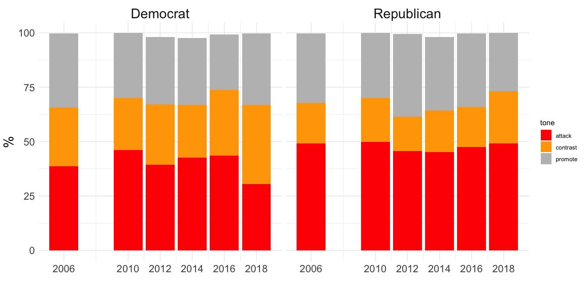

**Air Wars - Political Advertisements**

This week, I want to investigate political advertisements and test if
they are an effective predictor of political performance. In the past
few election cycles, political campaign spending has exploded. In 2022,
political campaigns are expected to spend close to [$10
billion](https://www.cnbc.com/2022/09/26/2022-midterms-candidates-spend-over-6point4-billion-on-ads-making-race-one-of-the-most-expensive-ever.html.)

Whether people are watching TV, listening to the radio, using social
media, or streaming platforms, political advertisements are everywhere.
Advertisements help introduce voters to the candidate. This is
especially true in local or congressional races where the constituency
may not be as familiar with the candidates (unlike Senate,
Gubernatorial, or Presidential races where candidates are oftentimes
more well-known). Campaigns also use ads to attack opponents for their
controversial views, affiliations with certain people or industries, or
public missteps while shining a light on the quality of the character.

Both parties have similar breakdowns when it comes to the tone of their
advertisements, with attack (criticizing the opponent), contrast
(comparing the two candidates), and promote (highlighting personal
qualities, voting records, beliefs, etc) each making up roughly 33% of
all advertisements for each party. Also, Democrats published many more
advertisements than Republicans during the 2018 midterm cycle. While
this is not surprising because Democrats were trying to capitalize on
anti-Trump sentiment to recapture the house (midterms are normally a
referendum on the current administration), what is interesting are the
states with the most total advertisement. While it makes sense that New
York, California, and Texas have a high number of advertisements because
of large populations and many house races, swing states like Virginia,
Pennsylvania, Michigan, have high volume. This may be because many of
the house races in these states are competitive, leading for candidates
to want to advertise more.

*Blog Extension - Building the Models*

The next step is to incorporate the number of advertisements into a
model at the district level. To do this, I took all available data for
each district and made the independent variable the proportion of ads
run by Democrats in that district. For example, if Democrats paid for 65
out of every 100 ads in a district during a cycle, the variable used to
predict overall Democratic vote share would by .65. I thought it was
best to keep the data as general as possible because there are many
districts that did not run certain types of ads. Also, wanted to use a
standard scale for any predictor instead of the absolute number of ads
since campaigns vary widely in funding and population. There are
Democratic campaigns with huge constituencies and funding that can
afford to pay for many more ads than a candidate from a smaller
district. Using the proportion of ads run makes it relative to the
Republican contender.

We can immediately see this result is unreliable because the model is
predicting values over 100% and below 0% (for example Arizona’s 8th
District and Georgia’s 8th District). This is most likely caused by each
district only having, at most, three observations because the training
data is only from the 2006, 2010, and 2014 midterm elections. Going
forward, it will be very hard to incorporate this data in my model if I
group by district.

| state          | district |        pred |
|:---------------|:---------|------------:|
| Alabama        | 2        |    56.34982 |
| Alabama        | 5        |    48.71903 |
| Alabama        | 6        |    16.82521 |
| Alaska         | 1        |    41.52297 |
| Arizona        | 1        |    56.66319 |
| Arizona        | 2        |    65.37246 |
| Arizona        | 8        |   114.13014 |
| Arizona        | 9        |    60.65801 |
| Arkansas       | 2        |    54.78282 |
| Arkansas       | 4        |    55.86227 |
| California     | 10       |    43.85024 |
| California     | 16       |    53.75407 |
| California     | 20       |    69.02065 |
| California     | 21       |    48.26504 |
| California     | 22       |    38.12000 |
| California     | 23       |    92.74785 |
| California     | 24       |    51.63505 |
| California     | 36       |    60.11428 |
| California     | 45       |    51.40201 |
| California     | 52       |    66.04546 |
| California     | 7        |    58.42778 |
| Colorado       | 3        |    61.81304 |
| Colorado       | 5        |    36.66500 |
| Colorado       | 6        |    45.67560 |
| Connecticut    | 5        |    56.10974 |
| Florida        | 12       |    58.78947 |
| Florida        | 13       |    50.72172 |
| Florida        | 16       |    68.70845 |
| Florida        | 18       |    64.29531 |
| Florida        | 19       |    55.85543 |
| Florida        | 2        |    35.55320 |
| Florida        | 25       |    50.79820 |
| Florida        | 26       |    35.20196 |
| Florida        | 27       |    56.68871 |
| Florida        | 3        |    44.94584 |
| Florida        | 6        |    42.10500 |
| Florida        | 7        |    59.74285 |
| Georgia        | 12       |    58.26613 |
| Georgia        | 2        |  -753.56915 |
| Hawaii         | 1        |    74.06945 |
| Idaho          | 1        |    33.20250 |
| Illinois       | 10       |    49.54668 |
| Illinois       | 12       |    27.75350 |
| Illinois       | 13       |    49.87013 |
| Illinois       | 14       |    46.75000 |
| Illinois       | 17       |    58.01735 |
| Illinois       | 18       |    29.28000 |
| Illinois       | 6        |    56.42135 |
| Illinois       | 8        |    54.71368 |
| Indiana        | 2        |    88.60555 |
| Indiana        | 3        |    47.29779 |
| Indiana        | 5        |    33.59333 |
| Indiana        | 6        |    36.09667 |
| Indiana        | 7        |    60.13813 |
| Indiana        | 9        |    48.10815 |
| Iowa           | 1        |    20.51341 |
| Iowa           | 2        |    60.13264 |
| Iowa           | 3        |    46.84389 |
| Iowa           | 4        |    44.39019 |
| Kansas         | 1        |    18.65600 |
| Kansas         | 2        |    66.87950 |
| Kansas         | 3        |    65.60404 |
| Kansas         | 4        |    48.39899 |
| Kentucky       | 1        |   182.33867 |
| Kentucky       | 3        |    65.64681 |
| Kentucky       | 6        |    63.86876 |
| Louisiana      | 1        |    19.58930 |
| Louisiana      | 2        |    80.33000 |
| Louisiana      | 3        |    67.25975 |
| Louisiana      | 4        |    34.53587 |
| Louisiana      | 5        |    45.35000 |
| Louisiana      | 6        |    28.39500 |
| Maine          | 1        |    63.40209 |
| Maine          | 2        |    63.56578 |
| Maryland       | 1        |    34.82732 |
| Maryland       | 2        |    66.26335 |
| Maryland       | 6        |    55.77000 |
| Michigan       | 11       |    62.57075 |
| Michigan       | 4        |    38.52000 |
| Michigan       | 6        |    38.15126 |
| Michigan       | 7        |    40.37467 |
| Michigan       | 8        |    44.44395 |
| Minnesota      | 1        |    54.41667 |
| Minnesota      | 2        |    52.07072 |
| Minnesota      | 3        |    45.88891 |
| Minnesota      | 7        |    57.97008 |
| Minnesota      | 8        |    57.06412 |
| Missouri       | 2        |    30.09044 |
| Missouri       | 4        |    67.32031 |
| Missouri       | 8        |    28.87449 |
| Montana        | 1        |    21.78823 |
| Nebraska       | 2        |    53.57376 |
| Nevada         | 2        |    38.78000 |
| Nevada         | 3        |    63.67576 |
| Nevada         | 4        |    40.08767 |
| New Hampshire  | 1        |    67.75972 |
| New Hampshire  | 2        |    53.05415 |
| New Jersey     | 1        |    59.29000 |
| New Jersey     | 2        |    32.08000 |
| New Jersey     | 3        |    50.58579 |
| New Jersey     | 5        |    55.92856 |
| New Mexico     | 1        |    62.71777 |
| New Mexico     | 2        |    38.35545 |
| New York       | 19       |    51.55144 |
| New York       | 20       |    68.20267 |
| New York       | 21       |    57.48615 |
| New York       | 22       |    49.89382 |
| New York       | 23       |    47.64652 |
| New York       | 24       |    12.97487 |
| New York       | 25       |    54.77297 |
| New York       | 26       |    41.93617 |
| New York       | 27       |    35.71503 |
| New York       | 4        |    59.25500 |
| North Carolina | 11       |    42.54097 |
| North Carolina | 13       |    60.93481 |
| North Carolina | 2        |    53.38072 |
| North Carolina | 5        |    38.47500 |
| North Carolina | 7        |    53.68000 |
| North Carolina | 8        |    64.61874 |
| North Carolina | 9        |   119.49748 |
| North Dakota   | 1        |    60.90157 |
| Ohio           | 1        |    55.28318 |
| Ohio           | 10       |    58.48209 |
| Ohio           | 12       |    53.89448 |
| Ohio           | 13       |    70.16721 |
| Ohio           | 14       |    26.61143 |
| Ohio           | 15       |    59.97683 |
| Ohio           | 16       |    22.59562 |
| Ohio           | 2        |    51.22719 |
| Ohio           | 3        |    72.16000 |
| Ohio           | 5        |    58.31522 |
| Ohio           | 7        |    39.38000 |
| Oklahoma       | 1        |    40.55939 |
| Oklahoma       | 2        |    58.05454 |
| Oklahoma       | 4        |    30.04000 |
| Oklahoma       | 5        |    37.69248 |
| Oregon         | 2        |    28.41750 |
| Oregon         | 5        |    56.52569 |
| Pennsylvania   | 10       |    67.50894 |
| Pennsylvania   | 11       |    75.04767 |
| Pennsylvania   | 12       |    52.74506 |
| Pennsylvania   | 13       |    61.23500 |
| Pennsylvania   | 15       |    42.62771 |
| Pennsylvania   | 16       |    40.65394 |
| Pennsylvania   | 17       |    58.53500 |
| Pennsylvania   | 4        |    63.14390 |
| Pennsylvania   | 5        |    36.40000 |
| Pennsylvania   | 6        |    42.77230 |
| Pennsylvania   | 7        | -2600.83860 |
| Pennsylvania   | 8        |    49.10685 |
| Pennsylvania   | 9        |    33.30500 |
| South Carolina | 1        |  -673.56391 |
| South Carolina | 5        |    48.83508 |
| South Dakota   | 1        |    41.79513 |
| Tennessee      | 2        |    19.46000 |
| Tennessee      | 3        |    35.68789 |
| Tennessee      | 8        |   143.77838 |
| Texas          | 15       |    60.55766 |
| Texas          | 16       |    39.60706 |
| Texas          | 17       |  -210.83025 |
| Texas          | 21       |    35.80000 |
| Texas          | 23       |    56.74474 |
| Texas          | 25       |    57.20422 |
| Texas          | 27       |    43.40065 |
| Utah           | 4        |    56.67813 |
| Virginia       | 10       |    43.25380 |
| Virginia       | 11       |    49.14216 |
| Virginia       | 2        |    49.60218 |
| Virginia       | 5        |    59.76546 |
| Virginia       | 7        |    44.27830 |
| Virginia       | 9        |    66.27771 |
| Washington     | 3        |    55.44323 |
| Washington     | 5        |    37.48789 |
| Washington     | 6        |    62.98000 |
| Washington     | 8        |    53.79415 |
| Washington     | 9        |    65.76667 |
| West Virginia  | 2        |    52.78617 |
| West Virginia  | 3        |    35.10482 |
| Wisconsin      | 1        |    38.50877 |
| Wisconsin      | 6        |    47.37768 |
| Wisconsin      | 8        |    59.26085 |

Instead, I tried removing the district level grouping, viewing all
observations as one large pool. This way, the training set now has over
450 observations. The downside is that we lose all the district level
nuance. Without the grouping, some of the observations appear very
abnormal. For example, a Democrat running in a very liberal district may
not run ads because he/she is expected to win easily, or a Democrat
running in a heavily conservative district may not run ads because
he/she is expected to lose easily (and vice versa). Because of this,
there will be observations where Democrats run 0% of the ads but win by
a large margin while losing in other districts. For this reason, I
decided to remove any observations with less than 10% and more than 90%
of the ads run by Democrats. When plotting the results, we can see a
clear positive relationship between ads run by Democrats and the vote
share. Advertising also had a p-value less than 0.05, meaning it was
significant predictor. While advertising may be unhelpful for predicting
non-competitive districts, these races normally are called for one side
or the other well in advance of the election. Ultimately, we care about
correctly predicting competitive districts, and advertising may prove to
be helpful moving forward when these races.

As seen below, the results are often not very accurate when compared
next to the actual outcome (the model had an overall Mean Squared Error
of 54.57). However this strategy of pooling together observations may be
important going forward if we want to factor local characteristics like
advertising or other fundamentals.

| state          | district | dem_votes_major_percent |     pred |
|:---------------|:---------|------------------------:|---------:|
| Alabama        | 5        |                   38.93 | 48.66400 |
| Arkansas       | 2        |                   46.78 | 47.25473 |
| Arizona        | 2        |                   54.75 | 51.07220 |
| Arizona        | 8        |                   44.54 | 49.11861 |
| Arizona        | 9        |                   61.09 | 50.88842 |
| California     | 10       |                   52.25 | 49.44882 |
| California     | 16       |                   57.55 | 49.34871 |
| California     | 21       |                   50.38 | 49.64382 |
| California     | 22       |                   47.28 | 50.53524 |
| California     | 24       |                   58.56 | 50.00175 |
| California     | 25       |                   54.37 | 54.66193 |
| California     | 36       |                   59.02 | 50.69731 |
| California     | 39       |                   51.56 | 50.62649 |
| California     | 45       |                   52.05 | 51.95570 |
| Colorado       | 3        |                   45.81 | 48.97621 |
| Colorado       | 6        |                   55.79 | 51.44034 |
| Florida        | 6        |                   43.69 | 52.43317 |
| Florida        | 7        |                   57.69 | 53.34609 |
| Florida        | 15       |                   46.98 | 52.64565 |
| Florida        | 16       |                   45.44 | 46.24122 |
| Florida        | 18       |                   45.70 | 49.89939 |
| Florida        | 19       |                   37.73 | 44.41101 |
| Florida        | 25       |                   39.55 | 47.90670 |
| Florida        | 26       |                   50.87 | 50.10943 |
| Florida        | 27       |                   53.08 | 49.64125 |
| Georgia        | 6        |                   50.51 | 52.18995 |
| Hawaii         | 1        |                   76.01 | 48.81469 |
| Iowa           | 1        |                   52.61 | 51.79670 |
| Iowa           | 3        |                   51.12 | 50.06782 |
| Iowa           | 4        |                   48.29 | 54.29725 |
| Illinois       | 6        |                   53.58 | 50.58516 |
| Illinois       | 12       |                   46.81 | 49.76239 |
| Illinois       | 13       |                   49.62 | 50.21655 |
| Indiana        | 2        |                   45.16 | 47.38472 |
| Indiana        | 3        |                   35.27 | 48.82658 |
| Indiana        | 9        |                   43.52 | 50.25916 |
| Kansas         | 2        |                   49.55 | 49.99452 |
| Kansas         | 3        |                   54.96 | 48.50732 |
| Kansas         | 4        |                   40.56 | 42.87110 |
| Kentucky       | 3        |                   62.93 | 46.84271 |
| Kentucky       | 6        |                   48.37 | 46.38495 |
| Louisiana      | 3        |                   24.21 | 52.03198 |
| Maine          | 1        |                   64.41 | 53.92487 |
| Maine          | 2        |                   50.62 | 47.72206 |
| Michigan       | 2        |                   43.72 | 53.34336 |
| Michigan       | 6        |                   47.63 | 46.90943 |
| Michigan       | 7        |                   46.20 | 51.78919 |
| Michigan       | 8        |                   51.97 | 52.51260 |
| Michigan       | 11       |                   53.44 | 54.00499 |
| Minnesota      | 1        |                   49.77 | 47.30536 |
| Minnesota      | 2        |                   52.76 | 49.37827 |
| Minnesota      | 3        |                   55.72 | 48.93108 |
| Minnesota      | 8        |                   47.11 | 46.81345 |
| Missouri       | 2        |                   47.99 | 50.20336 |
| Montana        | 1        |                   47.61 | 48.36652 |
| North Carolina | 2        |                   47.19 | 47.60006 |
| North Carolina | 7        |                   43.52 | 50.13567 |
| North Carolina | 9        |                   49.84 | 53.35054 |
| North Carolina | 13       |                   46.91 | 49.95394 |
| North Dakota   | 1        |                   37.14 | 47.04778 |
| Nebraska       | 2        |                   49.00 | 43.96765 |
| New Hampshire  | 1        |                   54.34 | 52.94452 |
| New Jersey     | 3        |                   50.66 | 49.20016 |
| New Jersey     | 7        |                   52.55 | 48.23370 |
| New Mexico     | 2        |                   50.93 | 52.02406 |
| Nevada         | 3        |                   54.78 | 51.30166 |
| Nevada         | 4        |                   54.28 | 51.33791 |
| New York       | 19       |                   52.67 | 50.23386 |
| New York       | 21       |                   43.06 | 45.52966 |
| New York       | 22       |                   50.89 | 48.76805 |
| New York       | 23       |                   45.76 | 47.34512 |
| New York       | 24       |                   47.37 | 49.03318 |
| New York       | 25       |                   58.98 | 49.75629 |
| New York       | 27       |                   49.81 | 46.61845 |
| Ohio           | 1        |                   47.75 | 48.45768 |
| Ohio           | 4        |                   34.74 | 47.14841 |
| Ohio           | 7        |                   41.26 | 51.33311 |
| Ohio           | 10       |                   42.99 | 50.56207 |
| Ohio           | 12       |                   47.86 | 48.05238 |
| Ohio           | 14       |                   44.75 | 51.25409 |
| Ohio           | 15       |                   40.50 | 44.68720 |
| Oklahoma       | 1        |                   40.70 | 45.35448 |
| Oklahoma       | 5        |                   50.70 | 51.42173 |
| Oregon         | 2        |                   41.17 | 45.45357 |
| Pennsylvania   | 1        |                   48.74 | 48.48431 |
| Pennsylvania   | 8        |                   54.64 | 46.82912 |
| Pennsylvania   | 9        |                   40.25 | 48.27121 |
| Pennsylvania   | 10       |                   48.68 | 49.14636 |
| Pennsylvania   | 11       |                   41.02 | 41.87667 |
| Pennsylvania   | 14       |                   42.09 | 42.87269 |
| Pennsylvania   | 16       |                   47.83 | 48.09276 |
| Pennsylvania   | 17       |                   56.26 | 48.30634 |
| South Carolina | 1        |                   50.69 | 49.63877 |
| South Dakota   | 1        |                   37.39 | 48.24240 |
| Tennessee      | 2        |                   33.39 | 50.51815 |
| Tennessee      | 3        |                   35.12 | 46.25920 |
| Texas          | 2        |                   46.30 | 44.99650 |
| Texas          | 7        |                   52.53 | 50.02592 |
| Texas          | 21       |                   48.67 | 53.50705 |
| Texas          | 23       |                   49.77 | 48.46051 |
| Texas          | 31       |                   48.52 | 54.50980 |
| Texas          | 32       |                   53.32 | 49.13536 |
| Texas          | 34       |                   59.99 | 54.72992 |
| Utah           | 4        |                   50.13 | 49.22698 |
| Virginia       | 2        |                   51.12 | 51.48254 |
| Virginia       | 5        |                   46.73 | 47.04464 |
| Virginia       | 6        |                   40.25 | 47.65383 |
| Virginia       | 7        |                   50.98 | 50.41522 |
| Virginia       | 9        |                   34.78 | 48.30094 |
| Virginia       | 10       |                   56.20 | 50.53948 |
| Washington     | 3        |                   47.33 | 50.82270 |
| Washington     | 5        |                   45.24 | 47.41415 |
| Washington     | 8        |                   52.42 | 49.91677 |
| Wisconsin      | 1        |                   43.65 | 47.14730 |
| Wisconsin      | 6        |                   44.49 | 53.24104 |
| Wisconsin      | 8        |                   36.29 | 41.06931 |
| West Virginia  | 2        |                   44.33 | 45.35072 |
| West Virginia  | 3        |                   43.63 | 51.34270 |
