**The Ground Game - Week 6**

The “Ground Game”, Political Campaigns’ strategy to mobilize and
persuade voters is critically important when trying to win elections.
While persuading voters is becoming increasingly difficult as the
country becomes more partisan, both political parties are realizing that
success is predicated on turnout. There have been many large scale
“get-out-the-vote” campaigns in recent years. For example, in 2018
during the Gubnatorial race, Stacey Abrams’s Campaign helped register
hundreds of thousands of
[voters](https://www.independent.co.uk/voices/georgia-election-stacey-abrams-biden-b1675670.html)

From the plot below, we can see that congressional districts, even in
the same state, have very different levels of turnout. For example, in
Texas, we can see that rural regions have lower turnout (corresponding
to purple and blue shades). Urban areas have higher turnout, indicated
by brighter shades of red. At first glance, this map seems to confirm an
assumption both the Democrats and Republicans operate under: higher
turnout helps the Democrats. This is because in rural states that are
more conservative, turnout appears to be lower than urban areas.
However, this concept may be misleading. For example, even though a
rural, conservative district may have low turnout, there may not
necessarily be liberal people who do not vote. Instead, it is possible
that the district is politically homogenous, and higher turnout would
lead to more conservatives voting. We can see this from the plot of
contested races in 2018 compared to turnout. There is only a small
linear relationship between turnout and Democratic vote share, meaning
increased turnout only has a small positive relationship with Democratic
success.

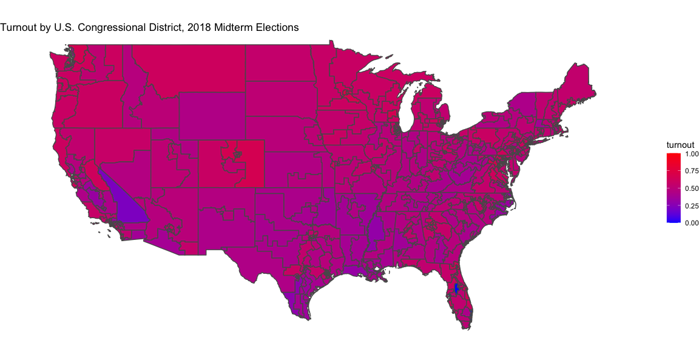

*Building a Model* - While turnout may not be useful in a linear model,
we can use recent polls as a predictor and then simulate turnout for
each party. In this method, we make a generalized linear model for each
district, with every recent poll as an observation. Doing 10,000
simulations for each district, using the poll results as the probability
of someone voting for a Democrat or Republican, we can get an average
margin of victory in each district. From the histograms below, we can
see that there are a wide range of outcomes for each seat that we have
data for (32 districts in total). Unfortunately, when observing these
results, we can see that this model may be problematic. For example, in
many instances, neither party gets close to 50% of the vote. Obviously,
this does not make sense because in most cases, there is only a Democrat
and Republican candidate. While we will eventually predict all the house
seats, in our district-level map, it probably makes sense to ignore
these results for now. While simulation may be a good idea as we
approach our final prediction, turnout is clearly not a useful
predictor.

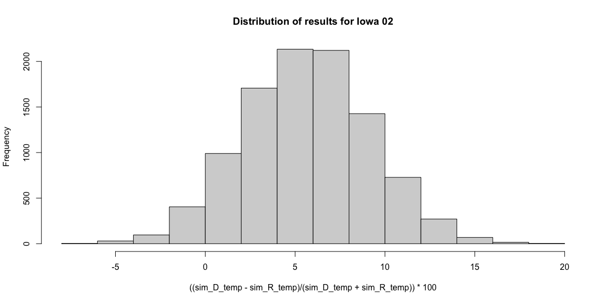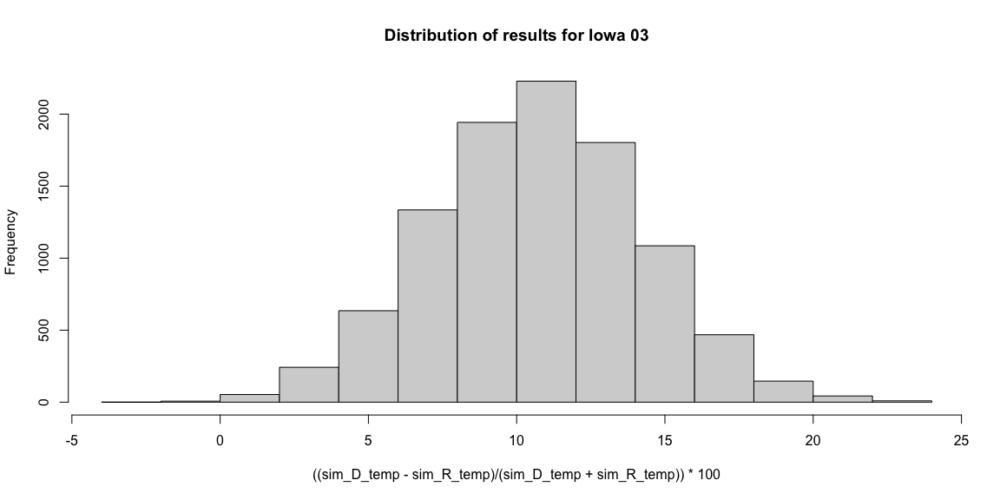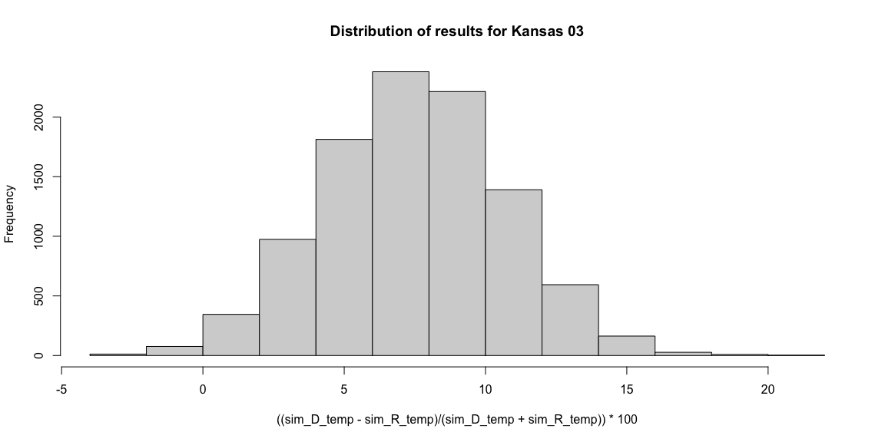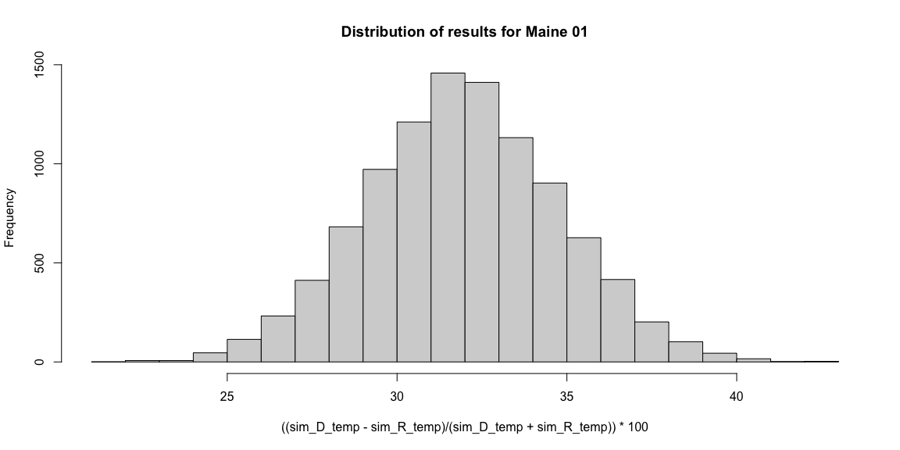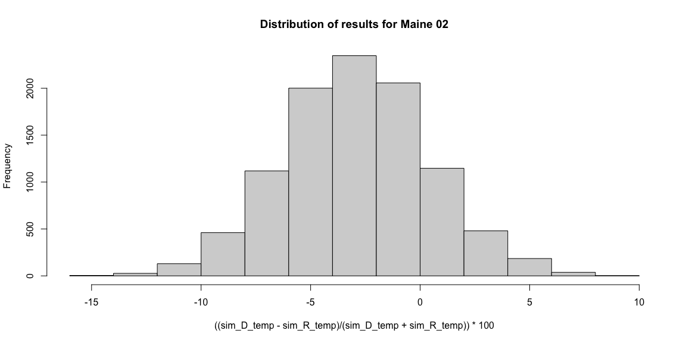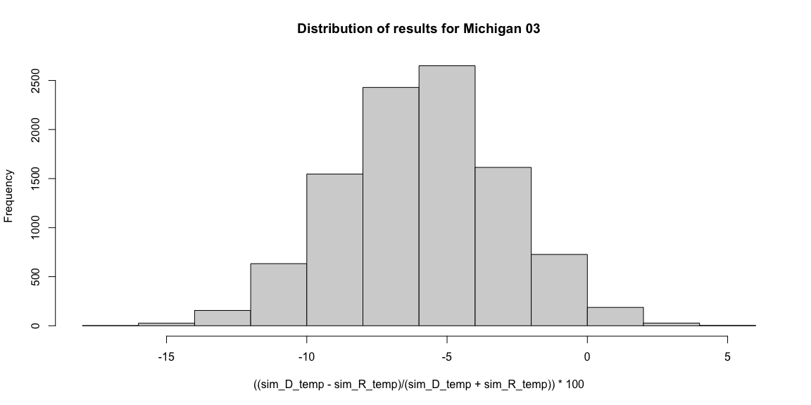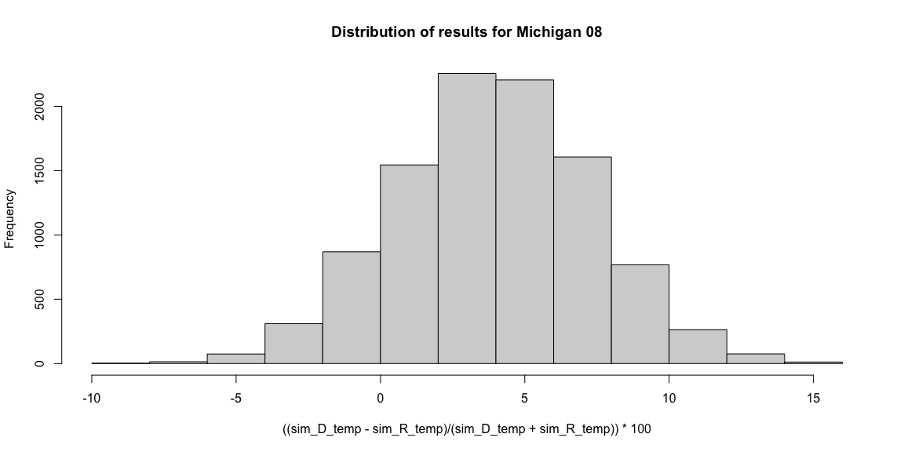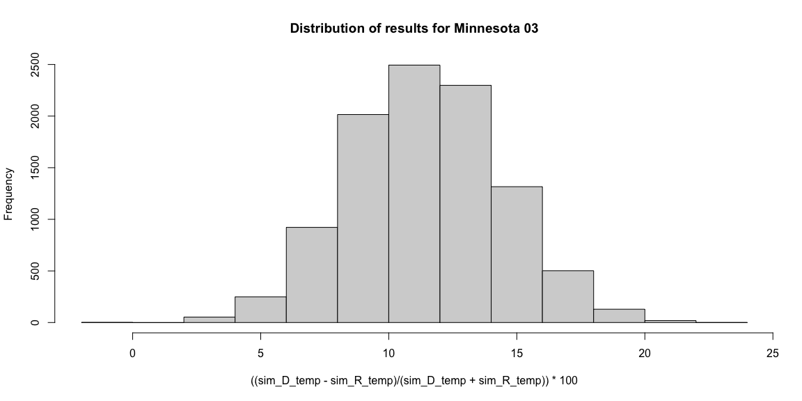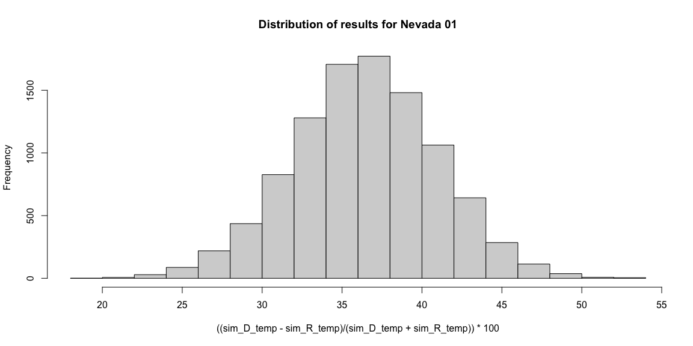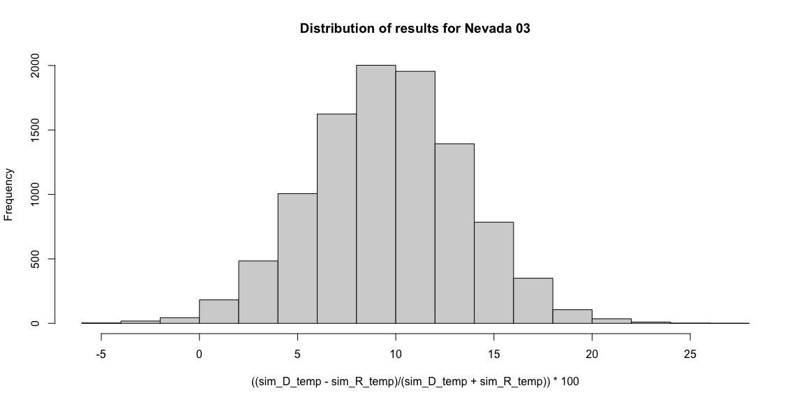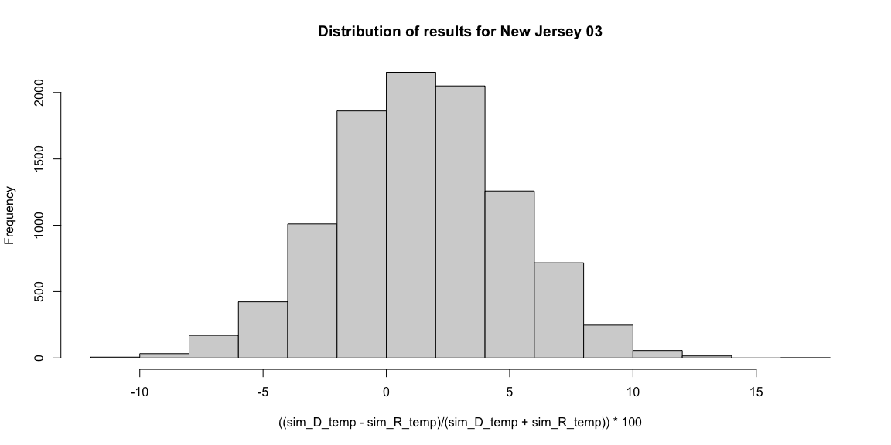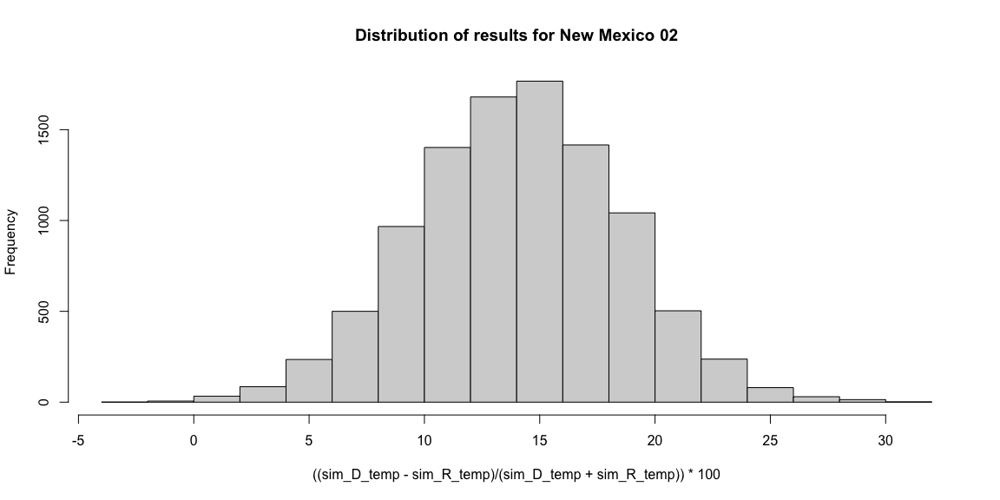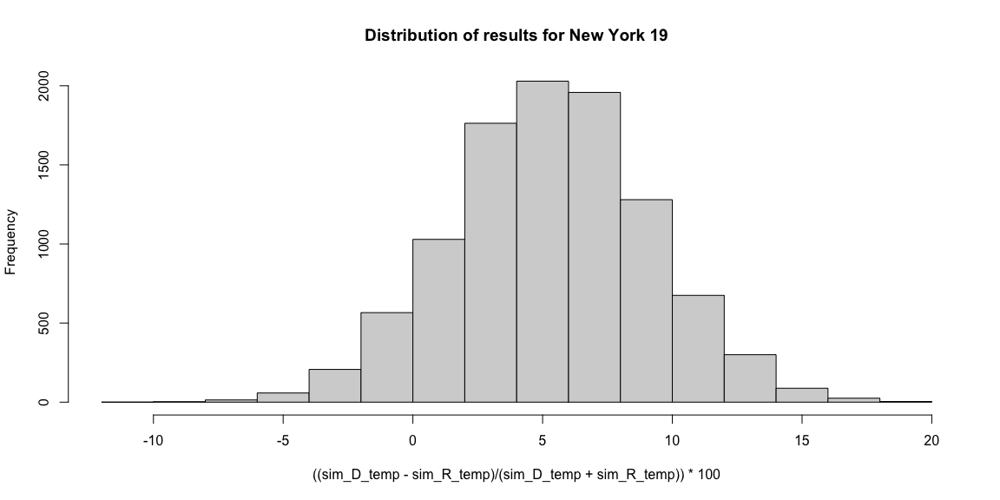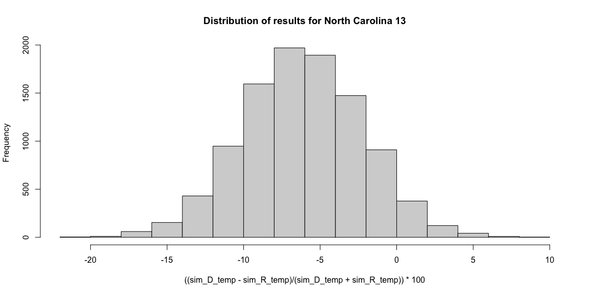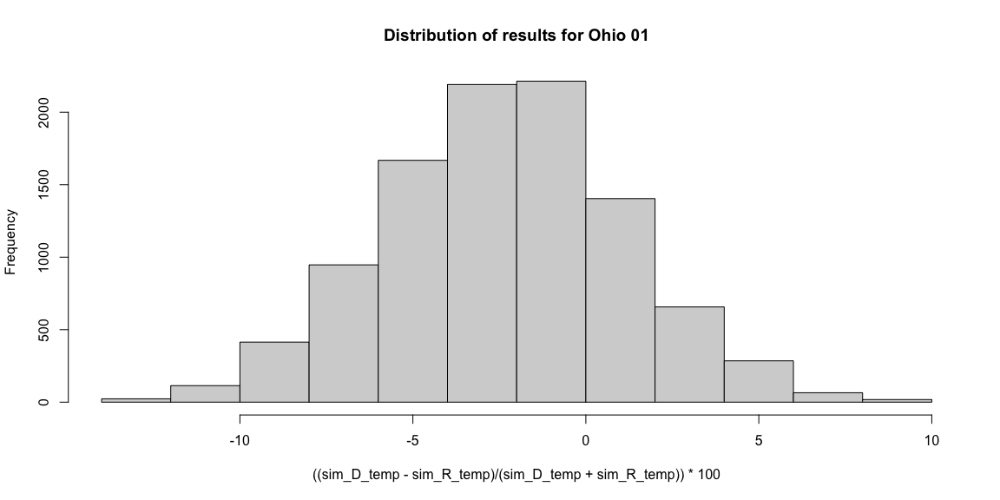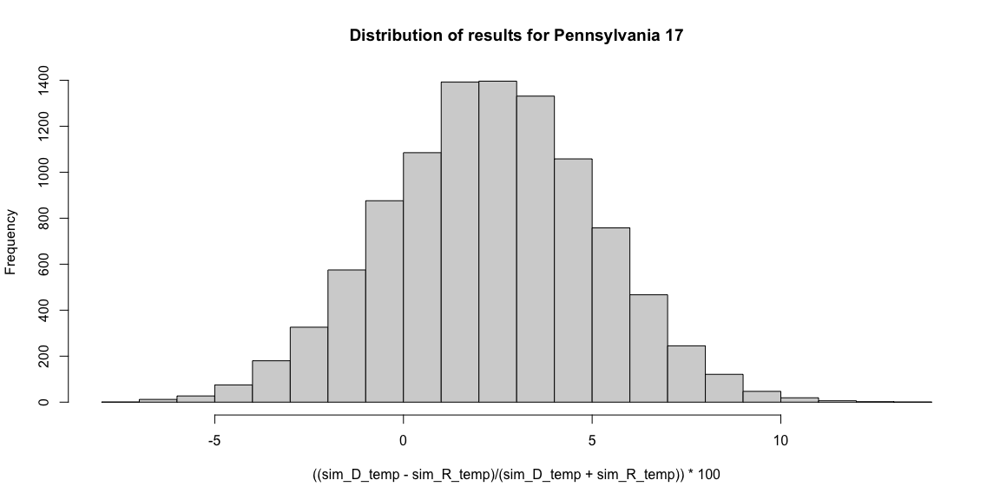

| state          | st_cd_fips |  pred_dem |  pred_rep | mean_democrat_win_margin |
|:---------------|:-----------|----------:|----------:|-------------------------:|
| California     | 0622       | 0.2220354 | 0.2906073 |                -8.704062 |
| Florida        | 1213       | 0.3686113 | 0.3263571 |                 1.754386 |
| Florida        | 1227       | 0.3166663 | 0.2684526 |                11.147011 |
| Illinois       | 1713       | 0.2593444 | 0.3457982 |                -9.764310 |
| Iowa           | 1901       | 0.3046030 | 0.2418445 |                12.390925 |
| Iowa           | 1902       | 0.3064553 | 0.2736335 |                 4.255319 |
| Iowa           | 1903       | 0.3158108 | 0.2550524 |                12.903226 |
| Kansas         | 2003       | 0.3521102 | 0.3032105 |                 6.329114 |
| Maine          | 2301       | 0.4947502 | 0.2556307 |                31.421121 |
| Maine          | 2302       | 0.3014435 | 0.3196930 |                -3.296703 |
| Michigan       | 2603       | 0.3459113 | 0.3894398 |                -8.648649 |
| Michigan       | 2608       | 0.3158895 | 0.2919566 |                 7.246377 |
| Minnesota      | 2701       | 0.3234932 | 0.3771824 |                -5.649718 |
| Minnesota      | 2702       | 0.3653585 | 0.3655082 |                -2.245707 |
| Minnesota      | 2703       | 0.3995444 | 0.3174953 |                10.065359 |
| Nebraska       | 3102       | 0.3017581 | 0.5467812 |               -25.655644 |
| Nevada         | 3201       | 0.2462418 | 0.1148674 |                30.919220 |
| Nevada         | 3202       | 0.2363129 | 0.3294454 |               -10.638298 |
| Nevada         | 3203       | 0.2635670 | 0.2175362 |                 9.197652 |
| New Jersey     | 3403       | 0.2823976 | 0.2747623 |                 4.621072 |
| New Jersey     | 3407       | 0.3267295 | 0.3243389 |                -1.674277 |
| New Mexico     | 3502       | 0.2285342 | 0.1719934 |                17.073171 |
| New York       | 3611       | 0.2166927 | 0.1432826 |                14.044944 |
| New York       | 3619       | 0.2680315 | 0.2408428 |                13.733075 |
| North Carolina | 3711       | 0.3166000 | 0.4075260 |               -12.380952 |
| North Carolina | 3713       | 0.2307081 | 0.2610819 |                -6.498952 |
| Ohio           | 3901       | 0.2767639 | 0.2901091 |                -6.122449 |
| Pennsylvania   | 4201       | 0.3139580 | 0.3282828 |               -11.578947 |
| Pennsylvania   | 4208       | 0.3152016 | 0.1779728 |                30.468750 |
| Pennsylvania   | 4217       | 0.4006544 | 0.3826833 |                 3.394256 |
| Virginia       | 5102       | 0.2633871 | 0.2366750 |                 4.267161 |
| Washington     | 5308       | 0.3240912 | 0.2942258 |                 3.583062 |

*Looking Ahead*

Going forward, I think pooling all the past congressional races (for
which we have data) makes the most sense for predicting the upcoming
midterms. While grouping the models by district makes sense in theory, I
have not added any data that helps describe the characteristics of a
district. For example, we have yet to incorporate levels of education,
or how rural or urban the district is. Instead, like in this exercise, I
made a model for each district, but each one had very few observations,
leading to results that did not make sense.
