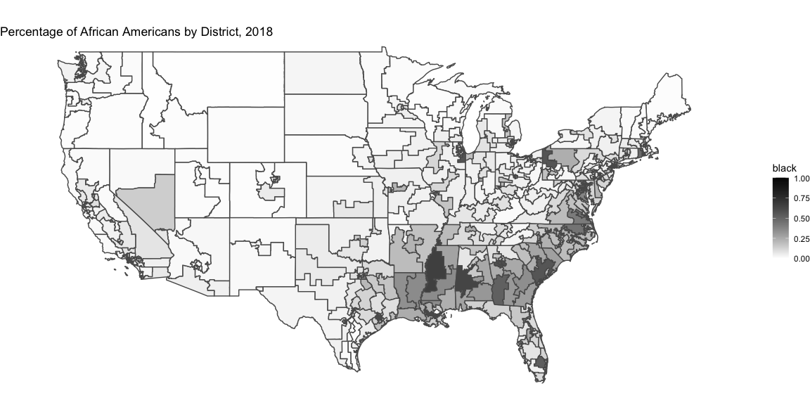
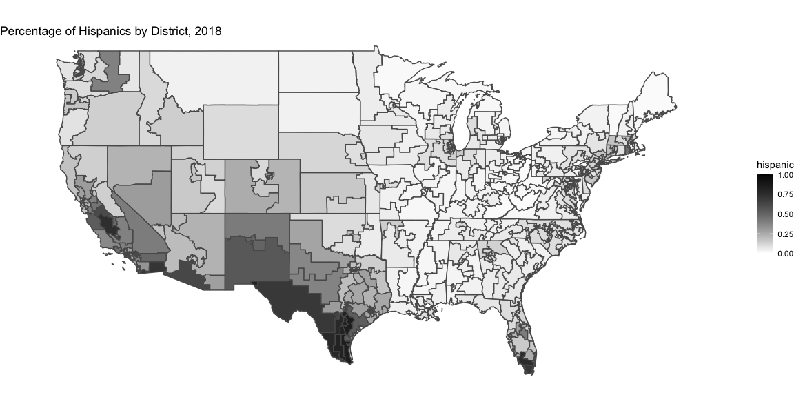

**Week 7 - Shocks and Updated Model**

When it comes to elections, the term “shocks” can be vague. For our
purposes, it makes sense to think about political “shocks” as sudden
events, news, legislation, or economic indicators that may change how
people vote or galvanize turnout for a certain party. For example, the
Dobbs decision overturning Roe vs Wade this summer may be important in
this year’s midterms because Democrats have made it central to their
national policy. These sudden events are also important because they can
help explain, or, in many instances, become an excuse for why
forecasters got their predictions wrong. This exact scenario played out
in 2016 when many forecasters, including
[FiveThirtyEight’s](https://fivethirtyeight.com/features/the-comey-letter-probably-cost-clinton-the-election/)
Nate Silver who blamed James Comey’s last-minute memo about Hilary
Clinton’s emails shortly before the election. However, the issue I have
with this assessment is that in this case, how would Trump’s Access
Hollywood tape not have counteracted the mobilization effect of the
Comey Letter? In addition, what percentage of people were still on the
fence days before the election and how many of these voters switched
because of this scandal? While we will never know these answers, I do
not believe that incorporating shocks into my model for the midterms
makes sense. We ultimately care about who controls the house, so we must
make a prediction for each district. Unfortunately, combing through
every district race and trying to incorporate shocks on the district
level (if there are any) is by no means guaranteed to add value to our
model and could be incredibly challenging. Also, if we think of national
shocks like the overturning of Roe or Inflation, the expert ratings
already incorporate these factors as part of their analysis. Thus, by
including expert ratings, we are already accounting for these phenomena.
In addition, I want to incorporate demographic information because
certain voting groups turning out will be crucial to determine control
of the house. As we can see from the plots below, minority groups often
define congressional districts in different parts of the country, so
catering to these voters and encouraging turnout is crucially important.

**Pooled Model - Improvement of Last Week**

Moving on to improving on my model from last week. Since last week’s
grouped-by-district models were getting disastrously bad predictions, it
makes sense to pool our data, viewing every district race from past
midterm elections (2010, 2014, and 2018) as observations in the same
group. Also, I want to factor in demographic data, because there are
often important subtilties in the makeup of the district that can give
us an indication of support for either party. For example, districts
with high percentages of Black and/or Hispanic people may vote Democrat
because traditionally these groups have voted for them in the past. We
start by using every demographic predictor in the data to predict
Democratic Vote Share, and we can see that the only significant
predictor is the percentage of women in the district. Adjusted R-squared
is only .13, so we know that using demographics alone will not help us.
Using a stepwise backward method to eliminate variables, the predictors
become the percentage of women, Hispanics, Native Americans, and Asians
in the population. However, I want to take women out because there is so
little variation (will always fluctuate around 50%) and because half of
the people in each minority group are women (so I avoid factoring women
in twice). I also want to add the percentage of African Americans in the
district, so we account for every major minority group.

|                 |   Estimate | Std. Error |    t value | Pr(\>\|t\|) |
|:----------------|-----------:|-----------:|-----------:|------------:|
| (Intercept)     |  -6.228657 |   29.50916 | -0.2110754 |   0.8329603 |
| female          |  74.120164 |   38.18515 |  1.9410731 |   0.0531110 |
| twenty_29       |   3.917725 |   17.47727 |  0.2241612 |   0.8227723 |
| thirty_44       | -16.322415 |   11.96207 | -1.3645148 |   0.1733467 |
| fourty5_64      |  -2.242311 |   20.35230 | -0.1101748 |   0.9123385 |
| white           |  19.275392 |   24.88335 |  0.7746302 |   0.4391197 |
| black           |  20.356926 |   25.40216 |  0.8013857 |   0.4234921 |
| hispanic        |  26.609089 |   24.13422 |  1.1025461 |   0.2710376 |
| native_american |  37.880533 |   29.44030 |  1.2866897 |   0.1991154 |
| asian           |  48.797316 |   32.11311 |  1.5195448 |   0.1295947 |

Adding in the average expert ratings along with demographic information,
we can see that all but two of the variables are significant, and
adjusted R-squared improves to .708, a massive increase from the
previous model. It is also clear that the presence of minorities helps
Democrats, with the coefficients for all the groups present in the model
having a positive relationship with the Democratic Vote Share. Doing an
ANOVA test between a linear regression with only expert ratings and the
pooled model with demographic data, we can see that there is a
significant difference, so having the demographic information is adding
value to our model.

    ## 
    ## Call:
    ## lm(formula = DemVotesMajorPercent ~ avg_rating + black + hispanic + 
    ##     asian + native_american, data = train_df)
    ## 
    ## Residuals:
    ##      Min       1Q   Median       3Q      Max 
    ## -12.2308  -1.8299   0.2903   1.8636  10.5739 
    ## 
    ## Coefficients:
    ##                 Estimate Std. Error t value Pr(>|t|)    
    ## (Intercept)      59.0006     0.5631 104.776  < 2e-16 ***
    ## avg_rating       -2.7240     0.1024 -26.589  < 2e-16 ***
    ## black             4.5448     2.1250   2.139 0.033194 *  
    ## hispanic          2.4573     1.0403   2.362 0.018750 *  
    ## asian            11.5948     3.0211   3.838 0.000149 ***
    ## native_american  12.4216     6.5747   1.889 0.059726 .  
    ## ---
    ## Signif. codes:  0 '***' 0.001 '**' 0.01 '*' 0.05 '.' 0.1 ' ' 1
    ## 
    ## Residual standard error: 2.955 on 330 degrees of freedom
    ## Multiple R-squared:  0.7121, Adjusted R-squared:  0.7078 
    ## F-statistic: 163.3 on 5 and 330 DF,  p-value: < 2.2e-16

    ## Analysis of Variance Table
    ## 
    ## Model 1: DemVotesMajorPercent ~ avg_rating
    ## Model 2: DemVotesMajorPercent ~ avg_rating + black + hispanic + asian + 
    ##     native_american
    ##   Res.Df    RSS Df Sum of Sq      F    Pr(>F)    
    ## 1    334 3124.6                                  
    ## 2    330 2882.4  4    242.17 6.9313 2.284e-05 ***
    ## ---
    ## Signif. codes:  0 '***' 0.001 '**' 0.01 '*' 0.05 '.' 0.1 ' ' 1

Finally, I use this model to predict the 2022 races that we have expert
ratings for, we can see that it is tracking well and giving reasonable
predictions.

| state          | district | avg_rating | prediction |
|:---------------|:---------|-----------:|-----------:|
| Alaska         | 0        |   3.861111 |   51.27154 |
| Arizona        | 1        |   5.055556 |   48.79146 |
| Arizona        | 2        |   4.944444 |   46.89404 |
| Arizona        | 4        |   2.638889 |   52.71664 |
| Arizona        | 6        |   5.194444 |   46.21629 |
| California     | 3        |   5.916667 |   45.30826 |
| California     | 6        |   1.333333 |   58.55886 |
| California     | 9        |   2.527778 |   55.17933 |
| California     | 13       |   3.277778 |   53.81194 |
| California     | 21       |   1.222222 |   58.09916 |
| California     | 22       |   4.222222 |   49.86429 |
| California     | 23       |   6.888889 |   42.18613 |
| California     | 25       |   1.555556 |   57.13453 |
| California     | 26       |   1.666667 |   56.42111 |
| California     | 27       |   4.111111 |   53.26182 |
| California     | 40       |   6.138889 |   44.91581 |
| California     | 41       |   5.888889 |   45.59928 |
| California     | 45       |   4.833333 |   49.38654 |
| California     | 47       |   2.611111 |   55.73882 |
| California     | 49       |   2.750000 |   53.15700 |
| Colorado       | 3        |   6.555556 |   42.05449 |
| Colorado       | 5        |   6.888889 |   41.21417 |
| Colorado       | 7        |   2.416667 |   53.64817 |
| Connecticut    | 1        |   1.111111 |   57.69741 |
| Connecticut    | 2        |   2.222222 |   53.74930 |
| Connecticut    | 3        |   1.222222 |   57.22488 |
| Connecticut    | 4        |   1.111111 |   57.63167 |
| Connecticut    | 5        |   2.638889 |   53.03237 |
| Florida        | 2        |   6.888889 |   41.20608 |
| Florida        | 4        |   6.888889 |   41.44471 |
| Florida        | 7        |   6.472222 |   43.02314 |
| Florida        | 9        |   1.222222 |   57.60072 |
| Florida        | 13       |   6.250000 |   43.22889 |
| Florida        | 14       |   1.111111 |   58.06186 |
| Florida        | 15       |   5.805556 |   44.77485 |
| Florida        | 16       |   6.888889 |   41.34547 |
| Florida        | 22       |   1.222222 |   57.27513 |
| Florida        | 23       |   1.555556 |   56.89610 |
| Florida        | 27       |   5.916667 |   45.05660 |
| Georgia        | 2        |   2.083333 |   55.96344 |
| Georgia        | 6        |   6.916667 |   42.45903 |
| Georgia        | 12       |   6.888889 |   42.17827 |
| Illinois       | 6        |   2.527778 |   53.62040 |
| Illinois       | 8        |   1.222222 |   58.18009 |
| Illinois       | 11       |   1.777778 |   56.29319 |
| Illinois       | 13       |   2.944444 |   52.08282 |
| Illinois       | 14       |   2.194444 |   54.06310 |
| Illinois       | 17       |   4.111111 |   48.73673 |
| Indiana        | 1        |   3.166667 |   51.77176 |
| Iowa           | 1        |   5.722222 |   43.93306 |
| Iowa           | 2        |   5.833333 |   43.77287 |
| Iowa           | 3        |   4.444444 |   47.69111 |
| Kansas         | 3        |   3.916667 |   49.61196 |
| Maine          | 2        |   4.333333 |   47.45894 |
| Maryland       | 1        |   6.888889 |   41.14723 |
| Maryland       | 2        |   1.222222 |   58.09902 |
| Maryland       | 6        |   2.750000 |   53.80504 |
| Massachusetts  | 9        |   1.444444 |   55.53803 |
| Michigan       | 3        |   3.361111 |   50.66376 |
| Michigan       | 4        |   6.888889 |   40.59205 |
| Michigan       | 7        |   3.472222 |   50.00855 |
| Michigan       | 8        |   3.472222 |   50.50586 |
| Michigan       | 10       |   5.611111 |   44.14897 |
| Michigan       | 11       |   1.222222 |   57.23192 |
| Minnesota      | 1        |   6.555556 |   41.81930 |
| Minnesota      | 2        |   3.555556 |   50.27735 |
| Minnesota      | 3        |   1.111111 |   57.37766 |
| Minnesota      | 8        |   6.888889 |   40.69086 |
| Missouri       | 2        |   6.777778 |   41.33816 |
| Nebraska       | 1        |   6.777778 |   41.34214 |
| Nebraska       | 2        |   5.000000 |   46.56365 |
| Nevada         | 1        |   3.027778 |   53.44904 |
| Nevada         | 2        |   6.888889 |   41.59069 |
| Nevada         | 3        |   3.361111 |   52.29542 |
| Nevada         | 4        |   2.944444 |   53.12921 |
| New Hampshire  | 1        |   3.361111 |   50.34349 |
| New Hampshire  | 2        |   2.861111 |   51.68005 |
| New Jersey     | 1        |   1.111111 |   57.67301 |
| New Jersey     | 2        |   6.888889 |   41.64568 |
| New Jersey     | 3        |   1.888889 |   54.98645 |
| New Jersey     | 5        |   1.666667 |   56.28109 |
| New Jersey     | 7        |   4.555556 |   48.36944 |
| New Jersey     | 11       |   1.555556 |   56.42950 |
| New Mexico     | 1        |   1.666667 |   56.53513 |
| New Mexico     | 2        |   4.333333 |   49.32009 |
| New Mexico     | 3        |   2.000000 |   56.94956 |
| New York       | 1        |   5.305556 |   45.64414 |
| New York       | 2        |   6.277778 |   43.37765 |
| New York       | 3        |   3.277778 |   52.49416 |
| New York       | 4        |   2.083333 |   55.33921 |
| New York       | 11       |   6.138889 |   44.73517 |
| New York       | 17       |   2.527778 |   53.79850 |
| New York       | 18       |   3.388889 |   50.99836 |
| New York       | 19       |   4.138889 |   48.31521 |
| New York       | 20       |   1.222222 |   56.84342 |
| New York       | 22       |   3.805556 |   49.25831 |
| New York       | 25       |   1.222222 |   57.01738 |
| North Carolina | 1        |   2.833333 |   53.78098 |
| North Carolina | 6        |   1.777778 |   55.57522 |
| North Carolina | 7        |   6.888889 |   41.48923 |
| North Carolina | 9        |   6.888889 |   42.60158 |
| North Carolina | 13       |   4.555556 |   48.23123 |
| Ohio           | 1        |   4.444444 |   48.40011 |
| Ohio           | 7        |   6.888889 |   40.56548 |
| Ohio           | 9        |   3.361111 |   51.06073 |
| Ohio           | 10       |   6.888889 |   41.35607 |
| Ohio           | 13       |   4.666667 |   47.14720 |
| Ohio           | 15       |   6.888889 |   40.78845 |
| Oregon         | 4        |   2.527778 |   52.74861 |
| Oregon         | 5        |   3.805556 |   49.49569 |
| Pennsylvania   | 1        |   6.111111 |   43.37403 |
| Pennsylvania   | 6        |   1.444444 |   56.22704 |
| Pennsylvania   | 7        |   4.333333 |   48.32177 |
| Pennsylvania   | 8        |   4.000000 |   48.86401 |
| Pennsylvania   | 10       |   6.666667 |   41.98945 |
| Pennsylvania   | 12       |   1.222222 |   56.04194 |
| Pennsylvania   | 17       |   4.111111 |   48.45514 |
| South Carolina | 1        |   6.888889 |   41.47524 |
| Tennessee      | 5        |   6.472222 |   43.10211 |
| Texas          | 15       |   5.166667 |   47.15896 |
| Texas          | 23       |   6.888889 |   42.31588 |
| Texas          | 28       |   3.055556 |   52.90783 |
| Texas          | 34       |   2.611111 |   54.09999 |
| Virginia       | 1        |   6.888889 |   41.64165 |
| Virginia       | 2        |   4.000000 |   49.87112 |
| Virginia       | 5        |   6.888889 |   41.44561 |
| Virginia       | 7        |   2.805556 |   52.99194 |
| Virginia       | 10       |   1.666667 |   56.95549 |
| Washington     | 3        |   6.138889 |   43.06830 |
| Washington     | 4        |   6.888889 |   41.67699 |
| Washington     | 5        |   6.888889 |   40.91406 |
| Washington     | 6        |   1.222222 |   56.68400 |
| Washington     | 8        |   3.222222 |   51.85136 |
| Wisconsin      | 1        |   6.777778 |   41.27496 |
| Wisconsin      | 3        |   5.388889 |   44.76355 |

**Next Steps**

Looking forward to the final prediction, the demographic information is
clearly crucial to incorporate in my model. The final piece will be to
aggregate all the data for expert ratings in each district, so I can
make predictions for the entire map. If they do not exist, I will try to
make a crude version of my own, incorporating incumbency, the 2020
margin of victory and weighting the current generic ballot (because 2020
skewed Democrat where 2022 looks to be leaning Republican).
