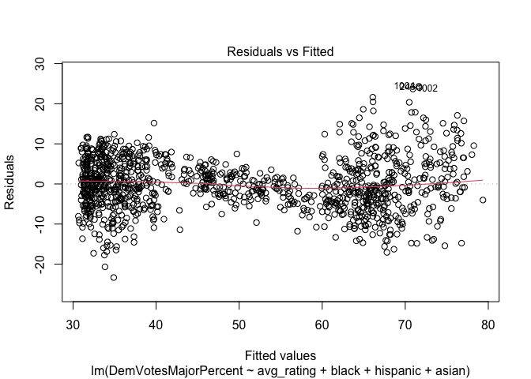
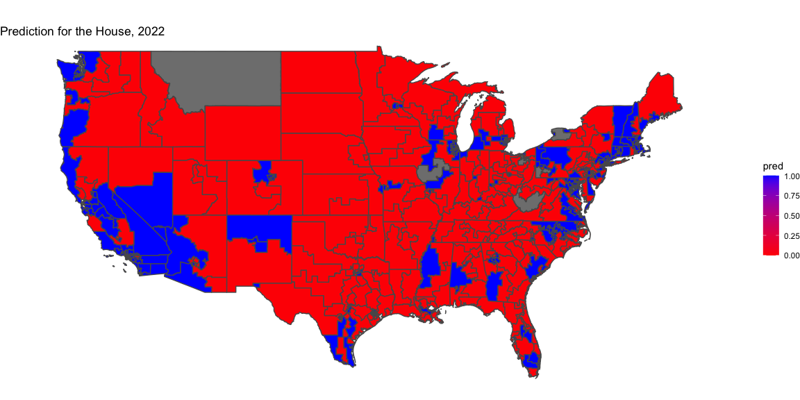

**Week 8 - Final Prediction**

**Introduction**  
The outcome of the 2022 Midterm Elections will have profound
consequences on the future of the country. Losing the House and Senate
will most likely derail President Biden’s legislative agenda, leaving
him in a similar spot as President Obama in 2010. There are also many
high-profile races for Governor and Secretary of State, whose role in
certifying elections may have an impact on the 2024 Presidential race.
Throughout the last fall semester, I have made several different models
to predict the outcome of each individual congressional district. I
tried using economic, polling, and advertising data while also factoring
in incumbency, get-out-the-vote campaigns, and shocks. Long-story-short,
very little has worked effectively. As a result, my main independent
variable is expert predictions which has several key advantages I will
dive into shortly. Regardless, while the general understanding seems to
be that the Democrats will struggle due to economic factors and
President Biden’s high disapproval, we cannot know for sure.

**Model Overview**

My final model predicts Democratic Vote Share and uses the average
expert rating (Cook Political Report, Sabato’s Crystal Ball, and
RealClear Politics) and then the percentages of African Americans,
Hispanics, and Asians in each district. I view the expert ratings as the
main “driver” of this model because they consider fundamentals,
incumbency, and polling on a far more sophisticated scale than I would
have been able to this semester. Expert ratings are a strong “catch-all”
variable because my own attempts at using economic data and polling were
largely in vain. In addition, I also wanted to add demographic data
because certain groups of people have historically voted in blocks.

One limitation of predicting elections in general is lack of
information, but unfortunately this issue is exacerbated using expert
ratings. “Moneyball” for politics is a relatively new phenomenon, and
expert ratings only became widely available starting in 2010. Another
choice I had to make was whether to include Presidential Race years. I
decided against this because I view midterms as an assessment of the
current President’s approval (which differs considerably from when two
Presidential candidates are on the ballot). Along with significantly
different turnouts, I decided to only use 2010, 2014, and 2018 data to
predict the 2022 midterms.

Because there were, at most, three observations per district, it was
unfeasible to create a linear regression for each congressional seat.
Instead, I pooled all the observations together, ignoring the year. This
way, I had over 1000 observations. As we can see, every predictor is
significant (p-value is below 0.05), a sign that each independent
variable is providing us with additional information. Interpreting the
coefficients, the presence of every minority group in the model has a
positive relationship with the democratic vote share in a district.
However, the numbers themselves may be misleading. As we can see, the
coefficient for Asians is larger than the other minority groups.
However, because the data for each group is a percentage, Asians may be
moving the prediction less than African Americans or Hispanics (because
there are many more African Americans and Hispanics than Asians in the
United States).

Moreover, the average rating predictor has a negative relationship with
Democratic vote share, but this was how it was coded. A value of 7
corresponded to the “Solid Republican,” meaning there is no question the
district will elect a Republican. It makes sense that the avg_rating
coefficient is negative. Higher values of the rating will correspond
with a smaller democratic vote share.

**Model Validation**

As we can see, the Adjusted R-Squared of the model is 0.8443, a huge
improvement over ones from prior weeks. As we can see from the
predictions versus the residuals from the training set, the model is
better at predicting close races. While there is certainly error in the
less competitive districts, I am not worried. Ultimately, we are focused
on who wins control of the house. I care much more about predicting the
seat accurately than I am predicting the win margin correctly.
Fortunately for us, races where a candidate wins by 10 or more
percentage points is probably easy to predict anyway. One issue that we
can see is that there are very large ranges for the predictions. For
example, Alabama’s 1st District has an average rating of 7,
corresponding to “Solid Republican.” However, its upper bound actually
has the Democrats winning. I think this is caused from pooling all the
observations together which dilutes the district specific information
that may be important.

| state          | district | avg_rating | prediction | lower_bound | upper_bound |
|:---------------|:---------|-----------:|-----------:|------------:|------------:|
| Alaska         | 1        |   3.000000 |   52.83531 |    39.82291 |    65.84770 |
| Alabama        | 1        |   7.000000 |   37.66069 |    24.63868 |    50.68269 |
| Alabama        | 2        |   7.000000 |   38.70306 |    25.67492 |    51.73119 |
| Alabama        | 3        |   7.000000 |   37.10086 |    24.08065 |    50.12106 |
| Alabama        | 4        |   7.000000 |   32.49912 |    19.48735 |    45.51088 |
| Alabama        | 5        |   7.000000 |   35.64483 |    22.63089 |    48.65876 |
| Alabama        | 6        |   7.000000 |   35.86665 |    22.85172 |    48.88158 |
| Alabama        | 7        |   1.000000 |   74.49860 |    61.42575 |    87.57145 |
| Arkansas       | 1        |   7.000000 |   34.76734 |    21.75404 |    47.78065 |
| Arkansas       | 2        |   7.000000 |   35.97678 |    22.96147 |    48.99208 |
| Arkansas       | 3        |   7.000000 |   32.44071 |    19.43018 |    45.45124 |
| Arkansas       | 4        |   7.000000 |   35.88598 |    22.87033 |    48.90164 |
| Arizona        | 1        |   4.500000 |   45.19735 |    32.19086 |    58.20384 |
| Arizona        | 2        |   4.833333 |   42.72674 |    29.71820 |    55.73529 |
| Arizona        | 3        |   1.000000 |   66.82642 |    53.78979 |    79.86305 |
| Arizona        | 4        |   2.333333 |   57.21268 |    44.20342 |    70.22194 |
| Arizona        | 5        |   7.000000 |   33.68919 |    20.67855 |    46.69983 |
| Arizona        | 6        |   5.000000 |   43.28940 |    30.28265 |    56.29616 |
| Arizona        | 7        |   1.000000 |   64.62063 |    51.58003 |    77.66124 |
| Arizona        | 8        |   7.000000 |   33.54381 |    20.53350 |    46.55411 |
| Arizona        | 9        |   7.000000 |   33.77512 |    20.76175 |    46.78849 |
| California     | 1        |   7.000000 |   33.51017 |    20.49903 |    46.52130 |
| California     | 2        |   1.000000 |   62.15184 |    49.12737 |    75.17631 |
| California     | 3        |   6.000000 |   38.35984 |    25.35137 |    51.36832 |
| California     | 4        |   1.000000 |   64.45732 |    51.44089 |    77.47376 |
| California     | 5        |   7.000000 |   34.17278 |    21.16008 |    47.18548 |
| California     | 6        |   1.000000 |   67.27121 |    54.25575 |    80.28666 |
| California     | 7        |   1.000000 |   71.23058 |    58.18720 |    84.27396 |
| California     | 8        |   1.000000 |   72.55724 |    59.51758 |    85.59690 |
| California     | 9        |   2.333333 |   62.47285 |    49.45190 |    75.49380 |
| California     | 10       |   1.000000 |   67.82099 |    54.78586 |    80.85613 |
| California     | 11       |   1.000000 |   72.43951 |    59.31956 |    85.55946 |
| California     | 12       |   1.000000 |   72.70577 |    59.65405 |    85.75750 |
| California     | 13       |   3.666667 |   53.13576 |    40.10679 |    66.16474 |
| California     | 14       |   1.000000 |   73.65748 |    60.53784 |    86.77711 |
| California     | 15       |   1.000000 |   74.31028 |    61.14711 |    87.47346 |
| California     | 16       |   1.000000 |   69.87850 |    56.80173 |    82.95527 |
| California     | 17       |   1.000000 |   77.19749 |    63.91717 |    90.47780 |
| California     | 18       |   1.000000 |   68.38448 |    55.34947 |    81.41950 |
| California     | 19       |   1.000000 |   67.07701 |    54.04493 |    80.10909 |
| California     | 20       |   7.000000 |   35.33104 |    22.31436 |    48.34771 |
| California     | 21       |   1.000000 |   67.93115 |    54.89694 |    80.96537 |
| California     | 22       |   4.000000 |   52.00548 |    38.95920 |    65.05176 |
| California     | 23       |   7.000000 |   36.41395 |    23.39119 |    49.43671 |
| California     | 24       |   1.000000 |   63.66040 |    50.64192 |    76.67889 |
| California     | 25       |   1.333333 |   63.80950 |    50.76982 |    76.84919 |
| California     | 26       |   1.333333 |   63.44576 |    50.42941 |    76.46212 |
| California     | 27       |   4.333333 |   51.52649 |    38.51227 |    64.54071 |
| California     | 28       |   1.000000 |   74.34234 |    61.19956 |    87.48511 |
| California     | 29       |   1.000000 |   67.59289 |    54.55763 |    80.62816 |
| California     | 30       |   1.000000 |   66.30963 |    53.28971 |    79.32955 |
| California     | 31       |   1.000000 |   70.65327 |    57.59974 |    83.70680 |
| California     | 32       |   1.000000 |   66.28372 |    53.26539 |    79.30205 |
| California     | 33       |   1.000000 |   68.47962 |    55.44536 |    81.51388 |
| California     | 34       |   1.000000 |   71.61301 |    58.55771 |    84.66831 |
| California     | 35       |   1.000000 |   68.73060 |    55.69201 |    81.76918 |
| California     | 36       |   1.000000 |   67.23403 |    54.20214 |    80.26592 |
| California     | 37       |   1.000000 |   73.31247 |    60.27646 |    86.34849 |
| California     | 38       |   1.000000 |   70.94173 |    57.88087 |    84.00259 |
| California     | 39       |   1.000000 |   68.09851 |    55.06647 |    81.13054 |
| California     | 40       |   6.000000 |   43.11902 |    30.07732 |    56.16073 |
| California     | 41       |   6.000000 |   41.13916 |    28.12488 |    54.15343 |
| California     | 42       |   1.000000 |   68.26693 |    55.23459 |    81.29928 |
| California     | 43       |   1.000000 |   74.46773 |    61.42561 |    87.50986 |
| California     | 44       |   1.000000 |   70.94406 |    57.90945 |    83.97866 |
| California     | 45       |   4.833333 |   55.76590 |    42.57786 |    68.95394 |
| California     | 46       |   1.000000 |   69.89641 |    56.84827 |    82.94454 |
| California     | 47       |   3.166667 |   56.95409 |    43.91444 |    69.99373 |
| California     | 48       |   7.000000 |   35.13977 |    22.12465 |    48.15489 |
| California     | 49       |   3.500000 |   51.91405 |    38.90738 |    64.92072 |
| California     | 50       |   1.000000 |   65.48549 |    52.46483 |    78.50616 |
| California     | 51       |   1.000000 |   67.85457 |    54.82944 |    80.87969 |
| California     | 52       |   1.000000 |   71.07555 |    58.03533 |    84.11576 |
| Colorado       | 1        |   1.000000 |   64.40904 |    51.39331 |    77.42477 |
| Colorado       | 2        |   1.000000 |   61.24294 |    48.21338 |    74.27250 |
| Colorado       | 3        |   6.666667 |   33.80269 |    20.78976 |    46.81562 |
| Colorado       | 4        |   7.000000 |   32.23053 |    19.21961 |    45.24144 |
| Colorado       | 5        |   7.000000 |   34.06022 |    21.05039 |    47.07004 |
| Colorado       | 6        |   1.000000 |   64.54767 |    51.53205 |    77.56330 |
| Colorado       | 7        |   2.333333 |   55.00506 |    41.98795 |    68.02217 |
| Colorado       | 8        |   4.000000 |   48.21679 |    35.20649 |    61.22710 |
| Connecticut    | 1        |   1.000000 |   65.25221 |    52.23747 |    78.26695 |
| Connecticut    | 2        |   1.666667 |   58.51499 |    45.49260 |    71.53738 |
| Connecticut    | 3        |   1.000000 |   64.79488 |    51.77856 |    77.81120 |
| Connecticut    | 4        |   1.000000 |   65.04753 |    52.03315 |    78.06192 |
| Connecticut    | 5        |   3.500000 |   50.96190 |    37.95551 |    63.96828 |
| Delaware       | 1        |   1.000000 |   66.34920 |    53.32981 |    79.36859 |
| Florida        | 1        |   7.000000 |   35.13568 |    22.12441 |    48.14694 |
| Florida        | 2        |   7.000000 |   37.25887 |    24.24023 |    50.27752 |
| Florida        | 3        |   7.000000 |   35.82558 |    22.81318 |    48.83798 |
| Florida        | 4        |   7.000000 |   39.46482 |    26.43635 |    52.49329 |
| Florida        | 5        |   6.666667 |   37.18185 |    24.17220 |    50.19150 |
| Florida        | 6        |   7.000000 |   34.17647 |    21.16623 |    47.18672 |
| Florida        | 7        |   6.666667 |   36.35927 |    23.35001 |    49.36854 |
| Florida        | 8        |   7.000000 |   33.84577 |    20.83608 |    46.85546 |
| Florida        | 9        |   1.000000 |   66.39692 |    53.36716 |    79.42668 |
| Florida        | 10       |   1.000000 |   68.97154 |    55.95597 |    81.98710 |
| Florida        | 11       |   7.000000 |   35.44108 |    22.43012 |    48.45204 |
| Florida        | 12       |   7.000000 |   32.58102 |    19.57073 |    45.59132 |
| Florida        | 13       |   6.000000 |   38.37467 |    25.36791 |    51.38144 |
| Florida        | 14       |   1.000000 |   66.83695 |    53.82288 |    79.85102 |
| Florida        | 15       |   6.000000 |   41.26829 |    28.25980 |    54.27679 |
| Florida        | 16       |   7.000000 |   34.86678 |    21.85617 |    47.87739 |
| Florida        | 17       |   7.000000 |   32.63480 |    19.62453 |    45.64507 |
| Florida        | 18       |   7.000000 |   35.18522 |    22.17257 |    48.19788 |
| Florida        | 19       |   7.000000 |   32.99890 |    19.98891 |    46.00889 |
| Florida        | 20       |   1.000000 |   74.47942 |    61.42573 |    87.53311 |
| Florida        | 21       |   7.000000 |   34.45539 |    21.44522 |    47.46556 |
| Florida        | 22       |   1.000000 |   65.12896 |    52.11352 |    78.14441 |
| Florida        | 23       |   1.000000 |   64.59636 |    51.58074 |    77.61199 |
| Florida        | 24       |   1.000000 |   74.22316 |    61.16728 |    87.27904 |
| Florida        | 25       |   1.000000 |   67.70218 |    54.68355 |    80.72080 |
| Florida        | 26       |   7.000000 |   36.69564 |    23.60924 |    49.78204 |
| Florida        | 27       |   5.666667 |   43.83443 |    30.75212 |    56.91674 |
| Florida        | 28       |   7.000000 |   37.90659 |    24.81901 |    50.99416 |
| Georgia        | 1        |   7.000000 |   38.76942 |    25.74272 |    51.79611 |
| Georgia        | 2        |   1.666667 |   69.70147 |    56.64856 |    82.75438 |
| Georgia        | 3        |   7.000000 |   36.91678 |    23.89900 |    49.93455 |
| Georgia        | 4        |   1.000000 |   76.10828 |    63.03250 |    89.18406 |
| Georgia        | 5        |   1.000000 |   74.33342 |    61.27408 |    87.39276 |
| Georgia        | 6        |   6.666667 |   37.09846 |    24.08681 |    50.11010 |
| Georgia        | 7        |   1.000000 |   72.49847 |    59.46975 |    85.52719 |
| Georgia        | 8        |   7.000000 |   38.86646 |    25.83831 |    51.89462 |
| Georgia        | 9        |   7.000000 |   34.72049 |    21.71013 |    47.73086 |
| Georgia        | 10       |   7.000000 |   36.96910 |    23.95164 |    49.98656 |
| Georgia        | 11       |   7.000000 |   36.41593 |    23.40202 |    49.42984 |
| Georgia        | 12       |   7.000000 |   40.62677 |    27.58641 |    53.66712 |
| Georgia        | 13       |   1.000000 |   78.17475 |    65.07174 |    91.27776 |
| Georgia        | 14       |   7.000000 |   34.50204 |    21.49084 |    47.51323 |
| Hawaii         | 1        |   1.000000 |   79.22901 |    65.82249 |    92.63552 |
| Hawaii         | 2        |   1.000000 |   70.43953 |    57.33772 |    83.54133 |
| Iowa           | 1        |   5.166667 |   40.83883 |    27.82872 |    53.84895 |
| Iowa           | 2        |   5.333333 |   39.69439 |    26.68290 |    52.70588 |
| Iowa           | 3        |   4.666667 |   43.72575 |    30.71621 |    56.73528 |
| Iowa           | 4        |   7.000000 |   31.46592 |    18.45343 |    44.47840 |
| Idaho          | 1        |   7.000000 |   31.35438 |    18.34200 |    44.36676 |
| Idaho          | 2        |   7.000000 |   31.56237 |    18.55044 |    44.57430 |
| Illinois       | 1        |   1.000000 |   73.90469 |    60.84557 |    86.96381 |
| Illinois       | 2        |   1.000000 |   72.80634 |    59.75702 |    85.85566 |
| Illinois       | 3        |   1.000000 |   65.47009 |    52.45234 |    78.48783 |
| Illinois       | 4        |   1.000000 |   66.13468 |    53.09812 |    79.17123 |
| Illinois       | 5        |   1.000000 |   63.58737 |    50.56457 |    76.61017 |
| Illinois       | 6        |   2.000000 |   58.34654 |    45.33289 |    71.36020 |
| Illinois       | 7        |   1.000000 |   74.53036 |    61.48407 |    87.57665 |
| Illinois       | 8        |   1.000000 |   65.58428 |    52.56429 |    78.60427 |
| Illinois       | 9        |   1.000000 |   66.22190 |    53.20067 |    79.24314 |
| Illinois       | 10       |   1.000000 |   64.29486 |    51.27841 |    77.31132 |
| Illinois       | 11       |   1.666667 |   60.73773 |    47.72443 |    73.75103 |
| Illinois       | 12       |   7.000000 |   32.11041 |    19.09830 |    45.12252 |
| Illinois       | 13       |   3.166667 |   54.88838 |    41.87825 |    67.89852 |
| Illinois       | 14       |   2.333333 |   58.01000 |    45.00224 |    71.01776 |
| Illinois       | 15       |   7.000000 |   31.41943 |    18.40617 |    44.43270 |
| Illinois       | 16       |   7.000000 |   31.54465 |    18.53215 |    44.55714 |
| Illinois       | 17       |   3.666667 |   50.60097 |    37.59314 |    63.60880 |
| Indiana        | 1        |   3.833333 |   51.48201 |    38.47545 |    64.48857 |
| Indiana        | 2        |   7.000000 |   32.69841 |    19.68778 |    45.70904 |
| Indiana        | 3        |   7.000000 |   32.54589 |    19.53481 |    45.55697 |
| Indiana        | 4        |   7.000000 |   32.01979 |    19.00796 |    45.03162 |
| Indiana        | 5        |   7.000000 |   32.77899 |    19.76773 |    45.79024 |
| Indiana        | 6        |   7.000000 |   32.04543 |    19.03336 |    45.05749 |
| Indiana        | 7        |   1.000000 |   69.08680 |    56.05884 |    82.11476 |
| Indiana        | 8        |   7.000000 |   31.72063 |    18.70780 |    44.73345 |
| Indiana        | 9        |   7.000000 |   31.55991 |    18.54694 |    44.57288 |
| Kansas         | 1        |   7.000000 |   33.15245 |    20.14219 |    46.16271 |
| Kansas         | 2        |   7.000000 |   34.75055 |    21.74046 |    47.76064 |
| Kansas         | 3        |   3.333333 |   52.00287 |    38.99506 |    65.01068 |
| Kansas         | 4        |   7.000000 |   34.74025 |    21.73008 |    47.75043 |
| Kentucky       | 1        |   7.000000 |   32.55447 |    19.54266 |    45.56628 |
| Kentucky       | 2        |   7.000000 |   32.23072 |    19.21881 |    45.24263 |
| Kentucky       | 3        |   1.000000 |   65.84341 |    52.82109 |    78.86573 |
| Kentucky       | 4        |   7.000000 |   31.56469 |    18.55174 |    44.57764 |
| Kentucky       | 5        |   7.000000 |   30.82183 |    17.80697 |    43.83670 |
| Kentucky       | 6        |   7.000000 |   33.09182 |    20.08052 |    46.10311 |
| Louisiana      | 1        |   7.000000 |   34.50009 |    21.48950 |    47.51068 |
| Louisiana      | 2        |   1.000000 |   76.37411 |    63.28909 |    89.45912 |
| Louisiana      | 3        |   7.000000 |   37.09580 |    24.07619 |    50.11540 |
| Louisiana      | 4        |   7.000000 |   39.56010 |    26.52607 |    52.59412 |
| Louisiana      | 5        |   7.000000 |   39.39481 |    26.36090 |    52.42872 |
| Louisiana      | 6        |   7.000000 |   37.00288 |    23.98463 |    50.02113 |
| Massachusetts  | 1        |   1.000000 |   62.34805 |    49.32443 |    75.37167 |
| Massachusetts  | 2        |   1.000000 |   62.52326 |    49.49913 |    75.54739 |
| Massachusetts  | 3        |   1.000000 |   63.36320 |    50.34395 |    76.38245 |
| Massachusetts  | 4        |   1.000000 |   62.07747 |    49.04902 |    75.10591 |
| Massachusetts  | 5        |   1.000000 |   64.19659 |    51.17333 |    77.21984 |
| Massachusetts  | 6        |   1.000000 |   61.77982 |    48.75176 |    74.80789 |
| Massachusetts  | 7        |   1.000000 |   69.59490 |    56.57990 |    82.60989 |
| Massachusetts  | 8        |   1.000000 |   64.53330 |    51.51324 |    77.55337 |
| Massachusetts  | 9        |   1.000000 |   60.81510 |    47.78017 |    73.85003 |
| Maryland       | 1        |   7.000000 |   34.94105 |    21.92899 |    47.95312 |
| Maryland       | 2        |   1.000000 |   66.85420 |    53.83445 |    79.87395 |
| Maryland       | 3        |   1.000000 |   66.99365 |    53.97540 |    80.01189 |
| Maryland       | 4        |   1.000000 |   79.52757 |    66.41891 |    92.63623 |
| Maryland       | 5        |   1.000000 |   71.19446 |    58.15855 |    84.23037 |
| Maryland       | 6        |   2.333333 |   59.01578 |    46.00606 |    72.02550 |
| Maryland       | 7        |   1.000000 |   75.40825 |    62.33335 |    88.48315 |
| Maryland       | 8        |   1.000000 |   69.22773 |    56.20574 |    82.24971 |
| Maine          | 1        |   1.000000 |   60.20815 |    47.16868 |    73.24761 |
| Maine          | 2        |   3.666667 |   46.89252 |    33.87205 |    59.91299 |
| Michigan       | 1        |   7.000000 |   30.88260 |    17.86807 |    43.89712 |
| Michigan       | 2        |   7.000000 |   31.23993 |    18.22661 |    44.25324 |
| Michigan       | 3        |   3.166667 |   52.79313 |    39.78364 |    65.80263 |
| Michigan       | 4        |   7.000000 |   33.50538 |    20.49521 |    46.51554 |
| Michigan       | 5        |   7.000000 |   31.84080 |    18.82870 |    44.85291 |
| Michigan       | 6        |   1.000000 |   64.53596 |    51.51458 |    77.55735 |
| Michigan       | 7        |   3.666667 |   48.94999 |    35.93875 |    61.96122 |
| Michigan       | 8        |   3.500000 |   51.73525 |    38.72561 |    64.74489 |
| Michigan       | 9        |   7.000000 |   31.46935 |    18.45645 |    44.48224 |
| Michigan       | 10       |   5.166667 |   44.01890 |    31.01165 |    57.02616 |
| Michigan       | 11       |   1.000000 |   65.19159 |    52.17165 |    78.21153 |
| Michigan       | 12       |   1.000000 |   72.26215 |    59.21341 |    85.31090 |
| Michigan       | 13       |   1.000000 |   73.11917 |    60.06846 |    86.16989 |
| Minnesota      | 1        |   6.333333 |   34.97713 |    21.96616 |    47.98811 |
| Minnesota      | 2        |   4.000000 |   47.74276 |    34.73301 |    60.75251 |
| Minnesota      | 3        |   1.000000 |   63.35206 |    50.32676 |    76.37737 |
| Minnesota      | 4        |   1.000000 |   65.34861 |    52.32602 |    78.37121 |
| Minnesota      | 5        |   1.000000 |   65.25804 |    52.23955 |    78.27654 |
| Minnesota      | 6        |   7.000000 |   31.97226 |    18.95975 |    44.98477 |
| Minnesota      | 7        |   7.000000 |   30.93257 |    17.91851 |    43.94663 |
| Minnesota      | 8        |   7.000000 |   30.93723 |    17.92281 |    43.95164 |
| Missouri       | 1        |   1.000000 |   72.25145 |    59.20520 |    85.29770 |
| Missouri       | 2        |   7.000000 |   32.19099 |    19.17848 |    45.20350 |
| Missouri       | 3        |   7.000000 |   32.17911 |    19.16713 |    45.19109 |
| Missouri       | 4        |   7.000000 |   31.85432 |    18.84224 |    44.86640 |
| Missouri       | 5        |   1.000000 |   66.21520 |    53.19448 |    79.23592 |
| Missouri       | 6        |   7.000000 |   31.79441 |    18.78215 |    44.80667 |
| Missouri       | 7        |   7.000000 |   31.37411 |    18.36112 |    44.38709 |
| Missouri       | 8        |   7.000000 |   31.63193 |    18.61898 |    44.64489 |
| Mississippi    | 1        |   7.000000 |   37.64271 |    24.61949 |    50.66594 |
| Mississippi    | 2        |   1.000000 |   76.02612 |    62.93457 |    89.11767 |
| Mississippi    | 3        |   7.000000 |   39.30929 |    26.27599 |    52.34259 |
| Mississippi    | 4        |   7.000000 |   36.80145 |    23.78385 |    49.81904 |
| Montana        | 1        |   4.833333 |   41.38249 |    28.36794 |    54.39703 |
| Montana        | 2        |   7.000000 |   30.85320 |    17.83909 |    43.86732 |
| North Carolina | 1        |   2.333333 |   64.38766 |    51.35048 |    77.42485 |
| North Carolina | 2        |   1.000000 |   66.67537 |    53.65821 |    79.69254 |
| North Carolina | 3        |   7.000000 |   36.25508 |    23.24030 |    49.26986 |
| North Carolina | 4        |   1.000000 |   68.17174 |    55.14969 |    81.19380 |
| North Carolina | 5        |   7.000000 |   33.98424 |    20.97298 |    46.99550 |
| North Carolina | 6        |   1.666667 |   65.60584 |    52.58317 |    78.62850 |
| North Carolina | 7        |   7.000000 |   35.82903 |    22.81424 |    48.84383 |
| North Carolina | 8        |   7.000000 |   34.85643 |    21.84454 |    47.86832 |
| North Carolina | 9        |   7.000000 |   37.80787 |    24.78784 |    50.82790 |
| North Carolina | 10       |   7.000000 |   33.77207 |    20.76124 |    46.78290 |
| North Carolina | 11       |   7.000000 |   31.71326 |    18.70080 |    44.72572 |
| North Carolina | 12       |   1.000000 |   70.98511 |    57.95297 |    84.01726 |
| North Carolina | 13       |   4.333333 |   50.49007 |    37.47944 |    63.50069 |
| North Carolina | 14       |   1.000000 |   66.78147 |    53.76303 |    79.79991 |
| North Dakota   | 1        |   7.000000 |   31.25356 |    18.24030 |    44.26683 |
| Nebraska       | 1        |   7.000000 |   32.20759 |    19.19644 |    45.21874 |
| Nebraska       | 2        |   4.333333 |   46.85413 |    33.84767 |    59.86059 |
| Nebraska       | 3        |   7.000000 |   31.18582 |    18.17301 |    44.19863 |
| New Hampshire  | 1        |   3.333333 |   49.29388 |    36.27592 |    62.31183 |
| New Hampshire  | 2        |   2.333333 |   54.04353 |    41.01879 |    67.06826 |
| New Jersey     | 1        |   1.000000 |   65.78423 |    52.76897 |    78.79949 |
| New Jersey     | 2        |   7.000000 |   35.23159 |    22.22106 |    48.24212 |
| New Jersey     | 3        |   1.666667 |   62.26008 |    49.24779 |    75.27237 |
| New Jersey     | 4        |   7.000000 |   32.40719 |    19.39645 |    45.41794 |
| New Jersey     | 5        |   1.666667 |   62.79154 |    49.77312 |    75.80995 |
| New Jersey     | 6        |   1.000000 |   68.34460 |    55.32647 |    81.36274 |
| New Jersey     | 7        |   5.000000 |   43.85520 |    30.84886 |    56.86153 |
| New Jersey     | 8        |   1.000000 |   67.72933 |    54.70502 |    80.75365 |
| New Jersey     | 9        |   1.000000 |   66.70115 |    53.68673 |    79.71557 |
| New Jersey     | 10       |   1.000000 |   76.26033 |    63.19887 |    89.32179 |
| New Jersey     | 11       |   1.000000 |   64.88840 |    51.87062 |    77.90617 |
| New Jersey     | 12       |   1.000000 |   69.71812 |    56.69517 |    82.74107 |
| New Mexico     | 1        |   1.333333 |   61.79704 |    48.77160 |    74.82249 |
| New Mexico     | 2        |   4.000000 |   49.30470 |    36.26269 |    62.34671 |
| New Mexico     | 3        |   1.666667 |   59.33308 |    46.30424 |    72.36193 |
| Nevada         | 1        |   3.333333 |   55.17276 |    42.16683 |    68.17869 |
| Nevada         | 2        |   7.000000 |   33.20651 |    20.19571 |    46.21730 |
| Nevada         | 3        |   3.666667 |   55.60820 |    42.58604 |    68.63035 |
| Nevada         | 4        |   3.166667 |   57.21239 |    44.20612 |    70.21867 |
| New York       | 1        |   5.000000 |   43.06791 |    30.06174 |    56.07408 |
| New York       | 2        |   5.500000 |   42.39805 |    29.39248 |    55.40363 |
| New York       | 3        |   3.333333 |   55.70989 |    42.67805 |    68.74173 |
| New York       | 4        |   3.166667 |   56.66609 |    43.66072 |    69.67146 |
| New York       | 5        |   1.000000 |   78.24354 |    65.17342 |    91.31366 |
| New York       | 6        |   1.000000 |   74.39689 |    61.24886 |    87.54493 |
| New York       | 7        |   1.000000 |   68.79652 |    55.78119 |    81.81185 |
| New York       | 8        |   1.000000 |   75.02543 |    61.97777 |    88.07309 |
| New York       | 9        |   1.000000 |   74.87518 |    61.82578 |    87.92459 |
| New York       | 10       |   1.000000 |   68.39202 |    55.36058 |    81.42345 |
| New York       | 11       |   6.000000 |   43.27474 |    30.24272 |    56.30677 |
| New York       | 12       |   1.000000 |   64.84718 |    51.82626 |    77.86810 |
| New York       | 13       |   1.000000 |   71.34992 |    58.31293 |    84.38692 |
| New York       | 14       |   1.000000 |   70.85022 |    57.82355 |    83.87690 |
| New York       | 15       |   1.000000 |   72.33866 |    59.28741 |    85.38991 |
| New York       | 16       |   1.000000 |   68.76175 |    55.74844 |    81.77506 |
| New York       | 17       |   3.333333 |   52.68746 |    39.68215 |    65.69278 |
| New York       | 18       |   3.000000 |   54.07581 |    41.06854 |    67.08309 |
| New York       | 19       |   4.000000 |   47.01812 |    34.00722 |    60.02903 |
| New York       | 20       |   1.000000 |   62.99560 |    49.97128 |    76.01992 |
| New York       | 21       |   7.000000 |   31.46468 |    18.45192 |    44.47744 |
| New York       | 22       |   4.000000 |   47.89223 |    34.88326 |    60.90120 |
| New York       | 23       |   7.000000 |   31.30750 |    18.29424 |    44.32075 |
| New York       | 24       |   7.000000 |   31.57258 |    18.55991 |    44.58524 |
| New York       | 25       |   1.000000 |   64.20602 |    51.18603 |    77.22601 |
| New York       | 26       |   1.000000 |   64.72437 |    51.70396 |    77.74477 |
| Ohio           | 1        |   4.000000 |   50.92789 |    37.91891 |    63.93687 |
| Ohio           | 2        |   7.000000 |   31.08258 |    18.06839 |    44.09677 |
| Ohio           | 3        |   1.000000 |   67.83507 |    54.81315 |    80.85700 |
| Ohio           | 4        |   7.000000 |   32.22656 |    19.21456 |    45.23855 |
| Ohio           | 5        |   7.000000 |   31.98388 |    18.97243 |    44.99533 |
| Ohio           | 6        |   7.000000 |   32.23567 |    19.22370 |    45.24764 |
| Ohio           | 7        |   7.000000 |   32.07174 |    19.05967 |    45.08380 |
| Ohio           | 8        |   7.000000 |   34.15244 |    21.14083 |    47.16404 |
| Ohio           | 9        |   3.166667 |   52.62625 |    39.61539 |    65.63711 |
| Ohio           | 10       |   7.000000 |   35.43001 |    22.41645 |    48.44356 |
| Ohio           | 11       |   1.000000 |   71.75585 |    58.71452 |    84.79719 |
| Ohio           | 12       |   7.000000 |   31.67945 |    18.66655 |    44.69235 |
| Ohio           | 13       |   4.000000 |   48.87896 |    35.86987 |    61.88804 |
| Ohio           | 14       |   7.000000 |   31.93827 |    18.92593 |    44.95061 |
| Ohio           | 15       |   7.000000 |   34.06042 |    21.04933 |    47.07151 |
| Oklahoma       | 1        |   7.000000 |   33.90125 |    20.89118 |    46.91132 |
| Oklahoma       | 2        |   7.000000 |   31.61987 |    18.60732 |    44.63242 |
| Oklahoma       | 3        |   7.000000 |   32.84659 |    19.83651 |    45.85668 |
| Oklahoma       | 4        |   7.000000 |   33.58349 |    20.57358 |    46.59340 |
| Oklahoma       | 5        |   7.000000 |   34.85042 |    21.83953 |    47.86131 |
| Oregon         | 1        |   1.000000 |   63.13661 |    50.11297 |    76.16026 |
| Oregon         | 2        |   7.000000 |   31.41982 |    18.40762 |    44.43202 |
| Oregon         | 3        |   1.000000 |   63.76594 |    50.74464 |    76.78724 |
| Oregon         | 4        |   3.166667 |   50.35095 |    37.33433 |    63.36756 |
| Oregon         | 5        |   4.000000 |   46.47782 |    33.46550 |    59.49015 |
| Oregon         | 6        |   3.666667 |   48.88677 |    35.87722 |    61.89632 |
| Pennsylvania   | 1        |   6.666667 |   34.71703 |    21.70599 |    47.72808 |
| Pennsylvania   | 2        |   1.000000 |   69.86509 |    56.85029 |    82.87989 |
| Pennsylvania   | 3        |   1.000000 |   75.48495 |    62.41860 |    88.55130 |
| Pennsylvania   | 4        |   1.000000 |   63.04429 |    50.01981 |    76.06877 |
| Pennsylvania   | 5        |   1.000000 |   67.24605 |    54.22650 |    80.26560 |
| Pennsylvania   | 6        |   1.333333 |   61.04749 |    48.02754 |    74.06745 |
| Pennsylvania   | 7        |   4.000000 |   47.81227 |    34.80538 |    60.81916 |
| Pennsylvania   | 8        |   4.000000 |   47.38210 |    34.37332 |    60.39089 |
| Pennsylvania   | 9        |   7.000000 |   31.34934 |    18.33647 |    44.36221 |
| Pennsylvania   | 10       |   7.000000 |   34.15825 |    21.14813 |    47.16837 |
| Pennsylvania   | 11       |   7.000000 |   32.08837 |    19.07733 |    45.09942 |
| Pennsylvania   | 12       |   1.666667 |   60.79167 |    47.77272 |    73.81062 |
| Pennsylvania   | 13       |   7.000000 |   31.20527 |    18.19164 |    44.21890 |
| Pennsylvania   | 14       |   7.000000 |   31.36024 |    18.34664 |    44.37385 |
| Pennsylvania   | 15       |   7.000000 |   31.31569 |    18.30226 |    44.32913 |
| Pennsylvania   | 16       |   7.000000 |   31.72785 |    18.71516 |    44.74054 |
| Pennsylvania   | 17       |   4.000000 |   47.37892 |    34.36738 |    60.39046 |
| Rhode Island   | 1        |   1.000000 |   63.14887 |    50.12854 |    76.16921 |
| Rhode Island   | 2        |   3.666667 |   48.95857 |    35.94906 |    61.96808 |
| South Carolina | 1        |   7.000000 |   36.02530 |    23.01100 |    49.03960 |
| South Carolina | 2        |   7.000000 |   37.71992 |    24.69864 |    50.74120 |
| South Carolina | 3        |   7.000000 |   35.52118 |    22.50673 |    48.53563 |
| South Carolina | 4        |   7.000000 |   36.42578 |    23.41056 |    49.44100 |
| South Carolina | 5        |   7.000000 |   37.40087 |    24.38014 |    50.42161 |
| South Carolina | 6        |   1.000000 |   72.89391 |    59.83806 |    85.94977 |
| South Carolina | 7        |   7.000000 |   37.63081 |    24.60823 |    50.65340 |
| South Dakota   | 1        |   7.000000 |   31.01352 |    17.99959 |    44.02745 |
| Tennessee      | 1        |   7.000000 |   31.16283 |    18.14903 |    44.17662 |
| Tennessee      | 2        |   7.000000 |   32.36970 |    19.35797 |    45.38144 |
| Tennessee      | 3        |   7.000000 |   33.56842 |    20.55710 |    46.57975 |
| Tennessee      | 4        |   7.000000 |   33.45937 |    20.44849 |    46.47026 |
| Tennessee      | 5        |   6.333333 |   38.09569 |    25.08677 |    51.10462 |
| Tennessee      | 6        |   7.000000 |   33.21174 |    20.20049 |    46.22298 |
| Tennessee      | 7        |   7.000000 |   35.51927 |    22.50625 |    48.53228 |
| Tennessee      | 8        |   7.000000 |   35.32729 |    22.31330 |    48.34128 |
| Tennessee      | 9        |   1.000000 |   76.68286 |    63.59000 |    89.77572 |
| Texas          | 1        |   7.000000 |   36.18865 |    23.17399 |    49.20331 |
| Texas          | 2        |   7.000000 |   35.68492 |    22.67217 |    48.69766 |
| Texas          | 3        |   7.000000 |   36.55414 |    23.53739 |    49.57089 |
| Texas          | 4        |   7.000000 |   35.29171 |    22.27980 |    48.30361 |
| Texas          | 5        |   7.000000 |   36.65683 |    23.64299 |    49.67067 |
| Texas          | 6        |   7.000000 |   36.59467 |    23.57916 |    49.61019 |
| Texas          | 7        |   1.000000 |   72.35965 |    59.32338 |    85.39592 |
| Texas          | 8        |   7.000000 |   36.82189 |    23.80642 |    49.83737 |
| Texas          | 9        |   1.000000 |   76.11899 |    63.06773 |    89.17025 |
| Texas          | 10       |   7.000000 |   35.47988 |    22.46840 |    48.49136 |
| Texas          | 11       |   7.000000 |   35.94140 |    22.91884 |    48.96395 |
| Texas          | 12       |   7.000000 |   35.28323 |    22.27182 |    48.29463 |
| Texas          | 13       |   7.000000 |   33.99842 |    20.98658 |    47.01026 |
| Texas          | 14       |   7.000000 |   36.68664 |    23.67165 |    49.70163 |
| Texas          | 15       |   5.500000 |   43.30171 |    30.21059 |    56.39284 |
| Texas          | 16       |   1.000000 |   65.98837 |    52.89377 |    79.08297 |
| Texas          | 17       |   7.000000 |   36.25475 |    23.24062 |    49.26887 |
| Texas          | 18       |   1.000000 |   73.63015 |    60.59281 |    86.66749 |
| Texas          | 19       |   7.000000 |   34.47787 |    21.45630 |    47.49944 |
| Texas          | 20       |   1.000000 |   66.32793 |    53.26053 |    79.39533 |
| Texas          | 21       |   7.000000 |   33.63885 |    20.62331 |    46.65439 |
| Texas          | 22       |   7.000000 |   38.43685 |    25.41132 |    51.46239 |
| Texas          | 23       |   7.000000 |   35.84723 |    22.78648 |    48.90798 |
| Texas          | 24       |   7.000000 |   34.99276 |    21.98091 |    48.00461 |
| Texas          | 25       |   7.000000 |   35.13518 |    22.12429 |    48.14606 |
| Texas          | 26       |   7.000000 |   35.62663 |    22.61427 |    48.63899 |
| Texas          | 27       |   7.000000 |   35.22545 |    22.18126 |    48.26963 |
| Texas          | 28       |   3.500000 |   53.70067 |    40.62951 |    66.77183 |
| Texas          | 29       |   1.000000 |   69.33780 |    56.27833 |    82.39726 |
| Texas          | 30       |   1.000000 |   74.59472 |    61.54387 |    87.64557 |
| Texas          | 31       |   7.000000 |   34.58289 |    21.57190 |    47.59387 |
| Texas          | 32       |   1.000000 |   69.33895 |    56.32545 |    82.35245 |
| Texas          | 33       |   1.000000 |   70.76039 |    57.73047 |    83.79032 |
| Texas          | 34       |   3.666667 |   52.56692 |    39.44649 |    65.68736 |
| Texas          | 35       |   1.000000 |   67.23491 |    54.20328 |    80.26654 |
| Texas          | 36       |   7.000000 |   36.23930 |    23.22510 |    49.25349 |
| Texas          | 37       |   1.000000 |   64.84880 |    51.83452 |    77.86308 |
| Texas          | 38       |   7.000000 |   37.06063 |    24.04303 |    50.07823 |
| Utah           | 1        |   7.000000 |   31.94613 |    18.93482 |    44.95743 |
| Utah           | 2        |   7.000000 |   32.16076 |    19.14970 |    45.17181 |
| Utah           | 3        |   7.000000 |   31.65079 |    18.63880 |    44.66279 |
| Utah           | 4        |   7.000000 |   32.00594 |    18.99465 |    45.01723 |
| Virginia       | 1        |   7.000000 |   35.37045 |    22.35815 |    48.38276 |
| Virginia       | 2        |   4.000000 |   52.95495 |    39.94512 |    65.96478 |
| Virginia       | 3        |   1.000000 |   72.27141 |    59.22967 |    85.31315 |
| Virginia       | 4        |   1.000000 |   72.01702 |    58.97275 |    85.06129 |
| Virginia       | 5        |   7.000000 |   36.56668 |    23.54962 |    49.58374 |
| Virginia       | 6        |   7.000000 |   33.10554 |    20.09471 |    46.11637 |
| Virginia       | 7        |   3.333333 |   55.99621 |    42.98865 |    69.00377 |
| Virginia       | 8        |   1.000000 |   67.53733 |    54.51998 |    80.55467 |
| Virginia       | 9        |   7.000000 |   32.27898 |    19.26697 |    45.29100 |
| Virginia       | 10       |   2.000000 |   62.12279 |    49.10618 |    75.13940 |
| Virginia       | 11       |   1.000000 |   69.10570 |    56.06054 |    82.15085 |
| Vermont        | 1        |   1.000000 |   60.16912 |    47.12948 |    73.20875 |
| Washington     | 1        |   1.000000 |   64.68236 |    51.65336 |    77.71135 |
| Washington     | 2        |   1.000000 |   62.67947 |    49.65413 |    75.70481 |
| Washington     | 3        |   5.166667 |   41.27634 |    28.26732 |    54.28537 |
| Washington     | 4        |   7.000000 |   32.75693 |    19.74275 |    45.77112 |
| Washington     | 5        |   7.000000 |   31.92883 |    18.91709 |    44.94056 |
| Washington     | 6        |   1.000000 |   62.38838 |    49.36226 |    75.41449 |
| Washington     | 7        |   1.000000 |   65.20863 |    52.18130 |    78.23595 |
| Washington     | 8        |   3.666667 |   49.68531 |    36.67385 |    62.69676 |
| Washington     | 9        |   1.000000 |   70.21358 |    57.16258 |    83.26459 |
| Washington     | 10       |   1.000000 |   64.55117 |    51.53175 |    77.57058 |
| Wisconsin      | 1        |   7.000000 |   32.87846 |    19.86831 |    45.88860 |
| Wisconsin      | 2        |   1.000000 |   61.70091 |    48.67063 |    74.73118 |
| Wisconsin      | 3        |   5.500000 |   38.56376 |    25.55124 |    51.57628 |
| Wisconsin      | 4        |   1.000000 |   69.59355 |    56.57098 |    82.61612 |
| Wisconsin      | 5        |   7.000000 |   31.58295 |    18.57034 |    44.59556 |
| Wisconsin      | 6        |   7.000000 |   31.54853 |    18.53567 |    44.56139 |
| Wisconsin      | 7        |   7.000000 |   30.98689 |    17.97246 |    44.00132 |
| Wisconsin      | 8        |   7.000000 |   31.36855 |    18.35539 |    44.38170 |
| West Virginia  | 1        |   7.000000 |   31.56452 |    18.55123 |    44.57781 |
| West Virginia  | 2        |   7.000000 |   31.42794 |    18.41464 |    44.44124 |
| Wyoming        | 1        |   7.000000 |   31.33454 |    18.32212 |    44.34696 |

**Conclusion**

While building these models, one theme keeps returning: forecasting
elections is extremely difficult. The most important reason is because
elections do not happen very often (once every two years is not a lot of
data for a statistician), and we have to ignore most of them because
they are irrelevant (Democrats controlled the house for most of the 20th
century regardless of which party controlled the White House). Also, as
we have seen many times, polls can be deceiving, people may have
different priorities than what was expected, or certain events can
galvanize turnout in one direction. Ultimately, I predict that it will
be this last point, turnout, that decides who wins in key races across
the country. Unfortunately, politics has become more about getting your
team to vote than it is to appeal to the other side. Regardless, my
model predicts that Democrats will win 207 congressional seats, giving
the Republicans a large majority in the house. Below shows the final
results (note: the map in R is using the 2018 districts because this was
the only one available. Because of this, the grey indicates where there
may have been redistricting. For example, Montana is now divided into
two districts instead of one, so the plot is grey because of the
discrepancy).

