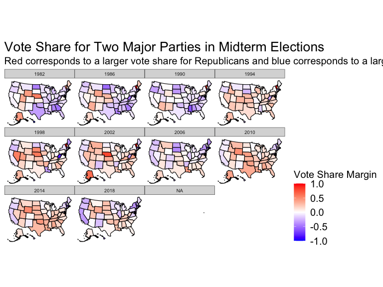
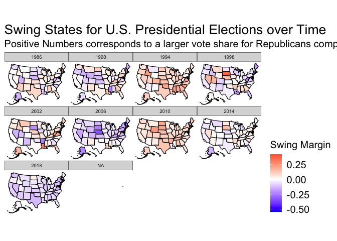

    ## ── Attaching packages ─────────────────────────────────────── tidyverse 1.3.1 ──

    ## ✓ ggplot2 3.3.5     ✓ purrr   0.3.4
    ## ✓ tibble  3.1.6     ✓ dplyr   1.0.8
    ## ✓ tidyr   1.2.0     ✓ stringr 1.4.0
    ## ✓ readr   2.1.2     ✓ forcats 0.5.1

    ## ── Conflicts ────────────────────────────────────────── tidyverse_conflicts() ──
    ## x dplyr::filter() masks stats::filter()
    ## x dplyr::lag()    masks stats::lag()

    ## Rows: 37 Columns: 16
    ## ── Column specification ────────────────────────────────────────────────────────
    ## Delimiter: ","
    ## chr (2): AreaAll, PluralityPartyAll
    ## dbl (9): year, RepWinnerAll, DemWinnerAll, OtherWinnerAll, RepVotesTotalPerc...
    ## 
    ## ℹ Use `spec()` to retrieve the full column specification for this data.
    ## ℹ Specify the column types or set `show_col_types = FALSE` to quiet this message.
    ## Rows: 16067 Columns: 31
    ## ── Column specification ────────────────────────────────────────────────────────
    ## Delimiter: ","
    ## chr (16): Office, State, Area, RepCandidate, RepStatus, DemCandidate, DemSta...
    ## dbl (14): raceYear, RepVotes, DemVotes, ThirdVotes, OtherVotes, PluralityVot...
    ## lgl  (1): CensusPop
    ## 
    ## ℹ Use `spec()` to retrieve the full column specification for this data.
    ## ℹ Specify the column types or set `show_col_types = FALSE` to quiet this message.

One common way to predict upcoming midterm congressional elections is by
looking at the vote share for both major parties in each state over
time. Below are maps of the United States highlighted with different
colors depending on the percentage of voters that voted for Republicans,
calculated by taking the total number of votes to Republican
congressional candidates in the state divided by the total number of
votes cast. Red indicates that Republicans carried the state, while blue
shades mean it went to the Democrats. White shades indicate that the
vote was very close.

``` r
plot_usmap(data = margin, regions = "state", values = "R_votemargin_st") +
  facet_wrap(facets = raceYear~.) +
  scale_fill_gradient2(low = "blue",mid = "white",high = "red",name = "Vote Share Margin") + 
  labs(title = "Vote Share for Two Major Parties in Midterm Elections",subtitle = "Red corresponds to a larger vote share for Republicans and blue corresponds to a larger vote share for Democrats") + theme(legend.position = "right",
        panel.grid = element_blank(),
        axis.text.x = element_blank(),
        axis.text.y = element_blank(),
        axis.title.x = element_blank(),
        axis.title.y = element_blank())
```



We can see from the plots that most states rarely change their party
preference. For example, California has voted heavily for Democrats to
represent them in Congress since the 1990s while Texas has voted for
Republicans in the same time frame. More generally, southern states in
the “Sun” or “Bible” Belt have consistently voted for Republicans by
large margins while coastal regions with denser urban areas like New
England and the West Coast have supported Democrats. While much of
midterm election results can be attributed to district level factors and
how the congressional maps were drawn, looking at the few states that
regularly flip party preferences can answer important questions for
national politics. Namely, are there states that used to lean a certain
direction that are now becoming more competitive? If certain states are
beginning to shift their partisan slant, what do we need to understand
about these communities who may end up who holds the power in Congress
or in the White House? Lastly, which candidates should the RNC and DNC
allocate resources and attention to?



Before we answer these questions, it is important to figure out which
states are becoming more competitive. From the maps below, the different
shades of blue and red represent a “swing” factor. This is calculated by
taking the vote share won by the Republicans and subtracting their vote
share in the midterm election four years ago. Negative numbers,
corresponding to blue, mean that Republicans won a smaller share of the
votes compared to four years ago. States that are a deeper shade of red
means Republicans won a larger share of the vote than four years ago.
Looking at the maps, we can see that Pennsylvania, Michigan, Ohio, and
Florida have flipped between red and blue in the past few midterm
elections (this also holds true of Presidential elections). There is
clear evidence for this as well because politicians at the top of the
ballot held most of their campaign rallies in the “rust” belt in the
lead up to the 2020 election. According to the [Washington
Post](https://www.washingtonpost.com/elections/2020/11/02/campaign-rallies-covid/),
Pennsylvania and Florida were the most common destination for both Joe
Biden and Donald trump.

More interesting still, some historically conservative states are
experiencing demographic shifts in that could change the political
landscape. In particular,
[Georgia](https://www.nbcnews.com/politics/meet-the-press/meet-2022-s-most-important-swing-state-georgia-n1287686),
[Arizona](https://www.nysun.com/article/why-arizona-is-turning-blue),
and
[Texas](https://www.theguardian.com/us-news/commentisfree/2022/mar/08/can-texas-become-purple-that-may-depend-on-hispanic-voters)
all have rapidly growing cities and surrounding suburbs (which typically
vote for Democrats). In addition, immigrants escaping violence from
South America naturalizing in Arizona and Texas could open the door for
Democratic gains in the House or Senate.
