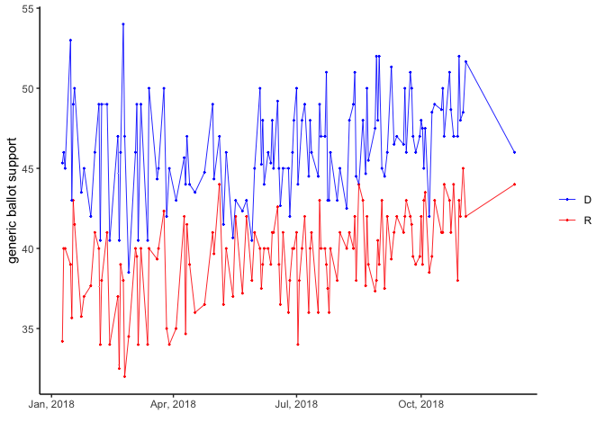
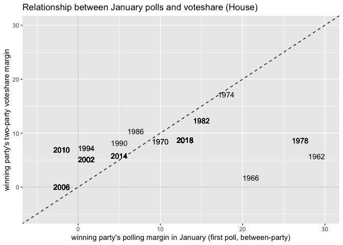
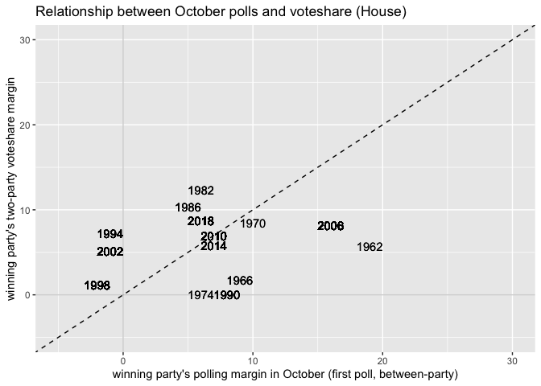

**Generic Polling - Looking at the Past**

Polls are used to predict the outcome of national, state, and local
elections in every cycle. Polls are helpful for the candidates because
they get a rough sense of their odds of winning (polls on specific
issues can also help inform a politician’s stance), but more importantly
voters, the media, corporations, investors, foreign nations and many
more actors all have an interest in which party will win control of the
White House or the United States Congress. Oddly enough, polls are
heavily relied upon to understand public opinion even when any single
poll is relatively uninformative and can vary wildly depending on the
current political or economic conditions. As seen in the plot below of
the lead up to the 2018 Midterm Elections, at some points during early
in the year, Democrats held an almost 20 percentage point advantage. As
the election approached however, the race got tighter and tighter.
Similarly, when comparing polls from January and October of a midterm
election year, we can see there is a much wider spread in January, but
election results end up falling much closer to the polls right before
the vote takes place. This can happen because a voter who leans slightly
in one direction is unhappy with his/her party in January may say they
will flip, but by October they end up [“coming
home”](https://www.nytimes.com/2014/04/23/upshot/the-myth-of-swing-voters-in-midterm-elections.html).
However, what we can see is that while polls may predict the margin
incorrectly, polls in midterm years have accurately predicted the winner
every time on the aggregate (with 2006 in the January polls, and 1974
and 1990 in the October polls as the only close calls).

**Incorporating Polls into our Model**

Last week, we tried to predict the congressional vote share of the
current President’s party in midterm elections using economic data like
GDP growth, unemployment, and inflation. We found that while inflation
was significant, the model was extremely overfit and the relationship
between inflation and other economic factors is very uncertain with how
party’s perform in midterm elections (the 1974 election, an extreme
outlier, may well have driven the entire model’s positive relationship
between democrats and inflation). To try to build off of last week, I
want to incorporate generic polls conducted in January of the election
year in addition to economic indicators.

| Model.Name               | R.squared.adj |
|:-------------------------|:--------------|
| Generic Poll Only        | 0.398         |
| Fundamentals and Polling | 0.297         |

| Predictor       | Coefficient | P.Val |
|:----------------|:------------|:------|
| Unemployment    | -0.387      | 0.414 |
| GDP Growth Rate | 0.621       | 0.645 |
| Inflation       | 0.096       | 0.746 |
| Generic Ballot  | 0.255       | 0.055 |

| Predictor      | Coefficient | P.Val |
|:---------------|:------------|:------|
| Generic Ballot | 0.285       | 0.007 |

After building a linear model with all the economic data from last week
(unemployment, inflation, and GDP growth) along with generic polling
data, we see that none of the predictors are significant, since none of
the p-values are less than 0.05. However, when we take generic polling
alone as a predictor of the current President’s party in the midterms,
it becomes a significant predictor and has a positive correlation with
house popular vote share. Most importantly however, when doing an ANOVA
test between the model with the economic and polling data compared to
just the polling model, the p-value is greater than 0.05, meaning that
the model with more variables is not adding any extra information
already captured by the polls. In light of this information, I am going
to be very hesitant when considering adding economic data into my
forecast because it has not proven to be useful this far. Finally, we
want to use use generic polling to predict this year’s midterm election.
Using aggregated polling data from FiveThirtyEight, we see that
Democrats are predicted to get 47.7% of the house vote share. While a
lot has changed for President Biden since January, I think this result
is reasonable and is in line with what other forecasters are predicting.
Also, I have more confidence knowing this prediction is coming from a
variable that we know to be more associated with actual results.

**Extension 1 - Examining the Methods of Major Forecastors**

Two of the most influential organizations that predict elections are
[FiveThirtyEight](https://fivethirtyeight.com/methodology/how-fivethirtyeights-house-and-senate-models-work/)
and the
[Economist](https://projects.economist.com/us-2020-forecast/house). Both
meticulously forecast Presidential, Congressional, Senate, and
Gubernatorial races, but their methods end up being slightly different.
While both models incorporate polling and “fundamental” data, their
definitions of fundamental may be different. Most importantly, The
Economist uses economic data in their forecast, but FiveThirtyEight
makese no mention. Instead, fundamentals relate more with fundraising,
incumbency, experience of candidates, and overall partisan lean of
states. Nate Silver’s house forecast places a larger emphasis on overall
generic polls and state partisan lean for congressional races because
polling in specific districts is often sporadic and less trustworthy.

In both models, the probability of winning is based off thousands of
simulations while also factoring in different types of errors.
FiveThirtyEight and the Economist try to account for local error in
specific states of districts, demographic error, error that has
underestimated Republican incumbents in the past, and national swing
errors, but the Economist arrives at the probability of winning the
House differently. Ultimately, most house races can be predicted easily
because they are non-competitive. Knowing this, the Economist builds
models for each competitive house race, a tiny subset of all the races,
and then incorporates these into an overall prediction of who will win
the house.

While FiveThirtyEight’s publishes a more thorough version of their
methodology, I like the Economist’s approach because of the localized
nature of each house race. While economic factors and generic polling
are important, it makes more sense to focus on the few dozen races that
are competitive because these will end up deciding which party has
control.
