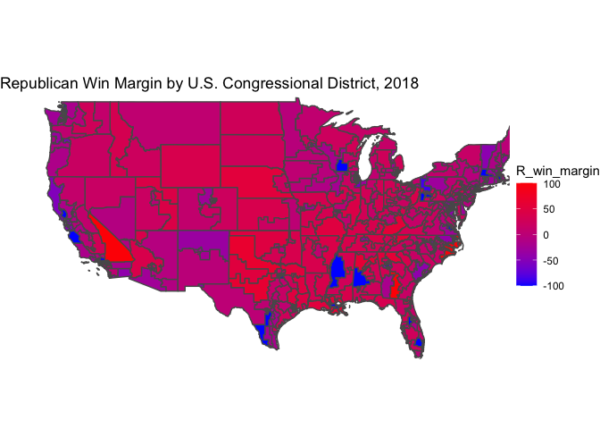
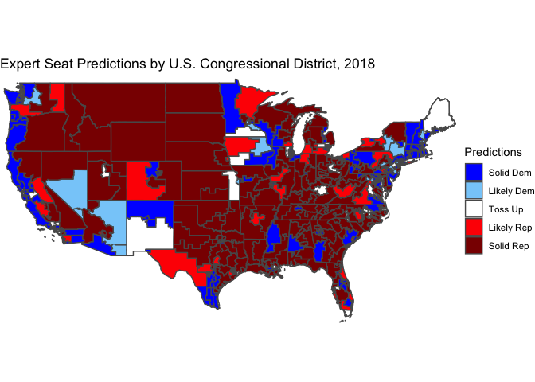
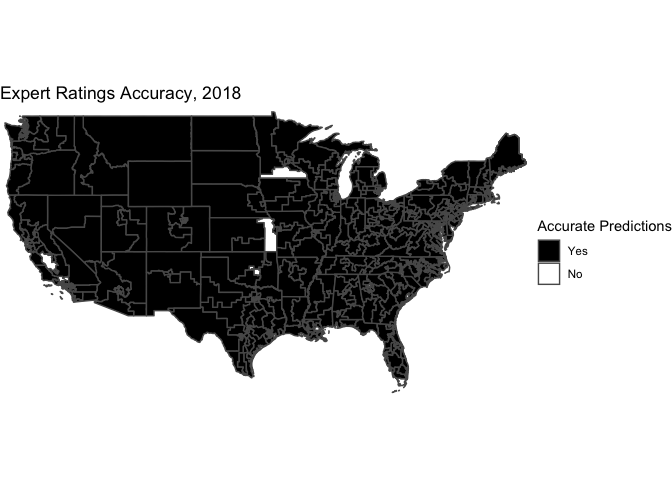

**Expert Ratings - Let’s see how the Professionals do it**

    ## Reading layer `districts114' from data source 
    ##   `/private/var/folders/ry/qlvkbbt57l9_3tv9fw638k3m0000gn/T/Rtmpc2riwn/districtShapes/districts114.shp' 
    ##   using driver `ESRI Shapefile'
    ## Simple feature collection with 436 features and 15 fields (with 1 geometry empty)
    ## Geometry type: MULTIPOLYGON
    ## Dimension:     XY
    ## Bounding box:  xmin: -179.1473 ymin: 18.91383 xmax: 179.7785 ymax: 71.35256
    ## Geodetic CRS:  NAD83

This week, I want to look at how expert ratings, more simply the “people
who do this for a living,” faired when predicting the 2018 midterm
elections. In particularly, I want to look at The Cook Political Report,
Inside Elections, and Sabato’s Crystal Ball because they created
forecasts for each congressional district.

These forecaster’s rate each district on a scale of 1 to 7. A 1
represents a “Solid Democratic” district, meaning there is no doubt that
those constituents will choose a Democrat to represent them in Congress.
7 means the same thing for Republicans or “Solid Republican.” 2 and 3
are “likely” and “leaning” Democrat, while 5 and 6 are “likely” and
“leaning” Republican respectively. 4’s represent toss-ups which are too
hard to predict one way or another. Often, the media will keep monitor
these races as “ones to watch.”

The goal is to see if expert predictions forecast the outcome of the
elections accurately. (If they do, we will want to add them into our
model) in the future). However, the issue remains that a 1-7 scale does
not correspond to specific percentages. A forecaster may say a district
is “Solid Democrat”, but it may be challenging to predict what share of
the votes the Democrats will actually receive. Ultimately, I do not
think we should be concerned. While it may be important to know the
overall vote share of each party state and federal elections, the key
question when forecasting the house is about which party is going to win
control and by how many seats. Since we use single member districts with
“first past the post” voting (with some exceptions), we only care about
who wins. Because of this, I simplify the 1-7 scale to a 1-5 scale. I
have eliminated the “Lean” category and expanded the “Likely” and
“Toss-up” category. As seen below, the first map indicates actual
results of the 2018 Midterm Elections. While there are some races that
are a deep shade of blue (heavily Democrat) or a deep shade of red
(heavily Republican), most races end up being relatively close (purple
shades). However, when we compare this with the simplified expert
predictions, most seats have been written off as not very competitive.

Finally, I wanted to see the accuracy of the expert forecasts to see if
they should be part of our models. As we can see, there are only a
handful of white districts (ones that the average expert ratings
predicted incorrectly. This means that expert ratings could be very
important for my models going forward.

**Model Update - None This Week**

While it may be tempting to use expert ratings in our models
immediately, there are a few key reasons why it may be smart to hold
off. First, the data we have available does not have expert ratings for
all 435 districts from each election, so adding this information into my
generical polling model (what I did last week) is impossible. It also
compromises our models if we have misaligned expert ratings. For
example, if we have ratings for one congressional district from 2012 and
2014, but another district’s training data is from 2016 and 2018, the
predictions will no longer be consistent. Second, because 2020 was a
census year, most districts got tweaked. While most changes are minor,
many states have gerrymandered maps, giving the party in power a
partisan edge. Third, while my model from last week using generic
polling has significant room to improve, expert ratings already consider
polling data. Because I want to avoid co-linearity in my predictors, it
does not make sense to mix polling with expert ratings.
